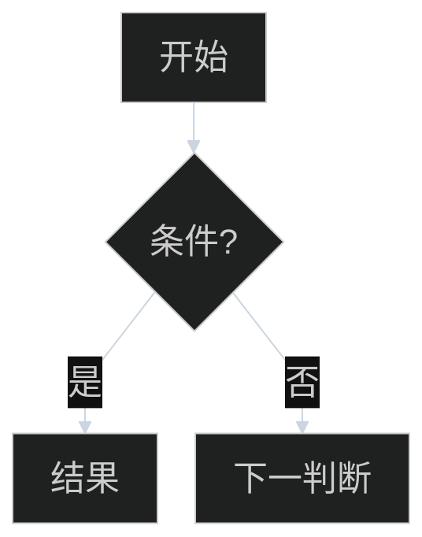
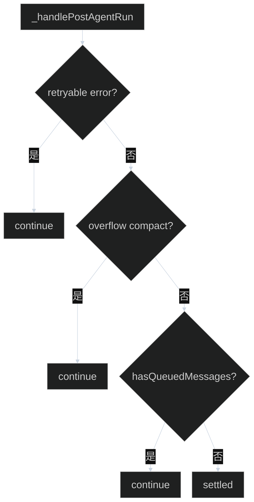
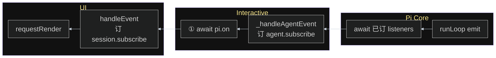

# Mermaid 绘图规则

教学笔记里的流程图：看清结构，不抢正文。先定主轴和出口，再写节点。

## 何时用哪种方向

| 图在讲什么 | 方向 | 例子 |
|------------|------|------|
| 一串判断 / 几道门 / 要不要停 | `flowchart TB` | 停机四道门、兜底 |
| 短链路、无回边的流水线 | `flowchart LR` | 一次 LLM 调用、tool 预检 |
| 分层叠在一起 | `flowchart TB` + `subgraph` | 调用栈从上到下 |
| 三列并排（左 UI、右 Core） | `flowchart RL` + 列内 `direction TB` | 事件总图：Core 发 → Interactive → UI |

默认 **TB**。用户说「三个模块并排 / 从左到右 UI Interactive Core」时用 **RL**，不要再用 TB 把三层竖着叠。

`A --> B` 在 `RL` 里：A 在右、B 在左。所以 `LIS --> HA --> HEV` 视觉上是 Core | Interactive | UI。

## 主轴与出口

判断链画成竖轴：

- **否 / 继续** → 往下（主轴）
- **是 / 结束 / 结果** → 往右（出口）
- 菱形里只写短问句，以 `?` 结尾
- 边上只写 `是` / `否` / `有` / `无`，细节放节点或图上方的 `function flow`



## 连线

- 必须 `curve: linear`（直线）。不要默认曲线。
- 不要 `stepAfter` / `step`：横向 + 直角折线 + 回边会缠在一起。
- 不要画绕全图的回边。循环写成节点文案（`continue：再进停机`）或落到「续跑 LLM」这种终点，不连回起点。
- 不要多条边汇进同一个结果框。每个 `是` 接到自己的结果节点（`C1` / `C2` / `C3`），哪怕文案相同。
- 中间语义需要被看见时，用节点，不要只写在很长的边标签上。
- **订 ≠ 发**：`subscribe` / `pi.on` 发生在构造时。写在处理节点第二行（`handleEvent<br/>订 session.subscribe`），不要再加黄框连进同一节点（会和事件箭头汇合）。

## 字号（预览会缩小 SVG）

Markdown 预览把图缩到栏宽。只改 `themeVariables.fontSize` 从 15 到 16，看起来没变。必须三件事一起做：

1. 每个 `classDef` 写 `font-size:22px`
2. init 里 `themeCSS` 强制 `.nodeLabel,.label,.cluster-label,span`
3. `useMaxWidth: false`（不要 `width: 100%` 再缩一次）

列多、节点多 → 图更宽 → 预览再缩小。并排图要少节点、短标签、短分区名。

## 疏密

| 项 | 取值 |
|----|------|
| `rankSpacing` | 28–36 |
| `nodeSpacing` | 24–28 |
| `padding` | 12 |
| `font-size` | **22px**（写在 classDef + themeCSS） |

不要把 spacing 收到 16/10 以下。不要靠 LR + 折线「压扁」一张本来该竖着读的判断图。

## 标签

- 一框一件事。菱形不超过约 12 个字。
- `<br/>` 只用于两行职责（处理 + 订）。
- 顺序门用 ①②③④。
- 分区标题一两个词：`UI` / `Interactive` / `Pi Core`。
- 图旁已有 `function flow` 时，图只保留结构。

## 皮肤（固定）

每张 flowchart 都带这段 `init`，再按角色 `classDef`（**都带 font-size:22px**）。

```text
%%{init: {"theme": "dark", "flowchart": {"curve": "linear", "rankSpacing": 32, "nodeSpacing": 24, "padding": 12, "useMaxWidth": false, "htmlLabels": true}, "themeVariables": {"fontSize": "22px", "background": "#000000", "lineColor": "#CBD5E1", "clusterBkg": "#111111", "clusterBorder": "#C4B5FD", "titleColor": "#FDE68A", "edgeLabelBackground": "#111111"}, "themeCSS": ".nodeLabel,.label,.cluster-label,span{font-size:22px!important}"}}%%
```

无 subgraph 时可去掉 `clusterBkg` / `clusterBorder` / `titleColor`。

| 角色 | class | fill / stroke / color |
|------|-------|------------------------|
| 入口 / IO | `start` | `#BFDBFE` / `#93C5FD` / `#1E3A8A` |
| 过程 | `step` | `#A5F3FC` / `#67E8F9` / `#155E75` |
| 判断 | `dec` | `#FEF08A` / `#FDE047` / `#713F12` |
| Core / 产品层 | `prod` | `#E9D5FF` / `#D8B4FE` / `#6B21A8` |
| 失败 / 动作 | `bad` | `#FBCFE8` / `#F9A8D4` / `#831843` |
| 成功 / 结束 | `ok` | `#BBF7D0` / `#86EFAC` / `#14532D` |
| subgraph | `wrap` | `#111111` / `#C4B5FD` / `#FDE68A` |

产品层 class 用 `prod`，不要用 `core`：subgraph 若叫 `core`，`class core` 会涂到分区上。

```text
classDef start fill:#BFDBFE,stroke:#93C5FD,color:#1E3A8A,font-size:22px
classDef step fill:#A5F3FC,stroke:#67E8F9,color:#155E75,font-size:22px
classDef dec fill:#FEF08A,stroke:#FDE047,color:#713F12,font-size:22px
classDef prod fill:#E9D5FF,stroke:#D8B4FE,color:#6B21A8,font-size:22px
classDef bad fill:#FBCFE8,stroke:#F9A8D4,color:#831843,font-size:22px
classDef ok fill:#BBF7D0,stroke:#86EFAC,color:#14532D,font-size:22px
classDef wrap fill:#111111,stroke:#C4B5FD,color:#FDE68A,font-size:22px
```

## 好 vs 坏

**好：竖轴、出口在右、无回边、边很短**



**好：并排三列、事件从右往左、订写在第二行**



**坏（不要再这样画）**

- `flowchart LR` + `curve: stepAfter` + 绕回起点
- 两条边同时进同一个节点，边标签写成「是：不因这批续 LLM」
- 菱形里塞一整句「Interactive 兜底：还开不开新一轮？」
- 为压高度把 `rankSpacing` 收到 16
- 用户要三列并排，却用 `flowchart TB` 把 UI / Interactive / Core 竖着叠
- 只改 `themeVariables.fontSize` 15→16，classDef 不写 `font-size`
- 单独加「订 subscribe」黄框再连到 `handleEvent`（和事件箭头汇合）
- `subgraph core` + `classDef core` 同名

## 出图步骤

1. 这张图只回答一个问题。
2. 选 TB / LR / RL（判断链 TB；并排分层 RL）。
3. 列出主轴节点；每个判断的「是」单独一个出口节点。
4. 套 init 模板；每个 classDef 带 `font-size:22px`。
5. 自检：无绕圈回边、无多线汇合、菱形短、边只有 是/否、直线、字号不靠 themeVariables 单飞。
