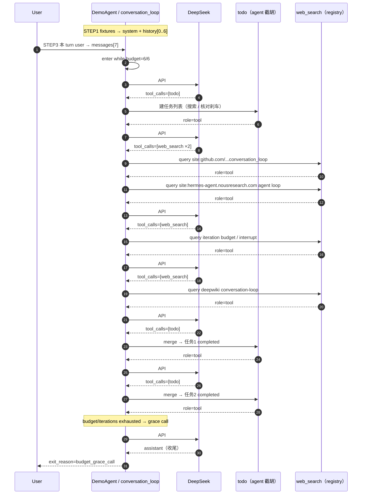

# Hermes Run Agent · 主循环如何学习

目标：讲清一次请求如何走完 **思考 → 调工具 → 观察 → 再思考**，以及预算 / 中断 / 工具发现。

对照大纲：[`../03-hermes Agent  学习大纲.md`](../03-hermes%20Agent%20%20学习大纲.md) **模块三**。

学法：

1. 读 `notes/` 讲稿（先建立心智模型）  
2. 打开 `hermes_src/` 按文件对照  
3. **跑 `demo/`**（DeepSeek）：完整 while + todo 截胡 + calculator  
4. 真仓库：完整 `hermes-agent/` 里对 `conversation_loop` while 打断点  

> `hermes_src/` 只读剪枝，缺大量依赖，**import 跑不起来**。  
> 注意：上游已把循环抽到 `agent/conversation_loop.py`；`run_agent.py` 里的 `run_conversation` 只是 **forwarder**。

---

## 目录

```text
02-run-agent/
├── README.md
├── notes/
│   ├── 1_agent_loop.md          # while 循环 / 预算 / 中断
│   ├── 2_tools_discovery.md     # registry → model_tools → toolsets
│   ├── 3_todo_intercept.md      # agent 级工具范例
│   └── 4_run_conversation_callflow.md  # 真源码 run_conversation 意图向 call flow
├── demo/                        # ★ 可跑通教学 demo（对齐 01-memory/demo）
│   ├── README.md
│   ├── run_agent_loop.py
│   ├── teaching/
│   │   ├── agent_loop/          # while / budget / DemoAgent / llm
│   │   ├── tools/               # registry + web_search
│   │   ├── todo/                # todo 截胡
│   │   └── memory/              # TeachingMemoryStore
└── hermes_src/
    ├── README.md
    ├── AGENTS.md                # Agent Loop + Footprint Ladder
    ├── agent/
    │   ├── iteration_budget.py  # 预算（原样）
    │   └── conversation_loop.SKELETON.md
    └── tools/
        ├── registry.py
        └── todo_tool.py
```

关联（prologue / 压缩）：

- [`../01-memory/demo/`](../01-memory/demo/) — turn_context + DeepSeek 压缩  
- [`../01-memory/hermes_src/agent/turn_context.py`](../01-memory/hermes_src/agent/turn_context.py)

---

## 一轮对话完整 Call Flow

> 一次用户消息 = **1 个 turn**（prologue 只跑一次）+ **N 次 while 迭代**（每次一次 API）。  
> Demo 对照：`demo/exports/agent_loop/00_workflow.md` · `demo/README.md` Code Call Flow。

### 总览

```text
User message
      │
      ▼
① AIAgent.run_conversation(...)                 # run_agent.py · 薄转发
      │
      ▼
② conversation_loop.run_conversation(agent, …)  # ★ 真入口
      │
      ├─③ Turn prologue（每 turn 一次）
      │     build_turn_context / 拼 system + history + user
      │     预压缩（如需）· tools schema 已按 toolset 装好
      │     messages ≈ [system, …history…, user]
      │
      └─④ while（思考 → 工具 → 观察 → 再思考）
            │
            │  刹车：max_iterations / IterationBudget / grace / interrupt
            │
            ├─⑤ API: chat.completions.create(messages, tools=schema)
            │         │
            │         ├─ 有 tool_calls ──────────────────────────────────┐
            │         │                                                   │
            │         │   ⑥ append role=assistant（含 tool_calls）        │
            │         │         │                                         │
            │         │         ▼                                         │
            │         │   ⑦ _execute_tool_calls / invoke_tool             │
            │         │         │                                         │
            │         │         ├─ todo / memory → agent 级截胡           │
            │         │         │     （schema 仍来自 registry）           │
            │         │         │                                         │
            │         │         └─ 其它 → handle_function_call            │
            │         │               → pre hooks → registry.dispatch     │
            │         │               → post hooks → JSON str             │
            │         │         │                                         │
            │         │         ▼                                         │
            │         │   ⑧ append role=tool（可多条）→ continue while    │
            │         │                                                   │
            │         └─ 纯文本 ──────────────────────────────────────────┤
            │               ⑨ append assistant → ⑩ return final_response  │
            │                                                             │
            └─ 触顶 / interrupt / grace 用尽 → 带原因退出 ────────────────┘
```

### 逐步对照

| 步 | 发生什么 | 看哪里 |
|----|----------|--------|
| ① | 入口转发，本身几乎无逻辑 | `run_agent.py` · `AIAgent.run_conversation` |
| ② | 真循环所在 | `agent/conversation_loop.py` · `run_conversation` |
| ③ | 冻 system、拼本 turn messages、拿 tools schema | turn_context / demo `TeachingMemoryStore` |
| ④ | iterations × budget × grace × interrupt | `notes/1_agent_loop.md` |
| ⑤ | 模型看见 **全量** schema + 当前 messages | `model_tools.get_tool_definitions` |
| ⑥⑦⑧ | 思考 → 调工具 → 观察写回 | `_execute_tool_calls` + `invoke_tool` |
| ⑨⑩ | 无 tool_calls → 收尾 | while 文本分支 |

### Role 时序（`demo/log.txt` 实跑）

> `max_iterations=6` · tools=`todo` + `web_search` · `exit_reason=budget_grace_call` · `api_calls=7`



**messages 下标（与 log ROLE TIMELINE 一致）**

```text
[0..6]  history          ← conversation_history.md（7 条，无 system）
[7]     user             ← 本 turn 用户输入
[8]     assistant        ← API #1  tool_calls=['todo']
[9]     tool             ← todo（截胡）
[10]    assistant        ← API #2  tool_calls=['web_search','web_search']
[11]    tool             ← web_search
[12]    tool             ← web_search          ← 同轮并行两条 tool
[13]    assistant        ← API #3  tool_calls=['web_search']
[14]    tool
[15]    assistant        ← API #4  tool_calls=['web_search']
[16]    tool
[17]    assistant        ← API #5  tool_calls=['todo']
[18]    tool
[19]    assistant        ← API #6  tool_calls=['todo']
[20]    tool
[21]    assistant        ← API #7  grace 收尾
```

最少形态：`system → user → assistant(+tool_calls) → tool → … → assistant(最终文本)`。

铁律：同 role 不连发；不要中途插合成 user；换 toolset / 重建 system = 破 prompt cache。  
本跑亮点：budget 用尽后仍有 **grace call**（API #7）；`todo` 走截胡、`web_search` 走 registry。

### 工具发现链（本 turn 之前就定好；循环内只消费 schema）

```text
tools/*.py 顶层 registry.register()
      → model_tools import 时 discover_builtin_tools
      → toolsets._HERMES_CORE_TOOLS 等组装
      → 每步 API 的 tools=…
      → tool_calls 再走上面的 invoke 分支（截胡 or dispatch）
```

### 退出条件

| 出口 | 含义 |
|------|------|
| 无 `tool_calls` | 正常完成，返回最终文本 |
| `api_call_count >= max_iterations` | 硬顶 |
| `iteration_budget` 用尽且 grace 已用 | 预算耗尽 |
| `_interrupt_requested` | 用户 /stop 等 |

对照：`notes/1` 循环 · `notes/2` 发现/分发 · `notes/3` todo 截胡 · `notes/4` 真源码 call flow · `demo/log.txt` / `demo/exports/agent_loop/00_workflow.md` 实跑时序。

---

## 建议阅读顺序

| 顺序 | 材料 | 重点 |
|------|------|------|
| 1 | `notes/1_agent_loop.md` | 循环骨架 |
| 2 | `demo/README.md` → `python run_agent_loop.py` | **动手** |
| 3 | `hermes_src/agent/conversation_loop.SKELETON.md` | while 摘录 |
| 4 | `notes/2_tools_discovery.md` | 发现与分发 |
| 5 | `hermes_src/tools/registry.py` + `todo_tool.py` | 行号对照 |
| 6 | `notes/3_todo_intercept.md` | agent 级截胡 |
| 7 | `notes/4_run_conversation_callflow.md` | 真源码意图向 call flow |

---

## 动手（对齐大纲产出）

1. 跑 `demo/`，对照 `log.txt` / `exports/agent_loop/00_workflow.md` 与上文时序图。  
2. 对比 `todo`（agent 截胡）vs `calculator`（registry.dispatch）。  
3. 面试一句话：Runtime = 主循环 + 工具调度 + 状态 + 预算/中断；核心工具 schema 每次全量下发 → Footprint Ladder。

---

## 与其它模块

| 模块 | 关系 |
|------|------|
| [`../01-memory/`](../01-memory/) | turn prologue、compress、cache |
| [`../03-eval/`](../03-eval/) | 用 Trace 验证循环每一步 |
