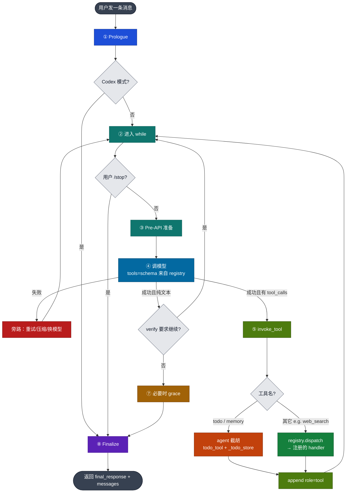

# 4 · `run_conversation` 意图向 Call Flow

> 对照：`../hermes_src/agent/conversation_loop.py` · `def run_conversation` ~`:523`  
> Demo：`../demo/teaching/agent_loop/conversation_loop.py`（主干精简版）  
> Prologue：`../../01-memory/hermes_src/agent/turn_context.py` · `build_turn_context`  
> 收尾：`agent/turn_finalizer.py` · `finalize_turn`（完整仓库）

---

## 0. 结构

用户发来**一条消息**时，`run_conversation` 不是只调一次模型，而是：

1. **Prologue**：固定 system、接上 history、追加本轮 user  
2. **While**：调用模型 → 若有 `tool_calls` 则执行并写回 → 再调用模型  
3. **Finalize**：落库、组装返回值给 CLI / Gateway  

```text
一个用户 turn
  = 1 次 prologue（只跑一次）
  + N 次 API 循环（思考 / 工具 / 再思考）
  + 1 次 finalize（只跑一次）
```

文件中大量 rate-limit、failover、413 压缩等是错误恢复旁路。先掌握主干，再按需下钻旁路。

---

## 1. 主干流程

```text
用户消息进来
        │
        ▼
┌───────────────────────────────────────────┐
│ ① Prologue（每 turn 一次）                 │
│  build_turn_context                       │
│  · 清洗 user 文本                         │
│  · 恢复或新建 system（保 prompt cache）    │
│  · history + 当前 user → messages         │
│  · 预压缩 / 插件 prefetch（如需）          │
└───────────────────────────────────────────┘
        │
        ▼
   是 Codex 专用模式？──是──► 整 turn 交给 Codex 子进程 ──► ⑧ finalize
        │否
        ▼
┌───────────────────────────────────────────┐
│ ② while 循环（可跑多次）                    │
│  条件：未触顶 iterations/budget            │
│        或仍有一次 grace 收尾机会            │
└───────────────────────────────────────────┘
        │
        ▼
   用户 /stop？──是──► ⑧ finalize
        │否
        ▼
   扣一次 budget（grace 轮不扣）
        │
        ▼
┌───────────────────────────────────────────┐
│ ③ Pre-API 准备                             │
│  · 将排队的 /steer 追加到最近一条 tool       │
│  · 修复损坏的 tool_call 参数、role 交替     │
│  · 内部 messages → 供应商 api_messages     │
│  · 可选：上下文超压再压缩                   │
└───────────────────────────────────────────┘
        │
        ▼
┌───────────────────────────────────────────┐
│ ④ 调用模型 API                             │
│  tools=schema（来自 registry + toolset）   │
└───────────────────────────────────────────┘
        │
   ┌────┴────┐
   │失败？    │成功
   ▼         ▼
 旁路恢复   检查是否有 tool_calls
 retry/     │
 compress/  │
 failover   │
            ├─ 无 ─► ⑥ 纯文本 → verify? → break / 回 while
            │
            └─ 有 ─► ⑤ 执行工具（逐个 tool_call）
                        │
                        │  append role=assistant（含 tool_calls）
                        │         │
                        │         ▼
                        │  invoke_tool / handle_function_call
                        │         │
                        │    ┌────┴────────────────────┐
                        │    │                         │
                        │    ▼                         ▼
                        │  name=todo/memory          其它工具
                        │  （agent 级截胡）          （registry）
                        │  读 agent._todo_store     registry.dispatch
                        │  → todo_tool(...)         → 注册时的 handler
                        │    │                         │
                        │    └────────────┬────────────┘
                        │                 ▼
                        │         返回 JSON str
                        │                 │
                        │                 ▼
                        │         append role=tool
                        │                 │
                        │                 ▼
                        └────────── continue while（再④）
        │
        ▼
┌───────────────────────────────────────────┐
│ ⑦ Grace（可选）                           │
│  若预算用尽且最后一条仍是 tool：            │
│  再调用一次 API（通常禁用 tools），          │
│  要求模型输出最终文本                       │
└───────────────────────────────────────────┘
        │
        ▼
┌───────────────────────────────────────────┐
│ ⑧ Finalize                                 │
│  落库 / memory·skill 回顾 / 返回 dict      │
└───────────────────────────────────────────┘
```

补充（schema 从哪来，会话开始前就定好）：

```text
tools/*.py 顶层 registry.register(name, schema, handler, …)
      → model_tools 发现 / toolset 组装
      → ④ 每次 API 的 tools= 参数（模型「看见」todo、web_search 等）
      → ⑤ 真正执行时再走：截胡 or registry.dispatch
```

---

## 2. 逐步说明

### ① Prologue

| 问题 | 回答 |
|------|------|
| **何时** | 每个用户 turn 只一次，进入 while 之前 |
| **做什么** | 准备本 turn 的 `messages` 与 `active_system_prompt` |
| **关键** | `_restore_or_build_system_prompt`：优先从 session DB 读回上一轮同一份 system 字符串 |
| **原因** | Prompt cache 要求 system 前缀字节级稳定；Gateway 常每 turn 新建 `AIAgent`，内存中的 prompt 会丢失，因此需 DB 持久化后再复用 |

### ② while

| 问题 | 回答 |
|------|------|
| **循环条件** | `api_call_count < max_iterations` 且 budget 仍有剩余；或 `_budget_grace_call` 为真 |
| **每次迭代** | 对应一次模型 API 调用（及其后的工具执行） |
| **退出约束** | `max_iterations`（硬上限）· `IterationBudget` · `/stop` interrupt |
| **为何循环** | 典型路径是多步：规划 → 调工具 → 再规划 → 再调工具 → 最终文本；单次 API 通常不够 |

### ③ Pre-API 准备

把内部会话状态转换成可发给供应商的请求体：

1. **`/steer` drain**：模型运行期间用户发来的纠偏指令，追加到最近一条 `role=tool` 的 content（不能新插 `user`，会破坏 role 交替）  
2. **sanitize / repair**：修复非法 JSON 参数、`tool→user` 等非法序列  
3. **组装 `api_messages`**：拷贝 messages；部分供应商（如 Moonshot）需要独立的 `reasoning_content`；临时上下文只注入本次请求副本，不写回持久化 history  
4. **可选再压缩**：prologue 之后若工具结果使上下文再次超阈值，再压一轮  

### ④ API

调用 `chat.completions`（或 stream）。

- **成功** → 根据是否有 `tool_calls` 分支  
- **失败** → 进入旁路：重试、压缩、轮换 credential、切换 fallback 模型等（源码中篇幅最大的部分）

### ⑤ 有 tool_calls —— 模型要调工具时怎么执行

模型返回「请调用某某工具」。代码要做两件事：

1. **先告诉模型有哪些工具**（说明书）  
2. **再真正跑起来**（执行）

说明书一律在 **registry** 里登记（`registry.register`）。  
执行时分两种：

| 工具 | 谁来执行 | 通俗说 |
|------|----------|--------|
| `todo`（还有 `memory`） | Agent 自己拦下来跑 | 任务列表存在 agent 内存里，不能走通用通道，否则拿不到这份状态 |
| `web_search` 等 | registry 按名字找到函数再跑 | 普通工具，登记时写好了 handler，dispatch 即可 |

```text
模型说：调 todo
      → Agent 截胡 → 改 agent 里的任务列表 → 结果写回 messages

模型说：调 web_search
      → registry 找到 web_search 的函数 → 搜索 → 结果写回 messages

然后回到 while，再问一次模型
```

容易混的一点：

- **registry 登记** = 让模型知道有这个工具（两边都要登记）  
- **截胡** = 只有 todo 这类特殊工具，执行时不走 registry 的通用入口  

所以：todo **既要** register（否则模型看不见），**又要**截胡（否则执行时丢状态）。

### ⑥ 无 tool_calls

得到纯文本，通常即本 turn 最终答案。可能还有校验闸：

- **verify / pre_verify**：例如本 turn 改了代码但未验证 → 注入合成 user nudge，再进 while 一轮，暂不把当前文本当作最终回复交给用户

### ⑦ Grace

场景：`max_iterations=6`，第 6 次 API 仍产生 `tool_calls`，budget 用尽，messages 停在 `role=tool`。

若直接结束，用户只有工具结果、没有最终说明。  
因此再允许 **1 次** API（通常 `tools=None`），强制产出最终文本。  
这对应 demo 中「6 次正常迭代 + 1 次 grace = 7 次 API」。

### ⑧ Finalize

`finalize_turn`：session 落库、可选 memory/skill 回顾，返回：

```python
{
  "final_response": ...,
  "messages": ...,
  "completed": ...,
  "api_calls": ...,
  # ...
}
```

CLI / Gateway / demo 均消费该 dict。

---

## 3. 简化 mermaid

节点仅保留编号；细节见上一节。



图例：

| 颜色 | 阶段 |
|------|------|
| 灰黑 | 起止 |
| 蓝 | ① Prologue |
| 青绿 | ②③ while / Pre-API |
| 天蓝 | ④ API（schema 来自 registry） |
| 橙 | ⑤ todo / memory **截胡** |
| 绿 | ⑤ **registry.dispatch** |
| 黄褐 | ⑦ grace |
| 紫 | ⑧ Finalize |
| 红 | 错误恢复旁路 |
| 浅灰菱形 | 判断节点 |

---

## 4. 三层意图

| 层 | 作用 |
|----|------|
| Prologue | 固定 system，拼好本 turn 的 messages，保证 prompt cache 可用 |
| While | 思考→工具→观察，直到得到最终文本或触顶/中断 |
| Finalize | 落库并统一返回；与循环细节解耦 |

> Runtime 意图：在 **system 前缀保持稳定（可缓存）** 的前提下，跑完 tool-calling 循环；旁路负责失败恢复与边界体验（如 grace）。

---

## 5. 源码行号速查

| 步 | 约行号 | 符号 |
|----|--------|------|
| 函数入口 | `:523` | `run_conversation` |
| Prologue | `:568` | `build_turn_context` |
| system 恢复 | `:282` | `_restore_or_build_system_prompt` |
| Codex 旁路 | `:634` | `_run_codex_app_server_turn` |
| while | `:643` | 条件含 grace |
| /steer | `:704` | Pre-API-call steer drain |
| 拼请求 | `:755` | Prepare messages for API |
| finalize | `:5332` | `finalize_turn` |

---

## 6. 与教学 demo 的对应

| 真源码 | demo |
|--------|------|
| ① 固定 system + history | `run_agent_loop.py` 加载 MEMORY/USER/history |
| ②③④⑤⑥ while 主干 | `teaching/agent_loop/conversation_loop.py` |
| ⑤ todo 截胡 | `teaching/todo/invoke_tool.py` |
| ⑦ grace | while 结束后的 grace 块；`log.txt` 中 API #7 |
| ⑧ 导出结果 | `exports/agent_loop/` |

实跑时序：`demo/log.txt` · README「Role 时序」· `exports/agent_loop/00_workflow.md`。

---

## 7. Happy path（口述）

1. 恢复或构建 system；history + 本轮 user → messages。  
2. 进入 while：完成 Pre-API 准备，调用模型。  
3. 有 `tool_calls` → 执行 → `role=tool` 写回 → 再调模型。  
4. 纯文本 →（可选 verify）→ 结束 while。  
5. 若预算用尽且停在 tool 结果上 → grace 再要一次最终文本。  
6. finalize 落库并返回。

---

## 8. 自检

1. 为什么 prologue 与 while 要拆开？（cache：每 turn 一次 vs 多轮 API）  
2. Gateway 新建 `AIAgent` 后，prefix cache 靠什么保住？  
3. `/steer` 为什么不能直接 append 一条 `user`？  
4. `max_iterations=6` 为何还能出现第 7 次 API？
