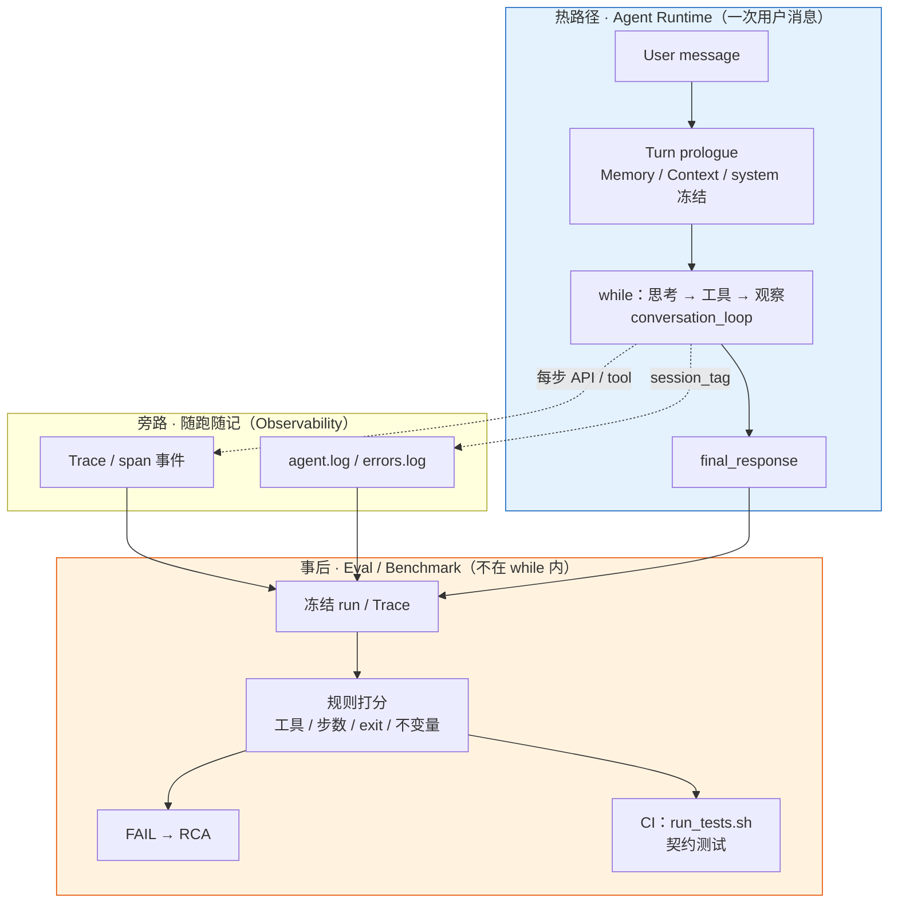
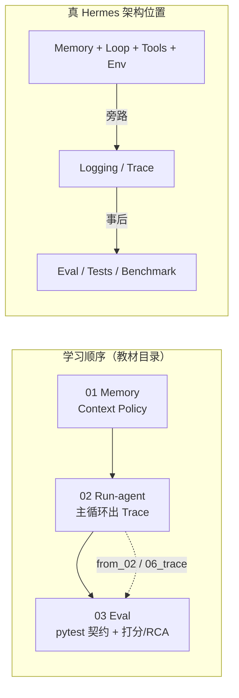
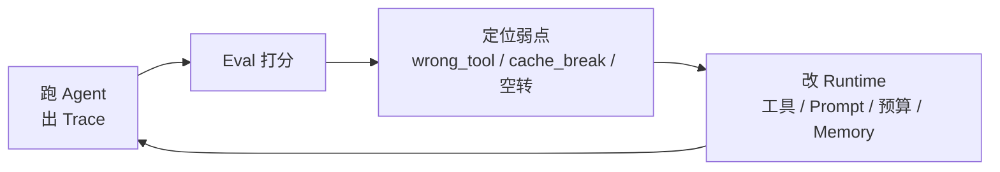

# Hermes Eval + Trace · 如何学习

目标：讲清 **评测维度设计**、**行为契约测试 vs 变更检测测试**，以及如何用 Trace / session 日志做根因分析。

对照大纲：[`../03-hermes Agent  学习大纲.md`](../03-hermes%20Agent%20%20学习大纲.md) **模块二**（目录名按现仓库为 `03-eval`，在 `02-run-agent` 之后）。

学法：

1. 读 [`notes/`](./notes/README.md) 讲稿（先建立心智模型，按 01→07）  
2. 打开 `hermes_src/` / [`../hermes-study/`](../hermes-study/) 按文件对照  
3. **跑 `demo/`**（离线，无需 API Key）：  
   - Layer A：`pytest …/test_agent_loop_contracts.py`（近 Hermes CI）  
   - Layer B：`run_eval_suite.py`（正例+负例打分 + session_tag + RCA）  
4. 真仓库：`scripts/run_tests.sh tests/agent/test_prompt_caching.py`；`hermes logs --session …`

> `hermes_src/` 只读剪枝，缺 `run_tests_parallel.py` 等依赖，**不要在剪枝树里冒充 CI**。  
> 正例轨迹来自 [`../02-run-agent/demo/exports/agent_loop/`](../02-run-agent/demo/exports/agent_loop/)；负例为 `demo/fixtures/failure_run.json`（合成）。

**何时 Eval / 评什么**：先跑通主循环留下 Trace，再对**冻结轨迹**做契约断言与规则打分（工具、步数、退出、role/system 不变量）——不是当场再调模型，也不是金标全文比对。详见 [`demo/README.md`](./demo/README.md)。

---

## Eval 在 Hermes 里属于哪一步

Eval **不在**热路径里的某次迭代（不是 `conversation_loop` while 中的一个阶段），而是挂在主循环**之外**的观测 / 评测层。

一句话：**Runtime 负责跑；Trace 负责记；Eval 负责评。**

### 运行时位置



| 层 | 属于哪一步 | 做什么 |
|----|------------|--------|
| 主循环 | Runtime 核心 | 真正「干活」 |
| Logging / Trace | **跑的时候旁路写出** | 留下可复放轨迹 |
| Eval | **跑完之后 / CI** | 对轨迹打分，不回头再调模型 |

### 与本仓库学习顺序

教材目录是 `01-memory → 02-run-agent → 03-eval`：先有 loop 产物，才有东西可评。



---

## Eval 对整个 Agent 的优化作用

Eval 本身不改模型权重，它提供的是 **可度量的反馈闭环**：让你知道改 Memory / 工具 / 预算 / Prompt 之后，系统变好了还是变坏了。



| 优化方向 | Eval 怎么帮你 | 典型信号 |
|----------|---------------|----------|
| **工具与策略** | 工具选对率、禁区工具 | 总调错 `execute_code` → 收紧 schema / 指引 / toolset |
| **成本与收敛** | 步数、budget、exit_reason | 大量 `budget_exhausted` / 无 final → 砍空转、加 grace、降 max_steps |
| **Context / Cache** | system 稳定、tools 冻结、role 交替 | cache_break / role_break → 守住「中途不改 system/toolset」 |
| **Memory / 压缩** | 完成率 + 忠实度相关 case | 压缩后答非所问 → 调 head/tail/摘要策略 |
| **防回归** | 固定 case 集 + CI 不变量 | 修 A 坏 B 时分数掉下来，立刻可见 |
| **事故复盘** | Trace RCA | 线上坏 session 冻成 fixture，根因可复现、可讲 |

对面试 / 工程的定位：

- **没有 Eval**：优化靠感觉（「感觉这次答案更好」），无法证明。
- **有 Eval**：优化变成「改一刀 → 重跑 case → 看维度分与不变量」——Agent 工程的质量门，和传统软件的测试套件同级。

本 demo 的最小闭环：`02-run-agent` 出 Trace → `03-eval`（pytest 契约 + 打分/RCA）→ 带着结论回去改循环或工具，再评一轮。

---

## 目录

```text
03-eval/
├── README.md
├── notes/                       # ★ 讲稿（见 notes/README.md 顺序）
│   ├── README.md                # 讲解顺序总览
│   ├── 01_eval_invariants.md    # 主线：不变量 vs 变更检测
│   ├── 02_logging_trace.md      # 主线：session_tag / Trace
│   ├── 03_eval_harness.md       # 主线：离线打分 + RCA
│   ├── 04_tests_and_eval.md     # 桥：契约测试 ↔ Eval
│   ├── 05_test_prompt_caching.md
│   ├── 06_test_context_compressor.md
│   └── 07_test_memory_provider.md
│
├── demo/                        # ★ 可跑通教学 demo
│   ├── README.md                # 双层结构 / 打分标准 / 跑法 / 产物
│   ├── run_eval_suite.py        # pytest → score → 日志 → RCA
│   ├── requirements.txt         # pytest>=8,<9
│   ├── fixtures/
│   │   ├── from_02_agent_loop.json   # 正例（02 实跑）
│   │   ├── failure_run.json          # 负例（合成，应 FAIL）
│   │   ├── eval_cases.json           # 两条期望（人改）
│   │   ├── eval_cases.jsonl          # suite 同步
│   │   └── eval_cases.md
│   ├── teaching/
│   │   ├── invariants/
│   │   │   ├── checkers.py
│   │   │   ├── test_agent_loop_contracts.py  # ★ Layer A
│   │   │   └── test_checkers.py              # 兼容入口
│   │   ├── logging/session_logger.py
│   │   └── harness/                 # scorer / rca / load_agent_loop_export
│   └── exports/eval_run/            # 跑完后的报告
│
└── hermes_src/                  # 只读剪枝对照
    ├── AGENTS.md                # Don't write change-detector tests
    ├── hermes_logging.py
    ├── scripts/run_tests.sh
    ├── agent/prompt_caching.py
    └── tests/agent/test_prompt_caching.py
```

关联：

- [`demo/README.md`](./demo/README.md) — demo 细节（打分标准、产物表）  
- [`../02-run-agent/demo/`](../02-run-agent/demo/) — 主循环实跑 + `06_trace.md`  
- [`../01-memory/demo/`](../01-memory/demo/) — turn prologue / 压缩  
- [`../hermes-study/tests/agent/test_prompt_caching.py`](../hermes-study/tests/agent/test_prompt_caching.py) — 真仓契约范例

---

## 一轮 Eval Call Flow

```text
Layer A  pytest test_agent_loop_contracts.py   # 近 Hermes CI（Test* + 关系断言）
        │
Layer B  冻结轨迹：from_02（正例）+ failure_run（负例）
        │
        ▼
① eval_cases.json           # 期望关系：tools ⊆ … / max_steps / allowed_exits
        │
        ▼
② score_suite               # 维度分 + 不变量
        │
        ├─ tools_subset / no_forbidden / steps / exit / final_text
        └─ role_alternation / system_stable / tools_frozen / budget_consistent
        │
        ▼
③ session_logger            # [session_id] 注入 + component 分流
        │
        ▼
④ RCA（负例 FAIL）          # wrong_tool / cache_break / budget_exhaustion
```

### 逐步对照

| 步 | 发生什么 | 看哪里 |
|----|----------|--------|
| A | pytest 契约（最像真仓） | `demo/teaching/invariants/test_agent_loop_contracts.py` |
| ① | 评测集写「关系」不写全文快照 | `notes/03` · `fixtures/eval_cases.json` |
| ② | 不变量 + 完成率/步数/工具选对率 | `notes/01` · `checkers` · `scorer` |
| ③ | session_tag / agent.log / errors.log | `notes/02` · `hermes_logging.py` |
| ④ | Trace 根因（负例） | `harness/rca.py` · `exports/eval_run/03_trace_rca.md` |

---

## 建议阅读顺序

完整表见 [`notes/README.md`](./notes/README.md)。摘要：

| 顺序 | 材料 | 重点 |
|------|------|------|
| 1 | `notes/01_eval_invariants.md` | change-detector 反模式 |
| 2 | `notes/02_logging_trace.md` | session_tag / Trace |
| 3 | `notes/03_eval_harness.md` | 维度与 RCA |
| 4 | `demo/` 动手 | pytest + `run_eval_suite.py` |
| 5 | `notes/04` → `05`→`07` | 契约测试 ↔ Eval + 范例深挖 |
| 6 | `02-run-agent` 的 `06_trace.md` | 真 loop Trace |

---

## 动手（对齐大纲产出）

1. 先跑 Layer A：`pytest teaching/invariants/test_agent_loop_contracts.py -q`。  
2. 再跑 `run_eval_suite.py`，对照正例 PASS / 负例 FAIL + `03_trace_rca.md`。  
3. 面试一句话：好测试/好评测断言 **不变量**；一条 Trace 能定位「工具选错 / 缓存击穿 / 预算耗尽」。

---

## 与其它模块

| 模块 | 关系 |
|------|------|
| [`../01-memory/`](../01-memory/) | Context Policy；压缩是唯一允许改上下文的场景 |
| [`../02-run-agent/`](../02-run-agent/) | 提供可评测的 loop Trace；Eval 验证循环每一步契约 |
