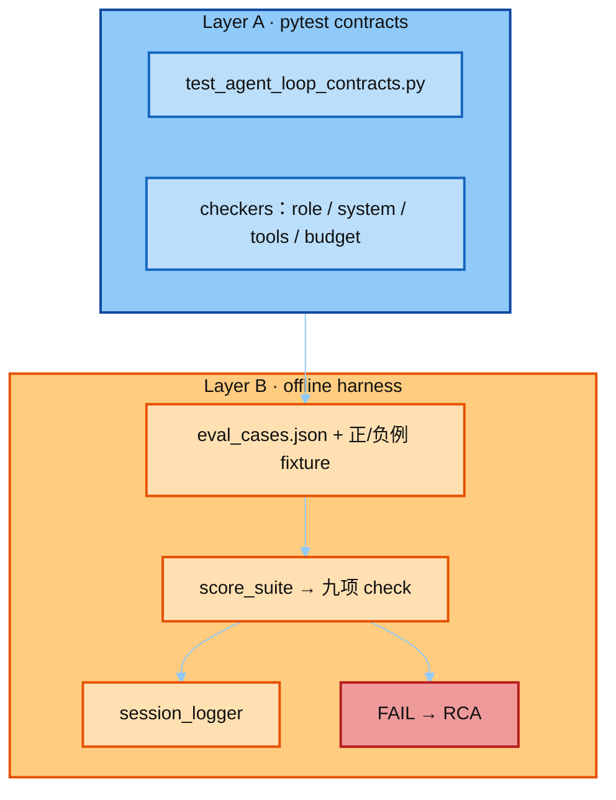
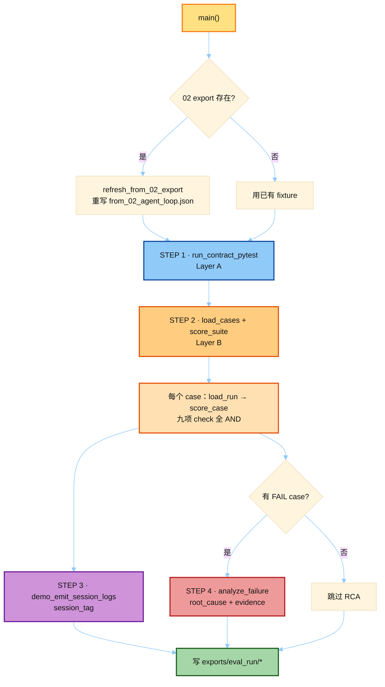
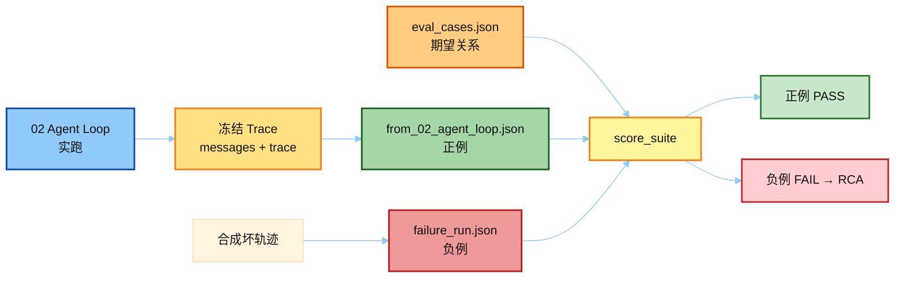
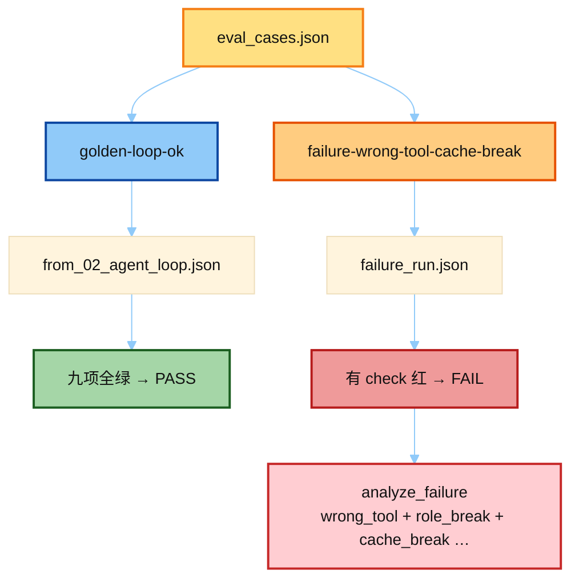
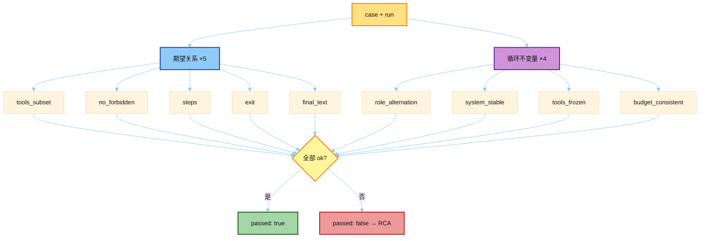
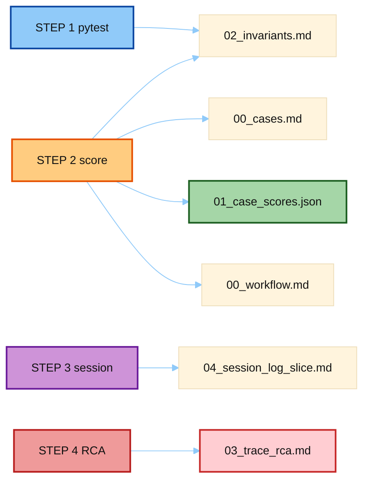

# Eval + Trace Demo

双层结构，更接近 Hermes 实际：

| 层 | 像不像真 Hermes | 做什么 |
|----|-----------------|--------|
| **A. pytest contracts** | ✅ 风格对齐 `test_prompt_caching.py` | `Test*` 类，断言关系 / 不变量 |
| **B. offline harness** | ❌ 真仓无此 JSON suite | 正例+负例打分、session 日志、RCA 报告 |

**无需 API Key。**



---

## Call Flow（`run_eval_suite.py`）



| STEP | 函数 | 产物 |
|------|------|------|
| 0 | `refresh_from_02_export` | `from_02_agent_loop.json`（可选） |
| 1 | `run_contract_pytest` | pytest 输出 → `02_invariants.md` |
| 2 | `score_suite` / `score_case` | `01_case_scores.json`、`00_cases.md` |
| 3 | `demo_emit_session_logs` | `04_session_log_slice.md` |
| 4 | `analyze_failure` | `03_trace_rca.md`（仅负例） |

### Code Call Flow（完整函数调用 · txt）

```text
run_eval_suite.main()
 │
 ├─① refresh_from_02_export()                    # STEP 0（可选）
 │      └─ load_run(02 exports/agent_loop/)
 │           ├─ is_agent_loop_export_dir(path)?
 │           └─ load_agent_loop_export(path)     # 解析 00/04/05/06 → run dict
 │      → dump(fixtures/from_02_agent_loop.json)
 │      → dump(exports/…/00_from_02_summary.md)  # 仅刷新成功时
 │
 ├─② run_contract_pytest()                       # STEP 1 · Layer A
 │      └─ subprocess: pytest test_agent_loop_contracts.py -q
 │           └─ Test* 类 → checkers:
 │                check_role_alternation / check_system_stable
 │                check_tools_frozen / check_budget_consistent
 │
 ├─③ resolve_cases_path() → load_cases(eval_cases.json)
 │      ├─ cases_to_jsonl(cases) → dump(eval_cases.jsonl)
 │      └─ format_cases_table_md(cases) → dump(00_cases.md)
 │
 ├─④ score_suite(cases, fixtures/)               # STEP 2 · Layer B
 │      for case in cases:
 │        └─ load_run(fixtures/<run_fixture>)
 │             └─ score_case(case, run)
 │                  ├─ tool_sequence_from_trace(trace)
 │                  ├─ 期望关系 ×5
 │                  │    tools_subset / no_forbidden / steps / exit / final_text
 │                  └─ 循环不变量 ×4
 │                       check_role_alternation(messages)
 │                       check_system_stable(trace)
 │                       check_tools_frozen(trace)
 │                       check_budget_consistent(run)
 │      → dump(01_case_scores.json)
 │      → dump(02_invariants.md)  # format_invariants_md(scores, pytest_*)
 │
 ├─⑤ demo_emit_session_logs(session_id)          # STEP 3
 │      ├─ set_session_context(session_id)
 │      ├─ logging → agent / errors / component 分流
 │      └─ filter_log_by_session(agent_log, session_id)
 │      → dump(04_session_log_slice.md)
 │
 ├─⑥ for FAIL score:                             # STEP 4 · 仅负例
 │      load_run(fixture) → analyze_failure(case, run, score)
 │           └─ failed_checks → root_cause + evidence + fix_hypothesis
 │      → format_rca_md(report) → dump(03_trace_rca.md)
 │
 └─⑦ format_workflow_md(scores, session_id, pytest_ok)
        → dump(00_workflow.md)
```

---

## 何时 Eval？Eval 的是什么？

评的是 **已冻结的 Agent Loop 轨迹**（messages + trace），不是当场再调模型、也不是金标全文。



| 文件 | 含义 |
|------|------|
| `from_02_agent_loop.json` | 正例：02 实跑轨迹 |
| `failure_run.json` | 负例：合成坏轨迹（驱动 RCA） |
| `eval_cases.json` | Layer B 期望关系（工具 / 步数 / 退出） |

一句话：**Hermes CI ≈ pytest 测契约；本 demo 再加一层 Trace 报告方便讲 RCA。**

架构位置见 [`../README.md`](../README.md)。

---

## 两条 Case（Layer B）

| id | fixture | 意图 | 期望 |
|----|---------|------|------|
| `golden-loop-ok` | `from_02_agent_loop.json` | 工具子集 + 允许 grace | **PASS** |
| `failure-wrong-tool-cache-break` | `failure_run.json` | 错工具 / role 破 / cache 漂 / 无 grace | **FAIL → RCA** |



人读一览：[`fixtures/eval_cases.md`](fixtures/eval_cases.md)。

---

## 打分评测标准

实现：`teaching/harness/scorer.py` + `teaching/invariants/checkers.py`。  
**不比金标全文、不锁精确工具序列**——只断言「期望关系」与循环不变量。

### 通过规则

| 层级 | 规则 |
|------|------|
| 单项 check | `ok == true` |
| 单 case | **全部** check 通过 → `passed: true` |
| Layer A | `pytest` 全绿（当前 16 tests） |
| Layer B | 正例 PASS；负例 FAIL 并写 RCA |



蓝 = 期望关系；紫 = 循环不变量（对齐 Prompt Cache / 消息布局）。

### Case 期望字段（`eval_cases.json`）

| 字段 | 含义 | 对应 check |
|------|------|------------|
| `expected_tools` | 轨迹中**至少**出现过这些工具（子集，非精确序列） | `tools_subset` |
| `forbidden_tools` | 不得出现的工具 | `no_forbidden` |
| `max_steps` | `api_calls ≤ max_steps` | `steps` |
| `allowed_exits` | `exit_reason` 必须落在此集合 | `exit` |
| `require_final_text` | 为 true 时 `final_response` 非空 | `final_text` |

### 九项 Check（全部 AND）

**期望关系（5）**

| check | 通过条件 |
|-------|----------|
| `tools_subset` | `expected_tools ⊆` 轨迹实际工具集合 |
| `no_forbidden` | 实际工具 ∩ `forbidden_tools` 为空 |
| `steps` | `api_calls ≤ max_steps` |
| `exit` | `exit_reason ∈ allowed_exits` |
| `final_text` | 需终答时 `final_response` 非空；否则跳过 |

**循环不变量（4）** — 与 Hermes「行为契约 / prompt cache」对齐

| check | 通过条件 |
|-------|----------|
| `role_alternation` | 不允许连续 `assistant` / `system`；允许多条连续 `tool`、连续 `user` |
| `system_stable` | 同 turn 内各次 `api_request` 的 system 指纹一致（保 cache） |
| `tools_frozen` | 循环内 `tool_names` 集合中途不增减 |
| `budget_consistent` | `budget_used ≤ budget_max`；`budget_grace_call` 时 `api_calls == budget_max + 1`；`budget_exhausted` 时 `used ≥ max` |

### 故意不做的事（反例）

```text
❌ assert exit_reason == "budget_grace_call"   # 冻结某次实跑
❌ assert api_calls == 7                       # 换模型就漂
❌ assert tool_sequence == ["todo", "web_search", ...]  # 精确序列快照
```

---

## 目录

```text
demo/
├── README.md                     # 本页
├── run_eval_suite.py             # 入口：Layer A → B → 日志 → RCA
├── requirements.txt              # pytest>=8,<9
│
├── fixtures/
│   ├── from_02_agent_loop.json   # ★ 正例（02 实跑，可刷新）
│   ├── failure_run.json          # ★ 负例（合成，应 FAIL）
│   ├── eval_cases.json           # Layer B 期望源文件（人改这个）
│   ├── eval_cases.jsonl          # 由 suite 从 .json 同步
│   └── eval_cases.md             # case 人读一览
│
├── teaching/
│   ├── invariants/               # Layer A：循环不变量
│   │   ├── checkers.py           # role / system / tools / budget
│   │   ├── test_agent_loop_contracts.py  # ★ Hermes 风格 Test* 契约
│   │   └── test_checkers.py      # 兼容 re-export → contracts
│   ├── logging/
│   │   └── session_logger.py     # session_tag + component 分流演示
│   └── harness/                  # Layer B：评测编排
│       ├── scorer.py             # score_case / score_suite
│       ├── rca.py                # 失败 → root_cause + evidence
│       └── load_agent_loop_export.py  # 02 exports 目录 → run dict
│
└── exports/eval_run/             # 跑 suite 后的产物
```

| 路径 | 职责 |
|------|------|
| `run_eval_suite.py` | 端到端：pytest → 打分 → 日志 → RCA → 写 exports |
| `test_agent_loop_contracts.py` | 近 Hermes CI 的契约层（主学习入口） |
| `from_02_agent_loop.json` / `failure_run.json` | 正例 / 负例冻结轨迹 |
| `eval_cases.json` | Layer B 两条期望 |
| `scorer.py` / `rca.py` | 离线打分与根因 |

---

## 跑法

```powershell
cd 03-eval\demo
pip install -r requirements.txt

# Layer A：近 Hermes 契约（推荐先看）
python -m pytest teaching/invariants/test_agent_loop_contracts.py -q

# 全流程：A + B + session 日志 + RCA
python run_eval_suite.py
```

可选：先刷新 02 正例轨迹再评：

```powershell
cd ..\..\02-run-agent\demo
python run_agent_loop.py
cd ..\..\03-eval\demo
python run_eval_suite.py   # 若存在 02 exports/agent_loop，会重写 from_02_agent_loop.json
```

成功时大致应看到：`pytest: PASS`、`offline: 1/2 cases passed`（负例 FAIL 为预期）。

---

## 产物

跑完 `run_eval_suite.py` → `exports/eval_run/`：



| 文件 | 描述 |
|------|------|
| `00_cases.md` | 两条 case 期望总表 |
| `00_from_02_summary.md` | 若从 02 刷新了正例：exit / api_calls / budget 摘要 |
| `00_workflow.md` | 双层流水线示意 + suite 汇总 |
| `01_case_scores.json` | Layer B 打分：正例 `passed:true`，负例 `false` |
| `02_invariants.md` | Layer A pytest 输出 + 各 case 九项 check ✓/✗ |
| `03_trace_rca.md` | 负例根因（如 `wrong_tool+role_break+cache_break`） |
| `04_session_log_slice.md` | session_tag 日志演示（非轨迹打分） |

```text
exports/eval_run/
├── 00_cases.md              # case 期望总表
├── 00_from_02_summary.md    # 02 正例刷新摘要（可选）
├── 00_workflow.md           # 双层流水线 + 汇总
├── 01_case_scores.json      # ★ Layer B 打分
├── 02_invariants.md         # Layer A + B 明细
├── 03_trace_rca.md          # ★ 负例 RCA
└── 04_session_log_slice.md  # session 日志演示
```
