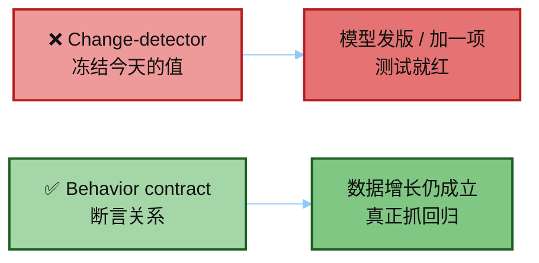
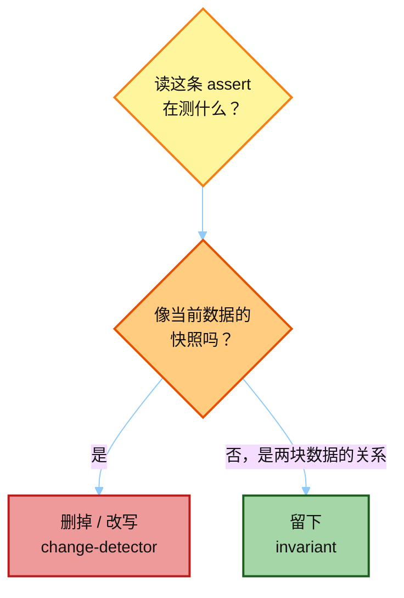
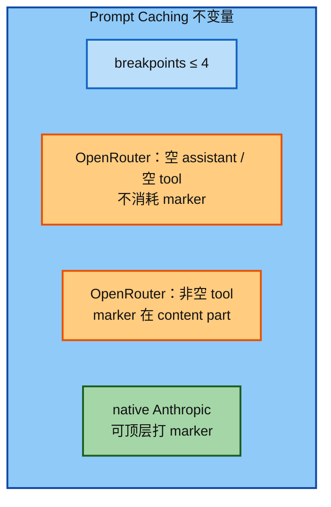
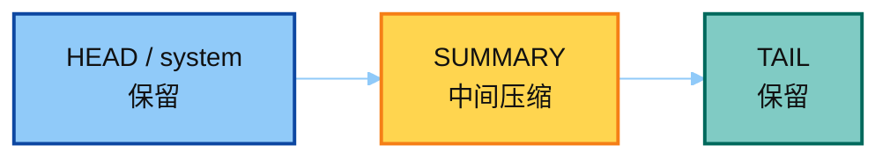
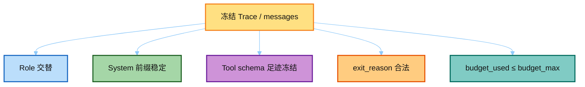
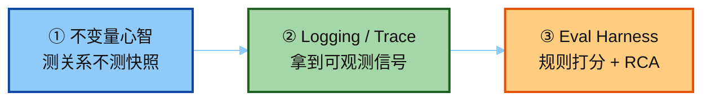

# 01 · Eval 不变量：行为契约 vs 变更检测

> 讲解顺序：[`README.md`](./README.md) · **主线 1/3**  
> 对照：`../hermes_src/AGENTS.md`「Don't write change-detector tests」  
> 课堂主文件：`../hermes_src/tests/agent/test_prompt_caching.py`  
> Demo：`../demo/teaching/invariants/` · `python run_eval_suite.py`  
> 下一篇：[`02_logging_trace.md`](./02_logging_trace.md) · 桥：[`04_tests_and_eval.md`](./04_tests_and_eval.md)

---

## 0. 一句话

好测试断言 **数据之间必须成立的关系（不变量）**，不冻结当前值（模型列表 / 配置版本号 / 枚举数量）。后者叫 change-detector：源码一更新就红，却测不到行为。



---

## 1. 反模式 vs 正模式



```python
# ❌ change-detector — 模型发版就挂
assert "gemini-2.5-pro" in _PROVIDER_MODELS["gemini"]
assert DEFAULT_CONFIG["_config_version"] == 21
assert len(_PROVIDER_MODELS["huggingface"]) == 8

# ✅ invariant — 关系在数据增长时仍成立
assert "gemini" in _PROVIDER_MODELS
assert len(_PROVIDER_MODELS["gemini"]) >= 1
assert raw["_config_version"] == DEFAULT_CONFIG["_config_version"]
for m in _PROVIDER_MODELS["huggingface"]:
    assert m.lower() in DEFAULT_CONTEXT_LENGTHS_LOWER
```

| 味道 | 典型写法 | 一改就坏的原因 |
|------|----------|----------------|
| 快照 | `== 21`、`len == 8`、具体模型名 | catalog / 版本 bump 是正常演进 |
| 关系 | `A ∈ catalog`、`len(A) ≥ 1`、`user_ver == DEFAULT` | 只有**关系断了**才红 |

---

## 2. Hermes 课堂范例

### 2.1 Prompt Caching（`test_prompt_caching.py`）

不关心「今天 catalog 里有哪些模型」，关心协议与适配器契约：



| 不变量 | 含义 |
|--------|------|
| Anthropic breakpoint ≤ 4 | 协议上限，不是「当前恰好几个」 |
| 空 assistant / 空 tool 不吃 cache marker（OpenRouter） | 避免无效 marker 导致 hang |
| native Anthropic 可 top-level 打 marker | 适配器路径差异是契约，不是快照 |

### 2.2 Context Compressor（`test_context_compressor.py`）



```text
PRESERVED_HEAD / SYSTEM  <  SUMMARY_BODY  <  PRESERVED_TAIL
```

顺序错了 = 拼装坏了；「摘要里今天有几个文件名」≠ 契约。

---

## 3. Agent Loop 可测的不变量

对一条**冻结**的 loop 导出（来自 `02-run-agent`），可断言：



| 不变量 | 信号 | 为什么重要 |
|--------|------|------------|
| Role 交替 | 同 role 不连发（同轮多条 `tool` 除外） | 破坏 API 消息布局 |
| System 前缀稳定 | 同 turn 多次 API 的 system 字节不变 | 砸 Prompt Cache |
| Tool schema 足迹 | 循环内 tools 集合不中途增减 | 砸缓存 + 模型幻觉工具 |
| 退出理由合法 | `exit_reason ∈ {completed, budget_grace_call, …}` | 知道是正常收尾还是空转耗尽 |
| 预算一致 | `budget_used ≤ budget_max`；grace 可 `api_calls = max + 1` | 成本与收敛纪律 |

这些是 **行为契约**，不是「今天 todo 必须叫这个名字」的快照。

---

## 4. 和 Eval 怎么串起来



---

## 5. 面试话术

> Hermes 测试哲学：**Behavior contracts over snapshots**。  
> 评测集也应写「期望工具 ⊆ 实际工具序列」「步数 ≤ 预算」「role 不变量」，而不是「最终答案必须等于这段金标字符串」——后者在模型换代时脆得像变更检测测试。

下一步：[`02_logging_trace.md`](./02_logging_trace.md)（怎么从日志 / Trace 拿到上述信号）。
