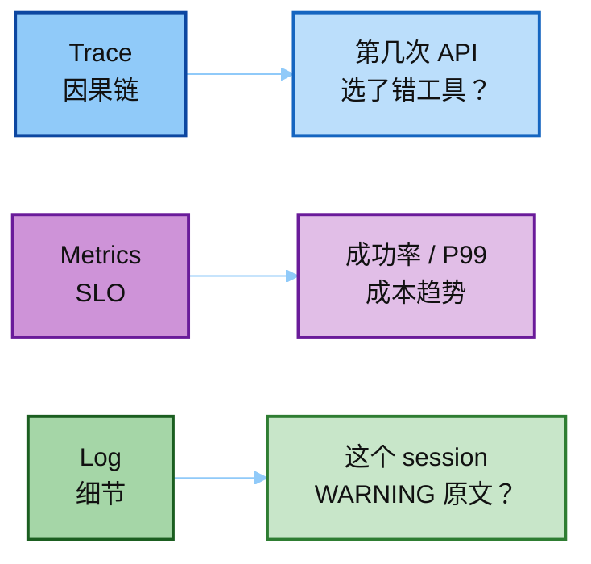
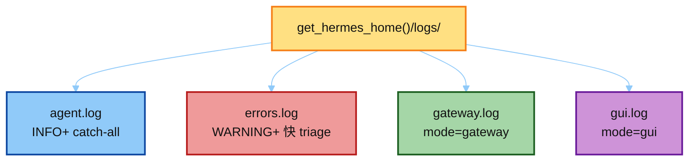
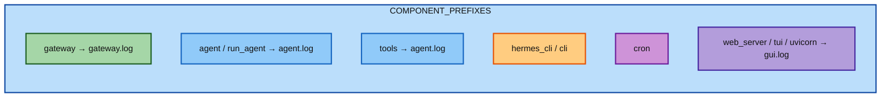
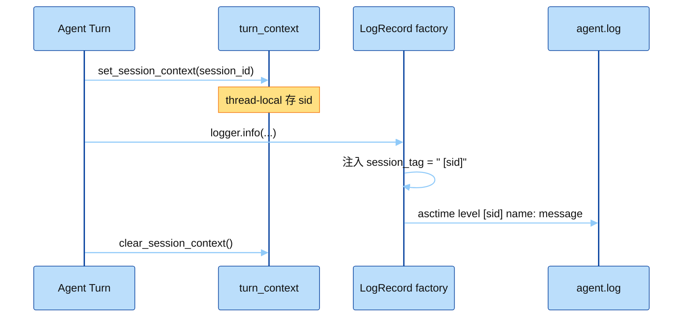
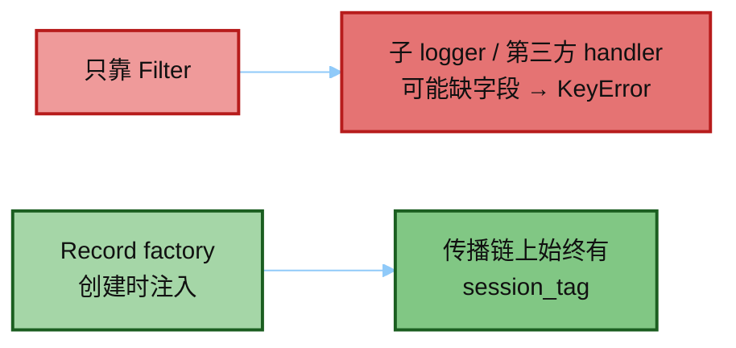
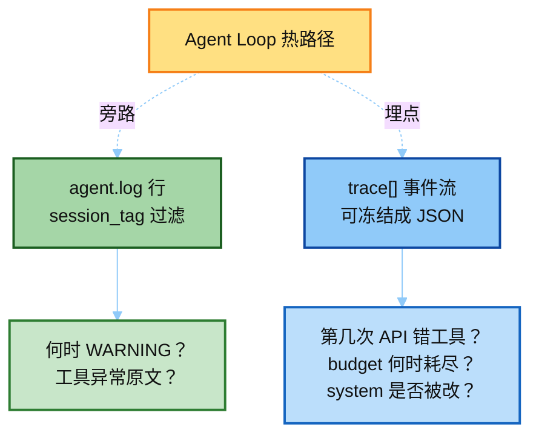
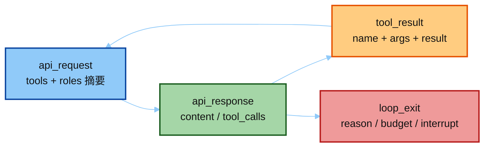
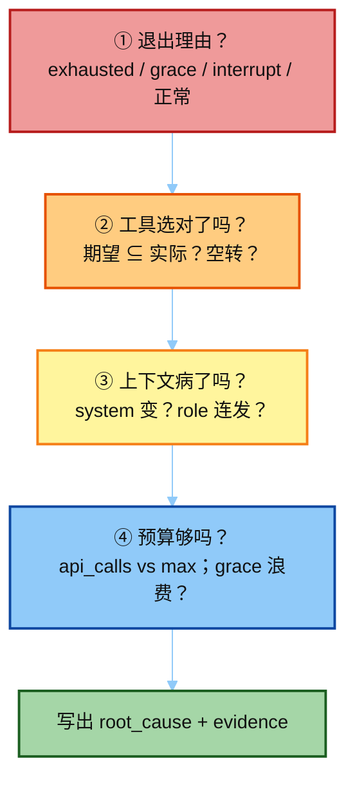
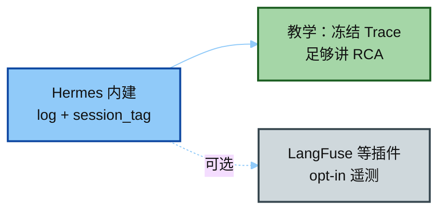

# 02 · Logging / Trace：session_tag 与根因定位

> 讲解顺序：[`README.md`](./README.md) · **主线 2/3** · 上一篇 [`01`](./01_eval_invariants.md)  
> 对照：`../hermes_src/hermes_logging.py`  
> 真源码挂钩：`agent/turn_context.py` → `set_session_context(session_id)`  
> Demo：`../demo/teaching/logging/` · fixtures `sample_agent.log`  
> Golden Trace：`../../02-run-agent/demo/exports/agent_loop/06_trace.md`

---

## 0. 一句话

**Trace 查因果，Metrics 看 SLO，Log 查细节。**  
Hermes 用 `session_tag` 把一条对话串到 `agent.log`；教学 demo 用结构化 `trace[]`（`api_request` / `api_response` / `tool_result` / `loop_exit`）做 RCA。



---

## 1. 日志分流（读代码）



```text
~/.hermes/logs/          # 实际路径走 get_hermes_home()，支持 profile
├── agent.log            # INFO+，catch-all
├── errors.log           # WARNING+，快速 triage
├── gateway.log          # mode=gateway 时：gateway.* / plugins.platforms
└── gui.log              # mode=gui 时：dashboard / tui_gateway / uvicorn
```

按 **logger 名前缀** 分流到组件（教学摘录）：



```python
COMPONENT_PREFIXES = {
    "gateway": ("gateway", "hermes_plugins", "plugins.platforms"),
    "agent":   ("agent", "run_agent", "model_tools", "batch_runner"),
    "tools":   ("tools",),
    "cli":     ("hermes_cli", "cli"),
    "cron":    ("cron",),
    "gui":     ("hermes_cli.web_server", "hermes_cli.pty_bridge", "tui_gateway", "uvicorn"),
}
```

用户侧：`hermes logs [--follow] [--level …] [--session …] [--component …]`。

---

## 2. session_tag 机制

把「这一轮对话」钉到每一行日志上，才能按 session 过滤。



格式：

```text
%(asctime)s %(levelname)s%(session_tag)s %(name)s: %(message)s
```

要点：用 **Record factory** 而不是只靠 Filter——保证第三方 handler / 子 logger 传播时也不会丢字段（避免 `KeyError: session_tag`）。



---

## 3. Trace vs Log（两套信号）



| 信号 | 来源 | 适合问什么 |
|------|------|------------|
| `agent.log` 行 | `hermes_logging` | 某 session 何时报 WARNING？工具抛了啥异常？ |
| `06_trace.md` / `golden_run.json` | demo `conversation_loop` 埋点 | 第几次 API 选了错工具？budget 何时耗尽？system 是否被改？ |

### Loop 内可观测点（对照 `02-run-agent`）



```text
api_request  → tools schema + message_roles 摘要
api_response → content / tool_calls
tool_result  → name + args + result（可截断）
loop_exit    → reason / budget_used / interrupted
```

---

## 4. 根因分析套路（面试会讲）

给定一条失败 Trace，按序问：



1. **退出理由？** `budget_exhausted` / `budget_grace_call` / `interrupt` / 正常文本？  
2. **工具选对了吗？** 期望工具是否出现在 `tool_calls` 序列？有没有反复同 query 空转？  
3. **上下文病了吗？** 同 turn 内 system 是否变化？是否出现同 role 连发 / 合成 user？  
4. **预算够吗？** `api_calls` vs `budget_max`；grace 是否浪费在又一次 tool_call？

Demo 的 `failure_run.json` 故意踩「选错工具 + role 破环 + budget 空转」三点，见 [`03_eval_harness.md`](./03_eval_harness.md)。

---

## 5. 外接 Observability（了解即可）

完整 Hermes 可挂 LangFuse 等插件（**opt-in**）。本模块教学 **不依赖** 第三方：冻结 Trace + session 日志切片就够讲清 Observability 三板斧。



下一步：[`03_eval_harness.md`](./03_eval_harness.md)（用规则对冻结轨迹打分，失败写 RCA）。
