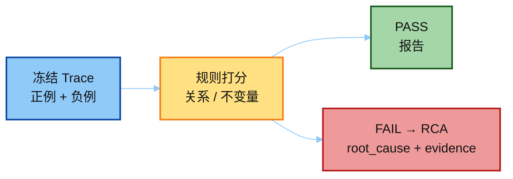
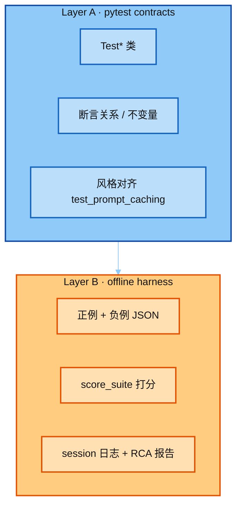
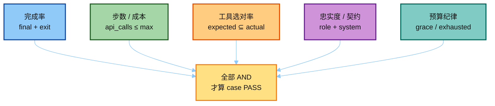
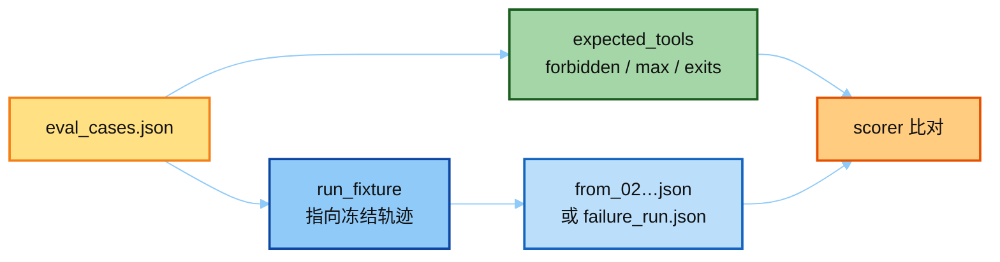
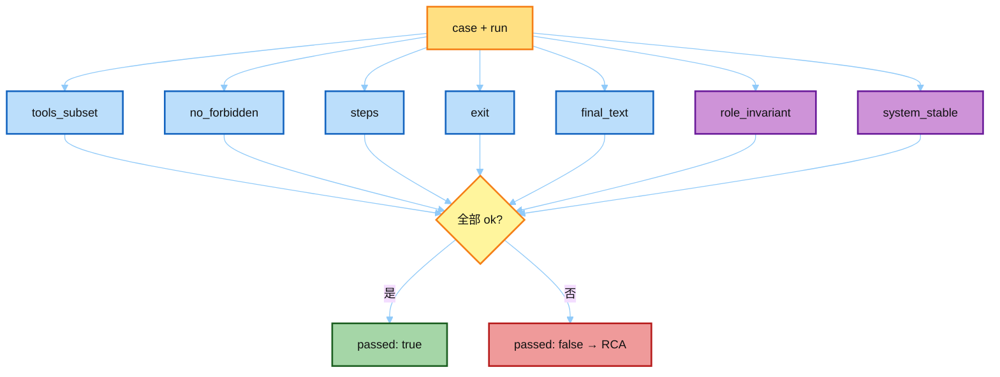
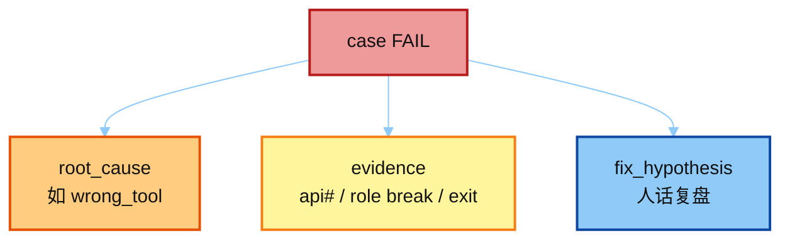
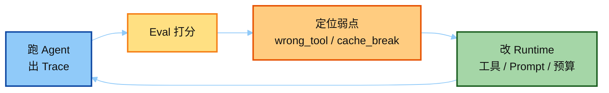
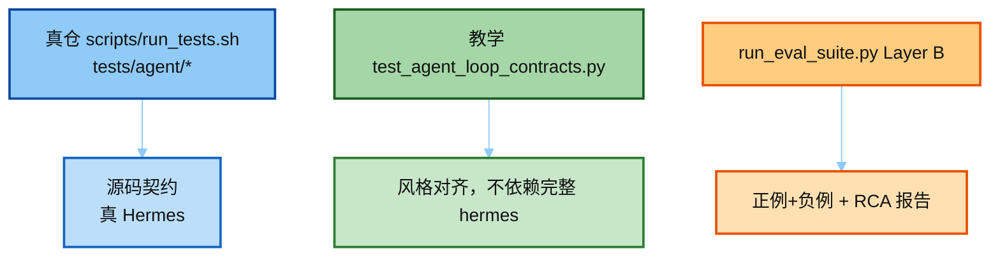

# 03 · 最小 Eval Harness：离线打分 + RCA

> 讲解顺序：[`README.md`](./README.md) · **主线 3/3** · 上一篇 [`02`](./02_logging_trace.md)  
> Demo：`../demo/run_eval_suite.py`  
> Layer A：`teaching/invariants/test_agent_loop_contracts.py`（近 Hermes pytest）  
> Layer B：`fixtures/eval_cases.json` + `from_02_agent_loop.json` / `failure_run.json`  
> 输出：`../demo/exports/eval_run/` · 下一篇桥：[`04_tests_and_eval.md`](./04_tests_and_eval.md)

---

## 0. 一句话

评测不必每次打真模型：**冻结一条 loop 导出 → 用规则打分 → 对失败 case 写 RCA**。这就是 JD 里 Eval / Benchmark / Trace Analysis 的最小可展示物。



---

## 1. 双层结构（像不像真 Hermes）



| 层 | 像不像真 Hermes | 做什么 |
|----|-----------------|--------|
| **A. pytest contracts** | ✅ 风格对齐 | `Test*`，断言关系 / 不变量 |
| **B. offline harness** | ❌ 真仓无此 JSON suite | 正例+负例打分、日志、RCA |

流程：`pytest` → `score_suite` → session 日志 → 负例 RCA。**无需 API Key。**

---

## 2. 评测维度（对齐大纲）



| 维度 | 本 demo 信号 | 通过条件（示例） |
|------|--------------|------------------|
| 完成率 | `final_response` 非空 + `exit_reason` | 在 case 允许的 exit 集合内 |
| 步数 / 成本代理 | `api_calls` / `budget_used` | `api_calls ≤ max_steps` |
| 工具选对率 | `tool_sequence` | `expected_tools ⊆ actual`；禁止 `forbidden_tools` |
| 忠实度 / 契约 | role 交替、system 稳定 | invariants 全绿 |
| 预算纪律 | grace / exhausted | case 可声明「期望 grace」或「禁止 exhausted」 |

不写「最终中文答案必须逐字等于金标」——那是 change-detector 的近亲（见 [`01_eval_invariants.md`](./01_eval_invariants.md)）。

---

## 3. Case 文件形状

一条 case = **期望关系**，不是期望全文快照。



```json
{
  "id": "loop-grace-ok",
  "run_fixture": "golden_run.json",
  "expected_tools": ["todo", "web_search"],
  "forbidden_tools": ["execute_code"],
  "max_steps": 10,
  "allowed_exits": ["completed", "budget_grace_call"],
  "require_final_text": true,
  "notes": "02-run-agent 实跑：budget 用尽后 grace 收尾"
}
```

| id | fixture | 意图 | 期望 |
|----|---------|------|------|
| `golden-loop-ok` | `from_02_agent_loop.json` | 工具子集 + 允许 grace | **PASS** |
| `failure-wrong-tool-cache-break` | `failure_run.json` | 错工具 / role 破 / cache 漂 | **FAIL → RCA** |

---

## 4. Scorer 怎么判



```python
def score_case(case, run) -> CaseScore:
    actual_tools = tool_names_from_trace(run["trace"])
    checks = [
        ("tools_subset", set(case["expected_tools"]) <= set(actual_tools)),
        ("no_forbidden", not (set(actual_tools) & set(case.get("forbidden_tools", [])))),
        ("steps", run["api_calls"] <= case["max_steps"]),
        ("exit", run["exit_reason"] in case["allowed_exits"]),
        ("final", bool(run.get("final_response")) if case["require_final_text"] else True),
        ("role_invariant", check_role_alternation(run["messages"])),
        ("system_stable", check_system_stable(run["trace"])),
    ]
    return CaseScore(passed=all(ok for _, ok in checks), checks=checks)
```

蓝 = 期望关系；紫 = 循环不变量（与 Prompt Cache / 消息布局对齐）。

---

## 5. RCA 输出形状

失败时不只打 `FAIL`，要写可讲的根因：



```text
root_cause: wrong_tool
evidence:
  - api#2 tool_calls=['execute_code']  # expected web_search
  - role break at messages[3]: user→user
  - exit_reason=budget_exhausted (not in allowed_exits)
fix_hypothesis: 模型空转执行代码且破坏 role 交替，预算耗尽无 grace 文本
```

面试时拿着 `exports/eval_run/03_trace_rca.md` 讲即可；提问顺序见 [`02_logging_trace.md`](./02_logging_trace.md) 第 4 节。

---

## 6. 闭环：Eval 如何反过来优化 Agent



| 优化方向 | Eval 信号 |
|----------|-----------|
| 工具与策略 | 总调错 `execute_code` → 收紧 schema / 指引 |
| 成本与收敛 | 大量 `budget_exhausted` → 砍空转、加 grace |
| Context / Cache | `system` 漂 / role 破 → 守住中途不改 |
| 防回归 | 固定 case 集 + CI 不变量 |

---

## 7. 与 CI / `run_tests.sh` 的关系



| 层 | 入口 | 目的 |
|----|------|------|
| 单元不变量 | 真仓 `scripts/run_tests.sh` → `tests/agent/` | 源码契约（真 Hermes） |
| 教学契约 | `test_agent_loop_contracts.py`（Test* 类） | 风格对齐真仓 |
| 行为评测报告 | `run_eval_suite.py` Layer B | 正例+负例打分 + RCA |

原则一致：**测关系，不测快照**；真仓永远走 `run_tests.sh`，勿裸奔 `pytest`（凭证 / TZ / 隔离会漂）。

---

## 8. 大纲动手清单

- [x] pytest 契约层（对齐 Hermes `Test*` 风格）
- [x] 正例 + 负例两条拉开的 offline case
- [x] 自动跑分脚本（先 pytest 再 score_suite）
- [x] ≥1 条不变量断言（role / system / tools / budget）
- [x] 一条完整 Trace 根因分析（`failure_run.json` → RCA）

```bash
cd 03-eval/demo
python run_eval_suite.py
# 看 exports/eval_run/
```

主线串读：[`01`](./01_eval_invariants.md) → [`02`](./02_logging_trace.md) → 本文 → 动手 `demo/` → [`04`](./04_tests_and_eval.md)。
