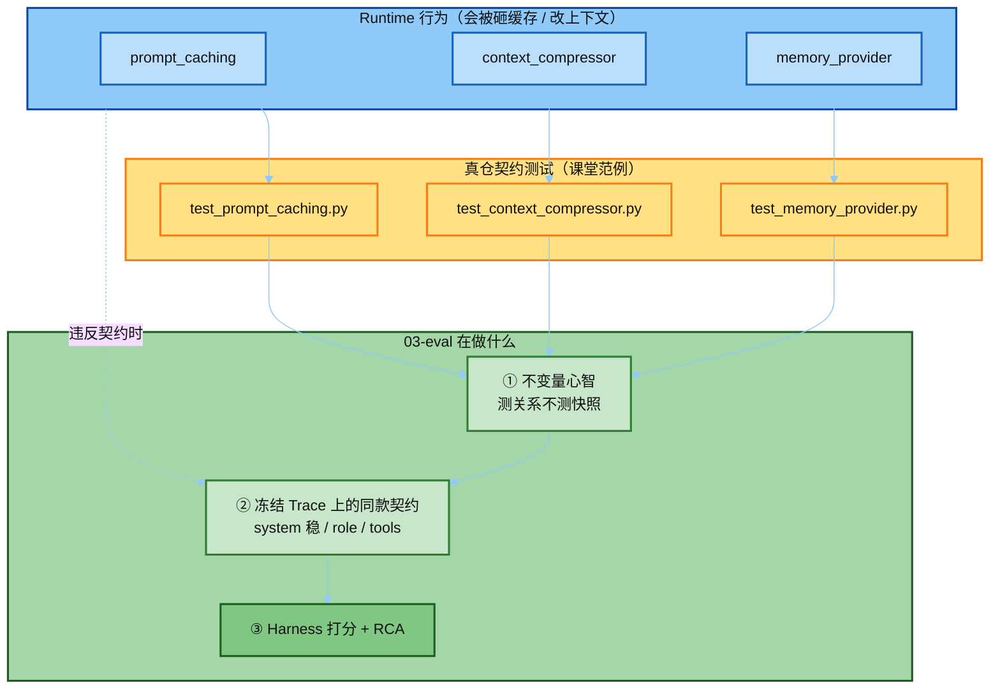
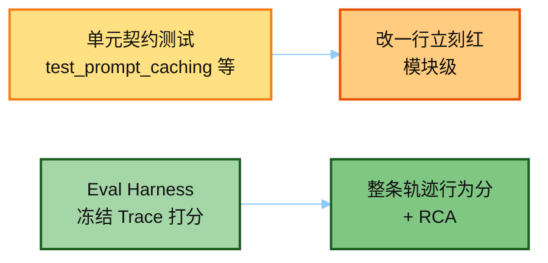
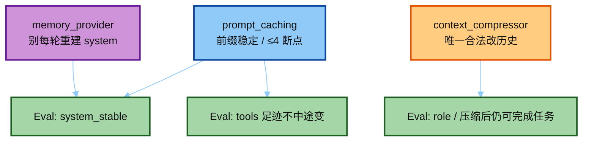

# 04 · 三份契约测试跟 Eval 什么关系

> 讲解顺序：[`README.md`](./README.md) · **桥** · 上一篇 [`03`](./03_eval_harness.md)  
> 延伸：[`05`](./05_test_prompt_caching.md) · [`06`](./06_test_context_compressor.md) · [`07`](./07_test_memory_provider.md) · 主线 [`01`](./01_eval_invariants.md)

---

## 0. 一句话

**它们不是 Eval 流水线里的一步，而是 Eval 要学的「测什么 / 怎么测」的真仓范例。**

---

## 1. 总览图

---

## 2. 对照表

| 关系 | 说明 |
|------|------|
| **哲学同源** | AGENTS.md「Behavior contracts over snapshots」——三份测试是正面教材；`01` 直接拿它们举例 |
| **不是 Eval 入口** | Eval demo 跑 `run_eval_suite.py` / Layer A，**不会**拿这三份当打分器 |
| **解释「为什么要评这些」** | Eval 查 system 稳、role 交替、tools 不中途变——正因 caching / 压缩 / memory 一乱就会砸前缀或毁布局 |
| **分工** | 单元测试：改源码立刻红；Eval：对整条冻结 loop 轨迹打分 + RCA |

---

## 3. 不变量怎么映射到 Eval check

| Runtime / 测试讲稿 | Eval 侧对应信号 |
|--------------------|-----------------|
| [`05` prompt caching](./05_test_prompt_caching.md) | `system_stable`、中途不改 toolset |
| [`06` compressor](./06_test_context_compressor.md) | 压缩是改历史的例外；压缩后仍要 role 合法 |
| [`07` memory](./07_test_memory_provider.md) | system 静态块会话级稳定 |

---

## 4. 建议读法

下一步：[`05_test_prompt_caching.md`](./05_test_prompt_caching.md)。
