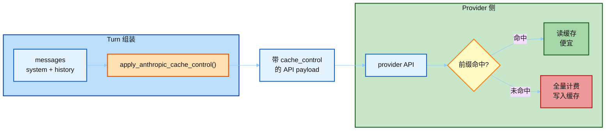
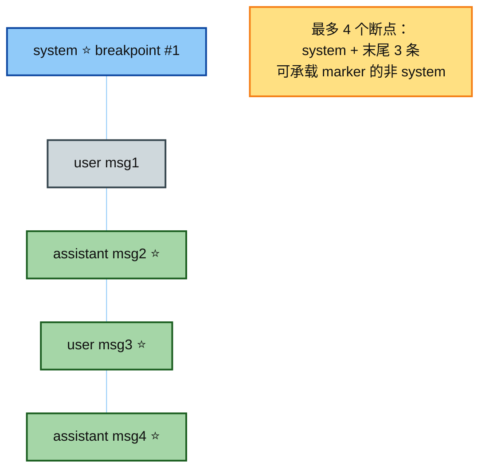
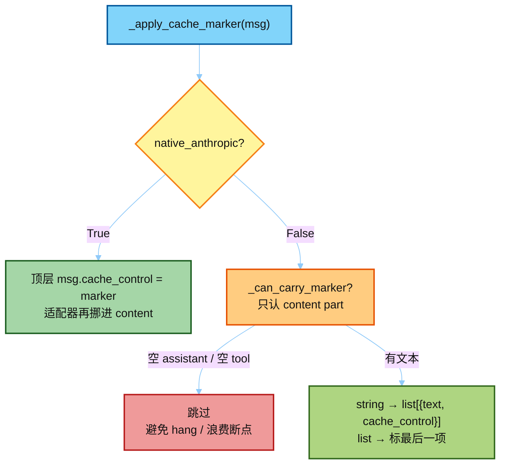
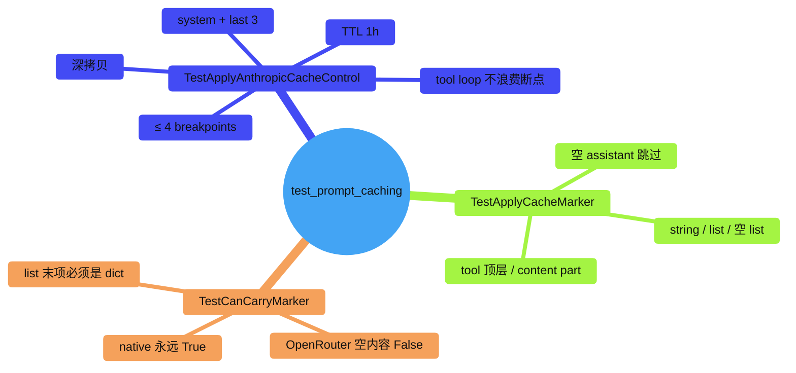

# 05 · `test_prompt_caching.py` 讲解

> 讲解顺序：[`README.md`](./README.md) · **范例 1/3** · 上一篇 [`04`](./04_tests_and_eval.md)  
> 源码：`hermes_src/agent/prompt_caching.py`  
> 测试：`hermes_src/tests/agent/test_prompt_caching.py`（~226 行）  
> 策略名：`system_and_3` — 最多 **4** 个 `cache_control` 断点  
> 跟 Eval：[`04_tests_and_eval.md`](./04_tests_and_eval.md) · 下一篇 [`06`](./06_test_context_compressor.md)

---

## 0. 一句话

给 Anthropic 请求打 **Prompt Cache 断点**：system + 最近 3 条可承载标记的非 system 消息，让多轮对话复用前缀，输入成本约降 75%。测试断言的是「标记怎么挂才合法」，不是「今天有哪些模型」。

---

## 1. 它在 Agent 热路径的哪一步



- **不改**历史内容、不换 toolset、不重建 system —— 只在**发送前**深拷贝并打标记。
- 这是 AGENTS.md「Prompt Caching Must Not Break」的配套实现：缓存靠前缀字节稳定；本模块负责断点落在哪。

---

## 2. `system_and_3` 策略



| 规则 | 含义 |
|------|------|
| `breakpoints ≤ 4` | Anthropic 协议上限（不变量，不是快照） |
| TTL `5m` / `1h` | 同一会话内复用；`1h` 时 marker 带 `"ttl": "1h"` |
| Deep copy | 原 `messages` 不被原地污染 |

---

## 3. Native Anthropic vs OpenRouter（核心差异）



| 路径 | tool 空内容 | assistant 空（纯 tool_calls） | 非空 tool |
|------|-------------|-------------------------------|-----------|
| Native Anthropic | 可顶层打标 | 可顶层打标 | 顶层打标 |
| OpenRouter | **跳过** | **跳过** | 包进 content part 再打标 |

测试里反复强调：OpenRouter 对 `role:tool` 顶层 `cache_control` 会 **silent hang**。

---

## 4. 测试结构地图



| 测试类 | 测什么 |
|--------|--------|
| `TestApplyCacheMarker` | 单条消息怎么挂标记 |
| `TestCanCarryMarker` | 这条消息能不能占用一个断点槽 |
| `TestApplyAnthropicCacheControl` | 整条策略：拷贝、system、末尾 3、上限 4、TTL |

---

## 5. 典型不变量（面试可背）

```text
1. cache breakpoints ≤ 4
2. OpenRouter：空 assistant / 空 tool 不消耗断点
3. OpenRouter：非空 tool 的 marker 必须在 content part，不能在顶层
4. apply_* 返回深拷贝，输入 messages 不变
5. _can_carry_marker 与 _apply_cache_marker 对 list 末项规则一致
   （否则 gate 通过但没打上 → 浪费断点）
```

---

## 6. 怎么跑

```bash
# 真仓库（CI 同款）
scripts/run_tests.sh tests/agent/test_prompt_caching.py

# 课堂剪枝树仅作阅读；不要冒充 CI
```

下一步：[`06_test_context_compressor.md`](./06_test_context_compressor.md)（超长上下文真正改历史的唯一合法路径）。
