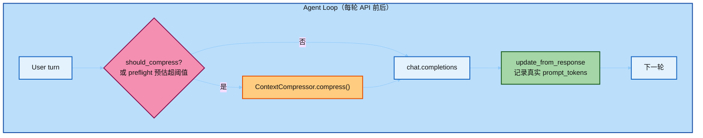
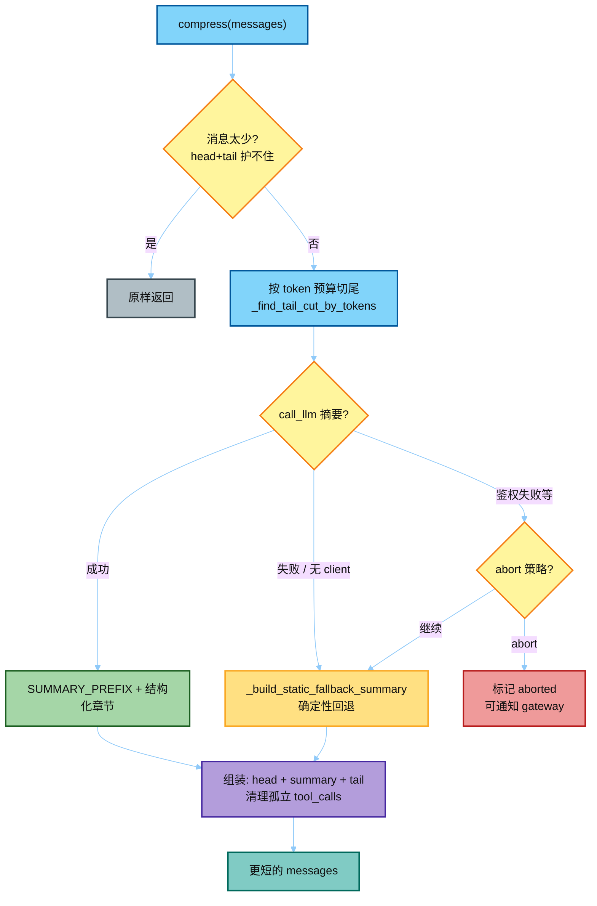
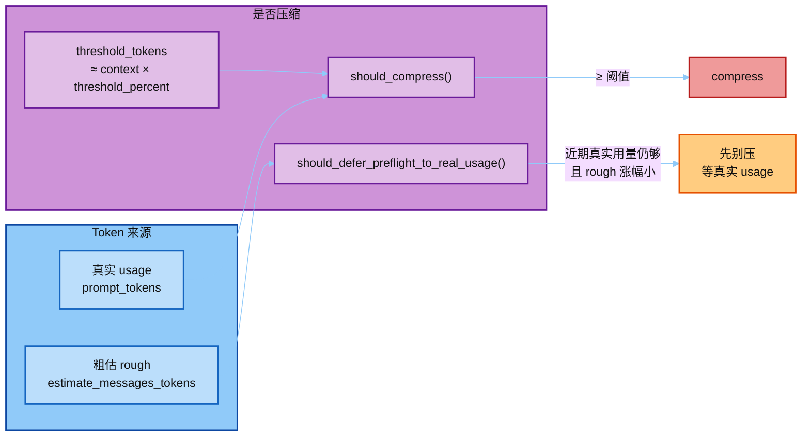
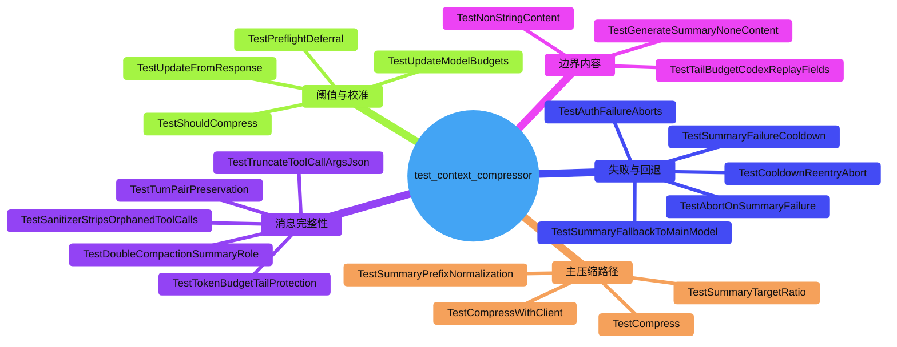

# 06 · `test_context_compressor.py` 讲解

> 讲解顺序：[`README.md`](./README.md) · **范例 2/3** · 上一篇 [`05`](./05_test_prompt_caching.md)  
> 源码：`agent/context_compressor.py`（完整树见 `hermes-study/` / 真仓库）  
> 测试：`hermes_src/tests/agent/test_context_compressor.py`（~3442 行，本模块最重）  
> 定位：AGENTS.md 里 **唯一允许改历史上下文** 的例外  
> 跟 Eval：[`04_tests_and_eval.md`](./04_tests_and_eval.md) · 下一篇 [`07`](./07_test_memory_provider.md)

---

## 0. 一句话

当 prompt token 超过阈值，把中间轮次压成「参考用摘要」，保住 system / 头尾关键消息，腾出上下文窗口——同时用 `SUMMARY_PREFIX` 明确告诉模型：**摘要不是当前任务指令**。

---

## 1. 它在热路径的哪一步



- **Prompt Caching**：尽量别动前缀。  
- **Compression**：窗口装不下时，**不得不**改历史；改完后缓存前缀会失效（这是刻意的代价）。  
- Memory 可在 `on_pre_compress` 里先抽关键信息，再压缩。

---

## 2. 压缩前后消息长什么样

```mermaid
%%{init: {"theme":"base","themeVariables":{"primaryTextColor":"#111111","secondaryTextColor":"#111111","tertiaryTextColor":"#111111","lineColor":"#90CAF9","fontSize":"16px"}}}%%
flowchart LR
    subgraph Before["压缩前"]
        S1["system"]
        H1["head<br/>protect_first_n"]
        M1["middle<br/>大量旧轮次"]
        T1["tail<br/>protect_last_n<br/>或 token 预算"]
    end

    subgraph After["压缩后"]
        S2["system"]
        H2["head 保留"]
        SUM["✨ SUMMARY<br/>REFERENCE ONLY"]
        T2["tail 保留"]
    end

    Before --> After

    style Before fill:#CFD8DC,stroke:#37474F,stroke-width:2px,color:#111111
    style After fill:#A5D6A7,stroke:#1B5E20,stroke-width:2px,color:#111111
    style M1 fill:#EF9A9A,stroke:#B71C1C,stroke-width:2px,color:#111111
    style SUM fill:#FFD54F,stroke:#F57F17,stroke-width:2px,color:#111111
    style S1 fill:#90CAF9,stroke:#0D47A1,stroke-width:2px,color:#111111
    style S2 fill:#90CAF9,stroke:#0D47A1,stroke-width:2px,color:#111111
    style H1 fill:#9FA8DA,stroke:#283593,stroke-width:2px,color:#111111
    style H2 fill:#9FA8DA,stroke:#283593,stroke-width:2px,color:#111111
    style T1 fill:#80CBC4,stroke:#00695C,stroke-width:2px,color:#111111
    style T2 fill:#80CBC4,stroke:#00695C,stroke-width:2px,color:#111111
```



关键不变量（测试里反复断言）：

```text
PRESERVED_HEAD / SYSTEM  <  SUMMARY_BODY  <  PRESERVED_TAIL
```

顺序乱了 = 拼装坏了；「今天摘要里有几个文件名」≠ 契约。

---

## 3. `compress()` 决策流



摘要前缀大意：

> `[CONTEXT COMPACTION — REFERENCE ONLY]`  
> 这是上一窗口的交接笔记，**不是**当前指令；只响应摘要**之后**的最新 user 消息。

结构化章节（Historical 前缀，避免被当成待办）：

| Heading | 作用 |
|---------|------|
| `## Historical Task Snapshot` | 过去在干什么 |
| `## Historical In-Progress State` | 当时进行中的状态 |
| `## Historical Pending User Asks` | 历史追问（勿当未完成） |
| `## Historical Remaining Work` | 历史剩余工作（勿自动续做） |

---

## 4. 阈值 / 校准 / 延迟压缩



测试关注点：

- `TestShouldCompress`：阈值上下界  
- `TestPreflightDeferral`：别被粗估误伤，过早压缩  
- `TestUpdateFromResponse`：压完后用真实 usage 校准  
- `TestUpdateModelBudgets` / `TestUpdateModelResetsCalibration`：换模型要重算预算

---

## 5. 测试结构地图（按类分组）



| 主题 | 代表不变量 |
|------|------------|
| 截断回退 | LLM 挂了也能压短，且摘要里有可恢复的 task/tool 线索 |
| 最新 user ask 只出现一次 | 防 #49307：回退摘要把同一句问三遍 → 模型复读旧任务 |
| Turn pair | 不把 assistant/tool 对拆断 |
| Orphan tool_calls | 压缩后不能留下无 result 的 tool_call |
| 双次压缩 | 摘要角色 / metadata 正确，不叠坏 |
| Cooldown | 摘要连续失败要冷却，避免打爆 aux 模型 |

---

## 6. Fixture 心智模型（读测试时）

```python
ContextCompressor(
    model="test/model",
    threshold_percent=0.85,  # 85% 窗口触发
    protect_first_n=2,       # 保住开头
    protect_last_n=2,        # 保住结尾（或改 token 预算）
    quiet_mode=True,
)
# get_model_context_length → 常 mock 成 100000
# call_llm → mock 成功 / RuntimeError / 鉴权失败
```

---

## 7. 怎么跑

```bash
scripts/run_tests.sh tests/agent/test_context_compressor.py
# 或单类
scripts/run_tests.sh tests/agent/test_context_compressor.py::TestShouldCompress
```

下一步：[`07_test_memory_provider.md`](./07_test_memory_provider.md)（压缩前可钩记忆；跨会话 recall 的插件腰部）。
