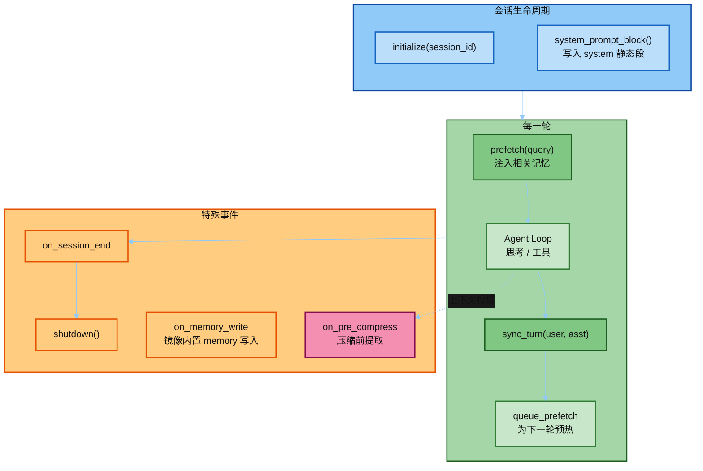
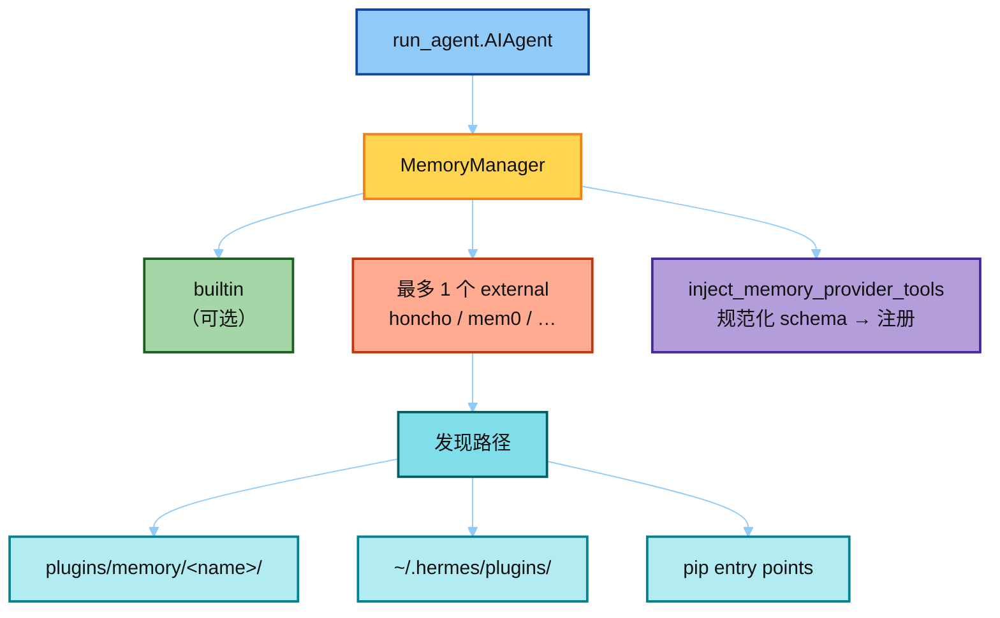
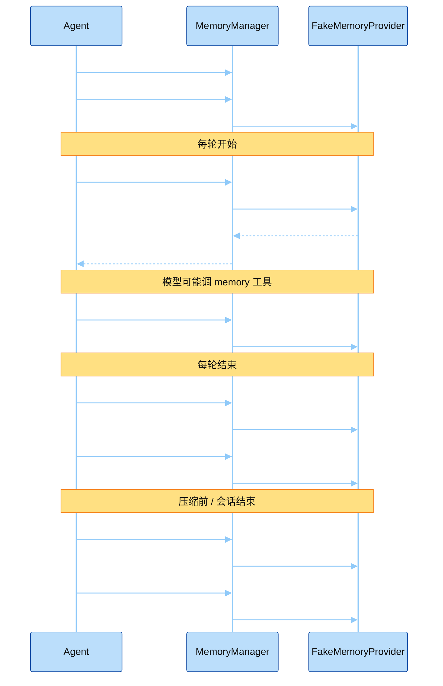
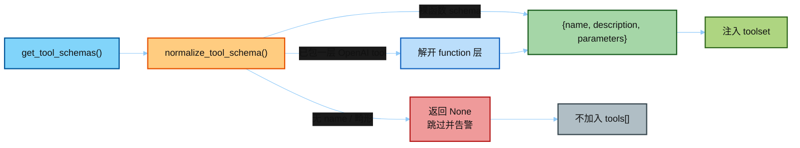
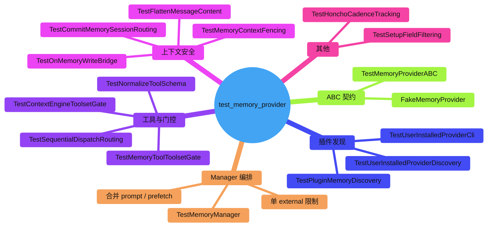
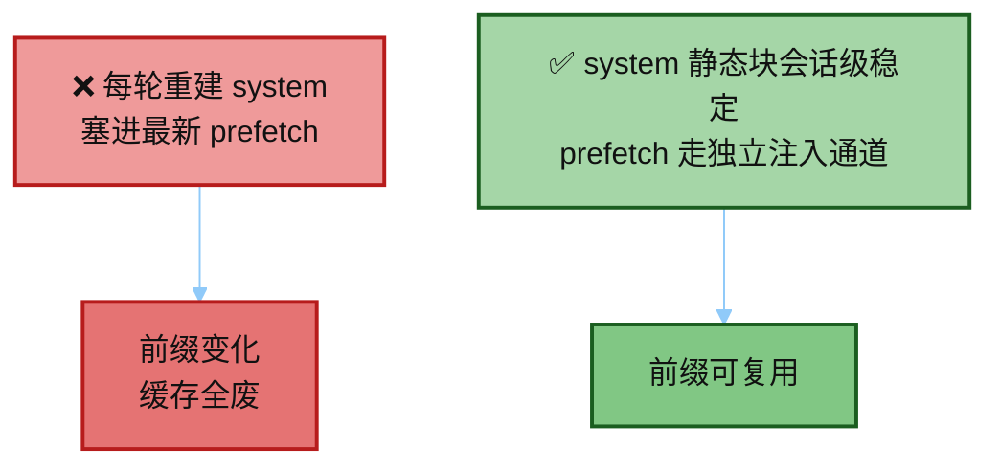

# 07 · `test_memory_provider.py` 讲解

> 讲解顺序：[`README.md`](./README.md) · **范例 3/3** · 上一篇 [`06`](./06_test_context_compressor.md)  
> 源码：`agent/memory_provider.py`（ABC）+ `agent/memory_manager.py`（编排）  
> 测试：`hermes_src/tests/agent/test_memory_provider.py`（~1590 行）  
> 定位：可插拔记忆后端的 **契约 + Manager 编排**，不是某个具体 SaaS 的实现细节  
> 跟 Eval：[`04_tests_and_eval.md`](./04_tests_and_eval.md) · 目录：[`README.md`](./README.md)

---

## 0. 一句话

`MemoryProvider` 定义记忆插件必须实现的生命周期；`MemoryManager` 是 `run_agent` 的唯一接入点——**最多一个外部 provider**，避免 tool schema 膨胀和互相打架。

---

## 1. 它在热路径的哪一步



和另外两个模块的关系：

| 模块 | 关系 |
|------|------|
| Prompt Caching | 记忆写入 system **会话开始时**；中途别重建 system，否则砸缓存 |
| Context Compressor | 压缩前走 `on_pre_compress`，把要留的抽进记忆/摘要 |

---

## 2. 架构：ABC + Manager + 插件目录



硬规则（测试 `test_second_external_rejected`）：

```text
providers ⊆ { builtin?,  exactly_one_external? }
第二个 external → 拒绝并告警，不静默双开
```

---

## 3. Provider 生命周期（Fake 也能跑通）

测试用 `FakeMemoryProvider` 记录每次调用，断言 Manager **转发顺序与合并行为**。



---

## 4. Tool Schema 规范化（防整盘工具挂掉）



背景：某个 provider 若返回「已经 wrap 过的」schema，再 wrap 一次会变成无顶层 `name` → DeepSeek 等直接 **整请求 400**，整盘工具失效（#47707）。测试覆盖：

- `TestNormalizeToolSchema`
- `TestMemoryInjectionRejectsMalformedSchema`

---

## 5. 测试结构地图



| 测试类 | 核心断言 |
|--------|----------|
| `TestMemoryProviderABC` | 不能直接实例化 ABC；可选钩子默认 no-op |
| `TestMemoryManager` | 增删、合并 prompt/prefetch、拒第二个 external |
| `Test*Discovery` | 内置 / 用户安装 / CLI 注册路径 |
| `TestMemoryContextFencing` | 注入记忆有边界，避免污染角色交替 |
| `Test*ToolsetGate` | 未开 toolset 时不暴露 memory 工具 |
| `TestOnMemoryWriteBridge` | 内置 memory 写入可镜像给外部 provider |

---

## 6. 与「别砸 Prompt Cache」的契约



`system_prompt_block()` = 静态说明；动态 recall 走 `prefetch()`，由 Manager / Agent 按既定通道注入，而不是每轮改写 system 字节。

---

## 7. 面试话术

> Hermes 记忆层是窄腰：`MemoryProvider` ABC + `MemoryManager` 单点编排。  
> 产品上可以接很多后端，但**同时只跑一个 external**；新后端应做独立插件仓库，不往 core 塞。  
> 测试用 Fake provider 验生命周期与 schema 规范化，不绑死「今天 catalog 里有几个模型」。

---

## 8. 怎么跑

```bash
scripts/run_tests.sh tests/agent/test_memory_provider.py
scripts/run_tests.sh tests/agent/test_memory_provider.py::TestMemoryManager
```

相关讲稿：[`05`](./05_test_prompt_caching.md)（缓存断点）· [`06`](./06_test_context_compressor.md)（压缩与 `on_pre_compress`）· 目录 [`README.md`](./README.md)。
