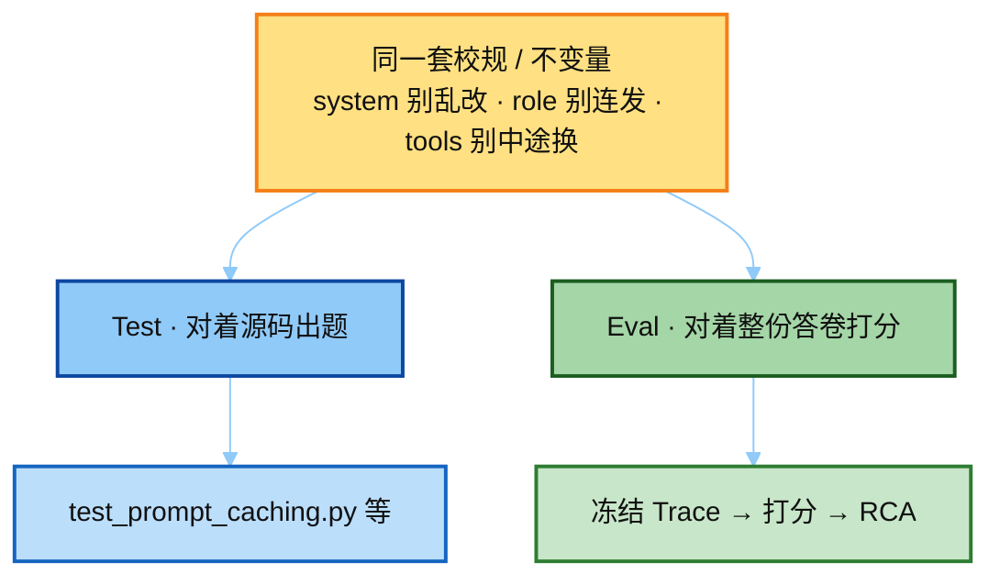
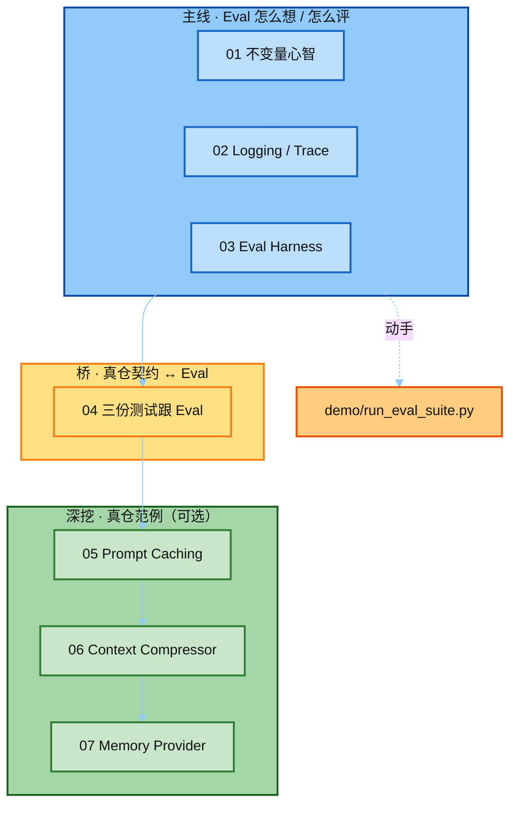

# 03-eval · notes 讲解顺序

本目录是 **Eval + Trace** 模块的讲稿。按编号顺序读即可；文件系统排序与讲解顺序一致。

---

## Runtime → 契约测试 → Eval

**一句话：Test 考源码模块；Eval 考整次冻结轨迹。两者不互相调用，只共用同一套不变量（校规）。**

详解（含对照表 / 常见误解）：[`04_tests_and_eval.md`](./04_tests_and_eval.md)。



---

## 推荐路径（主线）



| 顺序 | 文件 | 讲什么 | 读完应能回答 |
|------|------|--------|--------------|
| **01** | [`01_eval_invariants.md`](./01_eval_invariants.md) | 行为契约 vs 变更检测 | 为什么不写金标全文断言？ |
| **02** | [`02_logging_trace.md`](./02_logging_trace.md) | session_tag、日志分流、Trace | Trace / Log / Metrics 各查什么？ |
| **03** | [`03_eval_harness.md`](./03_eval_harness.md) | 离线打分 + RCA、双层 A/B | case 怎么写？FAIL 怎么写根因？ |
| — | 动手 | `../demo/run_eval_suite.py` | 正例 PASS、负例 FAIL+RCA |
| **04** | [`04_tests_and_eval.md`](./04_tests_and_eval.md) | 契约测试 ↔ Eval 关系 | 三份 test 是不是 Eval 入口？ |
| **05** | [`05_test_prompt_caching.md`](./05_test_prompt_caching.md) | Prompt Cache 断点契约 | 为何 `system_stable` 重要？ |
| **06** | [`06_test_context_compressor.md`](./06_test_context_compressor.md) | 上下文压缩（唯一改历史） | 压缩后仍测什么不变量？ |
| **07** | [`07_test_memory_provider.md`](./07_test_memory_provider.md) | Memory 插件编排 | 为何不能每轮重建 system？ |

---

## 两层结构（别混）

| 层 | 编号 | 性质 |
|----|------|------|
| **主线** | 01 → 02 → 03 | Eval 模块必读；讲清「评什么 / 信号从哪来 / 怎么打分」 |
| **范例深挖** | 04 → 05 → 06 → 07 | 用真仓测试讲「契约长什么样」；**不是** Eval 流水线本身 |

---

## 最短路径（赶时间）

1. `01` → `02` → `03`  
2. 跑一遍 `demo/`  
3. 扫一眼 `04`（关系图）  
4. `05` 选读（最短、最贴 invariants）

---

## 文件一览

```text
notes/
├── README.md                      ← 你在这里（讲解顺序）
├── 01_eval_invariants.md          # 主线 1
├── 02_logging_trace.md            # 主线 2
├── 03_eval_harness.md             # 主线 3
├── 04_tests_and_eval.md           # 桥：test ↔ Eval
├── 05_test_prompt_caching.md      # 范例：caching
├── 06_test_context_compressor.md  # 范例：compressor
└── 07_test_memory_provider.md     # 范例：memory
```

上级入口：[`../README.md`](../README.md)
