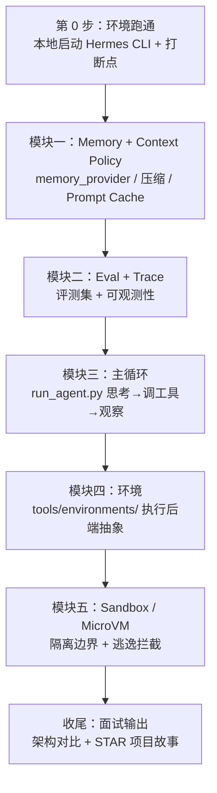

# Agent Runtime 岗位 · 学习大纲（最短路径 2~3 周）

---

## JD

1. 下一代多模态 Agent Runtime
2. Eval、Sandbox、Memory 等核心 Infra
3. 云端 Agent 服务与端云协同能力
4. 内部 Harness：Agentify the whole company
5. 熟悉 TypeScript 与 Node.js 生态
6. 啃过 CC / Codex / Pi / OpenCode / Hermes 源码
7. 熟悉 Context Policy、Sandbox、Trace Analysis、Eval 等
8. 对 Agentic Engineering 有深入 insight
9. 做过 Agent Runtime / Sandbox / MicroVM
10. 做过 Evaluation / Benchmark / Observability
11. 有多模态 Agent / 算法相关经验

---

## 一、开源项目按什么顺序读

1. **Hermes**（最优先，本地就有 `hermes-agent/`）——JD 点名，主战场。
2. **OpenCode**（开源、代码清晰）——对照 Hermes 看另一种 runtime 架构。
3. **Claude Code (CC)**——看 Context 管理、工具设计、权限模型（官方文档 + 用它时观察行为）。
4. **Codex / Pi**——公开资料了解范式即可，不用啃到底。

> 原则：**精读 1 个（Hermes），泛读 1 个（OpenCode），了解其余**。别平均用力。

---

## 二、Hermes 学习路线总览

一张图看懂 2~3 周怎么走：**先跑起来 → Memory → Eval → 主循环 → 环境 → Sandbox → 收尾产出面试材料**。



**时间与主线（最短 2~3 周）**

| 阶段 | 模块 | 时长 | 核心产出（demo / 笔记） | 命中 JD |
|------|------|------|------------------------|---------|
| 起步 | 第 0 步：跑通 CLI | 0.5~1 天 | 本地能打断点看一轮对话 | 啃源码 |
| 模块一 | Memory + Context Policy | 3~4 天 | Context 溢出策略笔记 + 缓存命中对比图 | Memory、Context Policy |
| 模块二 | Eval + Trace | 3~4 天 | 20~50 条评测集 + 一条完整 Trace 根因分析 | Eval、Benchmark、Observability |
| 模块三 | 主循环 | 3~4 天 | 主循环时序图 + 一轮 tool call 消息序列 | Agent Runtime、啃源码 |
| 模块四 | 环境 | 2~3 天 | 各执行后端对比笔记（local/docker/ssh/云） | Agent Runtime、端云协同 |
| 模块五 | Sandbox / MicroVM | 3~4 天 | Docker+seccomp 最小沙箱 + 逃逸拦截实验 | Sandbox、MicroVM |
| 收尾 | 面试输出 | 缓冲 | 架构对比笔记 + demo 串成 STAR 故事 | Agentic Engineering |

**学习原则**
- **先能跑再精读**：断点比读代码快十倍，第 0 步一定是把 CLI 跑起来。
- **按 JD Infra 优先级推进**：Memory → Eval → 主循环 → 环境 → Sandbox；主循环是 Runtime 地基，但 Memory/Eval 先建立 Context 与评测视角，再回看循环更清晰。
- **每模块留一个可展示物**：一句话能说清「读了哪段码 + 做了什么 demo + 拿到什么结论」，否则不算学完。
- **对齐 JD 不平均用力**：Sandbox 和 Eval 是 JD 高频词，优先保证这两个 demo 拿得出手。

---

## 模块一：Memory + Context Policy（3~4 天）

**学习目标**：截断 / 压缩 / 长期记忆检索；Prompt Cache 为什么不能中途改上下文。

**教材目录**：
- [`01-memory/`](./01-memory/)——notebook + 广谱 Memory/压缩/cache（目录名亦作 `04.1-memory` 旧称）
- [`07-mem-provider/`](./07-mem-provider/)——**结构对齐 05-env**：聚焦 turn **存**（`sync_turn`）、对话 **取**（`prefetch`→user 注入）、相关 **prompt**
- 概念长文：[`02-memory.md`](./02-memory.md)

**源码精读清单**
- `agent/memory_provider.py`：`MemoryProvider` ABC（`sync_turn` / `prefetch` / `shutdown`）。
- `agent/memory_manager.py`：单外部 provider 编排；`build_memory_context_block`。
- `turn_context` → `prefetch_all`；`conversation_loop` 注入 user；`turn_finalizer` → `_sync_external_memory_for_turn`。
- Prompt：`MEMORY_GUIDANCE`、`<memory-context>` note、`_MEMORY_REVIEW_PROMPT`（见 `07-mem-provider/notes/04`）。
- 压缩模块（context compression）：唯一允许改上下文的场景。
- 根 `AGENTS.md`「Prompt Caching Must Not Break」小节。

**代码目录结构**（Provider 接线优先读这个）

```text
07-mem-provider/
├── README.md
├── notes/          # 01 ABC → 02 prefetch → 03 sync → 04 prompts
├── demo/           # FakeProvider + 真 MemoryManager
└── hermes_src/     # memory_*.py + turn/inject/sync/prompt excerpts
```

广谱 notebook 仍见 [`01-memory/`](./01-memory/)。

**动手**
- 跑 `07-mem-provider/demo/run_mem_provider.py`；对照 notes/02–04。
- 可选：按 `01-memory/README.md` 跑 notebooks。
- 写一份「Context 溢出处理」策略笔记；画「缓存命中 vs 中途失效」对比图。

**面试会讲**
- Per-conversation prompt caching is sacred：任何中途 mutate 上下文 / 换 toolset / 重建 system prompt 都会击穿缓存、放大成本，只有压缩是例外。
- 取：prefetch 进 **user message**（不进 SP）；存：`sync_all` 异步 + interrupted 跳过；写什么由 `MEMORY_GUIDANCE` 约束。
- 记忆 = 短期(近轮) + 摘要 + 长期检索三层。

---

## 模块二：Eval + Trace（3~4 天）

**学习目标**：评测维度设计 + 可观测性；行为契约测试 vs 变更检测测试。

**教材目录**：[`03-eval/`](./03-eval/)——`hermes_src/` 源码剪枝 + `notes/` 讲稿 + `demo/` 离线打分（目录序：`01-memory` → `02-run-agent` → `03-eval`）。

**代码目录结构**（本步骤要读/要跑的文件）

```text
03-eval/
├── README.md
├── notes/
│   ├── 1_eval_invariants.md      # 不变量 vs 变更检测
│   ├── 2_logging_trace.md        # session_tag / 日志分流
│   └── 3_eval_harness.md         # 离线打分 + RCA
├── demo/                         # ★ 可跑通（无需 API Key）
│   ├── run_eval_suite.py
│   ├── fixtures/                 # eval_cases.jsonl + golden/failure runs
│   └── teaching/{invariants,logging,harness}/
└── hermes_src/
    ├── AGENTS.md                 # 「Don't write change-detector tests」
    ├── hermes_logging.py         # agent.log / errors.log / gateway.log
    ├── scripts/run_tests.sh      # CI 对齐的唯一测试入口（勿直接调 pytest）
    └── tests/agent/              # 不变量断言范例
        ├── test_prompt_caching.py        # ★ 课堂主文件
        ├── test_context_compressor.py
        └── test_memory_provider.py
```

（完整仓库里 Trace 还可配合 `hermes logs` + 外接 LangFuse。）

### 2.1 Eval / Benchmark
- 维度：完成率 / 步数 / 成本 / 工具选对率 / 忠实度。
- 源码：`03-eval/hermes_src/scripts/run_tests.sh`、`tests/agent/`；`AGENTS.md`「Don't write change-detector tests」。
- **动手**：跑 `03-eval/demo/`；扩 `eval_cases.jsonl` 到 20~50 条；至少写 1 条「不变量断言」而非「快照断言」。

### 2.2 Observability / Trace
- 概念：trace_id / span；每个 Tool/LLM/检索记什么；Trace 查因果、Metrics 看 SLO、Log 查细节。
- 源码：`03-eval/hermes_src/hermes_logging.py`、`hermes logs` 命令；demo `teaching/logging/`。
- **动手**：跑 demo 看 `03_trace_rca.md`；可选再接 LangFuse。

**面试会讲**
- 好测试断言「数据之间的关系（不变量）」，不冻结当前值（模型列表 / 配置版本号 / 枚举数量都会变，快照测试是反模式）。
- 一条 Trace 如何定位「工具选错 / 上下文溢出 / 预算耗尽」的根因。

---

## 模块三：Hermes Agent Runtime 主循环（3~4 天）

**学习目标**：一次请求怎么走完「思考 → 调工具 → 观察 → 再思考」，怎么控预算 / 防死循环。

**教材目录**：[`03-run-agent/`](./03-run-agent/)——`hermes_src/` 源码剪枝 + `notes/` 讲稿对照。

**源码精读清单**
- `agent/conversation_loop.py` → `run_conversation()`：**真正的** while 循环、`max_iterations`、`iteration_budget`、`_interrupt_requested`、grace call。
- `run_agent.py` → `AIAgent.run_conversation()`：现为 **forwarder**（转发到 conversation_loop）。
- `model_tools.py` → `handle_function_call()`；发现由 `tools/registry.py` 的 `discover_builtin_tools()` 触发。
- `toolsets.py` → `_HERMES_CORE_TOOLS`、`TOOLSETS`。
- `tools/registry.py`：`registry.register()` 自动发现。
- 开场白对照：[`04.1-memory/`](./04.1-memory/) 的 `turn_context.py`。

**代码目录结构**（本步骤要读/要跑的文件）

```text
03-run-agent/
├── README.md
├── notes/
│   ├── 1_agent_loop.md           # while / 预算 / 中断
│   ├── 2_tools_discovery.md      # registry → model_tools → toolsets
│   └── 3_todo_intercept.md       # agent 级工具范例
└── hermes_src/
    ├── run_agent.py              # AIAgent；run_conversation → forwarder
    ├── agent/conversation_loop.py # ★ 真正的 while 循环
    ├── model_tools.py            # handle_function_call / get_tool_definitions
    ├── toolsets.py               # _HERMES_CORE_TOOLS / TOOLSETS
    └── tools/
        ├── registry.py           # discover_builtin_tools / register
        └── todo_tool.py          # agent 级工具拦截范例
```

**动手**
- 画一张主循环时序图（消息 role 交替：system/user/assistant/tool）。
- 在本地跑通 Hermes CLI，打断点观察一轮 tool call 的完整消息序列（断点打在 `conversation_loop` 的 while，不要只打在 forwarder）。

**面试会讲**
- Runtime = 主循环 + 工具调度 + 状态 + 预算/中断。
- 为什么工具 schema 每次都全量下发 → 「narrow waist」设计，加核心工具门槛高（Footprint Ladder）。

---

## 模块四：环境（2~3 天）

**学习目标**：Agent 的「执行环境」如何抽象；本地 / 容器 / SSH / 云后端的统一接口与取舍。

**教材目录**：[`05-env/`](./05-env/)——`notes/` 真源码讲稿 + `hermes_src/tools/environments/` **完整后端拷贝** + `terminal_tool.FACTORY.py` 工厂摘录。完整对照亦见 [`hermes-study/tools/environments/`](./hermes-study/tools/environments/)。

**源码精读清单**
- `tools/environments/base.py`：`BaseEnvironment.execute` / snapshot / CWD。
- `local.py` / `docker.py`：无隔离 vs `_BASE_SECURITY_ARGS`。
- `file_sync.py` + `ssh.py` / `modal*.py` / `daytona.py`：端云文件到位。
- `terminal_tool.py` → `_get_env_config` / `_create_environment`（教材内为 FACTORY 摘录）。

**代码目录结构**（本步骤要读的文件）

```text
05-env/
├── README.md
├── notes/                 # 01 base → 02 local/docker → 03 remote → 04 factory
└── hermes_src/tools/
    ├── terminal_tool.FACTORY.py
    ├── env_probe.py
    └── environments/      # base/local/docker/ssh/modal/daytona/singularity/file_sync
```

**动手**
- 按 `05-env/README.md` 精读 `hermes_src`，对照 notes。
- 真 Hermes CLI 切 `TERMINAL_ENV=local|docker`，对 `execute` / `_create_environment` 打断点。
- 产出「后端对比表」（隔离 / 延迟 / 文件可见性 / 场景）。

**面试会讲**
- 环境抽象 = Runtime 与执行后端解耦；端云协同靠同一 `execute()` + bind/sync 策略。
- 选后端：调试 local，不可信代码 docker/云，远程机 ssh。

---

## 扩展：Cron（定时任务，可与模块三/四并行）

**学习目标**：无人值守调度——job 存哪、谁 tick、怎么跑一轮隔离 Agent、结果投到哪。

**教材目录**：[`06-cron/`](./06-cron/)——结构对齐 [`05-env/`](./05-env/)：`notes/` + `hermes_src/cron/` + `demo/`。

**源码精读清单**
- `cron/jobs.py`：`jobs.json`、`parse_schedule`、`create_job`、`get_due_jobs`
- `cron/scheduler.py`：`tick` / `run_job`（`skip_memory`、disabled toolsets、投递）
- `tools/cronjob_tools.py`：压缩 `cronjob(action=…)` + prompt 扫描

**动手**：跑 `06-cron/demo/run_cron_jobs.py`；可选在真 gateway 上对 `tick` 打断点。

**面试会讲**：JSON store ≠ 系统 crontab；fire 靠 gateway 分钟 tick；cron 会话 skip_memory + 禁交互工具 + Home 投递。

---

## 扩展：Gateway（消息网关，建议在模块三之后）

**学习目标**：多渠道入站如何变成同一套 Agent Turn——Session Key 拉历史、双层忙时守卫、Home/Cron 投递。

**教材目录**：[`08-gateway/`](./08-gateway/)——**结构对齐 [`04-prompt/`](./04-prompt/)**：`notes/` + `catalog/` + `hermes_src/` + `scripts/`。鸟瞰见 [`01-arch.md`](./01-arch.md) §5。

**源码精读清单**
- `gateway/platforms/base.py`：`handle_message`（`_active_sessions` / `_pending_messages` / bypass）
- `gateway/run.py`：`GatewayRunner._handle_message`、`_handle_message_with_agent`、`start_gateway`
- `gateway/session.py`：`build_session_key`、`SessionStore.get_or_create_session`
- `gateway/delivery.py` + `config.py`：`DeliveryRouter`、`HomeChannel`
- `hermes_cli/commands.py`：`should_bypass_active_session`
- `platforms/ADDING_A_PLATFORM.md`：新渠道走 plugin，不改 core

**代码目录结构**

```text
08-gateway/
├── README.md
├── notes/          # 0 地图 → 1 热路径 → 2 session → 3 双守卫 → 4 delivery/cron
├── catalog/        # 00_index + 01–08 主题索引（对照 excerpts）
├── hermes_src/     # 全文拷贝 + run.py/base.py 等巨文件摘录
└── scripts/extract_gateway_map.py
```

**动手**：按 `08-gateway/README.md` 读 notes/catalog；真仓对 `handle_message` / `_handle_message` 打断点。

**面试会讲**：Gateway = MessageEvent + Session Key 拉历史 + **两层守卫（控制命令必须 bypass）** + 同进程 cron/Delivery；按 session 缓存 AIAgent 保 prompt cache。

---

## 模块五：Sandbox / MicroVM（3~4 天）

**学习目标**：进程隔离 → 容器 → 轻量 VM 的取舍与安全边界。

**知识点阶梯**
- 进程级：seccomp / namespace / cgroup。
- 容器级：Docker 隔离与逃逸面。
- 轻量 VM：**Firecracker** / gVisor 的定位与 trade-off（启动速度 vs 隔离强度）。

**源码精读清单**
- 在模块四环境抽象之上，精读 `docker.py` 的隔离配置与挂载策略。
- 对照：无隔离的 `local.py` vs 容器隔离的 `docker.py`，哪些能力属于「环境」、哪些属于「沙箱加固」。

**动手（核心 demo）**
- 用 Docker + seccomp（或 gVisor）跑一个「执行任意代码」的最小沙箱：限制系统调用、只读挂载、网络关闭、资源上限。
- 记录一次「尝试逃逸被拦截」的实验结果。

**面试会讲**
- 为什么 Agent 执行代码必须隔离；不同隔离级别的成本/安全权衡；MicroVM 适合什么场景。
- 环境抽象解决「跑在哪」；Sandbox 解决「跑得安不安全」。

---

## 收尾：面试输出（第 3 周缓冲）

- **架构对比笔记**：Hermes vs OpenCode/CC 在 Context / 工具 / Sandbox 上的方案差异。
- **项目故事（STAR）**：把各模块 demo/PR 串成一条线，对应 JD 关键词逐一能讲。
- **一句话定位**：每模块能用一句话说清「读了哪段码 + 做了什么 demo + 拿到什么结论」。

---

## 硬核对齐 JD

| 模块 | 命中 JD 关键词 |
|------|----------------|
| 一 Memory | Memory、Context Policy、核心 Infra |
| 二 Eval+Trace | Eval、Benchmark、Observability、Trace Analysis |
| 三 主循环 | Agent Runtime、Agentic Engineering、啃源码 |
| 四 环境 | Agent Runtime、端云协同、核心 Infra |
| 五 Sandbox | Sandbox、MicroVM |
