# Hermes Agent — Architecture Map  - 最终篇

> 对照仓库：[`hermes-agent`](../../hermes-agent/) · README · [官方 Architecture](https://hermes-agent.nousresearch.com/docs/developer-guide/architecture)  
> 更深的 Session / Turn / Memory 细讲见 [`01-arch.md`](./01-arch.md)

**一句话**：多种入口汇入同一个 `AIAgent` 窄腰；能力长在边缘（Tools / Skills / Plugins / Platforms），核心只做「拼 Context → 调模型 → 跑 Tool → 落盘」。

---

## JD

1. 下一代多模态 Agent Runtime
2. Eval、Sandbox、Memory 等核心 Infra
3. 云端 Agent 服务与端云协同能力
4. 内部 Harness：Agentify the whole company
5. 熟悉 TypeScript 与 Node.js 生态
6. 啃过 CC / Codex / Pi / OpenCode / Hermes 源码
7. 熟悉 Context Policy、Sandbox、Trace Analysis、Eval 等
8. 对 Agentic Engineering 有深入 insight
9. 做过 Agent Runtime / Sandbox / MicroVM
10. 做过 Evaluation / Benchmark / Observability
11. 有多模态 Agent / 算法相关经验

---


## 1. 仓库目录速查

```text
hermes-agent/
├── run_agent.py          # 🔴 AIAgent 核心循环
├── cli.py                # 🟡 经典交互 CLI
├── model_tools.py        # 工具编排入口
├── toolsets.py           # toolset 定义 / 平台预设
├── hermes_state.py       # 🟢 SQLite + FTS5
├── hermes_constants.py   # get_hermes_home() · profile 路径
├── batch_runner.py       # 轨迹批跑
│
├── agent/                # Prompt / Cache / Memory / Display
├── hermes_cli/           # hermes 子命令 · setup · plugins · skin
├── tools/                # 工具实现 + environments/
├── gateway/              # 消息网关 + platforms/
├── cron/                 # jobs.py · scheduler.py
├── plugins/              # memory / context_engine / model-providers / platforms / …
├── skills/               # 内置 skills（默认可用）
├── optional-skills/      # 需显式 install
├── ui-tui/ + tui_gateway/# Ink TUI
├── apps/desktop/         # Electron Desktop（独立聊天面）
├── acp_adapter/          # IDE ACP
├── web/ + website/       # Dashboard + Docs
└── tests/                # pytest（务必 scripts/run_tests.sh）
```

用户状态落盘：

| 路径 | 内容 |
|------|------|
| `~/.hermes/config.yaml` | 行为配置（非密钥） |
| `~/.hermes/.env` | **仅** API keys / tokens |
| `~/.hermes/memories/` | USER.md · MEMORY.md |
| `~/.hermes/SOUL.md` | 人格 |
| `~/.hermes/cron/jobs.json` | 定时任务 |
| Profile | `hermes -p <name>` → 独立 `HERMES_HOME` |

Windows 原生安装常见根：`%LOCALAPPDATA%\hermes`（与 WSL/`~/.hermes` 不同）。

---

## 2. 系统全景

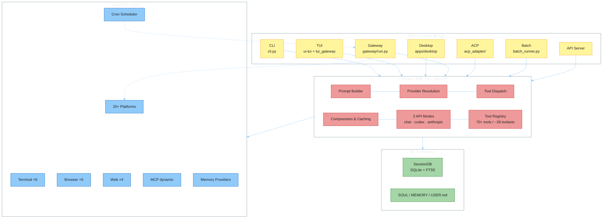

| 颜色层 | 职责 |
|--------|------|
| 黄 · Entry | 只做 I/O 与会话路由，不实现 Agent 逻辑 |
| 红 · Core | 唯一对话引擎；平台差异不进这里 |
| 绿 · Persist | transcript / 人格记忆落盘 |
| 蓝 · Edges | Tool 后端、渠道、Cron、可插拔记忆 |

---

## 3. 设计原则（读代码时的透镜）

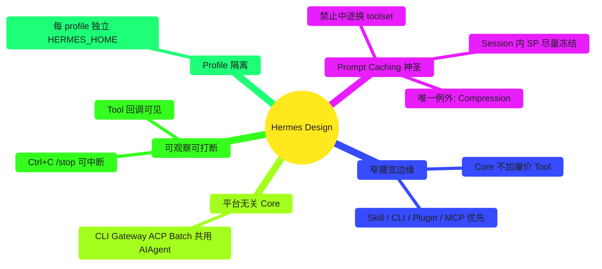

| 原则 | 落地 |
|------|------|
| **Prompt stability** | System prompt 会话内不变；禁 mid-conversation 重建（压缩除外） |
| **Platform-agnostic core** | 差异在入口，不在 `run_agent.py` |
| **Loose coupling** | MCP / plugins / memory 用 registry + `check_fn`，非硬依赖 |
| **Footprint ladder** | 扩展优先：改现有 → CLI+Skill → 门控 Tool → Plugin → MCP → 新核心 Tool |

---

## 4. Agent Runtime（运行时详解）

> 源码主链：`run_agent.py`（forwarder）→ `agent/conversation_loop.py`（真 while）→ `agent/turn_context.py`（prologue）→ `agent/turn_finalizer.py`（收尾）  
> 细讲笔记：[`02-run-agent/`](./02-run-agent/) · 官方 [Agent Loop](https://hermes-agent.nousresearch.com/docs/developer-guide/agent-loop)

**一句话**：一条用户消息 = **1 次 Prologue** + **N 次 API/Tool 循环** + **1 次 Finalize**。Runtime 只管编排；平台 I/O 在入口，能力在 Tool 边缘。

### 4.1 Runtime 分层鸟瞰

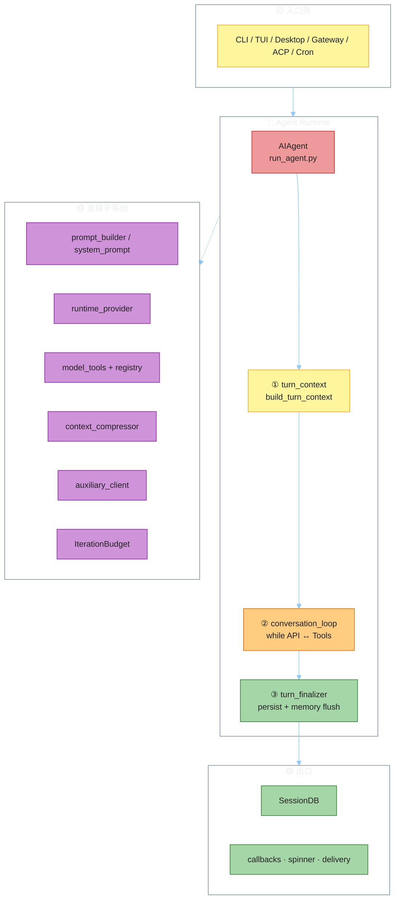

| 层 | 文件 | 每用户 Turn 跑几次 |
|----|------|-------------------|
| Prologue | `turn_context.py` | **1** — 拼 messages、复用/建 SP、预压缩 |
| Loop | `conversation_loop.py` | **N** — 调模型 + 跑 tool |
| Finalize | `turn_finalizer.py` | **1** — 落库、memory/skill 回顾、返回 dict |

### 4.2 一个 Turn 的主干状态机

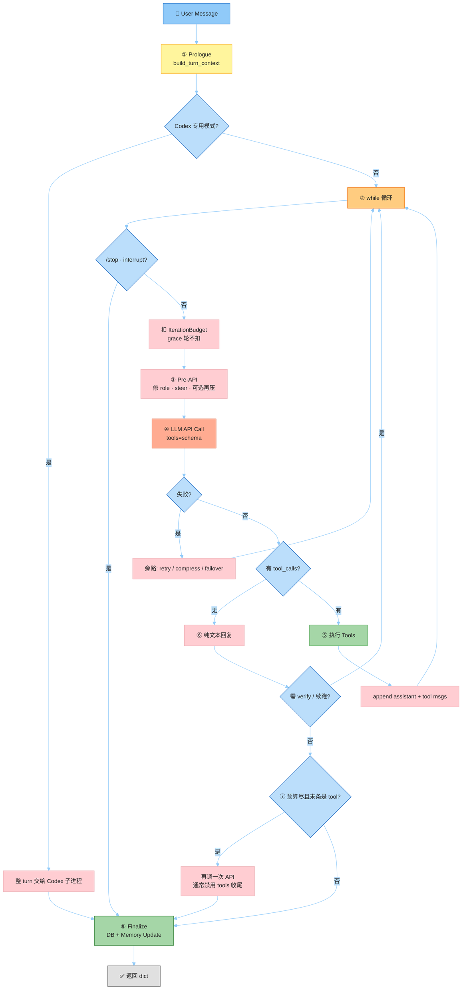

### 4.3 while 内：思考 → 工具 → 观察

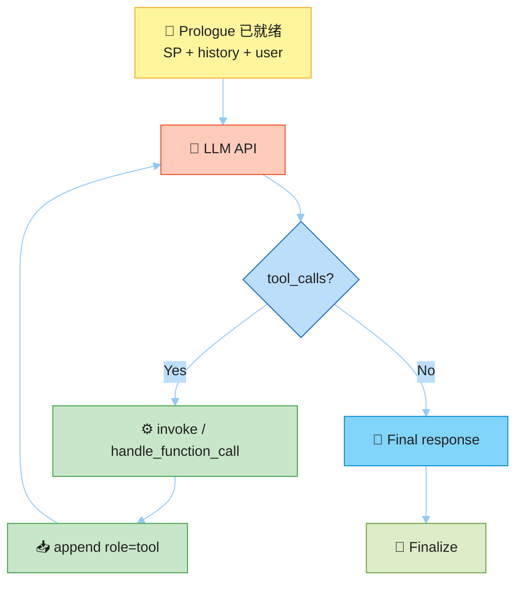

三个刹车（防死循环）：

| 机制 | 作用 |
|------|------|
| `max_iterations` | 硬上限（默认约 90，与 subagent 共享语义） |
| `IterationBudget` | 可 consume / refund（部分 housekeeping tool 可退回） |
| `_budget_grace_call` | 预算用尽后再给 **一次** 纯文本收尾 |
| `_interrupt_requested` | 用户 `/stop` / Ctrl+C；工具级也可取消 |

### 4.4 Tool 执行路径（Agent 级截胡 vs Registry）

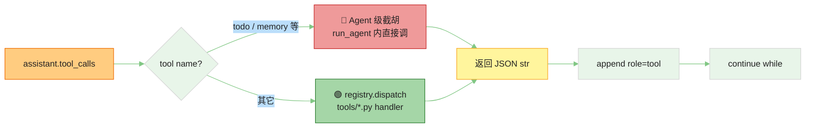

Schema 在会话开始前就定好：`tools/*.py` register → `model_tools` 发现 → toolset 过滤 → 每次 API 的 `tools=`。中途换 toolset = 废 prompt cache，Runtime 禁止。

### 4.5 消息 role 时序（铁律）

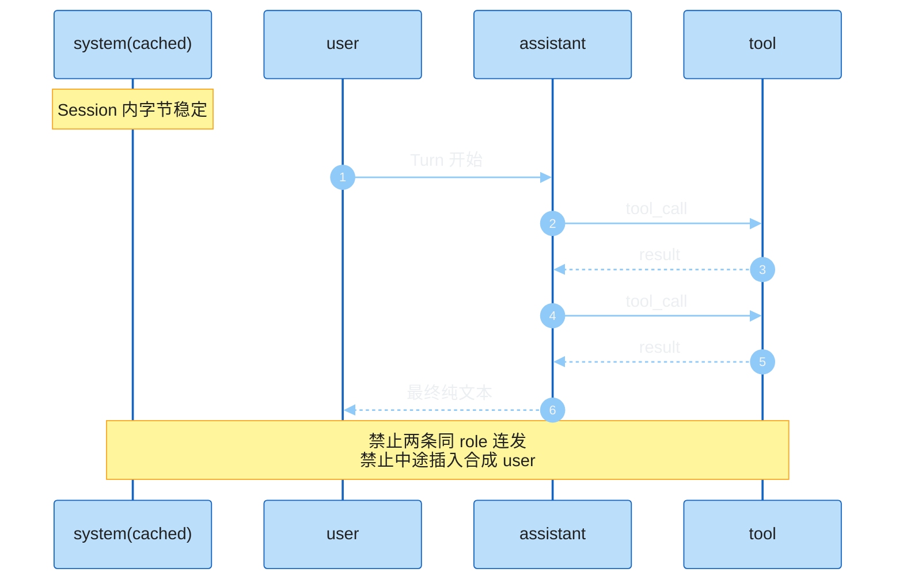

内部统一 OpenAI 消息形：`role` / `content` / `tool_calls`；`reasoning` 存在 `assistant_msg["reasoning"]`。三种 API Mode 在进出 API 边界做格式转换，Loop 内看到的始终是这套。

### 4.6 三条 API Mode

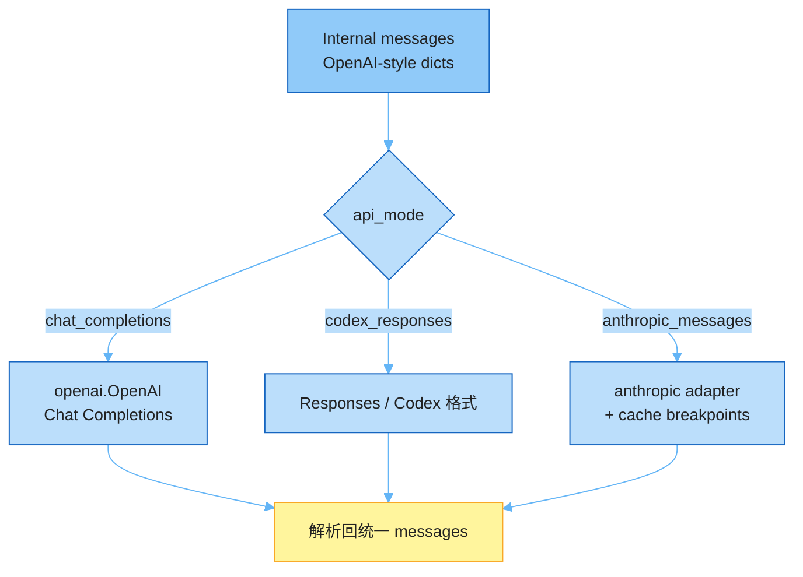

| Mode | 用途 | 解析优先级 |
|------|------|------------|
| `chat_completions` | OpenRouter / 多数兼容端 | 默认 |
| `codex_responses` | Codex / Responses API | 显式或 provider 探测 |
| `anthropic_messages` | 原生 Anthropic + cache | `anthropic` provider / `api.anthropic.com` |

解析顺序：构造参数 `api_mode` → provider 特判 → base_url 启发 → 默认 `chat_completions`。

### 4.7 Runtime 与周边职责边界

| 关注点 | Runtime 做 | Runtime 不做 |
|--------|------------|--------------|
| 会话路由 | 接收已解析的 history / session_id | Gateway Session Key / 排队 |
| Prompt | 复用缓存 SP；压缩时重建 | 每轮重读 SOUL/MEMORY 进 SP |
| Tool | 截胡 + registry 分发 | 新增核心 tool 的产品决策 |
| 预算 | iterations / budget / grace / interrupt | 平台侧消息防抖 |
| 落盘 | Finalize 写 SessionDB / flush memory | Cron 的 Home 投递策略 |

---

## 5. 三条主数据流

### 5.1 CLI / TUI / Desktop

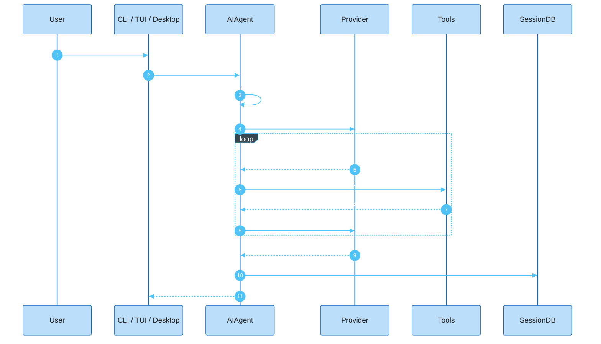

### 5.2 Messaging Gateway

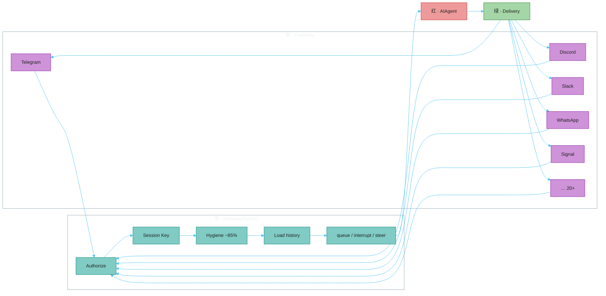

Session Key 形态：`{platform}:{provider_session_id}:…` —— Gateway 每次只收到「最新一条」，必须靠 SQLite 还原整段历史。

### 5.3 Cron

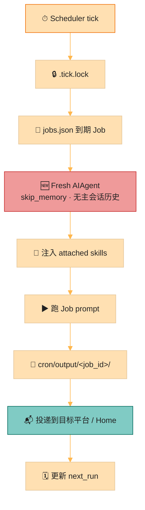

Cron 是 **Agent 任务**（不是 shell crontab）。交付与主 Gateway 会话隔离，避免破坏消息 role 交替。

---

## 6. Tool 系统与依赖链

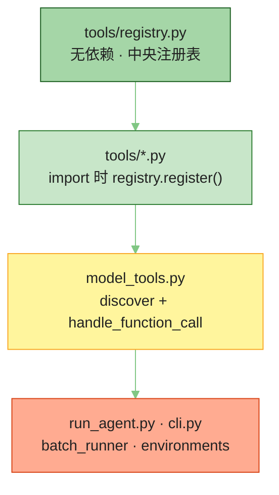

| 层 | 文件 | 作用 |
|----|------|------|
| Registry | `tools/registry.py` | schema / dispatch / availability / 错误包装 |
| Impl | `tools/*.py` | 自注册；handler 必须返回 JSON 字符串 |
| Orchestration | `model_tools.py` | 发现工具、组装 definitions、执行调用 |
| Exposure | `toolsets.py` | 只有进 toolset 的工具才会暴露给 Agent |
| Backends | `tools/environments/` | local · docker · ssh · modal · daytona · singularity |

**Footprint 提醒**：Terminal + File 能做的事，不要再加核心 Tool；优先 Skill / Plugin / MCP。

---

## 7. Context 体系（组装 · 缓存 · 压缩）

> 源码：`agent/system_prompt.py` · `agent/prompt_builder.py` · `agent/context_compressor.py` · `agent/turn_context.py`  
> 细讲：[`01-arch.md`](./01-arch.md) §3–4 · [`04-prompt/`](./04-prompt/) · 官方 [Prompt Assembly](https://hermes-agent.nousresearch.com/docs/developer-guide/prompt-assembly)

**一句话**：Context = **Session 冻结的 System Prompt** + **Turn 可变的消息侧**。稳定前缀保 cache；会变的东西放 messages / tool result / ephemeral，绝不每轮重写 SP。

### 7.1 Session vs Turn（两层时间尺度）

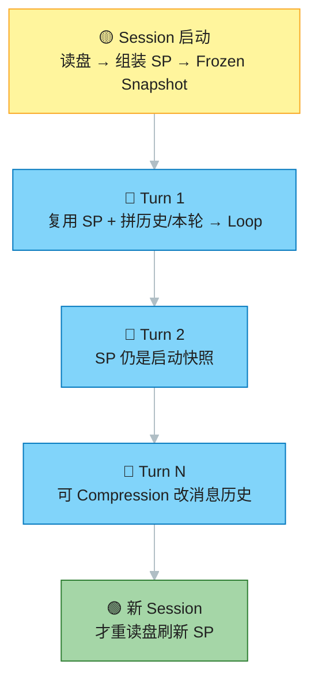

| 词 | 含义 | 对 Context 的影响 |
|----|------|-------------------|
| **Session** | Desktop 一条对话 / CLI 一次聊 / Gateway 同一 `session_id` | 启动组装并 **冻结** SP |
| **Turn** | 用户 1 条消息 → 跑完 Loop → 最终回复 | 每轮 Build：复用 SP + 追加消息；可压缩 |

### 7.2 发给 LLM 的两块拼图

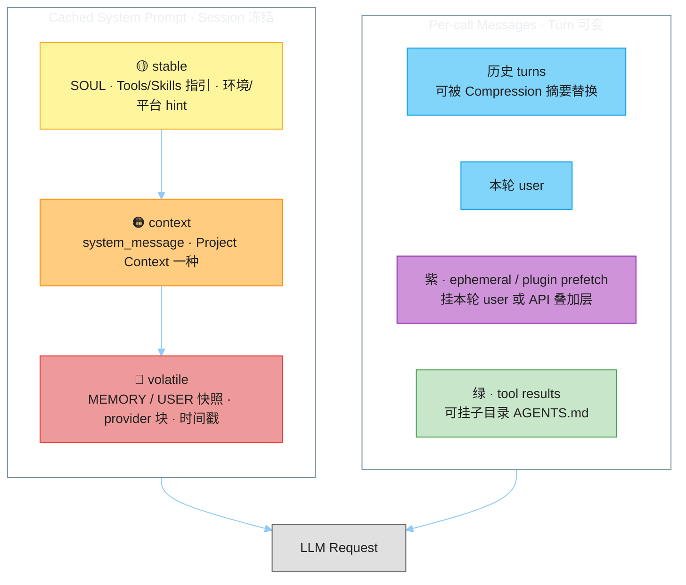

### 7.3 System Prompt 三层注入地图

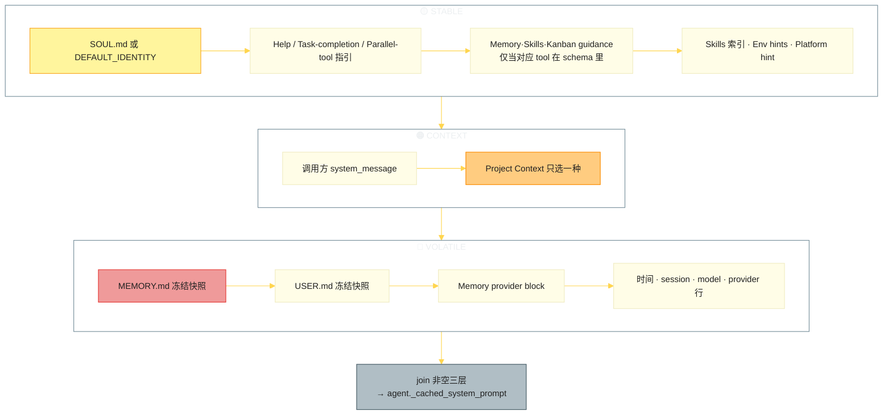

Project Context 优先级（每个 Session **只取一种**；`SOUL` 独立占位不抢槽）：

```text
.hermes.md / HERMES.md  →  AGENTS.md  →  CLAUDE.md  →  .cursorrules
```

**条件注入**：没加载 `memory` tool 就不塞 `MEMORY_GUIDANCE`，避免模型幻觉调用不存在的工具。

### 7.4 什么进 SP，什么绝不进 SP

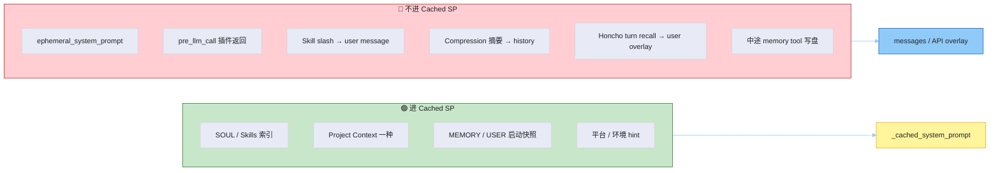

| Markdown / 块 | 进 Context 时机 | 中途写盘影响当前 SP？ |
|---------------|-----------------|----------------------|
| `SOUL.md` | Session 启动 → stable | 否（下个 Session） |
| Project Context | Session 启动 → context | 否；子目录可挂 **tool result** |
| `USER.md` / `MEMORY.md` | Session 启动 → volatile | **否** |
| Skills / Tools 描述 | Session 启动（按 schema） | 换 toolset 被禁止 |
| 消息历史 | 每 Turn | Compression 可改历史 |
| External prefetch | 常挂 Turn 侧 | 不改 SP |

Gateway 额外：每 turn 可能新建 `AIAgent`，靠 SessionDB **读回同一份 system 字符串**（`_restore_or_build_system_prompt`），否则 cache 前缀对不齐。

### 7.5 Turn 级 Build Context 流程

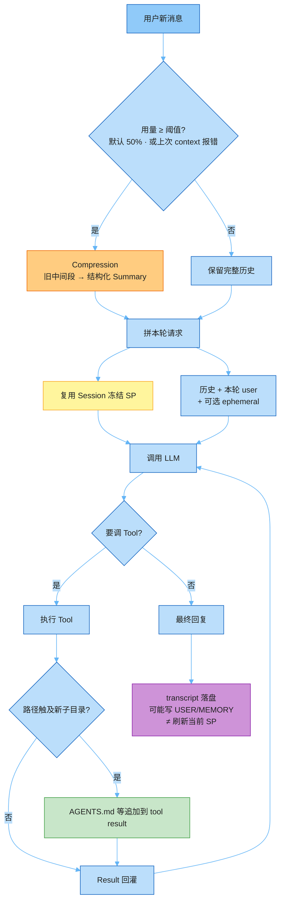

### 7.6 Compression（压消息，不重读说明书）

源码：`agent/context_compressor.py`。压的是 **消息列表**，不是重装 Project Context。

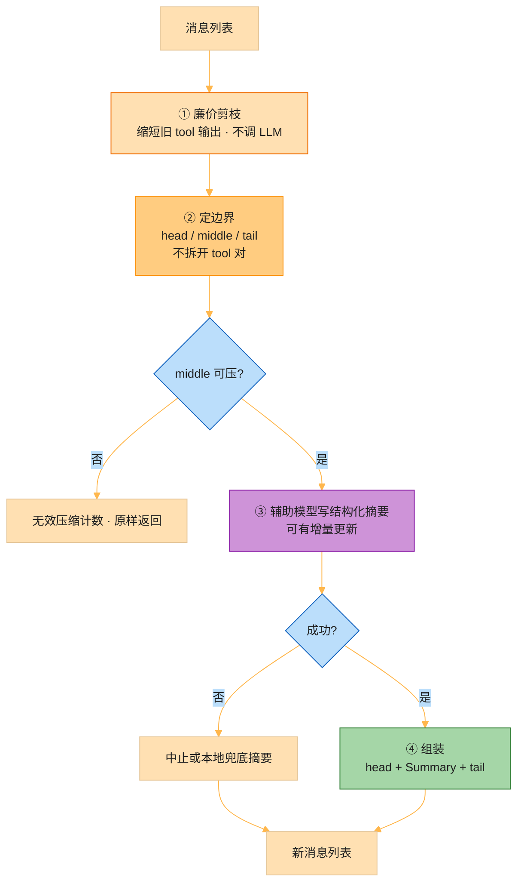

| 配置（`compression:`） | 默认直觉 |
|------------------------|----------|
| `threshold: 0.50` | 用量 ≥ 窗口 50% 触发 |
| `target_ratio: 0.20` | 尾部保留预算 ≈ 触发线 × 0.2 |
| `protect_last_n: 20` | 尾部至少留 N 条 |
| Gateway Hygiene | 进 Agent 前约 **85%** 安全网 |

三段切法：`head`（开头保护）· `middle`（压成 Historical Snapshot 摘要）· `tail`（近期原文）。摘要声明「仅背景参考」，防止把旧待办当成还要继续做。

### 7.7 Context 与 Prompt Cache 的契约

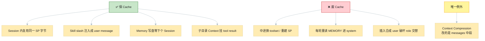

速记：

```text
写了 MEMORY ≠ 当前 SP 已更新（要新 Session）
直聊可以没有 AGENTS.md（完全正常）
Gateway：拉历史在消息侧；冻 SP 与 CLI 相同
Compression：改历史，不是改 Project Context 文件
```

---

## 8. 可插拔子系统

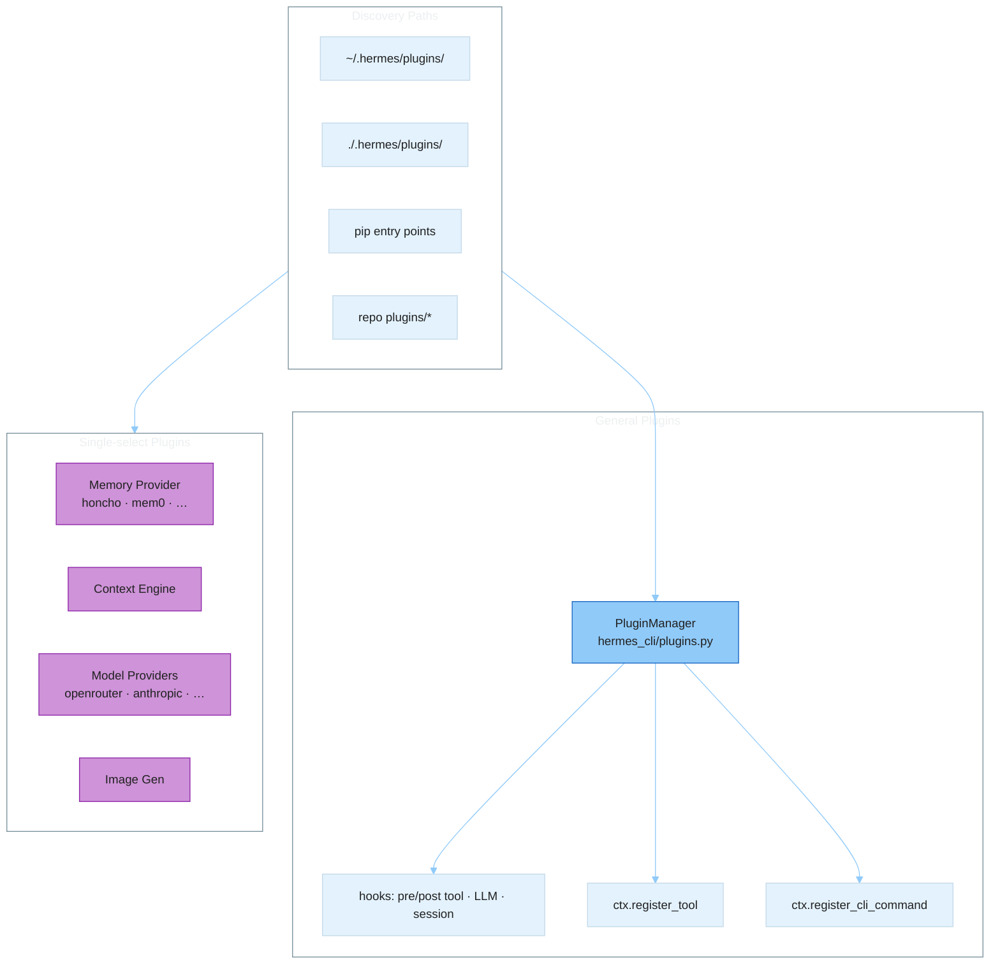

| 类型 | 选择模型 | 目录 |
|------|----------|------|
| General plugin | 可多个 | `plugins/<name>/`、用户目录、pip |
| Memory provider | **同时只能一个** | `plugins/memory/` |
| Context engine | **同时只能一个** | `plugins/context_engine/` |
| Model provider | 按配置切换 | `plugins/model-providers/` |
| Platform adapter | 多开 | `gateway/platforms/` + `plugins/platforms/` |

---

## 9. Surface 对照（同一 Core，不同壳）

```mermaid
%%{init: {
  "theme": "base",
  "themeVariables": {
    "fontSize": "14px",
    "primaryColor": "#F3E5F5",
    "primaryTextColor": "#212121",
    "lineColor": "#CE93D8",
    "edgeLabelBackground": "#BBDEFB",
    "edgeLabelColor": "#0D47A1"
  }
}}%%
flowchart TB
    CORE["AIAgent + Tools + SessionDB"]

    CLI["经典 CLI<br/>prompt_toolkit + Rich"]
    TUI["hermes --tui<br/>Ink ↔ JSON-RPC"]
    DASH["Dashboard /chat<br/>嵌入真实 TUI PTY"]
    DESK["Desktop App<br/>自有 transcript · 不嵌 TUI"]
    MSG["Messaging Gateway<br/>Telegram …"]
    IDE["ACP · VS Code/Zed/JB"]

    CLI & TUI & MSG & IDE & DESK --> CORE
    DASH --> TUI

    style CORE fill:#EF9A9A,stroke:#C62828,color:#212121
    style CLI fill:#FFF59D,stroke:#F9A825,color:#212121
    style TUI fill:#A5D6A7,stroke:#43A047,color:#212121
    style DASH fill:#80CBC4,stroke:#00897B,color:#212121
    style DESK fill:#CE93D8,stroke:#8E24AA,color:#212121
    style MSG fill:#81D4FA,stroke:#0288D1,color:#212121
    style IDE fill:#FFCC80,stroke:#FB8C00,color:#212121
```

要点：**Dashboard 嵌 TUI；Desktop 是第三条聊天面**（经 `hermes serve` JSON-RPC），不要在 Dashboard React 里重写主对话。

---

## 10. 学习路径（建议顺序）

| # | 主题 | 本仓库笔记 / 官方 |
|---|------|-------------------|
| 1 | 仓库目录 + 全景 | `arch.md` §1–2 |
| 2 | **Agent Runtime**（图解） | `arch.md` **§4** · [`02-run-agent/`](./02-run-agent/) · [agent-loop](https://hermes-agent.nousresearch.com/docs/developer-guide/agent-loop) |
| 3 | **Context 体系**（图解） | `arch.md` **§7** · [`04-prompt/`](./04-prompt/) · [prompt-assembly](https://hermes-agent.nousresearch.com/docs/developer-guide/prompt-assembly) |
| 4 | Session / Turn / Memory 深讲 | [`01-arch.md`](./01-arch.md) · [`02-memory.md`](./02-memory.md) |
| 5 | Cron | [`06-cron/`](./06-cron/) |
| 6 | Gateway | [`08-gateway/`](./08-gateway/) |
| 7 | Memory Providers | [`07-mem-provider/`](./07-mem-provider/) |
| 8 | Tools Runtime | [tools-runtime](https://hermes-agent.nousresearch.com/docs/developer-guide/tools-runtime) |

---

## 11. 速记卡片

```text
Entry → AIAgent Runtime → (Prompt + Provider + Tools) → SessionDB / Delivery
                       ↘ Terminal/Browser/Web/MCP/Cron/Plugins

Runtime: 1 Prologue + N (API↔Tool) + 1 Finalize
         刹车 = max_iterations · IterationBudget · grace · interrupt
         Tool = agent 截胡(todo/memory) | registry.dispatch
         三 Mode 边界转换，内部统一 OpenAI messages

Context: Session 冻 SP(stable→context→volatile)
         Turn 拼 历史+user+ephemeral；子目录挂 tool result
         写 MEMORY ≠ 刷新当前 SP；压缩只改 messages 中段
Cache:   禁中途换 toolset / 重建 SP（压缩例外）

Gate:    一条消息 → Session Key → 拉历史 → 同一 Runtime
Cron:    新 Agent · 独立会话 · Home/平台投递
Edge:    能力外挂；Core 保持窄
```
