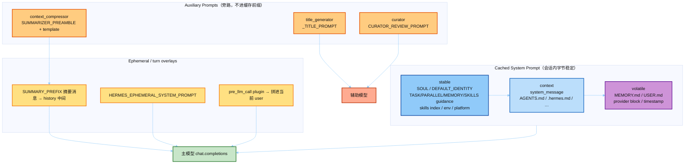

# Hermes Prompt · 系统学习

目标：按**模块**搞清 Hermes 用什么 prompt，并对照宏全文学习——不是只看最终拼出来的 system 字符串。

**完整源码仓**：`面试狂魔/人工智能面试题/hermes-agent/`（你打开的 `setup.py` 所在工程）。  
**注意**：`setup.py` 只负责打包 `skills/`，**不含任何 prompt**。  
**先读模块地图**：[`notes/0_module_prompt_map.md`](./notes/0_module_prompt_map.md)（各模块分别用什么 prompt）。

Catalog 由 `scripts/extract_prompts.py` 直接扫描完整仓生成，并同步副本到 `hermes_src/`。

---

## 先建立心智模型（5 分钟）

Hermes 的 prompt 分三类（别混）：

| 类型 | 生命周期 | 能不能中途改 | 代表 |
|------|----------|--------------|------|
| **① Cached System Prompt** | 会话启动组装一次，前缀复用 | **禁止**（唯一例外：压缩重建） | identity / skills / MEMORY / platform |
| **② Auxiliary LLM** | 旁路调用 | 可变，**不进**缓存前缀 | 压缩、标题、Judge、Curator、MoA |
| **③ User-turn injection** | 拼进当前 user | 可变 | `/learn`、skill slash、background review |

三层缓存结构（面试必背）：

```text
stable   → SOUL/DEFAULT_IDENTITY + tool/skills/env/platform guidance
context  → caller system_message + AGENTS.md / .hermes.md / …
volatile → MEMORY.md + USER.md + memory-provider block + timestamp
最终     → "\n\n".join([stable, context, volatile])
```

官方说明：[`hermes_src/prompt-assembly.md`](./hermes_src/prompt-assembly.md)

---

## 推荐学习顺序

| 顺序 | 读什么 | 学什么 |
|------|--------|--------|
| 0 | [`notes/0_module_prompt_map.md`](./notes/0_module_prompt_map.md) | **整仓模块→prompt 地图**（先建立全局观） |
| 1 | [`notes/1_assembly_map.md`](./notes/1_assembly_map.md) | System 三层组装顺序 |
| 2 | [`catalog/00_index.md`](./catalog/00_index.md) → `01` / `06` / `10` | System 宏全文 |
| 3 | `catalog/03*` | 压缩：aux summarizer vs 主模型护栏 |
| 4 | `catalog/07` / `08` | User-turn：background review、`/learn` |
| 5 | `catalog/09` / `11`–`15` | 旁路：MoA、goal Judge、Kanban、vision |
| 6 | [`notes/2_customization_surfaces.md`](./notes/2_customization_surfaces.md) | 改 SOUL/AGENTS，还是改代码 |
| 7 | `../02-run-agent/demo/exports/agent_loop/01_system.md` | 宏 → 真实拼装结果 |

---

## 目录

```text
04-prompt/
├── README.md                         # 本文件
├── hermes_src/                       # 真源码（对照用）
│   ├── prompt-assembly.md            # 上游官方 Prompt Assembly 文档
│   └── agent/
│       ├── prompt_builder.py         # ★ 几乎所有 system prompt 宏
│       ├── system_prompt.py          # ★ stable/context/volatile 组装
│       ├── context_compressor.py     # 压缩：SUMMARY_PREFIX + summarizer
│       ├── title_generator.py        # session title aux prompt
│       ├── curator.py                # CURATOR_REVIEW_PROMPT
│       ├── skill_commands.py         # skill slash → user message 注入
│       ├── subdirectory_hints.py     # 子目录 AGENTS.md 渐进注入
│       └── prompt_template_teaching.py  # 01-memory 教学拆解副本
├── catalog/                          # ★ 抽出的宏全文（可直接读）
│   ├── 00_index.md
│   ├── 01_prompt_builder_macros.md
│   ├── 02_system_prompt_assembly.md
│   ├── 03_compression_prompts.md
│   ├── 03b_compression_teaching.md
│   ├── 03c_summarizer_runtime.md     # 函数内拼装的 summarizer（非模块常量）
│   ├── 04_title_generation.md
│   └── 05_curator_prompts.md
├── notes/                            # 讲稿
│   ├── 1_assembly_map.md
│   └── 2_customization_surfaces.md
└── scripts/
    └── extract_prompts.py            # 重新扫描宏 → 刷新 catalog/
```

### 重新抽取宏

上游更新后：

```powershell
cd 08-hermes-agent/04-prompt
# 可重新 Invoke-WebRequest 拉取 hermes_src/agent/*.py
python scripts/extract_prompts.py
```

---

## Prompt 地图（一张图）



---

## 与其它模块的关系

| 模块 | 关系 |
|------|------|
| [`01-memory`](../01-memory/) | MEMORY/USER 快照如何进 volatile；压缩护栏已在 `prompt_template.py` 拆过 |
| [`02-run-agent`](../02-run-agent/) | `run_conversation` → `_build_system_prompt`；demo 导出 `01_system.md` |
| Prompt Cache | 中途改 system / 换 toolset = 废缓存；见 `AGENTS.md`「Prompt Caching Must Not Break」 |

---

## 面试可说的一句话

> Hermes 的 prompt 不是一大段硬编码，而是 **宏积木（prompt_builder）+ 三层组装（system_prompt）+ 旁路辅助 prompt（压缩/标题/curator）**；主会话前缀必须字节稳定以保住 prompt cache，动态内容要么进 volatile 快照，要么走 ephemeral / user-message overlay。
