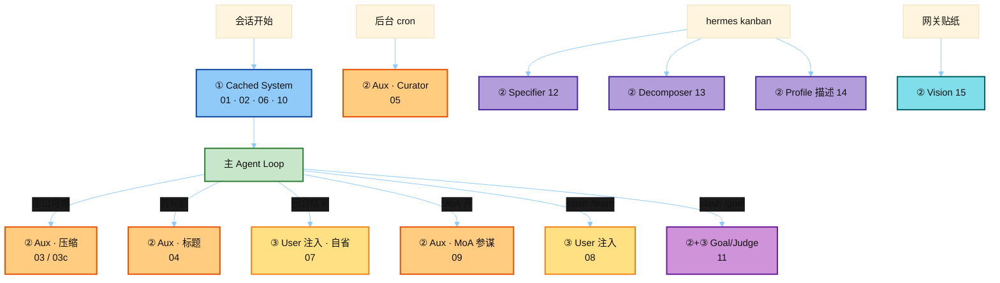

# Hermes Prompt Catalog · 总索引

扫描源：`D:\workspace\doc\面试狂魔\人工智能面试题\hermes-agent`
模块地图（先读）：[`../notes/0_module_prompt_map.md`](../notes/0_module_prompt_map.md)
学习入口：[`../README.md`](../README.md)

## 何时读哪份（总览）

每份 catalog 开头都有「何时使用」+ 热路径图。三类不要混：

## 分类文件

| 文件 | 主题 | 宏数量 |
|------|------|--------|
| [`01_prompt_builder_macros.md`](./01_prompt_builder_macros.md) | System Prompt 宏（prompt_builder.py） | 17 |
| [`02_system_prompt_assembly.md`](./02_system_prompt_assembly.md) | System Prompt 组装（system_prompt.py） | 1 |
| [`03_compression_prompts.md`](./03_compression_prompts.md) | Context Compression Prompts | 5 |
| [`04_title_generation.md`](./04_title_generation.md) | Session Title Prompt | 2 |
| [`05_curator_prompts.md`](./05_curator_prompts.md) | Curator Review Prompt | 2 |
| [`06_coding_agent_guidance.md`](./06_coding_agent_guidance.md) | Coding Agent Guidance | 1 |
| [`07_background_review.md`](./07_background_review.md) | Background Memory/Skill Review | 3 |
| [`08_learn_prompt.md`](./08_learn_prompt.md) | /learn Skill Authoring Prompt | 1 |
| [`09_moa_reference.md`](./09_moa_reference.md) | MoA Reference Advisor Prompt | 2 |
| [`10_verify_guidance.md`](./10_verify_guidance.md) | Coding Verify Guidance | 1 |
| [`11_goals_judge.md`](./11_goals_judge.md) | /goal Continuation + Judge Prompts | 11 |
| [`12_kanban_specify.md`](./12_kanban_specify.md) | Kanban Specifier Prompt | 2 |
| [`13_kanban_decompose.md`](./13_kanban_decompose.md) | Kanban Decomposer Prompt | 2 |
| [`14_profile_describer.md`](./14_profile_describer.md) | Profile Describer Prompt | 2 |
| [`15_sticker_vision.md`](./15_sticker_vision.md) | Sticker Vision Prompt | 1 |

## 手工补充（函数内拼装）

| 文件 | 说明 |
|------|------|
| [`03c_summarizer_runtime.md`](./03c_summarizer_runtime.md) | 压缩 summarizer preamble/template |
| [`03b_compression_teaching.md`](./03b_compression_teaching.md) | 01-memory 教学拆解 |

## 两类 + 一类注入

| 类型 | 典型 catalog |
|------|--------------|
| Cached System | 01, 02, 06, 10 |
| Auxiliary LLM | 03, 04, 05, 09, 11–15 |
| User-turn inject | 07, 08 |
