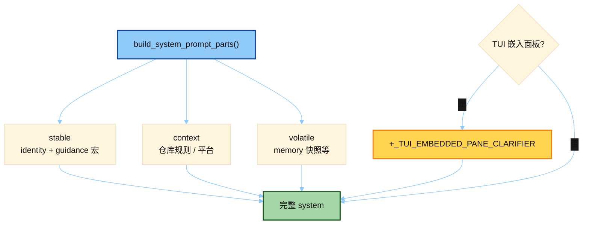

# System Prompt 组装（system_prompt.py）

> 源文件：`agent/system_prompt.py`
> 共提取 **1** 个宏 / 模板块

## 何时使用

| 项 | 说明 |
|----|------|
| **类型** | ① Cached System — **编排层**（stable / context / volatile） |
| **时机** | 会话启动组 system；本文件里的 `_TUI_EMBEDDED_PANE_CLARIFIER` 仅在 **TUI 嵌入面板** 场景追加 |
| **和 01 的关系** | 01 是文案宏库；02 决定宏怎么分层、何时塞进哪一段 |



## 索引

- [`_TUI_EMBEDDED_PANE_CLARIFIER`](#_tui_embedded_pane_clarifier) — L115

---

## `_TUI_EMBEDDED_PANE_CLARIFIER`

- 行号：`system_prompt.py:115`

```text
 You're in its embedded terminal pane, beside the GUI chat — the user can select your output (Option-drag on macOS, Shift-drag elsewhere) and press Cmd/Ctrl+L to send it to the chat composer.
```

---
