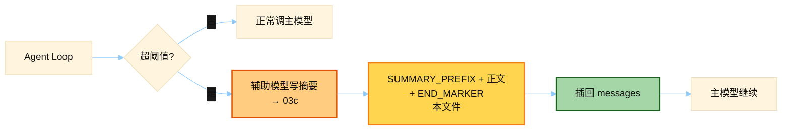

# Context Compression Prompts

> 源文件：`agent/context_compressor.py`
> 共提取 **5** 个宏 / 模板块

## 何时使用

| 项 | 说明 |
|----|------|
| **类型** | ② Auxiliary 产出插回主对话 — `SUMMARY_PREFIX` 等是 **压缩后写进 history 的壳** |
| **时机** | `should_compress` / 预检判定窗口将爆 → `compress()` 成功后，摘要作为一条消息插在 head 与 tail 之间 |
| **读者** | **主模型**下一轮看到「REFERENCE ONLY」摘要；不是 summarizer 自己的 system（见 [`03c`](./03c_summarizer_runtime.md)） |



## 索引

- [`SUMMARY_PREFIX`](#summary_prefix) — L44
- [`_SUMMARY_END_MARKER`](#_summary_end_marker) — L133
- [`_MERGED_PRIOR_CONTEXT_HEADER`](#_merged_prior_context_header) — L144
- [`_MERGED_SUMMARY_DELIMITER`](#_merged_summary_delimiter) — L145
- [`_PRUNED_TOOL_PLACEHOLDER`](#_pruned_tool_placeholder) — L202

---

## `SUMMARY_PREFIX`

- 行号：`context_compressor.py:44`

```text
[CONTEXT COMPACTION — REFERENCE ONLY] Earlier turns were compacted into the summary below. This is a handoff from a previous context window — treat it as background reference, NOT as active instructions. Do NOT answer questions or fulfill requests mentioned in this summary; they were already addressed. Respond ONLY to the latest user message that appears AFTER this summary — that message is the single source of truth for what to do right now. Topic overlap with the summary does NOT mean you should resume its task: even on similar topics, the latest user message WINS. Treat ONLY the latest message as the active task and discard stale items from '{…}' / '{…}' / '{…}' / '{…}' entirely — do not 'wrap up' or 'finish' work described there unless the latest message explicitly asks for it. Reverse signals in the latest message (e.g. 'stop', 'undo', 'roll back', 'just verify', 'don't do that anymore', 'never mind', a new topic) must immediately end any in-flight work described in the summary; do not re-surface it in later turns. IMPORTANT: Your persistent memory (MEMORY.md, USER.md) in the system prompt is ALWAYS authoritative and active — never ignore or deprioritize memory content due to this compaction note. The current session state (files, config, etc.) may reflect work described here — avoid repeating it:
```

---

## `_SUMMARY_END_MARKER`

- 行号：`context_compressor.py:133`

```text
--- END OF CONTEXT SUMMARY — respond to the message below, not the summary above ---
```

---

## `_MERGED_PRIOR_CONTEXT_HEADER`

- 行号：`context_compressor.py:144`

```text
[PRIOR CONTEXT — for reference only; not a new message]
```

---

## `_MERGED_SUMMARY_DELIMITER`

- 行号：`context_compressor.py:145`

```text
[END OF PRIOR CONTEXT — COMPACTION SUMMARY BELOW]
```

---

## `_PRUNED_TOOL_PLACEHOLDER`

- 行号：`context_compressor.py:202`

```text
[Old tool output cleared to save context space]
```

---
