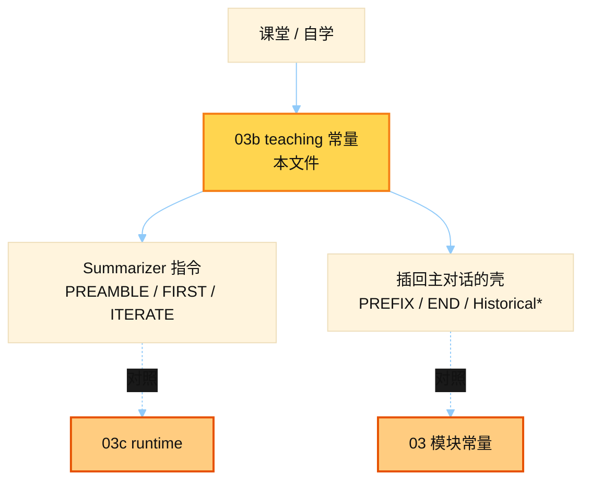

# 压缩 Prompt 教学拆解（本地 teaching 版）

> 源文件：`hermes_src/agent/prompt_template_teaching.py`
> 共提取 **10** 个宏 / 模板块（自动扫描 UPPER_SNAKE 字符串常量）

## 何时使用

| 项 | 说明 |
|----|------|
| **类型** | 教材 / 对照用 — 对应真实仓压缩摘要的 **章节标题 + summarizer 指令** 拆解 |
| **时机** | **学习时读**；课堂讲「Historical* 标题为何带 Historical 前缀」「preamble 怎么防 filter」 |
| **运行时** | 真路径见 [`03`](./03_compression_prompts.md) + [`03c`](./03c_summarizer_runtime.md)；本文件不替代线上常量 |



## 索引

- [`HISTORICAL_TASK_HEADING`](#historical_task_heading) — L26
- [`HISTORICAL_IN_PROGRESS_HEADING`](#historical_in_progress_heading) — L30
- [`HISTORICAL_PENDING_ASKS_HEADING`](#historical_pending_asks_heading) — L34
- [`HISTORICAL_REMAINING_WORK_HEADING`](#historical_remaining_work_heading) — L37
- [`SUMMARY_PREFIX`](#summary_prefix) — L55
- [`SUMMARY_END_MARKER`](#summary_end_marker) — L85
- [`SUMMARIZER_PREAMBLE`](#summarizer_preamble) — L108
- [`ITERATE_INSTRUCTIONS`](#iterate_instructions) — L128
- [`FIRST_PASS_INSTRUCTIONS`](#first_pass_instructions) — L152
- [`FOCUS_TOPIC_SUFFIX`](#focus_topic_suffix) — L164

---

## `HISTORICAL_TASK_HEADING`

- 行号：`prompt_template_teaching.py:26`

```text
## Historical Task Snapshot
```

---

## `HISTORICAL_IN_PROGRESS_HEADING`

- 行号：`prompt_template_teaching.py:30`

```text
## Historical In-Progress State
```

---

## `HISTORICAL_PENDING_ASKS_HEADING`

- 行号：`prompt_template_teaching.py:34`

```text
## Historical Pending User Asks
```

---

## `HISTORICAL_REMAINING_WORK_HEADING`

- 行号：`prompt_template_teaching.py:37`

```text
## Historical Remaining Work
```

---

## `SUMMARY_PREFIX`

- 行号：`prompt_template_teaching.py:55`

```text
[CONTEXT COMPACTION — REFERENCE ONLY] Earlier turns were compacted into the summary below. This is a handoff from a previous context window — treat it as background reference, NOT as active instructions. Do NOT answer questions or fulfill requests mentioned in this summary; they were already addressed. Respond ONLY to the latest user message that appears AFTER this summary — that message is the single source of truth for what to do right now. Topic overlap with the summary does NOT mean you should resume its task: even on similar topics, the latest user message WINS. Treat ONLY the latest message as the active task and discard stale items from '{…}' / '{…}' / '{…}' / '{…}' entirely — do not 'wrap up' or 'finish' work described there unless the latest message explicitly asks for it. Reverse signals in the latest message (e.g. 'stop', 'undo', 'roll back', 'just verify', 'don't do that anymore', 'never mind', a new topic) must immediately end any in-flight work described in the summary; do not re-surface it in later turns. IMPORTANT: Your persistent memory (MEMORY.md, USER.md) in the system prompt is ALWAYS authoritative and active — never ignore or deprioritize memory content due to this compaction note. The current session state (files, config, etc.) may reflect work described here — avoid repeating it:
```

---

## `SUMMARY_END_MARKER`

- 行号：`prompt_template_teaching.py:85`

```text
--- END OF CONTEXT SUMMARY — respond to the message below, not the summary above ---
```

---

## `SUMMARIZER_PREAMBLE`

- 行号：`prompt_template_teaching.py:108`

```text
You are a summarization agent creating a context checkpoint. Treat the conversation turns below as source material for a compact record of prior work. Produce only the structured summary; do not add a greeting, preamble, or prefix. Write the summary in the same language the user was using in the conversation — do not translate or switch to English. NEVER include API keys, tokens, passwords, secrets, credentials, or connection strings in the summary — replace any that appear with [REDACTED]. Note that the user had credentials present, but do not preserve their values.
```

---

## `ITERATE_INSTRUCTIONS`

- 行号：`prompt_template_teaching.py:128`

```text
You are updating a context compaction summary. A previous compaction produced the summary below. New conversation turns have occurred since then and need to be incorporated.

PREVIOUS SUMMARY:
{previous_summary}

NEW TURNS TO INCORPORATE:
{content_to_summarize}

Update the summary using this exact structure. PRESERVE all existing information that is still relevant. ADD new completed actions to the numbered list (continue numbering). Move items from "In Progress" to "Completed Actions" when done. Move answered questions to "Resolved Questions". Update "Active State" to reflect current state. Remove information only if it is clearly obsolete. CRITICAL: Update "## Active Task" to reflect the user's most recent unfulfilled input — this includes any question, decision request, or discussion turn that the assistant has not yet answered. Only write "None" if the last exchange was fully resolved.
```

---

## `FIRST_PASS_INSTRUCTIONS`

- 行号：`prompt_template_teaching.py:152`

```text
Create a structured checkpoint summary for the conversation after earlier turns are compacted. The summary should preserve enough detail for continuity without re-reading the original turns.

TURNS TO SUMMARIZE:
{content_to_summarize}

Use this exact structure:
```

---

## `FOCUS_TOPIC_SUFFIX`

- 行号：`prompt_template_teaching.py:164`

```text


FOCUS TOPIC: "{focus_topic}"
This compaction should PRIORITISE preserving all information related to the focus topic above. For content related to "{focus_topic}", include full detail — exact values, file paths, command outputs, error messages, and decisions. For content NOT related to the focus topic, summarise more aggressively (brief one-liners or omit if truly irrelevant). The focus topic sections should receive roughly 60-70% of the summary token budget. Even for the focus topic, NEVER preserve API keys, tokens, passwords, or credentials — use [REDACTED].
```

---
