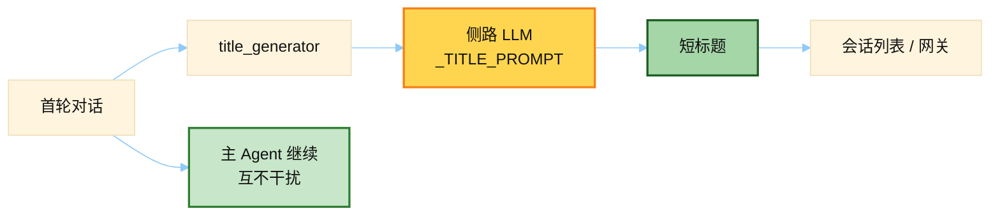

# Session Title Prompt

> 源文件：`agent/title_generator.py`
> 共提取 **2** 个宏 / 模板块

## 何时使用

| 项 | 说明 |
|----|------|
| **类型** | ② Auxiliary LLM — `task=title_generation`，**不进**主对话缓存前缀 |
| **时机** | 新会话有了首轮 user/assistant 交换后，后台生成 3–7 词标题（列表/gateway 展示用） |
| **变体** | 默认跟用户语言；配置钉死语言时用 `_TITLE_PROMPT_PINNED_LANGUAGE` |



## 索引

- [`_TITLE_PROMPT`](#_title_prompt) — L22
- [`_TITLE_PROMPT_PINNED_LANGUAGE`](#_title_prompt_pinned_language) — L29

---

## `_TITLE_PROMPT`

- 行号：`title_generator.py:22`

```text
Generate a short, descriptive title (3-7 words) for a conversation that starts with the following exchange. The title should capture the main topic or intent. Write the title in the same language the user is writing in. Return ONLY the title text, nothing else. No quotes, no punctuation at the end, no prefixes.
```

---

## `_TITLE_PROMPT_PINNED_LANGUAGE`

- 行号：`title_generator.py:29`

```text
Generate a short, descriptive title (3-7 words) for a conversation that starts with the following exchange. The title should capture the main topic or intent. Write the title in {language}. Return ONLY the title text, nothing else. No quotes, no punctuation at the end, no prefixes.
```

---
