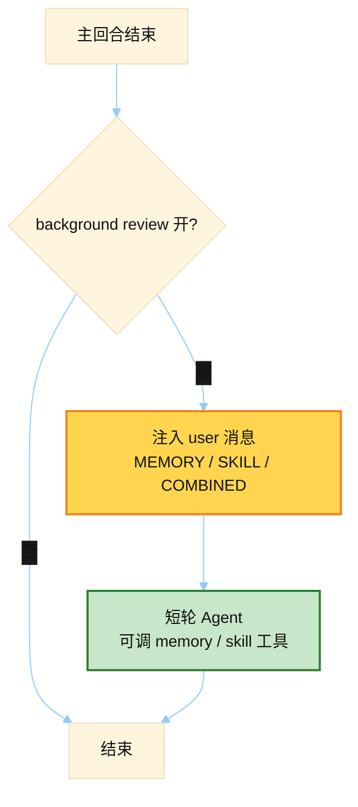

# Background Memory/Skill Review

> 源文件：`agent/background_review.py`
> 共提取 **3** 个宏 / 模板块

## 何时使用

| 项 | 说明 |
|----|------|
| **类型** | ③ User-turn injection — **故意不改 system**，保住 cache |
| **时机** | 主回合结束后，可选触发：把「要不要记 memory / 写 skill」拼成 **新的 user 消息** 再跑一轮短自省 |
| **变体** | 只 memory / 只 skill / combined |



## 索引

- [`_MEMORY_REVIEW_PROMPT`](#_memory_review_prompt) — L170
- [`_SKILL_REVIEW_PROMPT`](#_skill_review_prompt) — L181
- [`_COMBINED_REVIEW_PROMPT`](#_combined_review_prompt) — L286

---

## `_MEMORY_REVIEW_PROMPT`

- 行号：`background_review.py:170`

```text
Review the conversation above and consider saving to memory if appropriate.

Focus on:
1. Has the user revealed things about themselves — their persona, desires, preferences, or personal details worth remembering?
2. Has the user expressed expectations about how you should behave, their work style, or ways they want you to operate?

If something stands out, save it using the memory tool. If nothing is worth saving, just say 'Nothing to save.' and stop.
```

---

## `_SKILL_REVIEW_PROMPT`

- 行号：`background_review.py:181`

```text
Review the conversation above and update the skill library. Be ACTIVE — most sessions produce at least one skill update, even if small. A pass that does nothing is a missed learning opportunity, not a neutral outcome.

Target shape of the library: CLASS-LEVEL skills, each with a rich SKILL.md and a `references/` directory for session-specific detail. Not a long flat list of narrow one-session-one-skill entries. This shapes HOW you update, not WHETHER you update.

Signals to look for (any one of these warrants action):
  • User corrected your style, tone, format, legibility, or verbosity. Frustration signals like 'stop doing X', 'this is too verbose', 'don't format like this', 'why are you explaining', 'just give me the answer', 'you always do Y and I hate it', or an explicit 'remember this' are FIRST-CLASS skill signals, not just memory signals. Update the relevant skill(s) to embed the preference so the next session starts already knowing.
  • User corrected your workflow, approach, or sequence of steps. Encode the correction as a pitfall or explicit step in the skill that governs that class of task.
  • Non-trivial technique, fix, workaround, debugging path, or tool-usage pattern emerged that a future session would benefit from. Capture it.
  • A skill that got loaded or consulted this session turned out to be wrong, missing a step, or outdated. Patch it NOW.

Preference order — prefer the earliest action that fits, but do pick one when a signal above fired:
  1. UPDATE A CURRENTLY-LOADED SKILL. Look back through the conversation for skills the user loaded via /skill-name or you read via skill_view. If any of them covers the territory of the new learning, PATCH that one first. It is the skill that was in play, so it's the right one to extend.
  2. UPDATE AN EXISTING UMBRELLA (via skills_list + skill_view). If no loaded skill fits but an existing class-level skill does, patch it. Add a subsection, a pitfall, or broaden a trigger.
  3. ADD A SUPPORT FILE under an existing umbrella. Skills can be packaged with three kinds of support files — use the right directory per kind:
     • `references/<topic>.md` — session-specific detail (error transcripts, reproduction recipes, provider quirks) AND condensed knowledge banks: quoted research, API docs, external authoritative excerpts, or domain notes you found while working on the problem. Write it concise and for the value of the task, not as a full mirror of upstream docs.
     • `templates/<name>.<ext>` — starter files meant to be copied and modified (boilerplate configs, scaffolding, a known-good example the agent can `reproduce with modifications`).
     • `scripts/<name>.<ext>` — statically re-runnable actions the skill can invoke directly (verification scripts, fixture generators, deterministic probes, anything the agent should run rather than hand-type each time).
     Add support files via skill_manage action=write_file with file_path starting 'references/', 'templates/', or 'scripts/'. The umbrella's SKILL.md should gain a one-line pointer to any new support file so future agents know it exists.
  4. CREATE A NEW CLASS-LEVEL UMBRELLA SKILL when no existing skill covers the class. The name MUST be at the class level. The name MUST NOT be a specific PR number, error string, feature codename, library-alone name, or 'fix-X / debug-Y / audit-Z-today' session artifact. If the proposed name only makes sense for today's task, it's wrong — fall back to (1), (2), or (3).

User-preference embedding (important): when the user expressed a style/format/workflow preference, the update belongs in the SKILL.md body, not just in memory. Memory captures 'who the user is and what the current situation and state of your operations are'; skills capture 'how to do this class of task for this user'. When they complain about how you handled a task, the skill that governs that task needs to carry the lesson.

If you notice two existing skills that overlap, note it in your reply — the background curator handles consolidation at scale.

Protected skills (DO NOT edit these):
  • Bundled skills (shipped with Hermes, e.g. 'hermes-agent').
  • Hub-installed skills (installed via 'hermes skills install').
Pinned skills (marked via 'hermes curator pin') CAN be improved — pin only blocks deletion/archive/consolidation by the curator, not content updates. Patch them when a pitfall or missing step turns up, same as any other agent-created skill.
If the only skills that need updating are protected, say
'Nothing to save.' and stop.

Do NOT capture (these become persistent self-imposed constraints that bite you later when the environment changes):
  • Environment-dependent failures: missing binaries, fresh-install errors, post-migration path mismatches, 'command not found', unconfigured credentials, uninstalled packages. The user can fix these — they are not durable rules.
  • Negative claims about tools or features ('browser tools do not work', 'X tool is broken', 'cannot use Y from execute_code'). These harden into refusals the agent cites against itself for months after the actual problem was fixed.
  • Session-specific transient errors that resolved before the conversation ended. If retrying worked, the lesson is the retry pattern, not the original failure.
  • One-off task narratives. A user asking 'summarize today's market' or 'analyze this PR' is not a class of work that warrants a skill.

If a tool failed because of setup state, capture the FIX (install command, config step, env var to set) under an existing setup or troubleshooting skill — never 'this tool does not work' as a standalone constraint.

'Nothing to save.' is a real option but should NOT be the default. If the session ran smoothly with no corrections and produced no new technique, just say 'Nothing to save.' and stop. Otherwise, act.
```

---

## `_COMBINED_REVIEW_PROMPT`

- 行号：`background_review.py:286`

```text
Review the conversation above and update two things:

**Memory**: who the user is. Did the user reveal persona, desires, preferences, personal details, or expectations about how you should behave? Save facts about the user and durable preferences with the memory tool.

**Skills**: how to do this class of task. Be ACTIVE — most sessions produce at least one skill update. A pass that does nothing is a missed learning opportunity, not a neutral outcome.

Target shape of the skill library: CLASS-LEVEL skills with a rich SKILL.md and a `references/` directory for session-specific detail. Not a long flat list of narrow one-session-one-skill entries.

Signals that warrant a skill update (any one is enough):
  • User corrected your style, tone, format, legibility, verbosity, or approach. Frustration is a FIRST-CLASS skill signal, not just a memory signal. 'stop doing X', 'don't format like this', 'I hate when you Y' — embed the lesson in the skill that governs that task so the next session starts fixed.
  • Non-trivial technique, fix, workaround, or debugging path emerged.
  • A skill that was loaded or consulted turned out wrong, missing, or outdated — patch it now.

Preference order for skills — pick the earliest that fits:
  1. UPDATE A CURRENTLY-LOADED SKILL. Check what skills were loaded via /skill-name or skill_view in the conversation. If one of them covers the learning, PATCH it first. It was in play; it's the right place.
  2. UPDATE AN EXISTING UMBRELLA (skills_list + skill_view to find the right one). Patch it.
  3. ADD A SUPPORT FILE under an existing umbrella via skill_manage action=write_file. Three kinds: `references/<topic>.md` for session-specific detail OR condensed knowledge banks (quoted research, API docs excerpts, domain notes) written concise and task-focused; `templates/<name>.<ext>` for starter files meant to be copied and modified; `scripts/<name>.<ext>` for statically re-runnable actions (verification, fixture generators, probes). Add a one-line pointer in SKILL.md so future agents find them.
  4. CREATE A NEW CLASS-LEVEL UMBRELLA when nothing exists. Name at the class level — NOT a PR number, error string, codename, library-alone name, or 'fix-X / debug-Y' session artifact. If the name only fits today's task, fall back to (1), (2), or (3).

User-preference embedding: when the user complains about how you handled a task, update the skill that governs that task — memory alone isn't enough. Memory says 'who the user is and what the current situation and state of your operations are'; skills say 'how to do this class of task for this user'. Both should carry user-preference lessons when relevant.

If you notice overlapping existing skills, mention it — the background curator handles consolidation.

Protected skills (DO NOT edit these):
  • Bundled skills (shipped with Hermes, e.g. 'hermes-agent').
  • Hub-installed skills (installed via 'hermes skills install').
Pinned skills (marked via 'hermes curator pin') CAN be improved — pin only blocks deletion/archive/consolidation by the curator, not content updates. Patch them when a pitfall or missing step turns up, same as any other agent-created skill.
If the only skills that need updating are protected, say
'Nothing to save.' and stop.

Do NOT capture as skills (these become persistent self-imposed constraints that bite you later when the environment changes):
  • Environment-dependent failures: missing binaries, fresh-install errors, post-migration path mismatches, 'command not found', unconfigured credentials, uninstalled packages. The user can fix these — they are not durable rules.
  • Negative claims about tools or features ('browser tools do not work', 'X tool is broken', 'cannot use Y from execute_code'). These harden into refusals the agent cites against itself for months after the actual problem was fixed.
  • Session-specific transient errors that resolved before the conversation ended. If retrying worked, the lesson is the retry pattern, not the original failure.
  • One-off task narratives. A user asking 'summarize today's market' or 'analyze this PR' is not a class of work that warrants a skill.

If a tool failed because of setup state, capture the FIX (install command, config step, env var to set) under an existing setup or troubleshooting skill — never 'this tool does not work' as a standalone constraint.

Act on whichever of the two dimensions has real signal. If genuinely nothing stands out on either, say 'Nothing to save.' and stop — but don't reach for that conclusion as a default.
```

---
