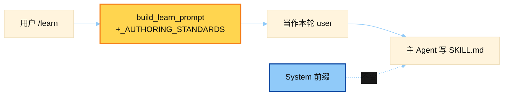

# /learn Skill Authoring Prompt

> 源文件：`agent/learn_prompt.py`
> 共提取 **1** 个宏 / 模板块

## 何时使用

| 项 | 说明 |
|----|------|
| **类型** | ③ User-turn injection — `/learn` slash |
| **时机** | 用户执行 `/learn`：把会话经验沉淀成 skill；标准文案注入 **当前 user 消息**，不重建 system |
| **内容** | HARDLINE 作者规范（description ≤60 字符等） |



## 索引

- [`_AUTHORING_STANDARDS`](#_authoring_standards) — L30

---

## `_AUTHORING_STANDARDS`

- 行号：`learn_prompt.py:30`

```text
Follow the Hermes skill-authoring standards exactly. These are the same
HARDLINE rules a maintainer enforces in review:

Frontmatter:
- name: lowercase-hyphenated, <=64 chars, no spaces.
- description: ONE sentence, **<=60 characters**, ends with a period. State the
  capability, not the implementation. No marketing words (powerful,
  comprehensive, seamless, advanced, robust). Do NOT repeat the skill name. If
  the description contains a colon, wrap the whole value in double quotes.
  This is the most-violated rule and it is NOT cosmetic: the system-prompt
  skill index truncates the description to 60 chars and loads it every
  session, so anything past char 60 is silently cut and never routes. After
  you write the description, COUNT the characters; if it is over 60, cut it
  down before saving — do not ship a sentence and hope.
    Good (<=60): `Search arXiv papers by keyword, author, or ID.`
    Bad (123):   `A comprehensive skill that lets the agent search arXiv for
                  academic papers using keywords, authors, and categories.`
- version: 0.1.0
- author: always the literal value `Hermes`. NEVER fill it from the host
  environment — the OS/login username (e.g. the `user=` line in your
  environment hints), git config, or any identity you can probe must not be
  written. Skills get shared and published, so an environment-derived name is
  a privacy leak the user never opted into; the skill names itself as Hermes.
- platforms: declare `[macos]`, `[linux]`, and/or `[windows]` IF the skill
  uses OS-bound primitives (osascript/apt/systemctl => the matching OS; /proc,
  os.setsid, signal.SIGKILL => linux; fcntl/termios => POSIX). Prefer fixing it
  cross-platform first (tempfile.gettempdir(), pathlib.Path, psutil); gate only
  when the dependency is genuinely platform-bound. Omit the field for portable
  skills.
- metadata.hermes.tags: a few Capitalized, Relevant, Tags.

Body section order (omit a section only if it genuinely has no content):
1. "# <Human Title>" then a 2-3 sentence intro: what it does, what it does NOT
   do, and the key dependency stance (e.g. "stdlib only").
2. "## When to Use" — bullet list of concrete trigger phrases.
3. "## Prerequisites" — exact env vars, install steps, credentials.
4. "## How to Run" — the canonical invocation, framed through Hermes tools.
5. "## Quick Reference" — a flat command/endpoint list, no narration.
6. "## Procedure" — numbered steps with copy-paste-exact commands.
7. "## Pitfalls" — known limits, rate limits, things that look broken but aren't.
8. "## Verification" — a single command/check that proves the skill worked.

Hermes-tool framing (this is what makes it a skill, not shell docs):
- Frame running scripts as "invoke through the `terminal` tool".
- Reference Hermes tools by name in backticks: `terminal`, `read_file`,
  `write_file`, `search_files`, `patch`, `web_extract`, `web_search`,
  `vision_analyze`, `browser_navigate`, `delegate_task`, `image_generate`,
  `text_to_speech`, `cronjob`, `memory`, `skill_view`, `execute_code`.
- Do NOT name shell utilities the agent already has wrapped: say `read_file`
  not cat/head/tail, `search_files` not grep/rg/find/ls, `patch` not sed/awk,
  `web_extract` not curl-to-scrape, `write_file` not echo>file or heredocs.
- Third-party CLIs (ffmpeg, gh, an SDK) are fine inside a script file, but the
  prose still frames them as "invoke through the `terminal` tool". If the
  skill needs an MCP server, name it and document its setup in Prerequisites.

Quality bar:
- Prefer exact commands, endpoint URLs, function signatures, and config keys
  that appear VERBATIM in the source. NEVER invent flags, paths, or APIs — if
  you didn't see it in the source, don't write it.
- Keep it tight and scannable: ~100 lines for a simple skill, ~200 for a
  complex one. Don't re-paste the source docs.
- Don't write a router/index/hub skill that only points at other skills.
- Larger scripts/parsers belong in a `scripts/` file (add via
  `skill_manage` write_file), referenced from SKILL.md by relative path — not
  inlined for the agent to re-type every run. References go in `references/`,
  templates in `templates/`.
```

---
