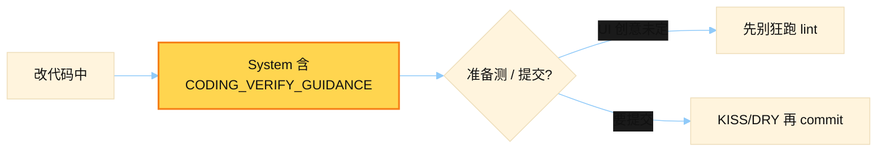

# Coding Verify Guidance

> 源文件：`agent/verify_hooks.py`
> 共提取 **1** 个宏 / 模板块

## 何时使用

| 项 | 说明 |
|----|------|
| **类型** | ① Cached System — 编码 verify 纪律短句 |
| **时机** | 编码上下文启用 verify hooks 时拼进 system：测/lint 时机、提交前清理风格 |
| **和 06** | 06 讲「怎么改代码」；10 讲「收工前怎么验」 |



## 索引

- [`CODING_VERIFY_GUIDANCE`](#coding_verify_guidance) — L26

---

## `CODING_VERIFY_GUIDANCE`

- 行号：`verify_hooks.py:26`

```text
[Coding] Before you run tests/linters or call this done: if this is creative UI/visual work, hold off on tests and linters until the user says they like the result or you're about to commit. And before every commit, clean your work: keep it KISS/DRY, match the surrounding code style, and be elitist, shorthand, clever, concise, efficient, and elegant.
```

---
