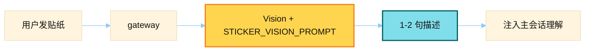

# Sticker Vision Prompt

> 源文件：`gateway/sticker_cache.py`
> 共提取 **1** 个宏 / 模板块

## 何时使用

| 项 | 说明 |
|----|------|
| **类型** | ② Auxiliary — `task=vision`（贴纸描述） |
| **时机** | 网关收到贴纸消息：侧路视觉模型生成 1–2 句客观描述，再参与主对话上下文（可缓存描述） |
| **不是** | 主模型 system 文案 |



## 索引

- [`STICKER_VISION_PROMPT`](#sticker_vision_prompt) — L23

---

## `STICKER_VISION_PROMPT`

- 行号：`sticker_cache.py:23`

```text
Describe this sticker in 1-2 sentences. Focus on what it depicts -- character, action, emotion. Be concise and objective.
```

---
