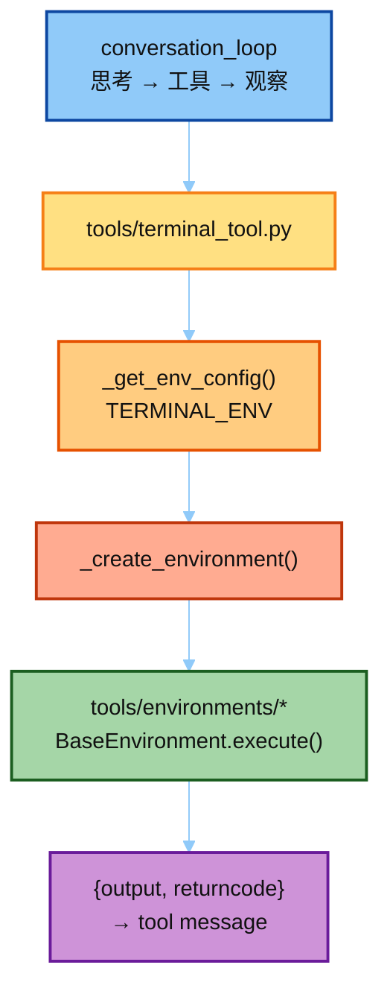

# Hermes Tools · Environments（执行环境）

目标：精读 Hermes **真源码**里 Agent 命令跑在哪——`tools/environments/` + `terminal_tool._create_environment`。

对照大纲：[`../03-hermes Agent  学习大纲.md`](../03-hermes%20Agent%20%20学习大纲.md) **模块四**。

学法（对齐 [`../03-eval/`](../03-eval/)）：

1. 读 [`notes/`](./notes/README.md)（01→04）建立心智模型  
2. 打开 [`hermes_src/`](./hermes_src/README.md) **真文件**对照（不是玩具封装）  
3. 完整仓库对照：[`../hermes-study/tools/environments/`](../hermes-study/tools/environments/) 或上游 `hermes-agent`  
4. 动手：跑 [`demo/run_local_env.py`](./demo/run_local_env.py)（**真** `LocalEnvironment`，不改源码）；或真 CLI 切 `TERMINAL_ENV` 打断点  

> `hermes_src/` 是只读剪枝：**缺大量依赖，不要指望直接 import 跑通**。  
> 可跑 demo 走完整 `hermes-agent` 仓库（见 `demo/README.md`）。
> 本模块**不以 FakeDocker / 自写教学环境代替真源码**。

---

## Env 是什么 / 作用

Agent 有时要在电脑上跑命令（比如 `ls`、装依赖、跑测试）。**Env（执行环境）就是决定这些命令实际跑在哪里的那一层。**

可以把它想成「工作台」：可以选本机直接跑、Docker 里跑、远程 SSH 机器上跑，或云端沙箱里跑。对 Agent 来说，用法都一样——发一条命令，拿回输出和退出码；换工作台不用改对话逻辑。

它的作用很简单：把「想跑什么命令」和「在哪跑」拆开。主循环只管要不要调 terminal；真正开进程、隔离、读写文件，都交给 Env。你改配置里的 `TERMINAL_ENV`，就能切换后端。

注意：Env **不是** Runtime。Runtime 是整台 Agent「怎么转起来」（思考 → 调工具 → 看结果）；Env 只是其中 **terminal 工具背后的工作台**——管命令跑在哪。下面那张图标题「在 Runtime 里的位置」，意思是 Env 挂在 Runtime 哪一步，不是说两者等同。

---

## 在 Runtime 里的位置



一句话：**主循环决定调不调 terminal；environments 决定命令跑在哪。**

---

## 目录

```text
05-env/
├── README.md                          # 本文件
├── notes/                             # ★ 讲稿（真源码对照）
│   ├── README.md
│   ├── 01_base_environment.md
│   ├── 02_local_vs_docker.md
│   ├── 03_remote_and_cloud.md
│   └── 04_factory_and_config.md
├── demo/                              # ★ 可跑：真 LocalEnvironment
│   ├── README.md
│   ├── run_local_env.py
│   └── exports/local_env/
└── hermes_src/                        # ★ 真源码剪枝（只读对照）
    ├── README.md                      # ★ 各 env 文件白话说明
    └── tools/
        ├── terminal_tool.FACTORY.py
        ├── env_probe.py
        └── environments/              # base/local/docker/ssh/…
```

各 env 文件逐个说明：[`hermes_src/README.md`](./hermes_src/README.md)。

关联：

- 完整实现：[`../hermes-study/tools/environments/`](../hermes-study/tools/environments/)  
- 工厂全文件：上游 `tools/terminal_tool.py`（约 2.6k 行；本目录只摘 factory）  
- 上一模块：[`../02-run-agent/`](../02-run-agent/)（tool 如何被主循环调用）  
- 下一模块（大纲五）：Sandbox / MicroVM（在 docker 之上加固）  
- 并行扩展：[`../06-cron/`](../06-cron/)（何时再开一轮 Agent；环境管「跑在哪」）

---

## 建议阅读顺序

| 顺序 | 材料 | 打开的真文件 |
|------|------|----------------|
| 1 | `notes/01` | `hermes_src/tools/environments/base.py` |
| 2 | `notes/02` | `local.py` + `docker.py`（`_BASE_SECURITY_ARGS`） |
| 3 | `notes/03` | `file_sync.py` + `ssh.py` / `modal.py` |
| 4 | `notes/04` | `terminal_tool.FACTORY.py` |
| 5 | 真仓打断点 | `BaseEnvironment.execute`、`_create_environment` |

---

## 动手（对齐大纲产出）

1. 画「后端对比表」：隔离 / 延迟 / 文件可见性 / 适用场景（notes/02、03 已给骨架）。  
2. 真 Hermes：`TERMINAL_ENV=local` 与 `docker` 各跑同一条 `pwd` / `cat /etc/os-release`。  
3. 面试三句：统一 `execute()`；差异在 `_run_bash`；配置走 `TERMINAL_ENV` 不改主循环。
