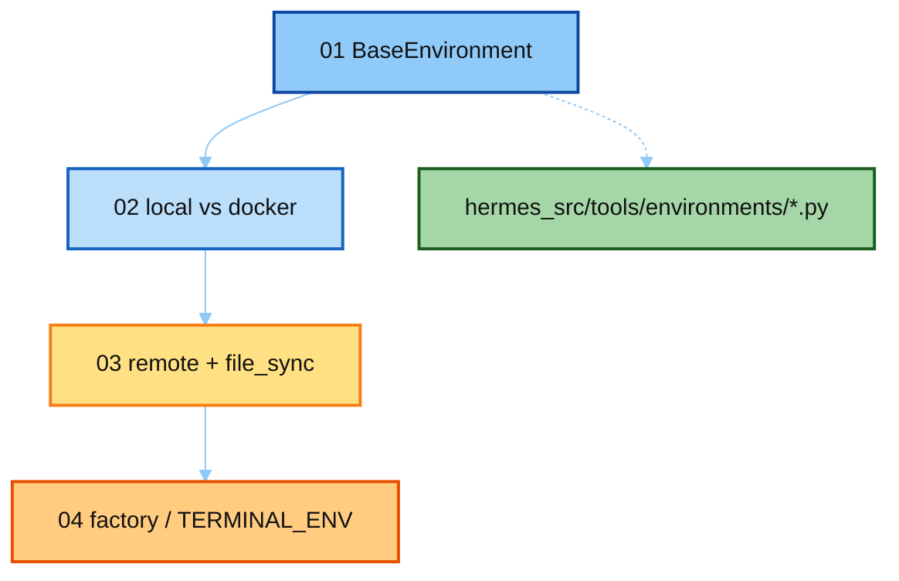

# 05-env · notes 讲解顺序

本目录讲 **Hermes 真源码** `tools/environments/` + `terminal_tool` 工厂。按编号读。

| 顺序 | 文件 | 真源码 | 读完应能回答 |
|------|------|--------|--------------|
| **01** | [`01_base_environment.md`](./01_base_environment.md) | `base.py` | spawn-per-call + snapshot 是什么？ |
| **02** | [`02_local_vs_docker.md`](./02_local_vs_docker.md) | `local.py` / `docker.py` | 隔离差在哪？security args？ |
| **03** | [`03_remote_and_cloud.md`](./03_remote_and_cloud.md) | `ssh.py` / `file_sync.py` / 云 | bind vs sync？ |
| **04** | [`04_factory_and_config.md`](./04_factory_and_config.md) | `terminal_tool.FACTORY.py` | 用户怎么切后端？ |

最短路径：`01` → `02` → `04`，再扫 `03` 对比表。

上级：[`../README.md`](../README.md)
