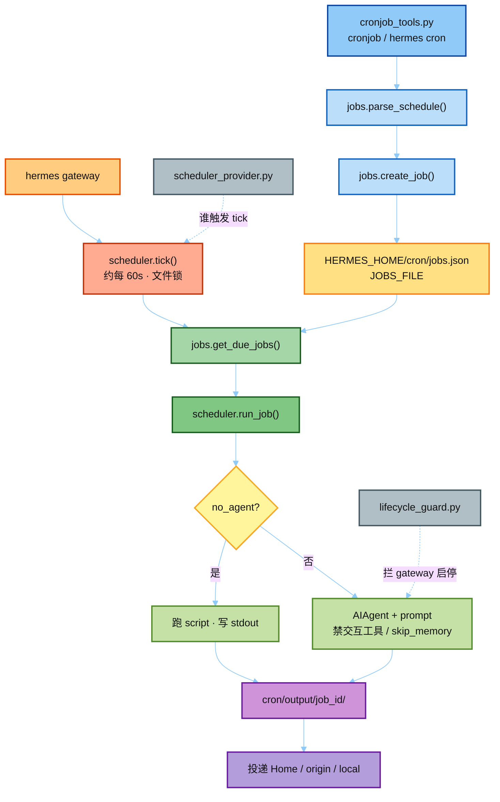

# hermes_src — Cron 真源码剪枝

本目录从 Hermes 拷贝 **真实** `cron/` + `tools/cronjob_tools.py`，方便对照 `notes/`。  
缺 gateway / AIAgent / config 等依赖，**不要在这里直接 import 跑**。

| 路径 | 用途 |
|------|------|
| `cron/__init__.py` | 对外 re-export：`create_job` / `tick` / `JOBS_FILE` |
| `cron/jobs.py` | ★ Job 存储：`jobs.json`、`parse_schedule`、`create_job`、`get_due_jobs` |
| `cron/scheduler.py` | ★ 完整调度器（大文件）：`tick` / `run_job` / 投递 |
| `cron/scheduler.TICK_RUN.py` | ★ 教学摘录：toolset 禁用、`run_job` 分支、`tick` 锁 |
| `cron/scheduler_provider.py` | Axis-B：触发器 ABC（builtin vs Chronos 等） |
| `cron/lifecycle_guard.py` | 禁止 cron 作业里跑 gateway 启停命令 |
| `tools/cronjob_tools.py` | ★ Agent 工具：`cronjob(action=…)` + prompt 扫描 |

精读顺序：`jobs.py` → `scheduler.TICK_RUN.py` → `cronjob_tools.py` → `scheduler_provider.py`。

---

## 运行逻辑（源码对照）

本树**不能直接 import 跑**；下图是完整 Hermes 里这些文件如何串起来。

一句话：**写入走 `jobs.py`；到期扫描与执行走 `scheduler.py`；Agent 入口是 `cronjob_tools.py`。**

教学摘录优先看 `scheduler.TICK_RUN.py`（`tick` 锁、`run_job` 分支、禁用 toolset）。

---

## 上游对照

上游完整文件：

- https://github.com/NousResearch/hermes-agent/blob/main/cron/jobs.py
- https://github.com/NousResearch/hermes-agent/blob/main/cron/scheduler.py
- https://github.com/NousResearch/hermes-agent/blob/main/tools/cronjob_tools.py

同仓库完整树：[`../../hermes-study/`](../../hermes-study/)（若已同步）或上游 `hermes-agent/cron/`。
