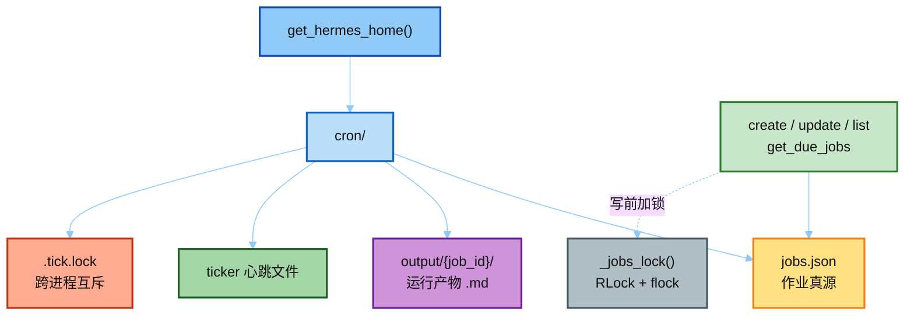
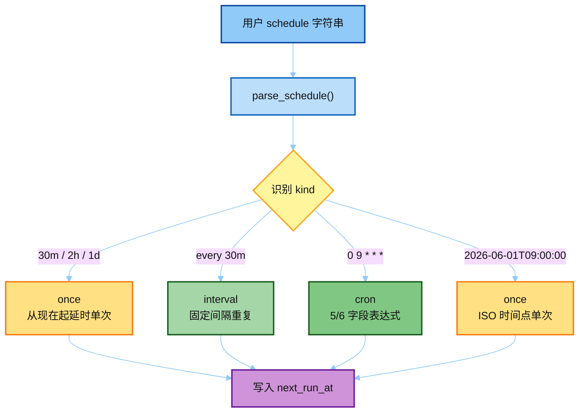
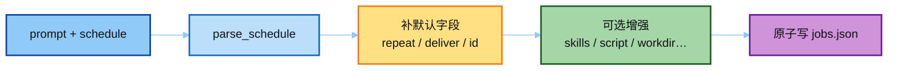
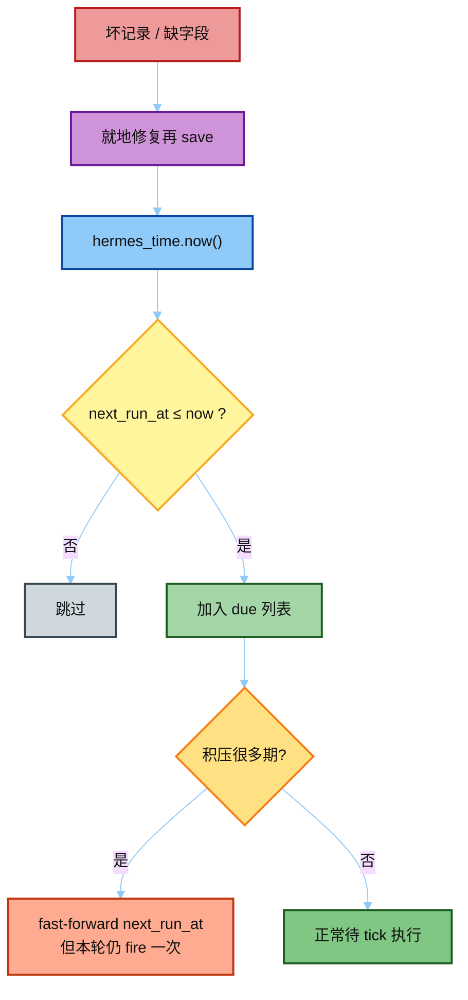

# 01 · Job Store（真源码 `jobs.py`）

> 对照：[`../hermes_src/cron/jobs.py`](../hermes_src/cron/jobs.py)  
> 下一篇：[`02_tick_and_run.md`](./02_tick_and_run.md)

---

## 一句话

Cron **不是系统 crontab**，也不是 SQLite 表：作业列表落在 **`{HERMES_HOME}/cron/jobs.json`**，运行产物在 **`cron/output/{job_id}/`**。

文件头注释写明：

> Jobs are stored in ~/.hermes/cron/jobs.json  
> Output is saved to ~/.hermes/cron/output/{job_id}/{timestamp}.md

（`~/.hermes` 实际是 `get_hermes_home()` —— **按 profile 隔离**，见 issue #4707 注释。）

**给小白：** 可以把 `jobs.json` 想成一张「待办闹钟表」。每条记录写清楚：要说什么（`prompt`）、什么时候响（`schedule` / `next_run_at`）、响完往哪送（`deliver`）。Gateway 每分钟扫这张表，到点就执行；执行结果另存成 markdown，方便事后翻。

---

## 整体结构（先建立地图）

读代码时抓住三件事：

1. **路径都锚 `get_hermes_home()`** —— 换 profile 就换整棵 `cron/` 树，不会串密钥和 jobs。
2. **读写走锁** —— 同进程 `RLock` + 跨进程文件锁，避免 ticker 与 CLI 同时改 JSON。
3. **`jobs.json` 是唯一作业真源** —— CLI / Agent tool / slash `/cron` 最终都读写它。

---

## 关键路径

| 符号 | 作用 |
|------|------|
| `get_hermes_home() / "cron"` | profile 作用域根 |
| `JOBS_FILE` | `jobs.json` |
| `OUTPUT_DIR` | `cron/output/` |
| `TICKER_HEARTBEAT_FILE` | ticker 线程心跳（`hermes cron status` 用） |
| `TICKER_INTERVAL_SECONDS = 60` | 与 gateway 内 ticker 共用 |
| `use_cron_store(home)` | ContextVar 切到别的 profile 的 cron，不改进程全局 |

跨进程：`_jobs_lock()` = 进程内 `RLock` + 文件 flock（Unix `fcntl` / Windows `msvcrt`），超时 30s，防 ticker 被卡死锁拖死（#60703）。

---

## `parse_schedule()` —— 四种写法

打开 `jobs.py` 里的 `parse_schedule`：用户输入一句字符串，解析成带 `kind` 的结构化 schedule，并算出第一次 `next_run_at`。

| 输入 | `kind` | 含义 |
|------|--------|------|
| `"30m"` / `"2h"` / `"1d"` | `once` | 从现在起一段时间后 **单次** |
| `"every 30m"` / `"every 2h"` | `interval` | 固定间隔 **重复** |
| `"0 9 * * *"` | `cron` | 5/6 字段 cron（要 `croniter`） |
| `"2026-06-01T09:00:00"` | `once` | ISO 时间点单次 |

注意：naive ISO 时间会锚到 **配置的 Hermes 时区**（`hermes_time.now()`），不是随便用服务器 local（#51021）。

**记忆口诀：** 带 `every` → 重复；纯时长 / ISO → 单次；五段数字空格 → cron 表达式。

---

## `create_job()` 关键字段

`create_job(prompt, schedule, …)` 会：

1. `parse_schedule(schedule)`
2. one-shot 默认 `repeat=1`
3. `deliver` 默认：有 `origin` → `"origin"`，否则 `"local"`
4. 写回 `jobs.json`（原子 replace）

常考可选字段：

| 字段 | 干什么 |
|------|--------|
| `skills` / `skill` | 跑前加载技能 |
| `script` + `no_agent` | 脚本即任务，不调 LLM |
| `context_from` | 注入别的 job 最近 output（链式） |
| `enabled_toolsets` | 收窄工具面 |
| `workdir` | 注入该目录 AGENTS.md，并设 TERMINAL_CWD |
| `model` / `provider` | 单 job 覆盖 |

---

## `get_due_jobs()` 心智模型

到期判定很朴素：**现在 ≥ `next_run_at` 且 job 启用**，就进入 due 列表。难点在「积压」和「坏数据」两条边角。

要点：

- 比较 `next_run_at` vs `hermes_time.now()`
- 网关宕机 / 上一跑超时导致 **积压**：fast-forward `next_run_at`，但 **仍 fire 一次**（防 #33315 永远 defer）
- 坏记录（缺 id、schedule 不是 dict、坏 ISO）会 **就地修复再 save**，避免一整次 tick 被 KeyError 打断

下一篇：gateway 每 60s 调 `tick()` → 锁 → due → `run_job`。
