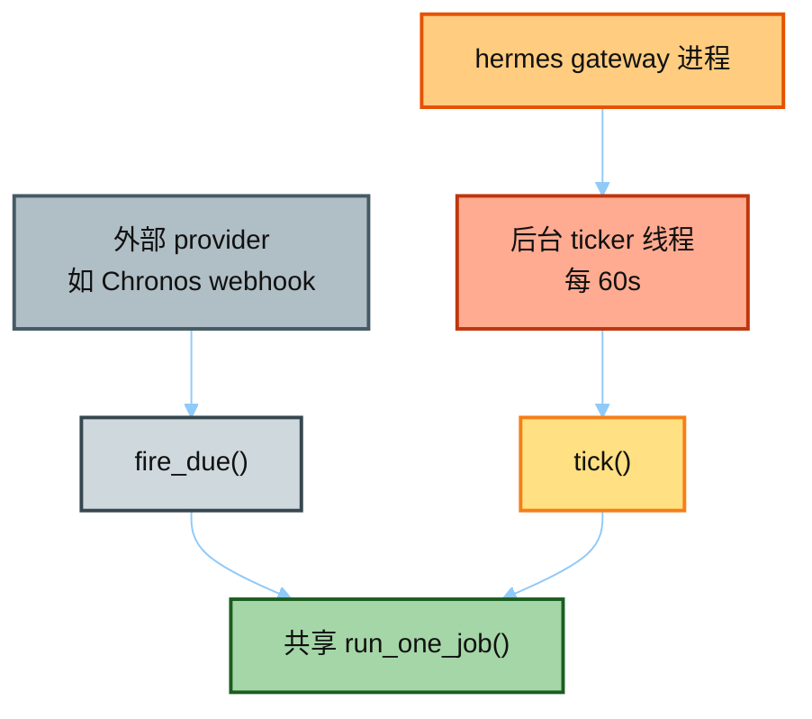
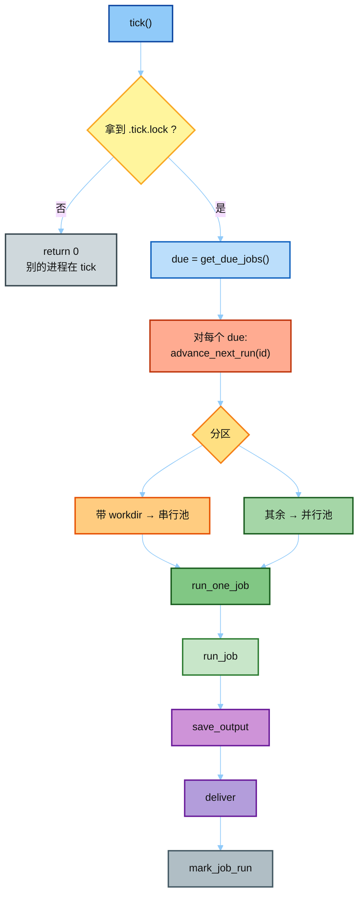
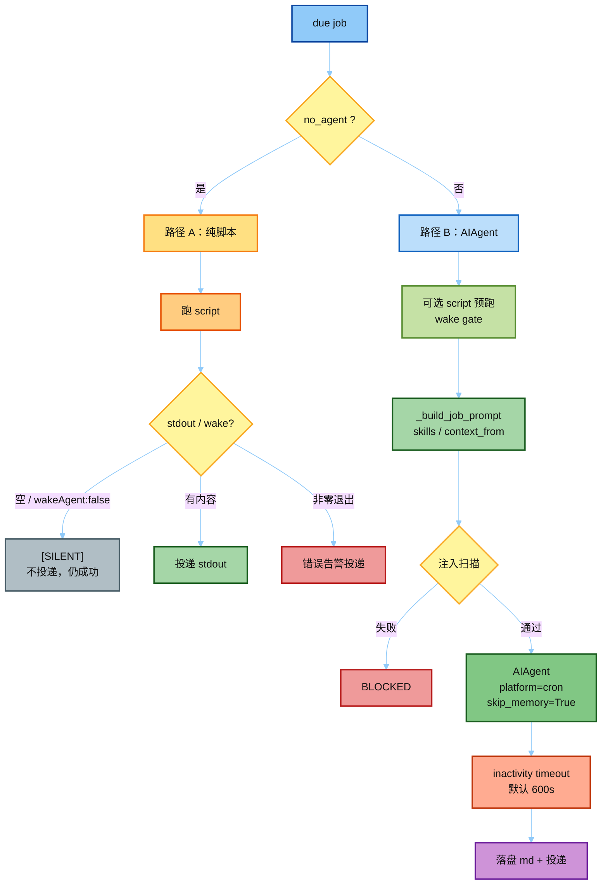

# 02 · tick / run_job（真源码 `scheduler.py`）

> 对照：  
> - 摘录 [`../hermes_src/cron/scheduler.TICK_RUN.py`](../hermes_src/cron/scheduler.TICK_RUN.py)  
> - 全文件 [`../hermes_src/cron/scheduler.py`](../hermes_src/cron/scheduler.py)  
> 下一篇：[`03_cronjob_tool.md`](./03_cronjob_tool.md)

---

## 一句话

Gateway 后台线程每 **60 秒** 调一次 `tick()`：拿 `.tick.lock` → `get_due_jobs()` → **先** `advance_next_run`（at-most-once）→ 并行 `run_one_job`（执行 / 落盘 / 投递 / `mark_job_run`）。

**没有独立 cron daemon**——builtin 触发器只活在 `hermes gateway` 进程里（`scheduler_provider.InProcessCronScheduler`）。

**给小白：** 想象 gateway 里有个「秒表员」：每分钟看一眼 `jobs.json` 里谁到点了。到点先把闹钟拨到下一次（防止两个进程同时响两次），再真正去跑任务。跑完把结果写成文件，需要的话推到 Telegram 等渠道。

---

## 谁在什么时候叫 `tick()`



**执行与投递永远在 `cron.scheduler`，provider 只决定 WHEN。** 关掉 gateway 且没用外部 provider 时，jobs 会躺在 JSON 里不 fire——这是最常见支持问题。

---

## `tick()` 真调用链



文字版对照：

```text
tick()
  ├─ flock(~/.hermes/cron/.tick.lock)   # 拿不到 → return 0
  ├─ due = get_due_jobs()
  ├─ for job in due: advance_next_run(id)   # ★ 执行前先推进，防双 fire
  ├─ partition: workdir 作业 → 串行池；其余 → 并行池
  └─ run_one_job(job) → run_job → save_output → deliver → mark_job_run
```

**为什么先 `advance_next_run`？** 若先跑再改时间，两个重叠的 tick（或 gateway 重启）可能对同一 `next_run_at` 各 fire 一次。先拨表再执行 = at-most-once。

并行上限：`HERMES_CRON_MAX_PARALLEL` 或 `config.yaml` → `cron.max_parallel_jobs`。  
`workdir` 会动进程级 `TERMINAL_CWD`，所以带 workdir 的 job **不能**和别的 workdir job 并行。

---

## `run_job()` 两条路径

到期后真正干活在 `run_job`。先看要不要 LLM：



### A. `no_agent=True`

- **不** import `AIAgent`
- 跑 `script`，stdout 原样投递
- 空 stdout / `wakeAgent: false` → `[SILENT]`（不投递，仍算成功）
- 非零退出 → 错误告警投递

适合：心跳探测、拉数据写文件、定时脚本——不需要模型「想」。

### B. 默认 LLM 路径

```text
可选 script 预跑（wake gate）
  → _build_job_prompt（含 skills / context_from）
  → 注入扫描（失败则 BLOCKED）
  → AIAgent(..., platform="cron", skip_memory=True, session_id=cron_…)
  → inactivity timeout（默认 600s，HERMES_CRON_TIMEOUT）
  → 落盘 markdown + 投递
```

精读点：`skip_memory=True` 注释 —— cron 的 system prompt 会污染用户记忆表示。

---

## 和主循环的关系

Cron **自建**一轮 `AIAgent` 会话（独立 `session_id`），**不**复用 Telegram/CLI 当前对话历史。

```mermaid
%%{init: {"theme":"base","themeVariables":{"primaryTextColor":"#111111","secondaryTextColor":"#111111","tertiaryTextColor":"#111111","lineColor":"#90CAF9","fontSize":"15px"}}}%%
flowchart LR
    subgraph Main["主会话（CLI / Telegram）"]
        M1["user / assistant 交替"]
        M2["prompt cache 前缀"]
    end

    subgraph CronS["Cron 会话"]
        C1["session_id=cron_…"]
        C2["skip_memory=True"]
        C3["禁用 cronjob / messaging / clarify"]
    end

    Main -.->|"互不写入对方 history"| CronS
    CronS --> DEL["投递进独立 cron session<br/>+ 头尾 frame"]

    style Main fill:#BBDEFB,stroke:#0D47A1,stroke-width:2px,color:#111111
    style CronS fill:#C8E6C9,stroke:#1B5E20,stroke-width:2px,color:#111111
    style M1 fill:#E3F2FD,stroke:#1565C0,stroke-width:2px,color:#111111
    style M2 fill:#E3F2FD,stroke:#1565C0,stroke-width:2px,color:#111111
    style C1 fill:#A5D6A7,stroke:#1B5E20,stroke-width:2px,color:#111111
    style C2 fill:#A5D6A7,stroke:#1B5E20,stroke-width:2px,color:#111111
    style C3 fill:#FFE082,stroke:#F57F17,stroke-width:2px,color:#111111
    style DEL fill:#CE93D8,stroke:#6A1B9A,stroke-width:2px,color:#111111
```



因此：

- 主会话的 role alternation / prompt cache **不受 cron 投递破坏**（投递进独立 cron session + 头尾 frame）
- cron agent **默认关掉** `cronjob` / `messaging` / `clarify`（防连环调度、等人交互）

见摘录里的 `_resolve_cron_disabled_toolsets`。

---

## Axis-B：谁触发？

`scheduler_provider.py`：

| Provider | 何时 fire |
|----------|-----------|
| `builtin`（默认） | 进程内 60s 循环调 `tick` |
| 外部（如 Chronos） | webhook → `fire_due` → 共享 `run_one_job` |

下一篇：Agent 的 `cronjob` 工具与 `hermes cron` CLI 如何共用同一 store。
