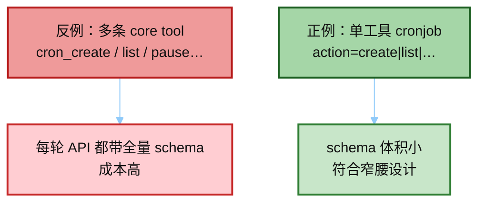
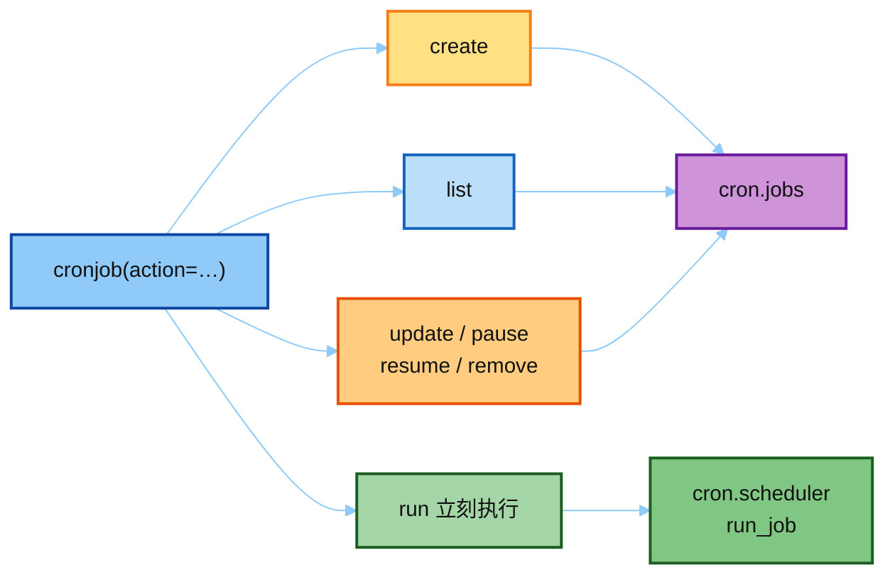
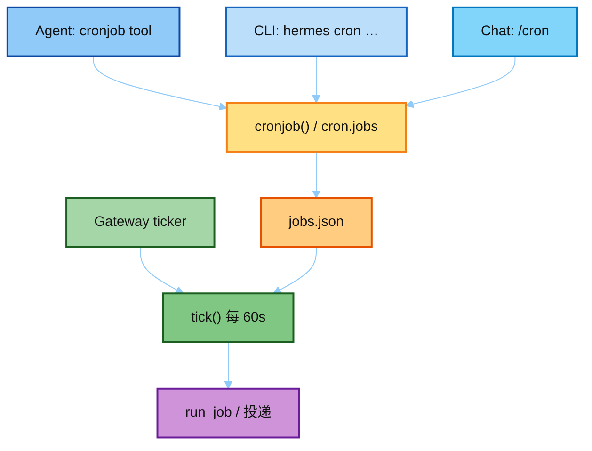
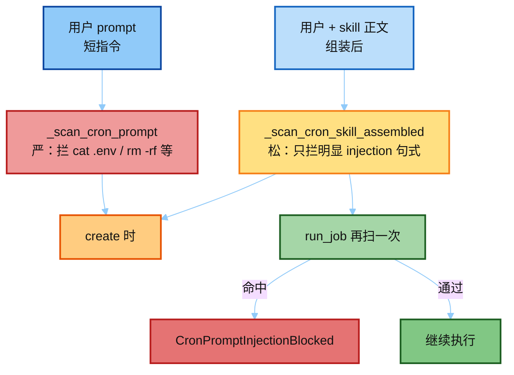
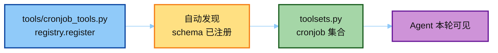

# 03 · cronjob 工具 + CLI（真源码）

> 对照：[`../hermes_src/tools/cronjob_tools.py`](../hermes_src/tools/cronjob_tools.py)  
> CLI 入口（完整仓）：`hermes_cli/cron.py`  
> 下一篇：[`04_hardening_and_delivery.md`](./04_hardening_and_delivery.md)

---

## 一句话

对外只暴露 **一个** 压缩工具 `cronjob(action=…)`，避免每个 CRUD 各占一条 schema（核心工具面要窄）。  
CLI `hermes cron …` 与 slash `/cron` 最终也落到同一套 `cron.jobs` / `cronjob_tools.cronjob`。

**给小白：** Agent、命令行、聊天里的 `/cron`，看起来像三个入口，其实都在操作同一张 `jobs.json`。Gateway 的 ticker 不负责「建任务」，只负责「到点执行」。建任务靠工具 / CLI；执行靠 tick。

---

## 为什么是一个 tool，不是一堆？

Footprint Ladder：每个模型工具都会塞进 **每一次** API 的 tools 列表。  
若做成 `cron_create` / `cron_list` / `cron_pause`… 多条 schema，每轮对话都付钱。  
压缩成 `cronjob(action=…)`：一条 schema，用 `action` 枚举分流。



---

## `action` 面

| action | 作用 |
|--------|------|
| `create` | 需要 `schedule` + `prompt`（或 skill / no_agent+script） |
| `list` | 列作业 |
| `update` / `pause` / `resume` / `remove` | 管理已有 job |
| `run` | 立刻跑一次（claim → `run_job`） |

`required: ["action"]` —— create 时 schema description **强调** `schedule`/`prompt` 必填（模型容易漏字段）。



---

## 三个入口汇合



文字版：

```text
Agent:  cronjob tool  ──┐
CLI:    hermes cron   ──┼──▶ cron.jobs / cron.scheduler
Chat:   /cron         ──┘
Gateway ticker        ──▶ tick() 每 60s
```

`hermes_cli/cron.py` 里 `_cron_api(**kwargs)` 直接 `from tools.cronjob_tools import cronjob`。  
创建/list 时若 builtin 且 gateway 没跑，会 **黄字警告**：「jobs won't fire」（#51038 最常见支持问题）。

**心智拆分：**

| 职责 | 谁做 |
|------|------|
| 建 / 改 / 删 / 列 | `cronjob` 工具 / CLI / `/cron` |
| 到点触发 | gateway ticker（或外部 provider） |
| 真正执行 | `scheduler.run_job` |

---

## Prompt 扫描（两层）

文件头大段注释讲清威胁面：cron job **无人审批**就会自动跑，prompt 注入危害更大。但 skill 正文里常出现「示例危险命令」教学句——一律严扫会误杀。



1. **用户 prompt**（短指令）→ `_scan_cron_prompt`：**严**（含 `cat .env`、`rm -rf /` 等）
2. **组装后 prompt**（用户 + skill 正文）→ `_scan_cron_skill_assembled`：**松**（只拦明显 injection 句式）

原因：skill 里写安全复盘会提到 `cat ~/.hermes/.env`，严扫会误杀（#3968）。

运行时 `run_job` 还会再扫组装结果；命中抛 `CronPromptInjectionBlocked`。  
这是 **create-time + run-time** 的 defense in depth。

---

## 注册

文件末尾 `registry.register(name="cronjob", toolset="cronjob", …)`。  
要进 Agent，还得出现在某个 toolset（`toolsets.py` 的 `cronjob` 集合）——发现 ≠ 暴露。



---

## 面试三句

1. 一个 action 工具压缩 CRUD，省每次 API 的 tool schema 体积。  
2. 写盘在 `jobs.json`；真正 fire 靠 gateway ticker（或外部 provider）。  
3. create-time 扫描 + run-time 扫描是 defense in depth，skill 正文用宽松规则防误杀。
