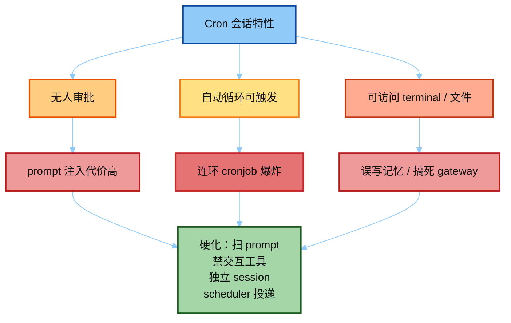
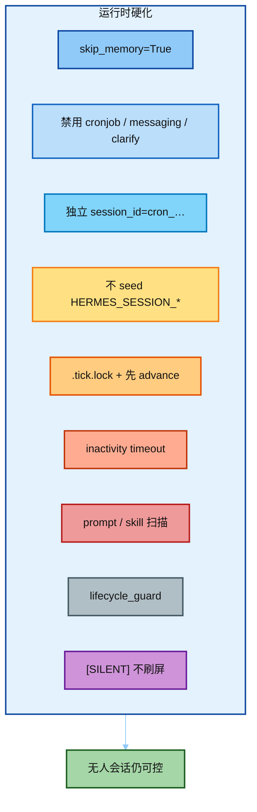
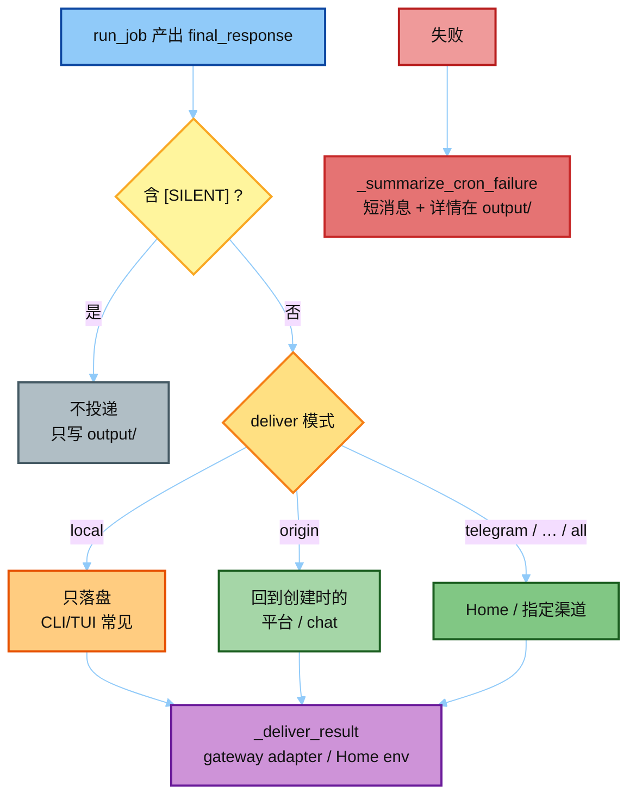
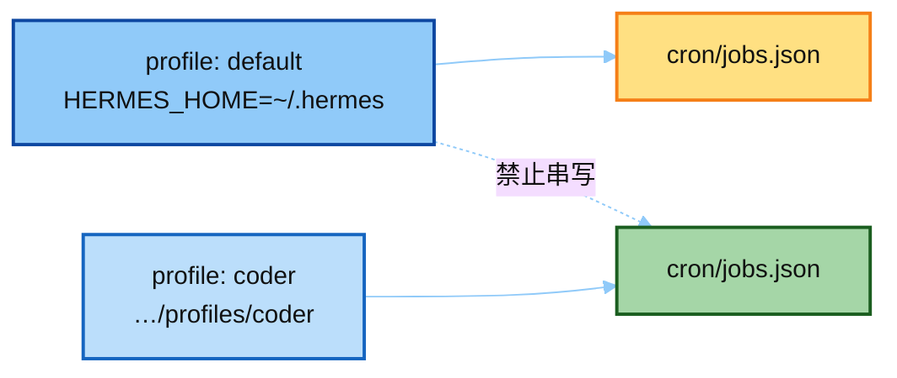
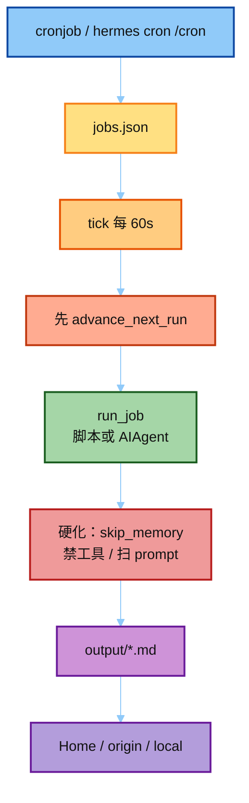

# 04 · Hardening + Delivery（真源码）

> 对照：`scheduler.py` / `jobs.py` / `lifecycle_guard.py`  
> 上一篇：[`03_cronjob_tool.md`](./03_cronjob_tool.md)

---

## 一句话

Cron 是 **无人值守、自动批准** 的 Agent 会话：必须关掉交互工具、跳过 memory、隔离会话、收紧 prompt，并把结果投到 **Home 渠道**，而不是让模型自己调 `send_message`。

**给小白：** 普通聊天时你在旁边，危险操作可以拦；定时任务半夜自己跑，没人点「同意」。所以 Hermes 把 cron 会话做成「受限沙箱」：不能再开新 cron、不能等人回复、不写用户记忆；跑完由调度器把结果推到指定聊天，而不是给模型一把 `send_message`。

---

## 为什么要硬化？（威胁模型）



---

## 硬化清单（对照代码）



| 规则 | 代码位置 | 为什么 |
|------|----------|--------|
| `skip_memory=True` | `run_job` → `AIAgent(...)` | cron SP 会腐蚀用户记忆表示 |
| 禁用 `cronjob` / `messaging` / `clarify` | `_resolve_cron_disabled_toolsets` | 防连环调度、等人回复、interactive 死等 |
| 独立 `session_id=cron_{id}_{ts}` | `run_job` | 不污染主会话 alternation / cache |
| 不 seed `HERMES_SESSION_*` from origin | `run_job` 注释块 | origin 只是投递元数据，不是「真人在聊」 |
| `.tick.lock` + 先 `advance_next_run` | `tick` | 多进程 / 重叠 tick 至多一次 |
| inactivity timeout | `HERMES_CRON_TIMEOUT` 默认 600s | 卡住的 API/tool 可杀；活跃可跑很久 |
| prompt / skill 扫描 | `cronjob_tools` + `CronPromptInjectionBlocked` | 无人审批，注入代价高 |
| `lifecycle_guard` | 禁 gateway 启停命令进 job | 防止 job 把宿主 gateway 弄死 |
| `[SILENT]` | `SILENT_MARKER` | 无新内容不刷屏，本地仍落盘 |

> AGENTS.md 写过「3 分钟硬中断」——以当前源码为准：主闸是 **inactivity** `HERMES_CRON_TIMEOUT`（默认 10 分钟安静），不是墙钟 3 分钟。

---

## 投递（Delivery）

跑完后 **scheduler** 决定要不要推、推到哪——不是模型自己发消息。



文字版：

```text
run_job 产出 final_response
  ├─ 含 [SILENT] → 不投递，只写 output/
  ├─ deliver=local → 只落盘（CLI/TUI origin 常见）
  ├─ deliver=origin → 回到创建时的平台/chat
  └─ deliver=telegram|…|all → Home / 指定渠道
```

要点：

- **不是** Agent 调 messaging tool；是 scheduler 侧 `_deliver_result` 走 gateway adapter / Home env（如 `TELEGRAM_HOME_CHANNEL`）。
- CLI/TUI 创建的 job 默认 local-only：list 能看，**不会**弹回终端（prompt builder 的 `cron` / CLI macro 会教模型别乱承诺）。
- 失败投递会压成一行短消息（`_summarize_cron_failure_for_delivery`），详情在 `cron/output/`。

**为什么禁用 messaging tool？** 若让 cron agent 自己 `send_message`，会绕过 Home 路由、破坏会话隔离，也难做静默契约。投递权收在调度器手里更干净。

---

## Profile 隔离

`jobs.py` 顶部长注释：cron **必须**锚 `get_hermes_home()`，不能锚 default root。  
否则多个 profile 的 job / 密钥 / skills 会串到同一个 `jobs.json`（#4707）。



---

## 端到端复习图

把 01→04 串起来，面试时按这条链讲：



---

## 面试怎么讲

1. **存储**：JSON job 表 + markdown 输出，不是神秘黑盒。  
2. **触发**：gateway 分钟 tick（或 Axis-B 外部 provider），执行路径统一 `run_one_job`。  
3. **安全**：无人会话 → 禁交互工具、skip memory、扫 prompt、独立 session、Home 投递。  
4. **静默契约**：`[SILENT]` / 空 stdout / wakeAgent=false 控制「有没有东西值得推」。
