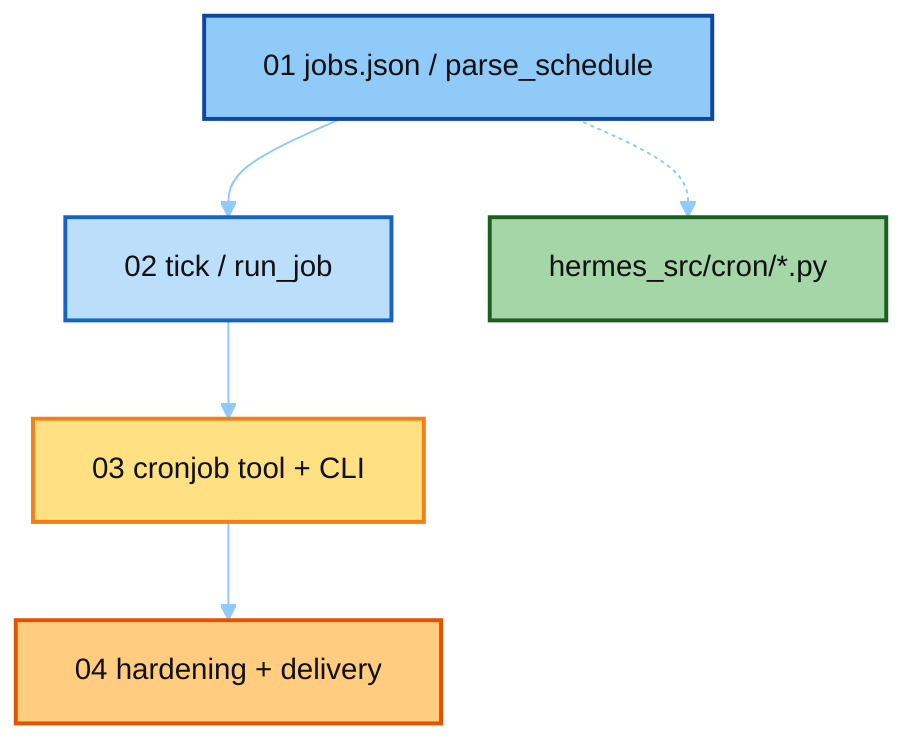

# 06-cron · notes 讲解顺序

本目录讲 **Hermes 真源码** `cron/` + `tools/cronjob_tools.py`。按编号读。

| 顺序 | 文件 | 真源码 | 读完应能回答 |
|------|------|--------|--------------|
| **01** | [`01_job_store.md`](./01_job_store.md) | `jobs.py` | `jobs.json` 存什么？四种 schedule？ |
| **02** | [`02_tick_and_run.md`](./02_tick_and_run.md) | `scheduler.TICK_RUN.py` | tick 锁 / at-most-once / no_agent？ |
| **03** | [`03_cronjob_tool.md`](./03_cronjob_tool.md) | `cronjob_tools.py` | Agent / CLI / `/cron` 怎么进同一套 API？ |
| **04** | [`04_hardening_and_delivery.md`](./04_hardening_and_delivery.md) | scheduler + jobs | 为什么 skip_memory？投递到哪？ |

最短路径：`01` → `02` → `04`，再扫 `03` 看工具面。

上级：[`../README.md`](../README.md)
