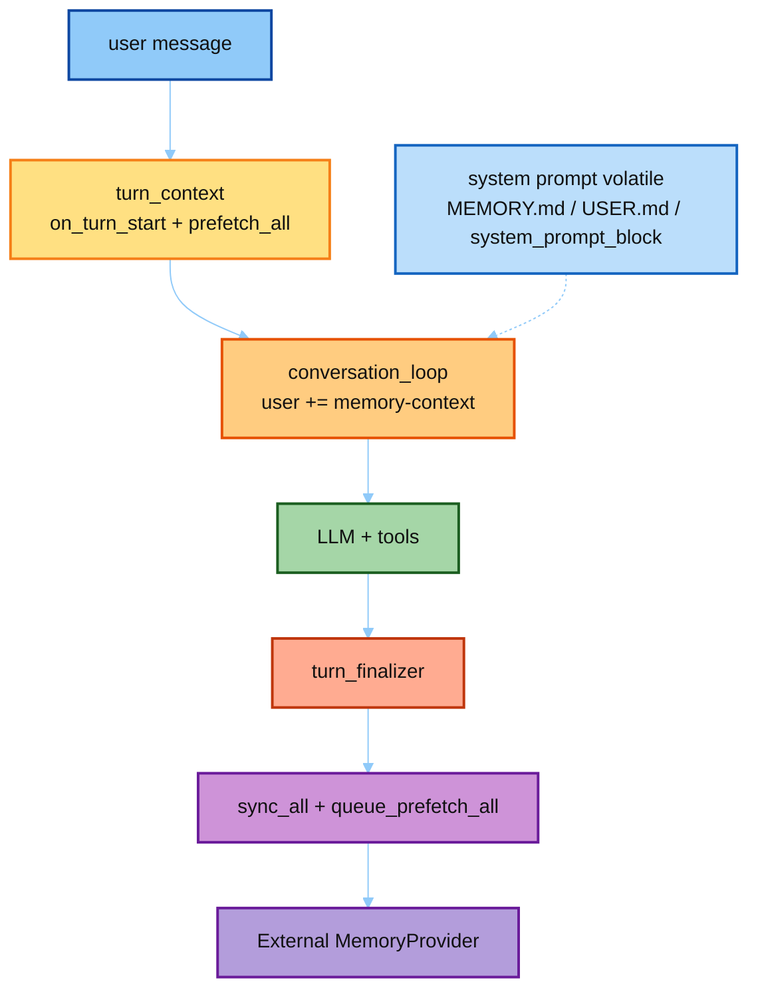

# Hermes Memory Provider（存 / 取 / Prompt）

目标：精读 Hermes **真源码**里外部记忆与内置记忆如何接入 Runtime——  
**一个 turn 结束怎么存**、**对话取上下文怎么 fetch**、**有哪些相关 prompt**。

对照大纲：[`../03-hermes Agent  学习大纲.md`](../03-hermes%20Agent%20%20学习大纲.md) **模块一**；广谱 notebook 见 [`../01-memory/`](../01-memory/)。  
本目录结构对齐 [`../05-env/`](../05-env/)：`hermes_src/` + `demo/`，聚焦 **Provider 接线**。

学法（与 [`hermes_src/README.md`](./hermes_src/README.md) 同一条主线）：

1. 打开 [`hermes_src/README.md`](./hermes_src/README.md)，按 **①→⑥** 对照真文件 / excerpts  
2. 精读 notes：[`01_provider_abc`](./hermes_src/notes/01_provider_abc.md) → [`02_memory_manager`](./hermes_src/notes/02_memory_manager.md) → [`03_excerpts_lecture`](./hermes_src/notes/03_excerpts_lecture.md)（③–⑥ 一份讲稿）  
3. 跑 [`demo/run_mem_provider.py`](./demo/run_mem_provider.py)  
4. Prompt 全文可到 [`../04-prompt/`](../04-prompt/) 对照  

> `hermes_src/` 只读剪枝，勿直接 import 跑。Demo 走完整 `hermes-agent`。

---

## 讲解顺序


| 顺序 | 材料 | 打开的真文件 | 读完应能回答 |
|------|------|--------------|--------------|
| **①** | [`notes/01_provider_abc.md`](./hermes_src/notes/01_provider_abc.md) | `memory_provider.py` | 三个进对话口？哪些是 abstract？ |
| **②** | [`notes/02_memory_manager.md`](./hermes_src/notes/02_memory_manager.md) | `memory_manager.py` | 注册 / 扇出 / 围栏 / session 边界？ |
| **③–⑥** | [`notes/03_excerpts_lecture.md`](./hermes_src/notes/03_excerpts_lecture.md) ★ | 七个 excerpts 串讲 | 取→注入→存→Prompt 一条线？ |
| **③** | `hermes_src` §③ | `01_turn_context.PREFETCH.py` | turn 开头何时取？ |
| **④** | `hermes_src` §④ | `02_conversation_loop.INJECT.py` | fetch 结果塞进 SP 还是 user？ |
| **⑤** | `hermes_src` §⑤ | `turn_finalizer` + `SYNC_HELPER` | turn 结束写什么？interrupted 呢？ |
| **⑥** | `hermes_src` §⑥ | `MEMORY_GUIDANCE` / VOLATILE / REVIEW | 有哪些相关 prompt？各自何时出现？ |
| **⑦** | [`demo/`](./demo/README.md) | 真 Mem0 OSS | 围栏与 `mem0_search` 是否对得上？ |

赶时间（只答「存 / 取 / prompt」）：直接开 [`03_excerpts_lecture.md`](./hermes_src/notes/03_excerpts_lecture.md)，再补 ①②。

---

## 在 Runtime 里的位置



一句话：**取** = SP 静态 snapshot + user 上动态 prefetch；**存** = memory 工具 / `sync_turn` / 后台 MEMORY_REVIEW。

---

## 目录

```text
07-mem-provider/
├── README.md                          # 本文件（讲解顺序入口）
├── hermes_src/                        # ★ 真源码剪枝（只读对照）
│   ├── README.md                      # ★ ①→⑥ 逐步精读
│   ├── notes/
│   │   ├── 01_provider_abc.md         # ★ ① ABC 精读
│   │   ├── 02_memory_manager.md       # ★ ② Manager 精读
│   │   └── 03_excerpts_lecture.md     # ★ ③–⑥ excerpts 一份讲稿
│   ├── agent/
│   │   ├── memory_provider.py
│   │   └── memory_manager.py
│   ├── tools/memory_tool.py
│   └── excerpts/                      # turn / inject / sync / prompts
└── demo/                              # ★ 可跑：真 MemoryManager + Mem0 OSS
    ├── README.md
    ├── run_mem_provider.py
    ├── mem0_demo/
    └── exports/mem_provider/
```

关联：

- 广谱 Memory：[`../01-memory/`](../01-memory/)  
- Prompt 宏：[`../04-prompt/catalog/01_prompt_builder_macros.md`](../04-prompt/catalog/01_prompt_builder_macros.md)  
- 后台 review：[`../04-prompt/catalog/07_background_review.md`](../04-prompt/catalog/07_background_review.md)  
- Cron 为何 `skip_memory`：[`../06-cron/`](../06-cron/)  

---

## 动手

1. 跑 [`demo/`](./demo/README.md)（真 `Mem0MemoryProvider` OSS），对照 fenced user 与 `mem0_search`。  
2. 真 Hermes：对 `prefetch_all`、`build_memory_context_block`、`_sync_external_memory_for_turn` 打断点。  
3. 面试三句：prefetch→user 保 cache；sync 异步且跳过 interrupt；写受 `MEMORY_GUIDANCE` 约束。
