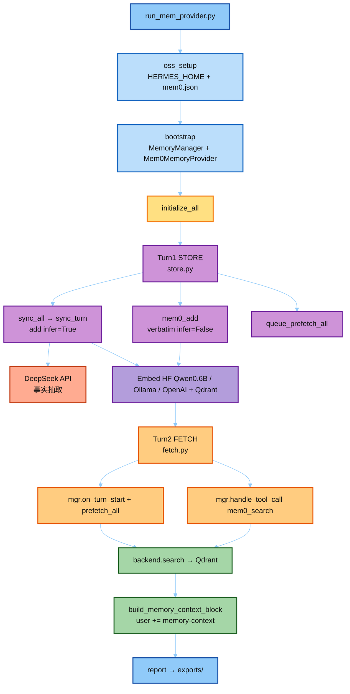

# Mem-Provider Demo · 真 MemoryManager + Mem0 OSS（DeepSeek API）

**不改 Hermes 源码。** 真 `MemoryManager` + 真 `Mem0MemoryProvider`（`mode: oss`）。

- **LLM**：DeepSeek API（`provider: deepseek`）
- **Embed**：默认本地 **`Qwen/Qwen3-Embedding-0.6B`**（HuggingFace / sentence-transformers）；也可 Ollama / OpenAI
- **向量**：本地 Qdrant 路径

流程：**sync_turn（存）→ prefetch / mem0_search（取）→ `<memory-context>` 围栏**

对照：[`../notes/02_prefetch_and_inject.md`](../notes/02_prefetch_and_inject.md)、[`../notes/03_sync_turn_store.md`](../notes/03_sync_turn_store.md)。

---

## 逻辑图



一句话：**存** = DeepSeek 抽事实 + 本地/云端 Embed 写入 Qdrant；**取** = search → 围栏注入 user。

---

## Call flow（text）

```text
run_mem_provider.main()
│
├─ 1. oss_setup.prepare_hermes_home()
│     HERMES_HOME = demo/.hermes_demo/
│     mem0.json = {
│       mode: oss,
│       llm:      deepseek  （api_key 不落盘，读 DEEPSEEK_API_KEY）
│       embedder: huggingface Qwen3-Embedding-0.6B（默认）/ ollama / openai
│       vector:   qdrant    → .hermes_demo/mem0_qdrant/
│     }
│     secrets ← os.environ 或 demo/.env
│
├─ 2. bootstrap.import_mem0_stack(hermes-agent)
│     sys.path ← hermes-agent/
│     stub plugins.memory（跳过 yaml 副作用）
│     from agent.memory_manager import MemoryManager, build_memory_context_block
│     from plugins.memory.mem0 import Mem0MemoryProvider
│
├─ 3. mgr.add_provider(mem0) → initialize_all(session)
│     Mem0MemoryProvider → OSSBackend → mem0.Memory.from_config
│
├─ 4. STORE  store.run_store_turn()                    ★ 讲解：存
│     # = AIAgent._sync_external_memory_for_turn
│     mgr.sync_all(user, asst, session_id=...)
│       └─ MemoryManager 后台线程
│            └─ Mem0MemoryProvider.sync_turn
│                 └─ backend.add(..., infer=True)
│                      ├─ DeepSeek：抽事实
│                      └─ Embed + Qdrant：写入
│     mgr.queue_prefetch_all(user, session_id=...)     # 同 helper 第二步
│     mgr.handle_tool_call("mem0_add", ...)            # verbatim 保底（经 manager 路由）
│       └─ backend.add(..., infer=False) → Embed + Qdrant
│
├─ 5. FETCH  fetch.run_fetch_turn()                    ★ 讲解：取
│     # = turn_context prologue
│     mgr.on_turn_start(turn, query)                   # Mem0 → _start_prefetch
│     raw = mgr.prefetch_all(query, session_id=...)
│       └─ Mem0MemoryProvider.prefetch → backend.search → Qdrant
│     search = mgr.handle_tool_call("mem0_search", ...)  # 工具兜底
│     fenced = build_memory_context_block(raw)         # = conversation_loop
│     api_user = user + "\n\n" + fenced                # <memory-context>（不写 session）
│     sp = mgr.build_system_prompt()                   # provider 静态块（非 prefetch）
│     mgr.queue_prefetch_all(query)                    # 为下一轮排队
│
└─ 6. report.write_exports() → exports/mem_provider/
      00_raw.json · 01_report.md
```

对齐 Runtime（真 Hermes）：

```text
turn_start  → MemoryManager.on_turn_start + prefetch_all → user += <memory-context>
LLM + tools → MemoryManager.handle_tool_call(mem0_*)
turn_end    → sync_all + queue_prefetch_all   # run_agent._sync_external_memory_for_turn
```

### 与源码对齐 / 刻意差异

| 项 | 状态 |
|----|------|
| `MemoryManager` + `Mem0MemoryProvider` + `OSSBackend` | ✅ 真 import |
| `initialize_all` / `sync_all` / `prefetch_all` / `queue_prefetch_all` | ✅ |
| `on_turn_start` 走 **manager**（非直接打 provider） | ✅ |
| 工具走 `mgr.handle_tool_call` | ✅ |
| `build_memory_context_block` 注入 **user**（不进 SP） | ✅ |
| 两轮拆成 STORE / FETCH 便于讲解 | 刻意（真 runtime 同一会话交错） |
| `mem0_add` verbatim 种子 | 刻意（演示兜底，非每轮必有） |
| DeepSeek LLM + OpenAI embed | 刻意（Hermes 默认 OSS 常配 Ollama；配置仍走 `mem0.json` oss 块） |
| Mem0 未 override `queue_prefetch` | 源码事实：end-of-turn `queue_prefetch_all` 对 Mem0 是 no-op；暖场靠 `on_turn_start` → `_start_prefetch` |

---

## 讲解用文件拆分

```text
demo/
├── run_mem_provider.py          # ★ 入口 + 编排
├── requirements.txt
├── mem0_demo/
│   ├── paths.py                 # 01 路径 / 隔离 HERMES_HOME
│   ├── bootstrap.py             # 02 找 hermes-agent、依赖、import 桩
│   ├── oss_setup.py             # 03 写 mem0.json（DeepSeek + embed）
│   ├── store.py                 # 04 ★ 存：sync_all + queue_prefetch + mem0_add
│   ├── fetch.py                 # 05 ★ 取：on_turn_start + prefetch + 围栏 + search
│   └── report.py                # 06 写 exports/
└── exports/mem_provider/
```

隔离目录：`demo/.hermes_demo/`（**不写** `~/.hermes`）。

| 讲 | 文件 | 对应真源码 |
|----|------|------------|
| 存 | `store.py` | `_sync_external_memory_for_turn` → `sync_all` + `queue_prefetch_all` |
| 取 | `fetch.py` | `turn_context` prologue + `conversation_loop` 围栏注入 |
| 配置 | `oss_setup.py` | `$HERMES_HOME/mem0.json` + `OSSBackend` |

---

## 前置

1. **Python ≥ 3.10**（`mem0ai>=2.0.10` 要求）
2. **`demo/.env`** 写入 DeepSeek Key（不要提交进 git）：

```text
DEEPSEEK_API_KEY=sk-...
```

3. **Embed 二选一**（PowerShell 推荐 A，几分钟内可跑通）：

| 方案 | 需要 | 说明 |
|------|------|------|
| **A. Ollama（推荐）** | 本机 Ollama + `nomic-embed-text` | 不装 torch / sentence-transformers |
| B. HuggingFace | `sentence-transformers` + 下载 Qwen0.6B | 首次很慢；Store Python 易因路径过长装坏 torch |
| C. OpenAI | `OPENAI_API_KEY` | 云端 embed |

```powershell
# A：确认 Ollama
ollama list
# 若没有 nomic-embed-text：
# ollama pull nomic-embed-text
```

---

## 跑法（推荐 PowerShell + Ollama）

短路径 venv，避免 Windows Store Python 超长路径把 torch 装坏；Ollama 路径**不要**装 `sentence-transformers`。

```powershell
# —— 一次性：建 venv + 轻量依赖 ——
python -m venv D:\tmp\mem0venv
D:\tmp\mem0venv\Scripts\Activate.ps1
# 若无法激活脚本：
#   Set-ExecutionPolicy -Scope CurrentUser RemoteSigned

python -m pip install -U pip
python -m pip install "mem0ai>=2.0.10,<3" "qdrant-client>=1.9,<2" "openai>=1.0,<3" "ollama>=0.3,<1"

# —— 每次运行 ——
cd "D:\workspace\doc\面试狂魔\人工智能面试题\AI_coding_interview\08-hermes-agent\07-mem-provider\demo"
D:\tmp\mem0venv\Scripts\Activate.ps1
$env:MEM0_DEMO_EMBED_PROVIDER = "ollama"
python run_mem_provider.py
```

产物：`exports/mem_provider/01_report.md`、`00_raw.json`。  
运行会重写 `demo/.hermes_demo/mem0.json`（LLM=deepseek API，embed=ollama/`nomic-embed-text`）。

### 可选：HuggingFace Qwen0.6B

```powershell
# 仍建议短路径 venv；会额外装 torch，耗时长
python -m pip install -r requirements.txt
$env:MEM0_DEMO_EMBED_PROVIDER = "huggingface"
python run_mem_provider.py
```

> WSL 系统 `python3` 受 PEP 668 限制：请用 `python3 -m venv .venv` 再激活，或直接用上面的 Windows 步骤。  
> 换 embed 维数（如 768→1024）时，`OSSBackend` 会重建 Qdrant collection。
---

## 环境变量

| 变量 | 含义 |
|------|------|
| `DEEPSEEK_API_KEY` | DeepSeek LLM（必填） |
| `DEEPSEEK_API_BASE` | 默认 `https://api.deepseek.com` |
| `MEM0_DEMO_EMBED_PROVIDER` | `auto`（默认→hf）/ `huggingface` / `ollama` / `openai` |
| `MEM0_DEMO_EMBED_MODEL` | hf 默认 `Qwen/Qwen3-Embedding-0.6B` |
| `MEM0_DEMO_EMBED_DIMS` | hf 默认 `1024`；ollama `768`；openai `1536` |
| `MEM0_DEMO_OLLAMA_URL` / `OLLAMA_HOST` | Ollama 时用，默认 `http://localhost:11434` |
| `OPENAI_API_KEY` / `MEM0_DEMO_EMBED_API_KEY` | 仅云端 embed |
| `MEM0_DEMO_EMBED_BASE_URL` | OpenAI 兼容网关（可选） |
| `MEM0_DEMO_LLM_MODEL` | 默认 `deepseek-chat` |
| `HERMES_AGENT_ROOT` | hermes-agent 根目录 |
