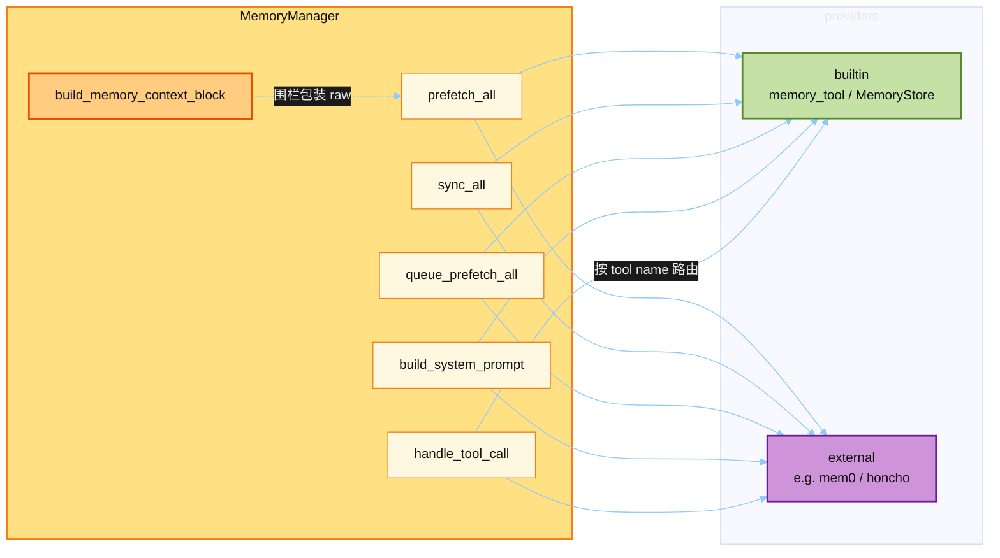
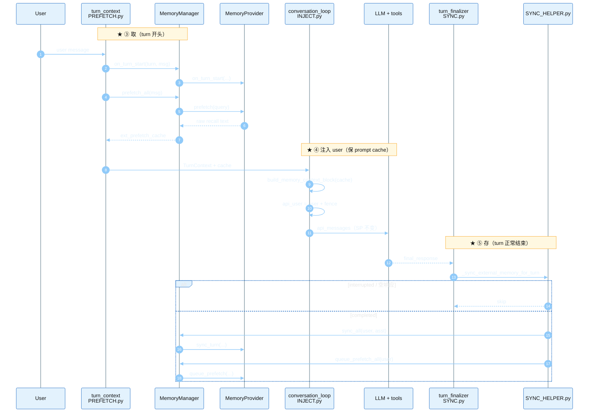
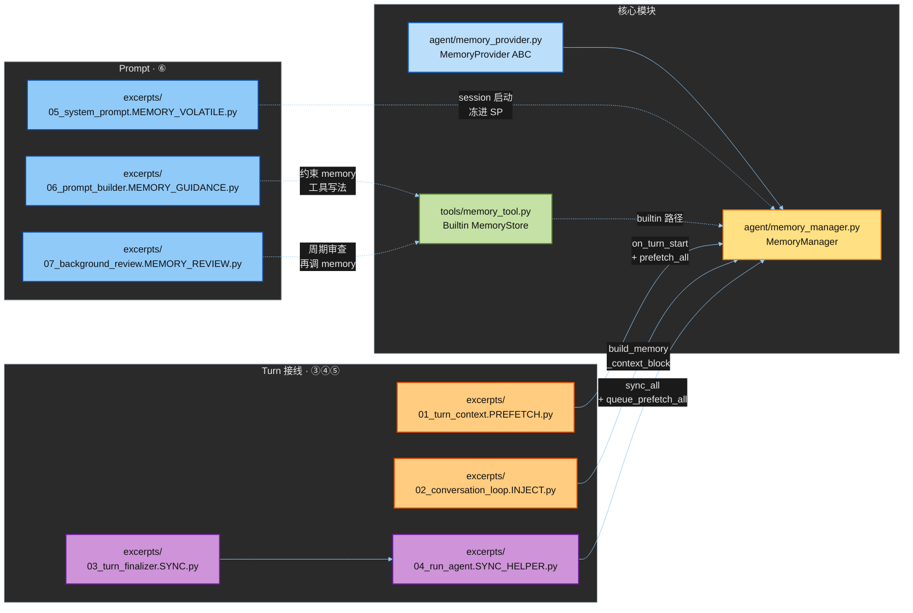
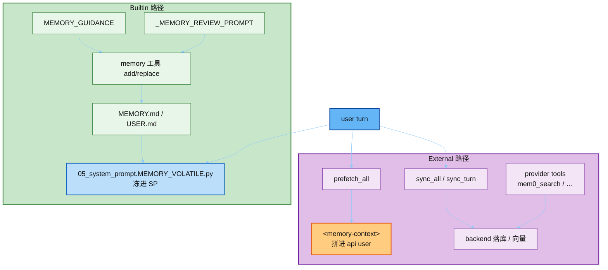

# hermes_src — Mem0 / Memory Provider 真源码剪枝

本目录从 Hermes 拷贝 **真实** memory 相关实现，方便对照讲稿。  
缺 gateway / plugin 后端等依赖，**不要在这里直接 import 跑**。

---

## 讲解顺序（按这个走）

一条主线：**契约 → 编排 → 取 → 注入 → 存 → Prompt**。  
颜色约定贯穿下文：**蓝 = 契约/SP**，**黄 = Manager**，**橙 = 取/注入**，**紫 = 存**，**绿 = Builtin**。

```mermaid
%%{init: {"theme":"base","themeVariables":{"primaryTextColor":"#E8E8E8","secondaryTextColor":"#E8E8E8","tertiaryTextColor":"#E8E8E8","lineColor":"#90CAF9","edgeLabelBackground":"#1a1a1a","fontSize":"15px"}}}%%
flowchart LR
    S1["① ABC<br/>memory_provider.py"] --> S2["② Manager<br/>memory_manager.py"]
    S2 --> S3["③ 取<br/>PREFETCH"]
    S3 --> S4["④ 注入<br/>INJECT"]
    S4 --> S5["⑤ 存<br/>SYNC + HELPER"]
    S5 --> S6["⑥ Prompt<br/>VOLATILE / GUIDANCE / REVIEW"]

    style S1 fill:#BBDEFB,stroke:#1565C0,stroke-width:2px,color:#111111
    style S2 fill:#FFE082,stroke:#F57F17,stroke-width:2px,color:#111111
    style S3 fill:#FFCC80,stroke:#E65100,stroke-width:2px,color:#111111
    style S4 fill:#FFCC80,stroke:#E65100,stroke-width:2px,color:#111111
    style S5 fill:#CE93D8,stroke:#6A1B9A,stroke-width:2px,color:#111111
    style S6 fill:#90CAF9,stroke:#0D47A1,stroke-width:2px,color:#111111
```

| 步 | 打开 | 读完应能回答 |
|----|------|--------------|
| **①** | `agent/memory_provider.py` + [`notes/01_provider_abc.md`](./notes/01_provider_abc.md) | `prefetch` / `sync_turn` / `system_prompt_block` 各管什么？ |
| **②** | `agent/memory_manager.py` + [`notes/02_memory_manager.md`](./notes/02_memory_manager.md) | 为何至多一个 external？围栏谁包？ |
| **③** | `excerpts/01_turn_context.PREFETCH.py` | turn 开头何时 `prefetch_all`？ |
| **④** | `excerpts/02_conversation_loop.INJECT.py` | 召回塞进 SP 还是 user？为何？ |
| **⑤** | `excerpts/03_turn_finalizer.SYNC.py` + `04_run_agent.SYNC_HELPER.py` | 正常结束写什么？interrupted 呢？ |
| **⑥** | `05_system_prompt.MEMORY_VOLATILE.py` + `MEMORY_GUIDANCE` + `MEMORY_REVIEW` | 哪些是 session 冻进 SP，哪些约束工具写法？ |

③–⑥ 合订讲稿（台上只开一份）：[`notes/03_excerpts_lecture.md`](./notes/03_excerpts_lecture.md)。  
赶时间：只答「存 / 取 / prompt」→ **③ → ④ → ⑤ → ⑥**（或直接开讲稿）。  
动手跑通：[`../demo/`](../demo/README.md)。

---

## ① 契约 · MemoryProvider ABC

文件：`agent/memory_provider.py`（精读见 [`notes/01_provider_abc.md`](./notes/01_provider_abc.md)）

抓住三个钩子即可：

| 钩子 | 时机 | 进哪 |
|------|------|------|
| `system_prompt_block()` | session 启动 | SP（静态，保 cache） |
| `prefetch(query)` | 每 turn 开头 | **不进 SP**，交给 Manager 围栏 |
| `sync_turn(...)` | 每 turn 正常结束 | 异步落库 |

---

## ② 编排 · MemoryManager

文件：`agent/memory_manager.py`（精读见 [`notes/02_memory_manager.md`](./notes/02_memory_manager.md)）

一句话：ABC 定义契约 → Manager 扇出 → turn 三处接线（取 / 注入 / 存）。

**一个 builtin + 至多一个 external**；失败互不影响。

---

## ③④⑤ 一个 Turn：取 → 注入 → 存

对照 excerpts 读：**橙 = 取 / 注入**，**紫 = 存**。SP 静态块是 session 级，不在每 turn 改。

---

## 文件如何拼进 Runtime

读完 ①–⑤ 后再看这张总图：三列分别是核心模块、Turn 接线、Prompt。

| 路径 | 用途 |
|------|------|
| `agent/memory_provider.py` | ★ ABC：`prefetch` / `sync_turn` / `system_prompt_block` |
| `agent/memory_manager.py` | ★ 编排：单外部、`prefetch_all` / `sync_all`、围栏 |
| `tools/memory_tool.py` | 内置 `MemoryStore`（MEMORY.md / USER.md）+ `memory` 工具 |
| `excerpts/01_turn_context.PREFETCH.py` | ③ turn 开始：`on_turn_start` → `prefetch_all` |
| `excerpts/02_conversation_loop.INJECT.py` | ④ API 前：prefetch 注入 **user**（不改 SP） |
| `excerpts/03_turn_finalizer.SYNC.py` | ⑤ turn 结束：调 `_sync_external_memory_for_turn` |
| `excerpts/04_run_agent.SYNC_HELPER.py` | ⑤ `sync_all` + `queue_prefetch_all`（跳过 interrupted） |
| `excerpts/05_system_prompt.MEMORY_VOLATILE.py` | ⑥ SP volatile：builtin md + `build_system_prompt()` |
| `excerpts/06_prompt_builder.MEMORY_GUIDANCE.py` | ⑥ ★ `MEMORY_GUIDANCE` 宏 |
| `excerpts/07_background_review.MEMORY_REVIEW.py` | ⑥ ★ `_MEMORY_REVIEW_PROMPT` |

---

## ⑥ Prompt + 两条记忆路径

| | Builtin（`memory_tool.py`） | External（Provider） |
|--|---------------------------|----------------------|
| **取** | Session 启动冻进 SP volatile | 每 turn `prefetch` → user 围栏 |
| **存** | 模型显式调 `memory` 工具 / MEMORY_REVIEW | turn 末 `sync_turn`（异步） |
| **对 cache** | SP 会话内稳定 | 故意不碰 SP |

---

上游：

- https://github.com/NousResearch/hermes-agent/blob/main/agent/memory_provider.py
- https://github.com/NousResearch/hermes-agent/blob/main/agent/memory_manager.py

上级：[`../README.md`](../README.md)。  
更广的 Memory 教材：[`../../01-memory/`](../../01-memory/)。  
Prompt 目录对照：[`../../04-prompt/`](../../04-prompt/)。
