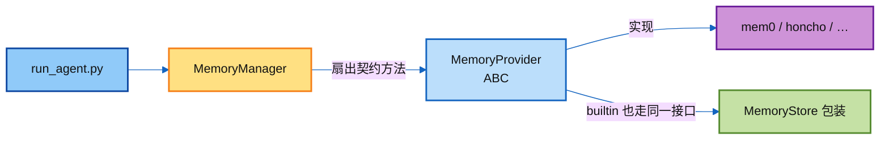
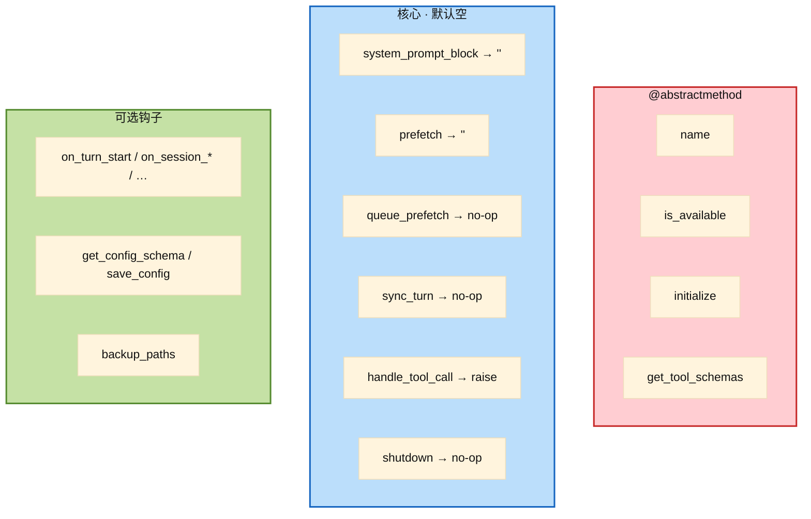
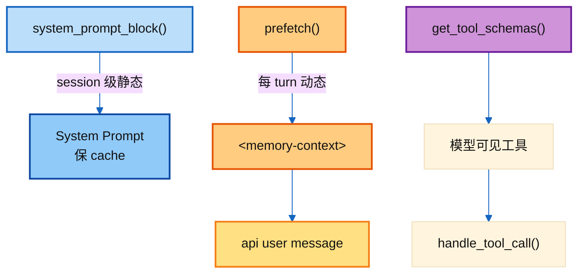
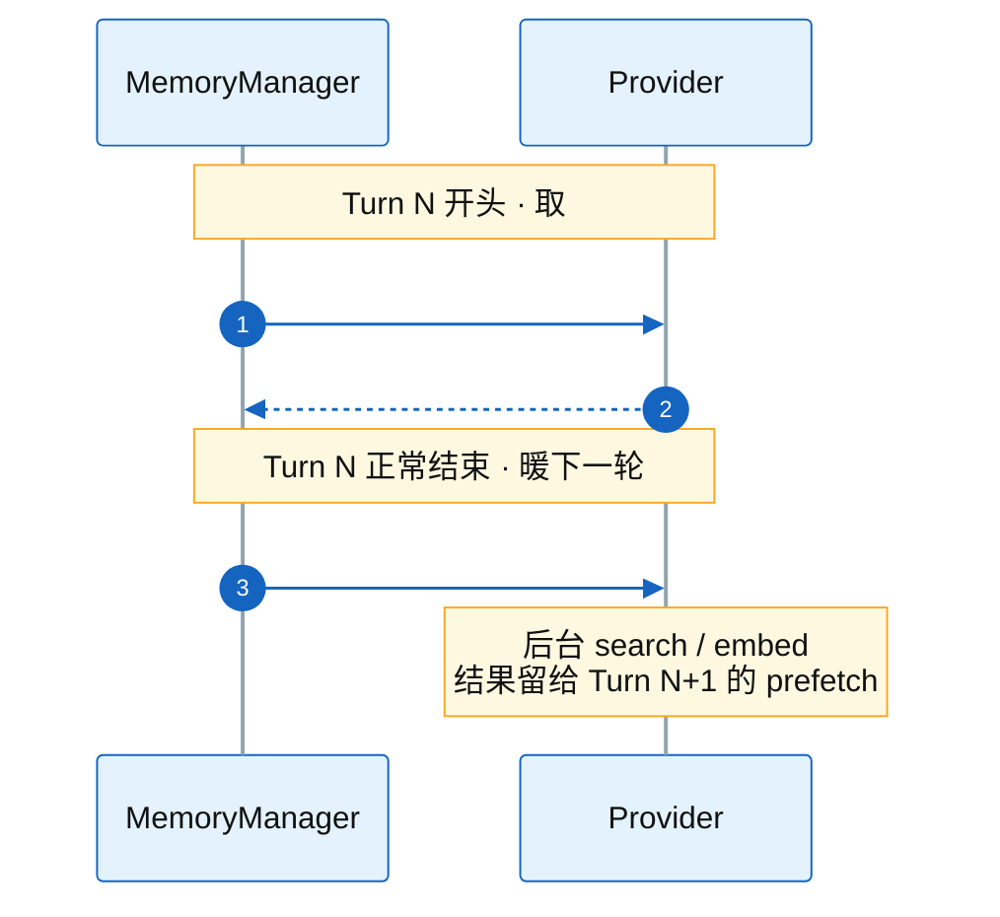
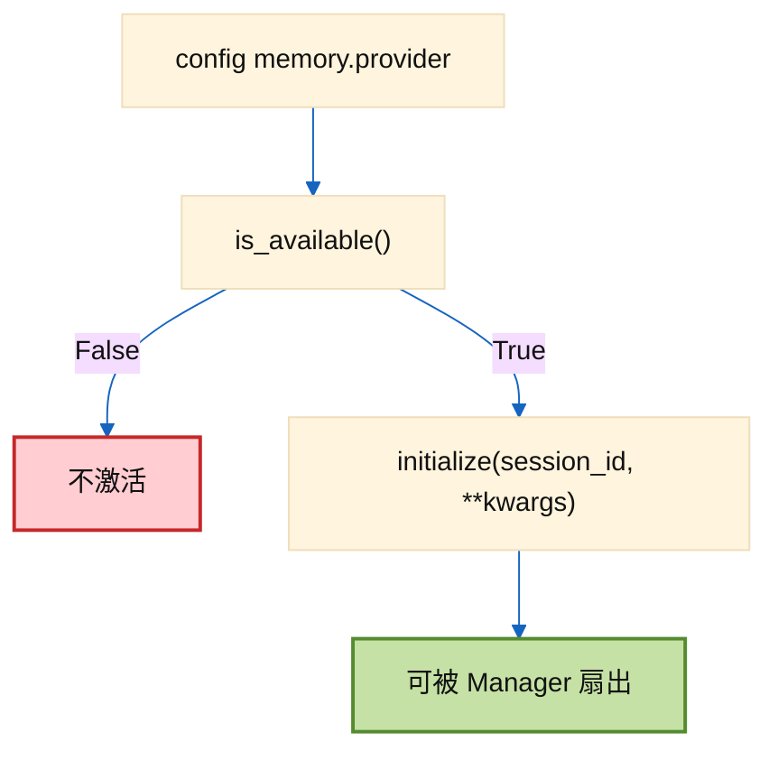
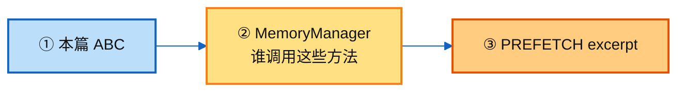

# ① · MemoryProvider ABC 精读

> 讲解顺序：[`../README.md`](../README.md) **①→⑥**（本篇 = **①**）  
> 对照源码：[`../agent/memory_provider.py`](../agent/memory_provider.py)  
> 下一跳 ② Manager：[`02_memory_manager.md`](./02_memory_manager.md)

---

## 1. 一句话

`MemoryProvider` 是外部记忆后端的**契约**：只回答「怎么取 / 怎么存 / 暴露哪些工具」，**不碰** Runtime 主循环。  
谁在何时调用，全部由 `MemoryManager` 决定。

---

## 2. 它在 Runtime 里站哪



文件头注释就是生命周期提纲：

```text
initialize()            # 连后端、建资源
system_prompt_block()   # 静态说明进 SP
prefetch(query)         # turn 前召回
sync_turn(user, asst)   # turn 后异步写入
get_tool_schemas()      # 暴露给模型的工具
handle_tool_call()      # 工具分发
shutdown()              # 退出清理
```

可选钩子（默认空实现，按需 override）：`on_turn_start` / `on_session_end` / `on_session_switch` / `on_pre_compress` / `on_memory_write` / `on_delegation` / `backup_paths`。

---

## 3. 必须实现 vs 默认空实现

读 ABC 时先分清「必须写」和「可跳过」：

| 类别 | 方法 | 默认 |
|------|------|------|
| **抽象 · 必写** | `name` / `is_available` / `initialize` / `get_tool_schemas` | — |
| **核心 · 有默认** | `system_prompt_block` / `prefetch` / `queue_prefetch` / `sync_turn` / `handle_tool_call` / `shutdown` | `""` / no-op / `NotImplementedError` |
| **可选钩子** | `on_*` / `get_config_schema` / `save_config` / `backup_paths` | 空 / `[]` |



**为什么 `prefetch` / `sync_turn` 不是 abstract？**  
允许「只读上下文、不写」或「只写不召回」的 provider；缺省返回空 / no-op，Manager 扇出时跳过即可。

---

## 4. 三个进对话的口：SP / prefetch / tools

这是整份契约最重要的分流——**进哪，决定能不能碰 prompt cache**。

| 方法 | 时机 | 进哪 | 内容性质 |
|------|------|------|----------|
| `system_prompt_block()` | session 启动组装 SP | **SP**（会话内冻住） | 静态说明、状态、用法 |
| `prefetch(query)` | 每 turn API 前 | **不进 SP**；Manager 围栏后拼进 **user** | 动态召回 |
| `get_tool_schemas()` + `handle_tool_call` | 模型主动调 | tool message | 结构化查询 / 写入 |



源码注释写得很死：

> Prefetched recall context is injected separately via `prefetch()`.  
> `system_prompt_block` is for **STATIC** provider info.

把动态召回塞进 `system_prompt_block` = **每 turn 改 SP** = 打断 prompt cache。这是实现 provider 时最容易踩的坑。

---

## 5. 取：`prefetch` + `queue_prefetch`

```text
prefetch(query, *, session_id="") -> str
queue_prefetch(query, *, session_id="") -> None
```

契约意图：

1. **`prefetch` 要快** — 最好返回上一轮 `queue_prefetch` 暖好的缓存；慢 IO 放后台。  
2. **`queue_prefetch` 在 turn 结束后**被 Manager 调用，为**下一轮**预热。  
3. `session_id` 给 gateway 多会话用；单会话 provider 可忽略。



返回空字符串 =「这轮没什么可注入」——合法，不是错误。

---

## 6. 存：`sync_turn`

```text
sync_turn(user_content, assistant_content, *, session_id="", messages=None) -> None
```

| 约定 | 含义 |
|------|------|
| **非阻塞** | 有延迟就丢后台队列；别卡主循环 |
| `messages` | 完整 OpenAI 风格消息（含 tool_calls / tool results）；不需要可忽略 |
| 谁负责跳过 interrupted | **上层**（`SYNC_HELPER`），不是 provider 自己判 |

Provider 不应假设「每次 `sync_turn` 都是用户满意的完整对话」——那是 Runtime 过滤后的结果。

---

## 7. 启动：`is_available` + `initialize`



`is_available` 硬规则（docstring）：

- **不要发网络请求** — 只查 config / 依赖是否安装。  
- 返回 False → 整条外部记忆链路不挂上。

`initialize` 的 kwargs 约定：

| kwargs | 含义 | 实现时注意 |
|--------|------|------------|
| `hermes_home` | 当前 profile 的 HERMES_HOME | **禁止**硬编码 `~/.hermes` |
| `platform` | `cli` / `telegram` / … | — |
| `agent_context` | `primary` / `subagent` / `cron` / `flush` | 非 `primary` 应**跳过写入**（cron 系统提示会污染用户画像） |
| `agent_identity` | profile 名 | 多 profile 隔离 |
| `parent_session_id` | 子代理父会话 | — |
| `user_id` / `user_id_alt` | gateway 用户标识 | — |

---

## 8. 工具：`get_tool_schemas` + `handle_tool_call`

```text
get_tool_schemas() -> List[Dict]   # OpenAI function 格式
handle_tool_call(tool_name, args, **kwargs) -> str  # 必须 JSON 字符串
```

- 无工具（纯上下文）→ 返回 `[]`。  
- 默认 `handle_tool_call` 直接 `raise NotImplementedError`——声明了 schema 就必须 override。  
- 工具名会被 Manager 登记；**不能 shadow 核心工具名**（那是 Manager 侧规则，见 ②）。

---

## 9. 可选钩子速查

| 钩子 | 何时 | 典型用途 |
|------|------|----------|
| `on_turn_start(turn, message, **kwargs)` | 每 turn 开头 | 计数、scope、周期性维护 |
| `on_session_end(messages)` | 真会话结束（exit / `/reset` / 过期） | 抽取事实、摘要；**不是每 turn** |
| `on_session_switch(new_id, …)` | `/resume` `/branch` `/new` / 压缩换 id | 更新内部 `_session_id`、清空 buffer |
| `on_pre_compress(messages) -> str` | 压缩丢弃旧消息前 | 抽出洞见；返回值可并进压缩 summary prompt |
| `on_delegation(task, result, …)` | **父**代理收到子代理结果 | 子代理本身 `skip_memory=True` |
| `on_memory_write(action, target, content, …)` | 内置 `memory` 工具**写成功**后 | 镜像到外部后端 |
| `get_config_schema` / `save_config` | `hermes memory setup` | 交互式配置；secret 进 `.env` |
| `backup_paths() -> list[str]` | `hermes backup` | 声明 HERMES_HOME **之外**的状态路径 |

`on_session_switch` 三个布尔要分清：

| 参数 | 含义 |
|------|------|
| `reset=True` | 全新对话（`/new` `/reset`）→ 清空 per-session buffer |
| `reset=False` | `/resume` `/branch` / 压缩 → 逻辑对话延续，只换 id |
| `rewound=True` | id 没变但 transcript 被截断 → 作废按 turn 缓存的文档状态 |

---

## 10. Builtin vs External（同一 ABC）

| | Builtin | External（本 ABC 的主要消费者） |
|--|---------|--------------------------------|
| `name` | `"builtin"` | `"mem0"` / `"honcho"` / … |
| 取 | 多靠 SP 里冻住的 MEMORY.md | 每 turn `prefetch` |
| 存 | 模型调 `memory` 工具 | `sync_turn` + 可选自有 tools |
| 数量 | 始终可有 | Manager **只允许一个** |

实现外部 provider 时记住：builtin 写成功会经 Manager 调你的 `on_memory_write`——用来镜像，不是让你再写一遍 MEMORY.md。

---

## 11. 实现清单（写一个新 provider 时）

1. `name` + `is_available`（无网络）  
2. `initialize`：用 `hermes_home`，尊重 `agent_context != primary` 不写  
3. 决定三条进对话路径：SP 静态？prefetch 动态？要不要 tools？  
4. `prefetch` 快路径 + `queue_prefetch` 预热  
5. `sync_turn` 异步落库  
6. 需要的话 override session / compress / memory_write 钩子  
7. `get_config_schema`（+ `save_config` 或纯 env）  
8. 状态在 HOME 外 → `backup_paths`

插件落点：`plugins/memory/<name>/`，由 `memory.provider` 配置激活。  
政策：**新的内存后端应作为独立插件仓库**，不要往 Hermes 核心树塞第三产品目录。

---

## 12. 自测题（闭卷）

1. 动态召回为什么不能写进 `system_prompt_block`？  
2. `prefetch` 与 `queue_prefetch` 各自在哪一拍被调用？  
3. `is_available` 为什么禁止打网络？  
4. `agent_context == "cron"` 时写入会有什么后果？  
5. 哪些方法是 `@abstractmethod`，少写一个会怎样？  
6. `on_session_end` 和每 turn 的 `sync_turn` 差在哪？

答完对照 [`memory_provider.py`](../agent/memory_provider.py)；编排侧见 [`02_memory_manager.md`](./02_memory_manager.md)。

---

## 13. 下一跳



→ [`02_memory_manager.md`](./02_memory_manager.md)
