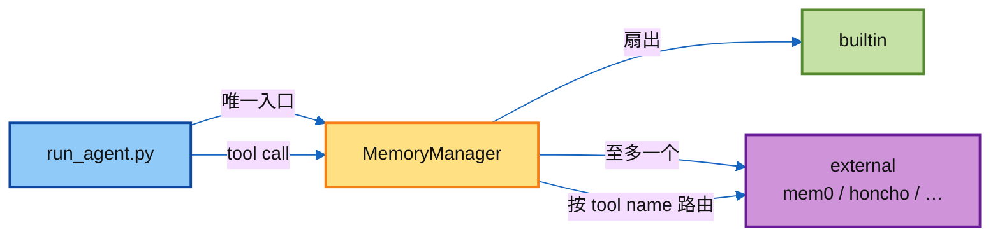
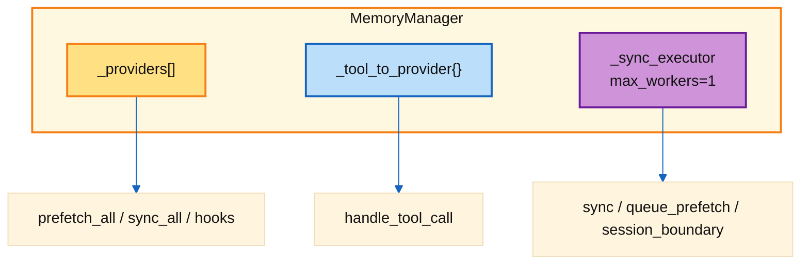
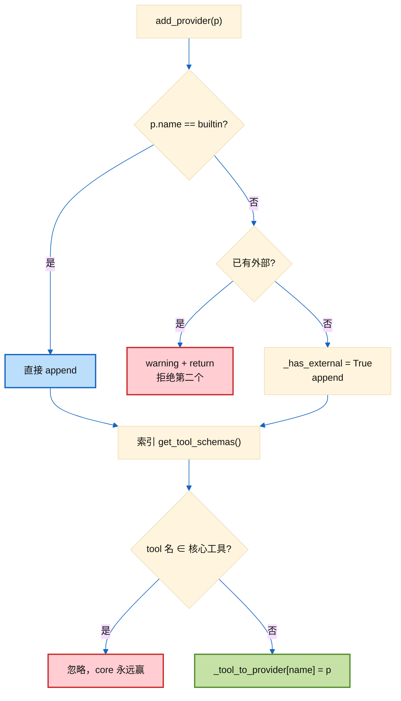
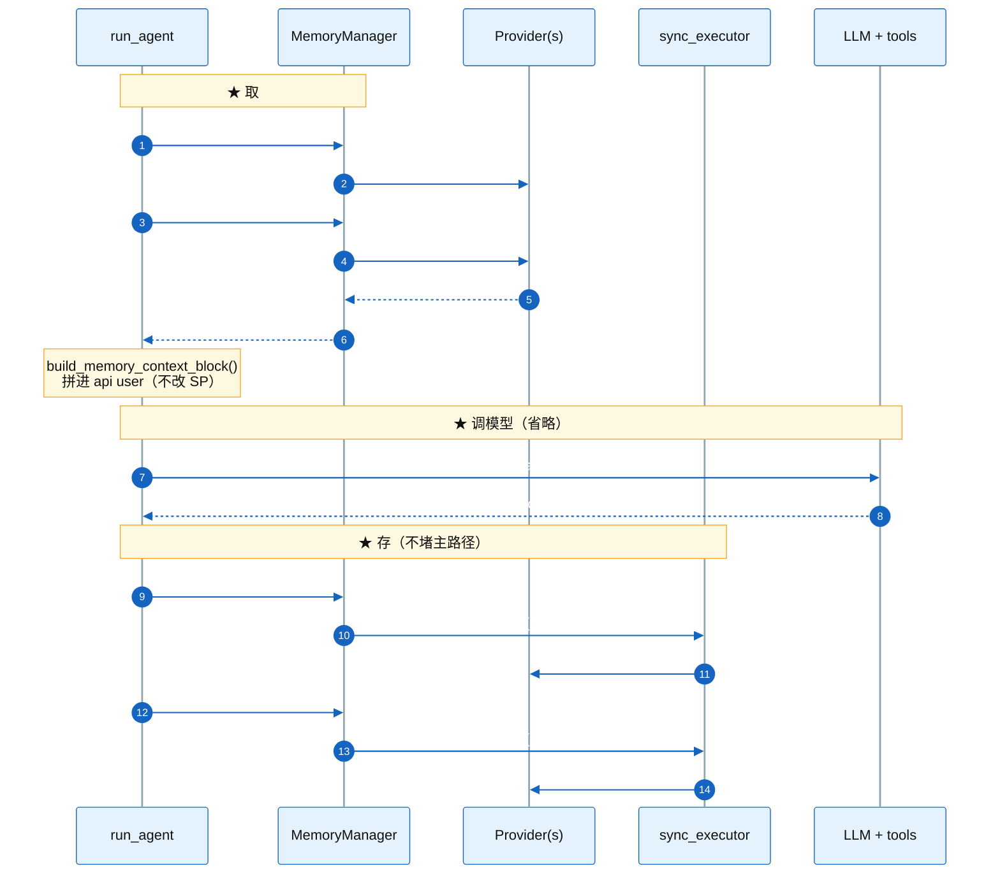
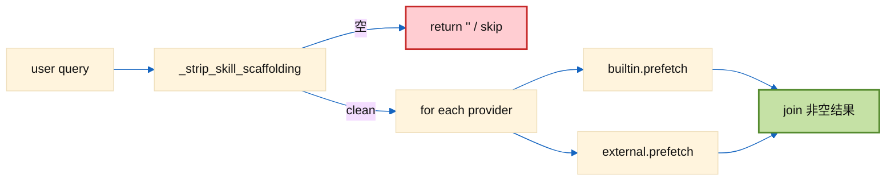
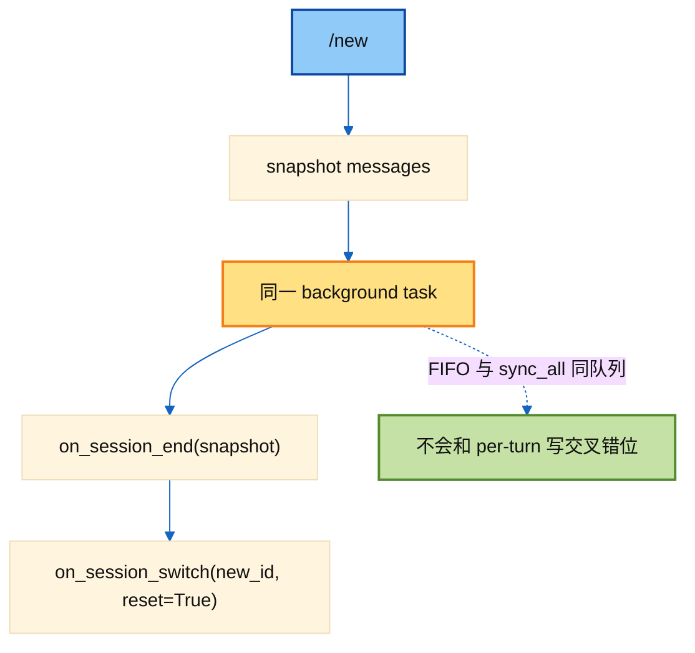

# ② · MemoryManager 精读

> 讲解顺序：[`../README.md`](../README.md) **①→⑥**（本篇 = **②**）  
> 对照源码：[`../agent/memory_manager.py`](../agent/memory_manager.py)  
> 上一跳 ① ABC：[`01_provider_abc.md`](./01_provider_abc.md) · 下一跳 ③ Prefetch：[`../excerpts/01_turn_context.PREFETCH.py`](../excerpts/01_turn_context.PREFETCH.py)

---

## 1. 一句话

`MemoryManager` 是 `run_agent.py` 里**唯一的记忆编排入口**：注册 provider、扇出 prefetch/sync、路由 provider 工具、包 `<memory-context>` 围栏、把慢 IO 丢到后台线程。  
Provider 自己不碰 Runtime；Manager 不碰具体后端。

---

## 2. 它在 Runtime 里站哪



文件头注释里的用法就是整本的提纲：

```text
add_provider(...)           # 注册（外部只收一个）
build_system_prompt()       # session 启动：静态块进 SP
prefetch_all(user_msg)      # turn 前：召回
sync_all(user, asst)        # turn 后：异步写入
queue_prefetch_all(user)    # turn 后：暖下一轮
```

---

## 3. 内部三块状态

读类时先抓住这三个字段：

| 字段 | 作用 |
|------|------|
| `_providers: List[MemoryProvider]` | 注册顺序；builtin 通常在前 |
| `_tool_to_provider: Dict[str, Provider]` | `mem0_search` → 哪个 provider |
| `_sync_executor`（懒创建） | **单 worker** 后台池：串行化 sync / queue_prefetch / session 边界 |



**为什么单 worker？**  
Turn N 的 `sync_turn` 必须先于 Turn N+1 落库；provider 自己不必再写锁。Session `/new` 的 `on_session_end → on_session_switch` 也走同一队列，避免和 per-turn sync 竞态。

---

## 4. 注册：`add_provider` 硬规则



记住三条：

1. **外部只能有一个**（防 schema 膨胀、后端互相打架）。  
2. **核心工具名不可被 shadow**（`clarify` / `delegate_task` 等）。  
3. 同名 tool 后到者忽略，并打 warning。

模块级还有 `normalize_tool_schema` / `inject_memory_provider_tools`：防止 provider 返回「已包好一层 OpenAI tool」再被包第二层，导致 `function.name` 缺失、整次请求 400。

---

## 5. 一个 Turn：Manager API 怎么被调用



对照记住：

| 时机 | Manager 方法 | 同步？ |
|------|--------------|--------|
| turn 开头 | `on_turn_start` → `prefetch_all` | **同步**（要立刻注入） |
| API 前 | 模块函数 `build_memory_context_block` | 纯字符串包装 |
| turn 正常结束 | `sync_all` + `queue_prefetch_all` | **后台** |
| interrupted / 空响应 | （上层跳过，不进 Manager） | — |

---

## 6. Prefetch 扇出 + Skill 清洗

`prefetch_all` / `sync_all` / `queue_prefetch_all` 共用 `_strip_skill_scaffolding`：

- 普通消息：原样传下去。  
- `/skill` 展开后：只抽出**用户真实指令**。  
- 光调 skill、没有指令：返回 `None` → **整轮跳过**，避免把 skill 正文污染 embedding。

扇出契约：**一个 provider 炸了不影响其他**（`try/except` + log）。



---

## 7. 围栏：`build_memory_context_block`

这是**模块级函数**（不是 Manager 方法），但和 Manager 强绑定——prefetch 原文必须先经过它再进 user message。

```text
<memory-context>
[System note: ... NOT new user input. Treat as authoritative reference data ...]

{sanitize 后的 raw}
</memory-context>
```

配套：

| 工具 | 用途 |
|------|------|
| `sanitize_context` | 去掉 provider 自己塞进来的假围栏 / system note |
| `StreamingContextScrubber` | **流式**输出时按 chunk 剥掉围栏，防模型把 memory 当答案回显到 UI |

设计意图：**动态记忆进 user，不进 SP** → prompt cache 前缀稳定。

---

## 8. 后台为什么必须异步

历史上有 provider 卡网络 ~298s：用户已经看到回复，但 `run_conversation` 还没返回 → CLI/TUI/Gateway 一直显示 running，下一条消息会触发激进 interrupt。

因此：

```text
sync_all / queue_prefetch_all / commit_session_boundary_async
    → _submit_background(fn)
        → DaemonThreadPoolExecutor(max_workers=1)
        → 失败则 inline 兜底（慢但正确，不丢写）
```

`shutdown_all` 先 `_drain_sync_executor`（最多等 `_SYNC_DRAIN_TIMEOUT_S = 5s`），再 reverse 调各 `provider.shutdown()`。

---

## 9. Tool 路由

```mermaid
%%{init: {"theme":"base","themeCSS":".edgeLabel,.edgeLabel p,.edgeLabel span{color:#FFFFFF!important;}.messageText,.labelText,.loopText{fill:#FFFFFF!important;color:#FFFFFF!important;}","themeVariables":{"primaryTextColor":"#111111","secondaryTextColor":"#111111","tertiaryTextColor":"#111111","lineColor":"#1565C0","signalColor":"#1565C0","signalTextColor":"#FFFFFF","fontSize":"15px"}}}%%
sequenceDiagram
    participant Loop as agent loop
    participant MM as MemoryManager
    participant P as Mem0Provider

    Loop->>MM: has_tool("mem0_search")?
    MM-->>Loop: True
    Loop->>MM: handle_tool_call("mem0_search", args)
    MM->>P: handle_tool_call(...)
    P-->>MM: JSON string
    MM-->>Loop: JSON string
```

- `get_all_tool_schemas()`：收集并去重；跳过 core 名。  
- `handle_tool_call`：查表；异常 → `tool_error(...)`，不抛穿。  
- Builtin 的 `memory` 工具往往走 Agent 自己的拦截路径；写成功后通过 `notify_memory_tool_write` **镜像**给外部。

---

## 10. Session 边界：`/new` 的坑与修法

`/new` 需要两件事，且顺序固定：

1. `on_session_end(messages)` — 可能含 LLM 抽取，很慢  
2. `on_session_switch(new_id, reset=True)` — 换内部 session 绑定  

若 end 跑在临时线程、switch 在主线程 → 晚到的 end 会写到**新** session。  
若 end 同步跑 → `/new` 卡整轮 LLM。

解法：`commit_session_boundary_async` 把 **end + switch 绑成一个任务**丢进同一后台队列。



---

## 11. Builtin → External 镜像写入

当模型调用内置 `memory` 工具且**真正落盘成功**时：

```text
notify_memory_tool_write(tool_result, tool_args)
  → 必须 success=True 且非 staged
  → 展开单 op / operations 批处理
  → 只镜像 add / replace / remove
  → on_memory_write(...)  （跳过 builtin 自己）
```

失败 / 待审批 / 非 JSON → **闭关**（不告诉外部「写了」）。

---

## 12. API 速查（按场景）

| 场景 | 调什么 |
|------|--------|
| Agent 启动 | `add_provider` → `initialize_all` → `build_system_prompt` |
| 每 turn 前 | `on_turn_start` → `prefetch_all` → `build_memory_context_block` |
| Provider 工具 | `get_all_tool_schemas` / `handle_tool_call` |
| Builtin memory 写成功 | `notify_memory_tool_write` |
| Turn 正常结束 | `sync_all` + `queue_prefetch_all` |
| `/new` | `commit_session_boundary_async` |
| `/resume` 等换 id | `on_session_switch` |
| 压缩前 | `on_pre_compress` |
| 子代理完成 | `on_delegation` |
| 进程退出 | `shutdown_all`（含 drain） |
| 测试断言落库 | `flush_pending(timeout=...)` |

---

## 13. 自测题（闭卷）

1. 为什么动态 recall 进 **user** 而不是改 SP？  
2. 为什么 `sync_all` 不能 inline？  
3. 第二个外部 provider 注册时会发生什么？  
4. Skill 展开消息若不清洗，坏在哪里？  
5. `/new` 为什么要把 end 和 switch 绑成**一个**后台任务？  
6. `StreamingContextScrubber` 解决的是哪类 bug？

答完对照源码相关函数；动手可跑 [`../demo/`](../demo/README.md)。

---

## 14. 建议阅读路径（对着文件）

```mermaid
%%{init: {"theme":"base","themeCSS":".edgeLabel,.edgeLabel p,.edgeLabel span{color:#FFFFFF!important;}.messageText,.labelText,.loopText{fill:#FFFFFF!important;color:#FFFFFF!important;}","themeVariables":{"primaryTextColor":"#111111","secondaryTextColor":"#111111","tertiaryTextColor":"#111111","signalTextColor":"#FFFFFF","lineColor":"#1565C0","fontSize":"15px"}}}%%
flowchart LR
    A["① add_provider<br/>+ normalize_tool_schema"] --> B["② prefetch_all<br/>+ build_memory_context_block"]
    B --> C["③ sync_all<br/>+ _submit_background"]
    C --> D["④ handle_tool_call<br/>+ notify_memory_tool_write"]
    D --> E["⑤ commit_session_boundary_async<br/>+ shutdown_all"]

    style A fill:#BBDEFB,stroke:#1565C0,stroke-width:2px,color:#111111
    style B fill:#FFCC80,stroke:#E65100,stroke-width:2px,color:#111111
    style C fill:#CE93D8,stroke:#6A1B9A,stroke-width:2px,color:#111111
    style D fill:#C5E1A5,stroke:#558B2F,stroke-width:2px,color:#111111
    style E fill:#FFE082,stroke:#F57F17,stroke-width:2px,color:#111111
```



下一跳：[`../excerpts/01_turn_context.PREFETCH.py`](../excerpts/01_turn_context.PREFETCH.py) + [`../README.md`](../README.md) §③④（Runtime 何时调这些 API）。
