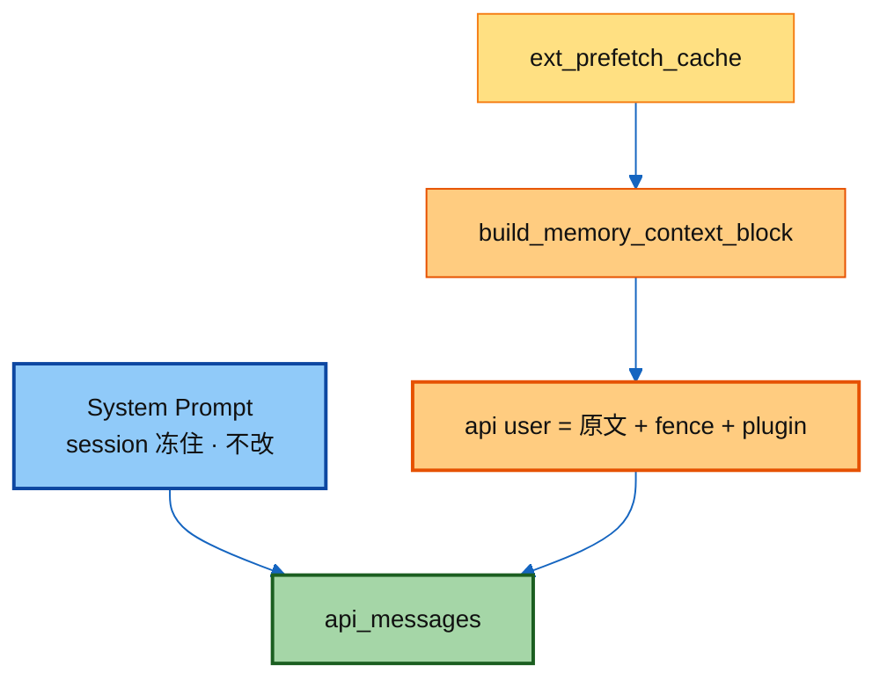
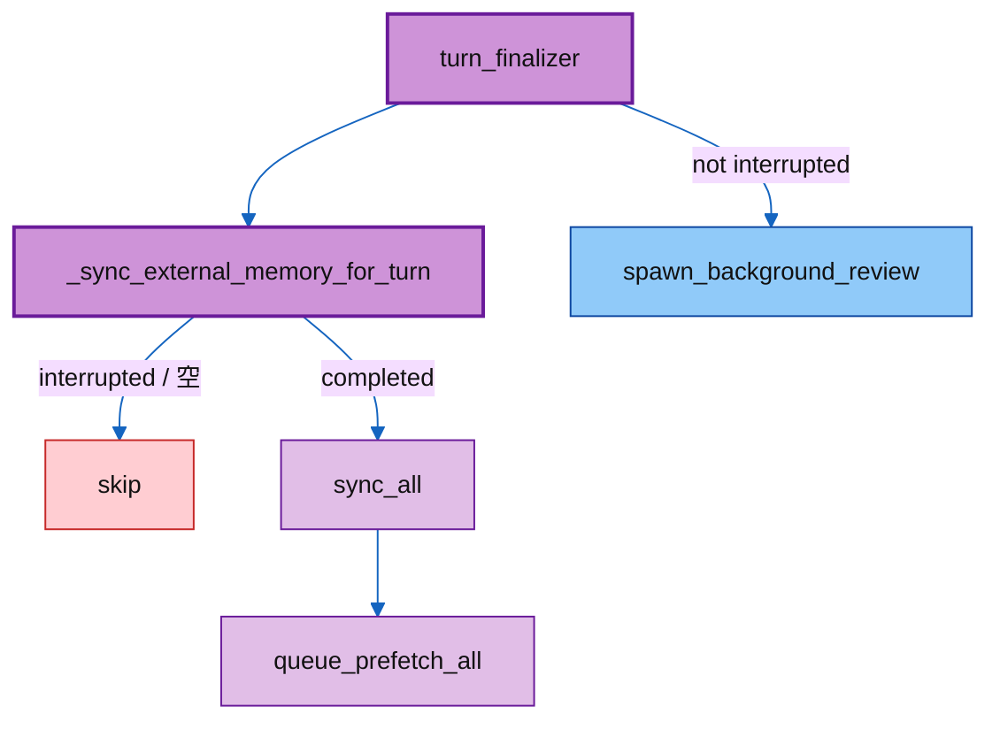
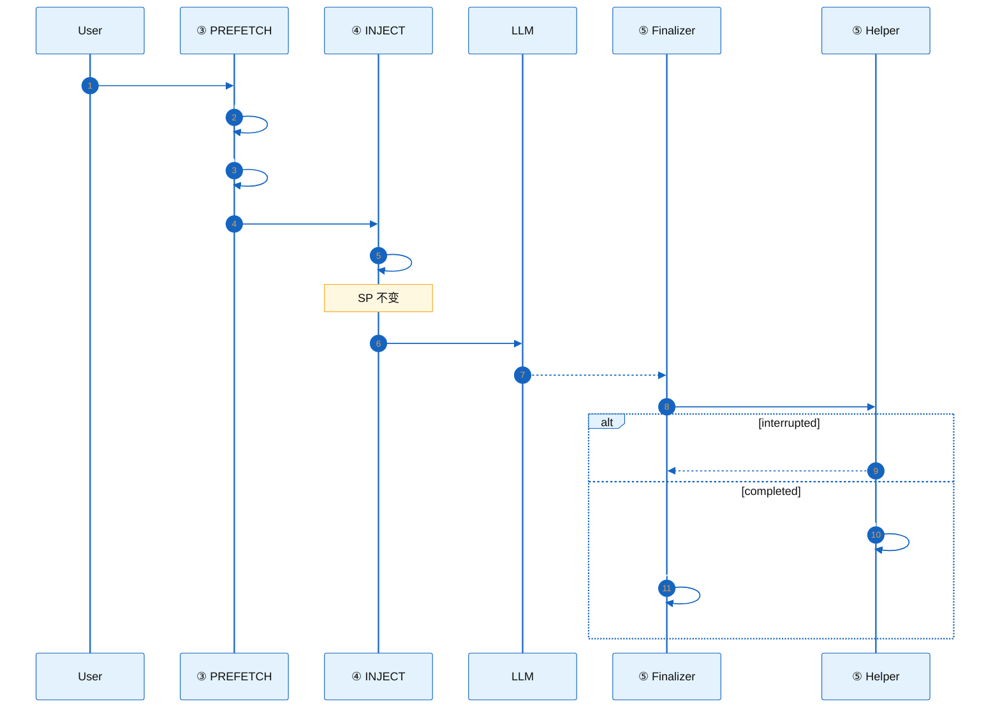

# ③–⑥ · Excerpts 讲解稿（取 → 注入 → 存 → Prompt）

> 上游：[`../README.md`](../README.md) · ① [`01_provider_abc.md`](./01_provider_abc.md) · ② [`02_memory_manager.md`](./02_memory_manager.md)  
> 本篇把 `excerpts/` 七个剪枝**按讲解顺序串成一份讲稿**；**代码对着链接里的 `.py` 念**，这里只留要点与提问。  
> 源码均为不可运行剪枝；真文件在完整 `hermes-agent`。

颜色约定：**橙 = 取/注入**，**紫 = 存**，**蓝 = Prompt / SP**。

---

## 0. 开场一句话（30 秒）

一个 turn 里记忆只做三件事：

1. **取** — turn 开头 `prefetch_all`，结果进 `TurnContext.ext_prefetch_cache`
2. **注入** — API 前把召回围栏拼进 **当前 user**（不改 SP，保 prompt cache）
3. **存** — turn 正常结束 `sync_all` + `queue_prefetch_all`；interrupted 整段跳过

Prompt 分三条：session 冻进 SP 的 volatile、约束 `memory` 工具写法的 `MEMORY_GUIDANCE`、后台审查用的 `_MEMORY_REVIEW_PROMPT`。

| 步 | Excerpt | 讲解钩子 |
|----|---------|----------|
| ③ | `01_turn_context.PREFETCH.py` | 先 `on_turn_start`，再 `prefetch_all` |
| ④ | `02_conversation_loop.INJECT.py` | 围栏进 user；注释写明为何不进 SP |
| ⑤a | `03_turn_finalizer.SYNC.py` | 调 helper + 可选后台 review |
| ⑤b | `04_run_agent.SYNC_HELPER.py` | interrupted 直接 return |
| ⑥a | `05_system_prompt.MEMORY_VOLATILE.py` | MEMORY.md / USER.md / external SP 块 |
| ⑥b | `06_prompt_builder.MEMORY_GUIDANCE.py` | 写什么、不写什么 |
| ⑥c | `07_background_review.MEMORY_REVIEW.py` | 审查焦点：人 + 期望 |

---

## ③ 取 · `01_turn_context.PREFETCH.py`

**对着念：** [`../excerpts/01_turn_context.PREFETCH.py`](../excerpts/01_turn_context.PREFETCH.py)（`agent/turn_context.py` L550–L579）

### 讲解要点

1. **顺序固定**：`on_turn_start` → `prefetch_all`。Provider 可在 start 里清 per-turn 状态，再按本轮 query 召回。
2. Query 用 `original_user_message`（干净用户话），不是可能已注入 skill 的 `user_message`。
3. 失败吞掉：`except Exception: pass` — 外部记忆 best-effort，不能挡对话。
4. 结果只放进 `TurnContext.ext_prefetch_cache`，**此刻还不碰 messages / SP**。

### 台上可问

> 「为何必须先 `on_turn_start` 再 `prefetch`？」  
> → Provider 需要 turn 边界通知；prefetch 依赖本轮 query。

---

## ④ 注入 · `02_conversation_loop.INJECT.py`

**对着念：** [`../excerpts/02_conversation_loop.INJECT.py`](../excerpts/02_conversation_loop.INJECT.py)（`agent/conversation_loop.py` L801–L856）

### 讲解要点

1. **只改当前 turn 的那条 user**（`idx == current_turn_user_idx`）。
2. Prefetch → `build_memory_context_block` → `<memory-context>…</memory-context>` 围栏，拼到 `api_msg["content"]` 末尾。
3. **故意不进 system prompt**：注释写死了 Hermes 不变量——SP 会话内 byte-stable，改 SP 就砸 prompt cache。
4. Plugin 的 `pre_llm_call` 上下文同样进 user，同一套理由。

### 台上可问

> 「召回为什么不塞进 SP？」  
> → 每 turn 召回内容不同；改 SP 会 invalidate 整段 prefix cache。动态进 user，静态冻在 SP。

---

## ⑤ 存 · Finalizer + Helper

### ⑤a `03_turn_finalizer.SYNC.py`

**对着念：** [`../excerpts/03_turn_finalizer.SYNC.py`](../excerpts/03_turn_finalizer.SYNC.py)（`agent/turn_finalizer.py` L487–L505）

**要点：**

1. 先 `_sync_external_memory_for_turn(...)`（外部落库）。
2. 再可选 `_spawn_background_review`——**响应已经交给用户之后**，不抢主模型注意力。
3. Review 条件：`final_response and not interrupted`。

### ⑤b `04_run_agent.SYNC_HELPER.py`

**对着念：** [`../excerpts/04_run_agent.SYNC_HELPER.py`](../excerpts/04_run_agent.SYNC_HELPER.py)（`run_agent.py` L3367–L3426；**整段 docstring 都值得念**）

| 规则 | 原因 |
|------|------|
| `interrupted → return` | 半截输出不是「用户看到的对话真相」，写进外部库会污染未来召回（#15218） |
| 用 `original_user_message` | `user_message` 可能带 skill 注入，会 bloating / 搞坏 provider query |
| `sync_all` + `queue_prefetch_all` 同一次 | 落库 + 暖下一轮 |
| 全文 `try/except` | 外部记忆挂了不能挡用户看回复 |
| 多模态先 flatten 成纯文本 | Provider 期望 string |

### 台上可问

> 「用户按了 stop / 中断，会不会写入 Mem0？」  
> → 不会。`interrupted` 时 sync 与 queue_prefetch 一起跳过。

---

## ⑥ Prompt · 三条线

### ⑥a Volatile SP · `05_system_prompt.MEMORY_VOLATILE.py`

**对着念：** [`../excerpts/05_system_prompt.MEMORY_VOLATILE.py`](../excerpts/05_system_prompt.MEMORY_VOLATILE.py)（`agent/system_prompt.py` L457–L527）

**要点：**

1. Builtin：`MEMORY.md` / `USER.md` → `format_for_system_prompt` → volatile。
2. External：`memory_manager.build_system_prompt()` **叠加**，不替代 builtin。
3. 时间戳只要**日期**（不要到分钟）——整日 SP byte-stable，少砸 cache。
4. `build_system_prompt()`：**每 session 建一次**，缓存在 `_cached_system_prompt`；压缩后才重建。

对比记牢：

| | Session 启动冻进 SP | 每 turn 动态 |
|--|---------------------|--------------|
| Builtin md snapshot | ✓ volatile | — |
| External `system_prompt_block` | ✓ | — |
| External `prefetch` | — | ✓ 进 user 围栏 |

---

### ⑥b 写法约束 · `06_prompt_builder.MEMORY_GUIDANCE.py`

**对着念：** [`../excerpts/06_prompt_builder.MEMORY_GUIDANCE.py`](../excerpts/06_prompt_builder.MEMORY_GUIDANCE.py)（`agent/prompt_builder.py` L151–L172）

**三条黄金规则：**

1. **存什么：** 用户偏好、环境细节、工具怪癖、稳定约定——能减少「用户下次再纠正你」。
2. **不存什么：** 任务进度、PR/issue/SHA、「修了 bug X」、7 天内会过期的产物；那些用 `session_search`。
3. **怎么写：** 陈述事实，不要祈使句。  
   `'User prefers concise responses' ✓` · `'Always respond concisely' ✗`  
   流程/工作流 → skill，不是 memory。

---

### ⑥c 后台审查 · `07_background_review.MEMORY_REVIEW.py`

**对着念：** [`../excerpts/07_background_review.MEMORY_REVIEW.py`](../excerpts/07_background_review.MEMORY_REVIEW.py)（`agent/background_review.py` L166–L179）

**要点：**

1. 给 **forked review agent** 的 user-message，不是主对话 SP。
2. 焦点只有两块：**用户是谁**、**用户期望你怎么做事**。
3. 有则调 `memory` 工具；无则 `'Nothing to save.'` 停。
4. 与 ⑤a 衔接：响应交付后才 spawn，不跟用户抢模型。

---

## 总览：一个 Turn 时序（可投屏）

---

## 收束三句（面试 / 复盘）

1. **取进 user、不进 SP** — 保 per-conversation prompt cache。  
2. **存异步且跳过 interrupt** — 半截对话不当真相写入外部库。  
3. **写受 MEMORY_GUIDANCE 约束** — 耐久事实进 memory；进度进 transcript；流程进 skill。

---

## Excerpt 速查

| 文件 | 角色 |
|------|------|
| [`01_turn_context.PREFETCH.py`](../excerpts/01_turn_context.PREFETCH.py) | ③ 取 |
| [`02_conversation_loop.INJECT.py`](../excerpts/02_conversation_loop.INJECT.py) | ④ 注入 |
| [`03_turn_finalizer.SYNC.py`](../excerpts/03_turn_finalizer.SYNC.py) | ⑤ 收尾入口 |
| [`04_run_agent.SYNC_HELPER.py`](../excerpts/04_run_agent.SYNC_HELPER.py) | ⑤ sync 规则 |
| [`05_system_prompt.MEMORY_VOLATILE.py`](../excerpts/05_system_prompt.MEMORY_VOLATILE.py) | ⑥ SP volatile |
| [`06_prompt_builder.MEMORY_GUIDANCE.py`](../excerpts/06_prompt_builder.MEMORY_GUIDANCE.py) | ⑥ 写法宏 |
| [`07_background_review.MEMORY_REVIEW.py`](../excerpts/07_background_review.MEMORY_REVIEW.py) | ⑥ 审查 prompt |

上一跳：[`02_memory_manager.md`](./02_memory_manager.md) · 动手：[`../../demo/`](../../demo/)
