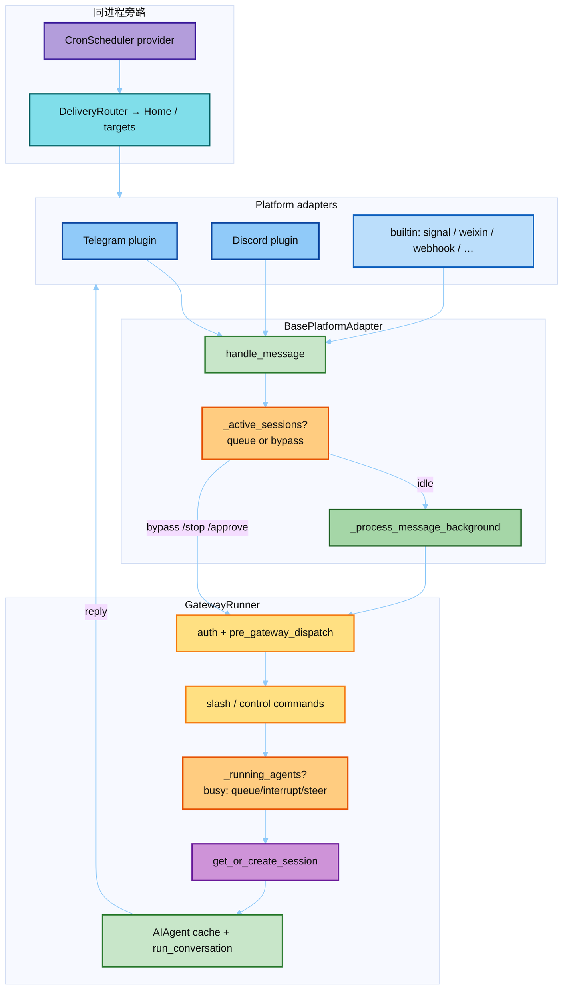

# Hermes Gateway · 源码学习

目标：按**消息路径**搞清 Gateway 怎么把 Telegram/Discord/… 接到同一套 Agent Core——不是只背「常驻进程」四个字。

**完整源码仓**：`面试狂魔/人工智能面试题/hermes-agent/`（`gateway/` 包）。  
**先读模块地图**：[`notes/0_module_gateway_map.md`](./notes/0_module_gateway_map.md)。  
**鸟瞰长文**：[`../01-arch.md`](../01-arch.md) §5。  
**结构对齐**：本目录对齐 [`../04-prompt/`](../04-prompt/)——`notes/` + `catalog/` + `hermes_src/` + `scripts/`。

Catalog / excerpts 由 `scripts/extract_gateway_map.py` 从完整仓刷新；讲稿在 `notes/`，索引在 `catalog/`。

---

## 先建立心智模型（5 分钟）

Gateway = **常驻桥**：平台适配器收消息 → 统一 `MessageEvent` → Session Key 拉历史 → `AIAgent` 跑一轮 → 回写渠道。相对 CLI 多了三件硬活：

| 硬活 | 为什么 CLI 没有 / 更轻 |
|------|------------------------|
| **按 Session Key 拼历史** | 入站往往只有「最新一条」；必须从 SQLite 拉齐 transcript |
| **并发 Turn 排队 / 打断** | 用户连发、审批、clarify 时 Agent 可能还在跑 |
| **Home / Delivery 路由** | Cron / 后台结果要投到指定 chat，不是「当前 stdin」 |

两条**必须同时绕过**的守卫（面试必背，见 AGENTS.md）：

```text
① Adapter 层  _active_sessions + _pending_messages
   → 忙时默认排队；/stop /approve /deny /clarify 答复必须 bypass 直达 runner

② Runner 层   _running_agents + busy handler
   → 再拦一层；控制命令仍要 inline dispatch，不能再进 _process_message_background
```

Prompt Cache 仍神圣：Gateway **按 session 缓存 AIAgent**（`_agent_cache`），避免每条消息重建 system prompt。

---

## 推荐学习顺序

| 顺序 | 读什么 | 学什么 |
|------|--------|--------|
| 0 | [`notes/0_module_gateway_map.md`](./notes/0_module_gateway_map.md) | 包地图：谁管配置 / session / 适配器 / runner |
| 1 | [`notes/1_message_pipeline.md`](./notes/1_message_pipeline.md) | 一条入站消息 → Turn 的热路径 |
| 2 | [`catalog/00_index.md`](./catalog/00_index.md) → `02` / `03` | `handle_message` + `_handle_message` 摘录 |
| 3 | [`notes/2_session_and_history.md`](./notes/2_session_and_history.md) | `build_session_key` + `get_or_create_session` |
| 4 | [`notes/3_concurrency_guards.md`](./notes/3_concurrency_guards.md) | 双守卫 + bypass 集合 |
| 5 | [`notes/4_delivery_and_cron.md`](./notes/4_delivery_and_cron.md) | Home channel、DeliveryRouter、gateway 内 cron |
| 6 | `catalog/08` + `ADDING_A_PLATFORM.md` | 新平台：plugin 优先，不要改 core |
| 7 | 真仓对 `GatewayRunner._handle_message` / `BasePlatformAdapter.handle_message` 打断点 | 眼见为实 |

---

## 目录

```text
08-gateway/
├── README.md
├── hermes_src/
│   ├── README.md
│   └── gateway/
│       ├── __init__.py / config.py / session.py / delivery.py
│       ├── platform_registry.py / session_context.py
│       ├── platforms/ADDING_A_PLATFORM.md
│       └── excerpts/                 # run.py / base.py 等巨文件摘录
├── catalog/                          # ★ 索引 + 热路径讲义（对照 excerpts）
│   ├── 00_index.md
│   ├── 01_package_map.md
│   ├── 02_message_path.md
│   ├── 03_session_key.md
│   ├── 04_dual_guards.md
│   ├── 05_slash_bypass.md
│   ├── 06_delivery_home.md
│   ├── 07_cron_in_gateway.md
│   └── 08_platform_adapter.md
├── notes/                            # 讲稿
│   ├── 0_module_gateway_map.md
│   ├── 1_message_pipeline.md
│   ├── 2_session_and_history.md
│   ├── 3_concurrency_guards.md
│   └── 4_delivery_and_cron.md
└── scripts/
    └── extract_gateway_map.py        # 重新拷贝 + 刷新 excerpts
```

### 重新抽取

上游更新后：

```powershell
cd 08-hermes-agent/08-gateway
python scripts/extract_gateway_map.py
```

> `hermes_src/` 只读对照，**勿直接 import 跑**。断点请开完整 `hermes-agent`。

---

## Gateway 地图（一张图）



---

## 和相邻模块的关系

| 模块 | 交接面 |
|------|--------|
| [`02-run-agent`](../02-run-agent/) | Gateway 最终调的就是 `AIAgent.run_conversation` |
| [`04-prompt`](../04-prompt/) | Session 启动 freeze SP；gateway 注入 platform / session context |
| [`06-cron`](../06-cron/) | tick 跑在 gateway 进程；投递走 DeliveryRouter / Home |
| [`07-mem-provider`](../07-mem-provider/) | 同一套 prefetch/sync；cron 默认 `skip_memory` |
| [`01-arch.md`](../01-arch.md) §5 | 鸟瞰：Session Key、Hygiene、Session Manager |

---

## 面试一句话

Gateway 不是「多写几个 HTTP handler」，而是：**统一 MessageEvent + Session Key 拉历史 + 双层忙时守卫（控制命令必须 bypass）+ 同进程 cron/delivery**，让所有渠道共用一个带 prompt cache 的 Agent Core。
