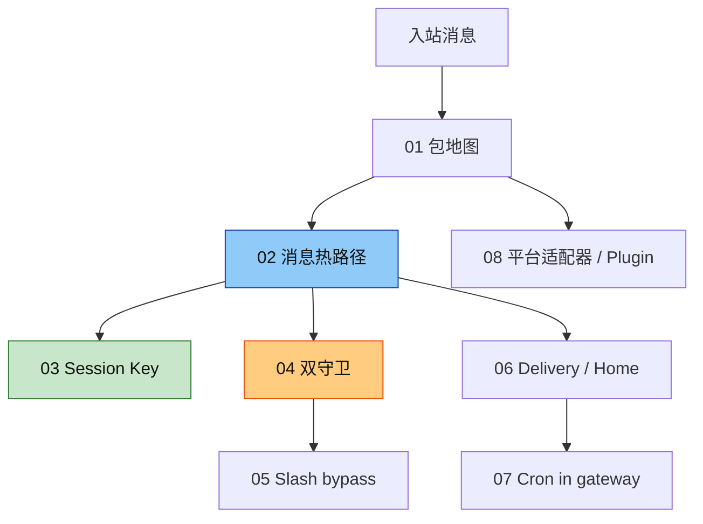

# Hermes Gateway Catalog · 总索引

扫描源：`hermes-agent/gateway/`（+ `hermes_cli/commands.py` bypass 段）  
模块地图：[`../notes/0_module_gateway_map.md`](../notes/0_module_gateway_map.md)  
学习入口：[`../README.md`](../README.md)

## 何时读哪份

## 分类文件

| 文件 | 主题 | 对照 excerpts / 源码 |
|------|------|----------------------|
| [`01_package_map.md`](./01_package_map.md) | 包职责与启动 | `__init__.py`、`platform_registry.py` |
| [`02_message_path.md`](./02_message_path.md) | 入站 → Agent | `base_handle_message.py`、`run_message_and_cron.py` |
| [`03_session_key.md`](./03_session_key.md) | Key / Store | `session_key_store.py`、`session.py` |
| [`04_dual_guards.md`](./04_dual_guards.md) | 两层忙时守卫 | `base_handle_message.py`、`run_busy_session.py` |
| [`05_slash_bypass.md`](./05_slash_bypass.md) | bypass 判定 | `commands_bypass.py` |
| [`06_delivery_home.md`](./06_delivery_home.md) | 投递路由 | `delivery_router.py`、`config_platform_home.py` |
| [`07_cron_in_gateway.md`](./07_cron_in_gateway.md) | 同进程调度 | `run_message_and_cron.py`（cron 段） |
| [`08_platform_adapter.md`](./08_platform_adapter.md) | 新平台 | `ADDING_A_PLATFORM.md`、`platform_registry.py` |

## 三类「不要混」

| 类型 | 含义 | 典型文件 |
|------|------|----------|
| **同步用户 Turn** | 真人消息 → Agent → `adapter.send` | `02` `03` `04` |
| **控制面** | `/stop` `/approve` `/steer`… | `04` `05` |
| **异步投递** | Cron / 后台 → DeliveryRouter | `06` `07` |
