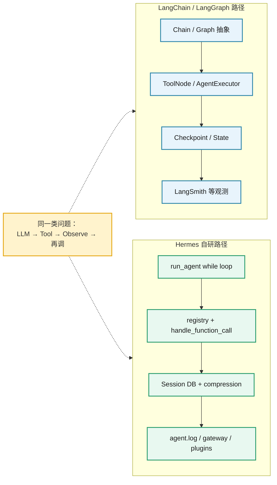
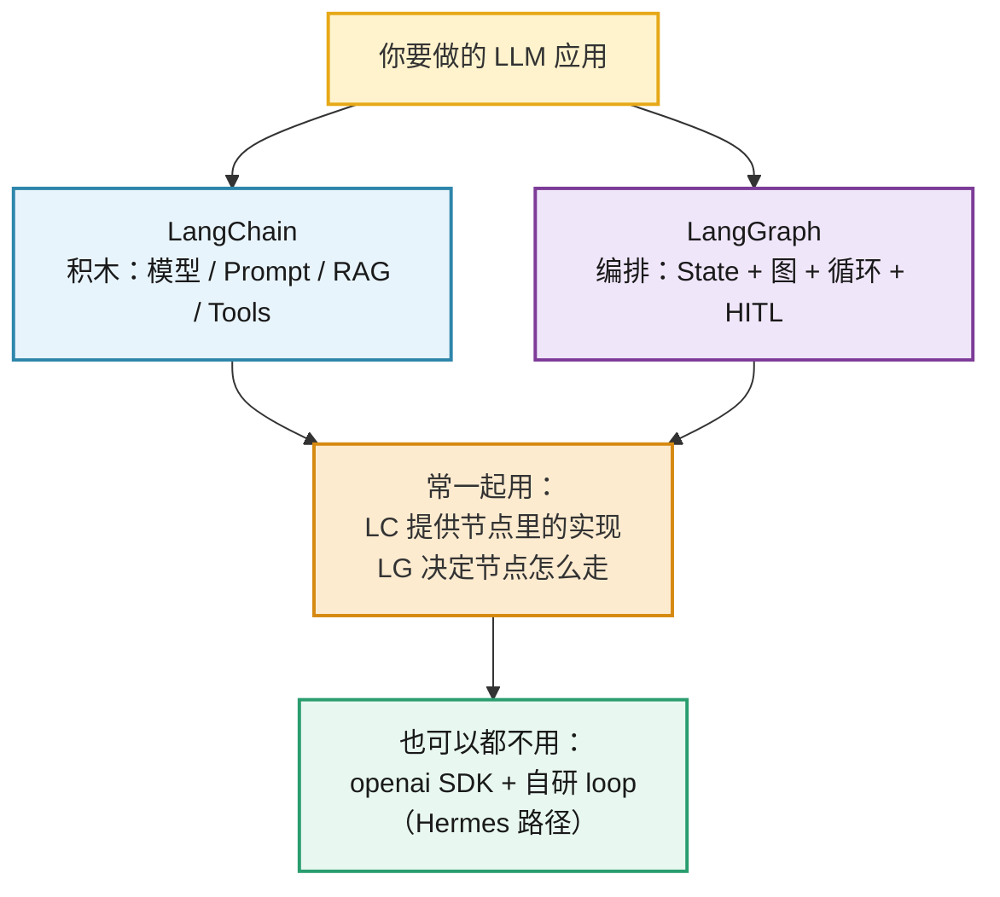
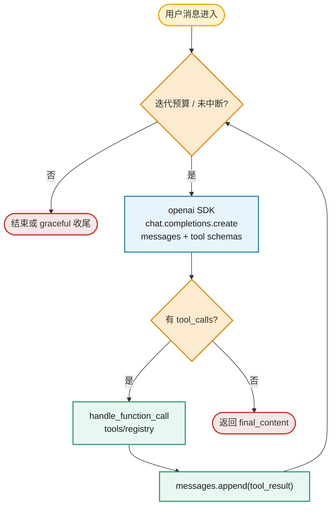
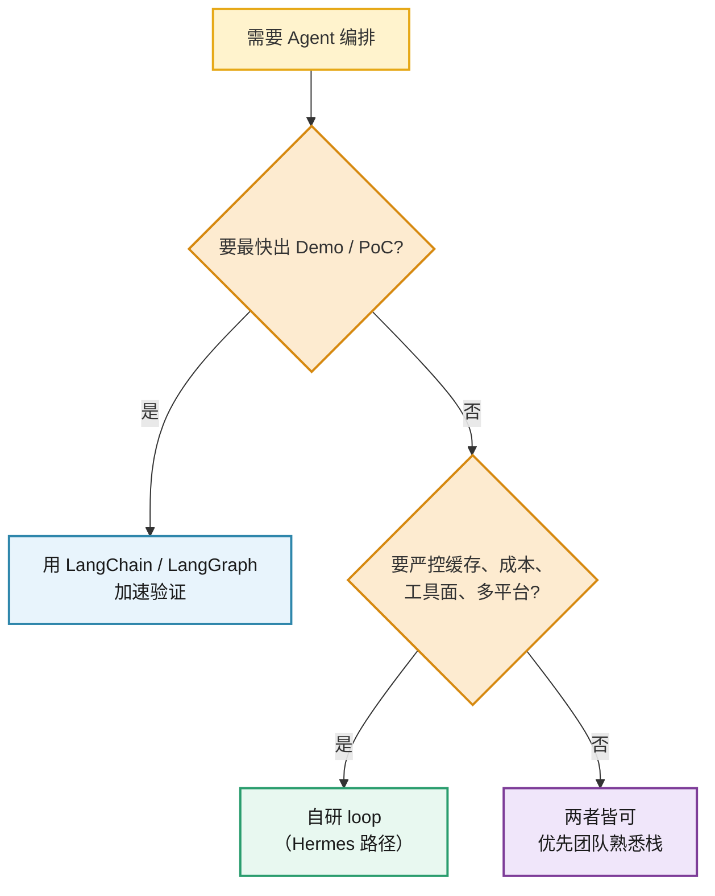
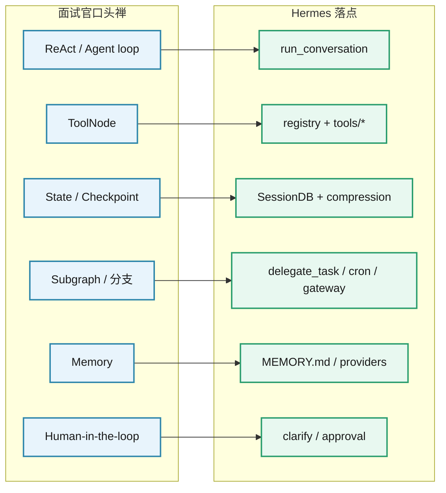

# Hermes 没用 LangChain / LangGraph —— 以及面试为什么总问

> 研究结论：Hermes Agent **核心编排不依赖** LangChain / LangGraph。  
> 面试高频问「有没有用 LC/LG 编排过」，测的多半是 **Agent 概念标签**，不是「生产必须用这个库」。

对照源码仓库：`hermes-agent`（Nous Research）。

---

## 1. 结论（先说清楚）

| 问题 | 答案 |
|------|------|
| Hermes 用了 LangGraph 吗？ | **没有** |
| Hermes 用了 LangChain 吗？ | **核心没有**；仅在可选 skill / 文档示例里出现集成片段 |
| Agent 怎么编排？ | 自研：`run_agent.py` 里同步 tool-calling loop + `model_tools.py` / `tools/registry.py` |
| 主依赖是什么？ | `openai` SDK（`pyproject.toml` 精确 pin），不是 LC/LG |

一句话：**生产级 Agent 可以完全不用 LC/LG；手写 OpenAI 兼容 API + messages + tools 循环就够。**

### 总览图：两条编排路径（概念等价，实现不同）



---

## 2. LangChain 和 LangGraph 主要是干什么的

两者都来自 LangChain 生态，但**职责分层不同**，面试里经常被混着问。

| | LangChain | LangGraph |
|--|-----------|-----------|
| 一句话 | **LLM 应用积木箱**：把模型、提示、检索、工具、输出解析拼成流水线 | **有状态的 Agent / 工作流编排**：用图（节点+边）表达分支、循环、人机审批 |
| 典型对象 | Chain、Retriever、Tool、PromptTemplate、OutputParser | StateGraph、Node、Edge、Checkpoint、interrupt |
| 擅长 | RAG 拼装、多厂商模型适配、快速接向量库/工具 | 多步 Agent、条件分支、循环重试、暂停等人确认后再继续 |
| 不擅长 / 代价 | 抽象层厚，版本与 API 变动快，深度定制时易「绕框架」 | 状态图建模有学习成本；简单问答/单次 tool call 会显得过重 |

### 2.1 LangChain：主要干什么

**把「调用大模型」升级成「可组装的应用组件」。**

常见能力：

1. **模型统一接口**：OpenAI / Anthropic / 本地模型换一层封装  
2. **Prompt + Chain**：提示模板 → 模型 → 解析器，串成固定流水线  
3. **RAG 积木**：文档加载、切分、Embedding、向量库、Retriever、拼进 prompt  
4. **Tools**：给 LLM 可调用的函数/API 包装  
5. **早期 Agent**：如 ReAct / AgentExecutor（后来更重的编排逐渐交给 LangGraph）

适合：Demo、PoC、内部工具、标准 RAG、「先跑通再谈架构」。

### 2.2 LangGraph：主要干什么

**把 Agent / 业务工作流建成一张可控的状态图。**

常见能力：

1. **显式状态（State）**：每步读写共享 state（消息、中间结果、标志位）  
2. **节点 + 边**：节点=一步（调模型 / 调工具 / 写库）；边=顺序或条件跳转  
3. **循环**：模型继续调工具直到结束 —— 对应手写 `while tool_calls`  
4. **人机协同（HITL）**：图中途 `interrupt`，等人审批再 resume  
5. **Checkpoint**：中断可恢复、可回放，偏生产工作流

适合：多步决策、审批流、复杂分支、需要「停下来问人」的 Agent。

### 2.3 关系与分工（一张图）



记忆口诀：

- **LangChain = 零件与胶水**（怎么接模型、检索、工具）  
- **LangGraph = 流程与状态机**（步骤怎么走、何时停、如何恢复）  
- **Hermes = 自研零件 + 自研流程**（不买这套积木/图框架）

---

## 3. 证据：依赖与代码

### 3.1 `pyproject.toml`

核心 `dependencies` 可见：

- 有：`openai==2.24.0`、`httpx`、`pydantic`、`fastapi` 等
- **没有**：`langchain`、`langgraph`、`langsmith`、`llama-index`、`crewai`、`autogen` 等 Agent 框架

策略也很明确：只把「每个 session 都用到」的包装进默认依赖；框架型编排库不在列。

### 3.2 源码 import

在 `*.py` / `*.ts` 中检索：

```text
from langchain / import langchain
from langgraph / import langgraph
```

→ **零命中**。

`langgraph` 在整个仓库几乎无引用。

### 3.3 LangChain 出现在哪里？

只出现在 **文档 / optional skills**，例如：

- `optional-skills/mlops/chroma`、`pinecone`、`faiss`、`whisper` 等 SKILL.md  
  → 「如何与 LangChain 集成」的示例代码  
- 网站文档里对应的 mlops 指南、与 DSPy/Instructor 的对比表

性质：**教用户把某个向量库接到 LC 生态**，不是 Hermes runtime 的依赖。

### 3.4 Hermes 自己的编排长什么样

核心不在图框架，而在自研 Agent Loop：



伪代码等价于：

```text
while 未超迭代预算 and 未中断:
    response = client.chat.completions.create(messages, tools=schemas)
    if response.tool_calls:
        for each tool_call:
            result = handle_function_call(...)
            messages.append(tool_result)
    else:
        return final_content
```

负载能力在边缘：tools / skills / plugins / gateway / memory providers —— **不是** LangGraph StateGraph。

设计约束（与「为何不用重框架」直接相关）：

- **Prompt caching 神圣**：会话中途改 system prompt / toolset 会废缓存、烧钱  
- **核心工具面要窄**：每个 tool schema 每轮 API 都要带上  
- 能力优先 CLI command + skill / 插件 / MCP，而不是再叠一层编排框架

---

## 4. 为什么「学了半天觉得 LC/LG 非用不可」——你的直觉是对的

| 场景 | LC / LG 合不合适 |
|------|------------------|
| 教程、Demo、Hackathon | 合适：抽象多、上手快、和文档同构 |
| 内部 PoC、快速验证工具链 | 常合适 |
| 长会话、要控缓存/成本、多平台 Gateway | 框架层常碍事 → 自研更常见 |
| Hermes / Cursor 类产品核心 | 典型自研 loop，不用 LC/LG |

**非用不可的是「Agent 编排能力」本身**（loop、状态、工具、终止、失败恢复），不是某个库名。

### 选型图：什么时候用框架，什么时候自研



---

## 5. 面试为什么总问「用过 LangChain / LangGraph 吗」

常见真实动机（往往叠在一起）：

1. **简历 / JD 关键词**  
   岗位描述写了 LC/LG → 一面用关键词对齐，不等于团队生产全押框架。

2. **默认「共同语言」**  
   很多候选人靠官方教程接触 Agent；面试官用 LC/LG 当速记：chain、tool agent、graph、checkpoint、human-in-the-loop。

3. **想测概念，不是测 import**  
   真正想听的通常是：
   - LLM → tool → observe → 再调 的闭环  
   - 状态存在哪、上下文怎么截断/压缩  
   - 多步分支、审批节点怎么设计  
   - 循环终止、重试、成本与超时  

   LangGraph 只是这些概念的一种实现；手写 loop 是另一种。

4. **行业惯性**  
   2023–2025 中文圈 Agent 内容 LC 曝光极高；问法滞后于一线工程实践很常见。

---

## 6. 面试怎么答（可直接用）

> 了解 LangChain / LangGraph，能写 chain、tool agent、状态图。  
> 落地更倾向直接用 OpenAI 兼容 API 写 agent loop：自己管 messages、tool schema、终止条件和上下文压缩。  
> 像 Hermes 这类产品也是自研编排，核心依赖不是 LC/LG。  
> 框架适合快速验证；要控 prompt cache、工具面体积和多平台接入时，手写更可控。

补充一句更加分：

> LC/LG 和自研 loop 解决的是同一类问题——差别在抽象层放哪。我能用框架原型，也能在需要时拆掉框架自己控。

避免两种极端：

- ❌ 「没用过所以不会 Agent」  
- ❌ 「生产必须全用 LangGraph」

---

## 7. 概念对照表（面试翻译用）

| 面试官说的 LC/LG 词 | Hermes / 自研里的等价物 |
|--------------------|-------------------------|
| Agent / ReAct loop | `run_agent.run_conversation` while loop |
| Tools / ToolNode | `tools/*.py` + `registry` + `handle_function_call` |
| State / checkpoint | Session DB、messages 历史、compression |
| Graph 分支 / 子图 | `delegate_task` 子代理、cron、gateway 分流 |
| Memory | `MEMORY.md` / memory providers / session search |
| Human-in-the-loop | clarify / approval / gateway 审批命令 |
| LangSmith tracing | 自建日志（agent.log / gateway.log）或独立可观测插件 |

会说这张表，比背 API 更像做过真项目。

### 对照图：面试词 → Hermes 落点



---

## 8. 学习建议（针对「面试会问、工程可不用」）

1. **概念必会**：agent loop、tool schema、消息角色交替、上下文压缩、终止条件。  
2. **LC/LG：读懂即可**：会写一个最小 tool agent + 一个带分支的 StateGraph 就够应付「用过吗」。  
3. **至少手写一版**：纯 `openai` SDK + tools，不依赖框架——这是和 Hermes 同构的路径，面试故事更硬。  
4. **能讲取舍**：何时用框架加速、何时拆掉框架控成本和缓存。

---

## 9. 一句话收束

**Hermes 证明：严肃 Agent 产品可以零依赖 LangChain / LangGraph。**  
面试问 LC/LG，多半在筛「你是否进入过 Agent 编排语境」；你觉得「非用不可」——判断正确。把等价能力讲清楚，比死磕库名更重要。
