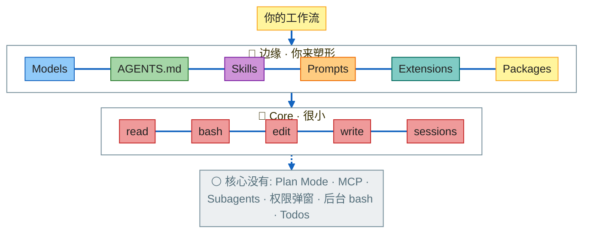
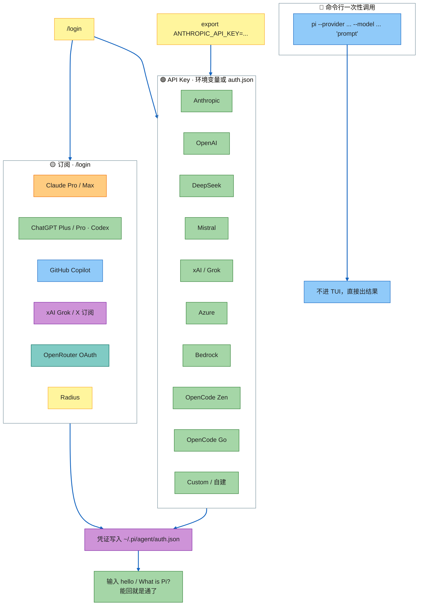
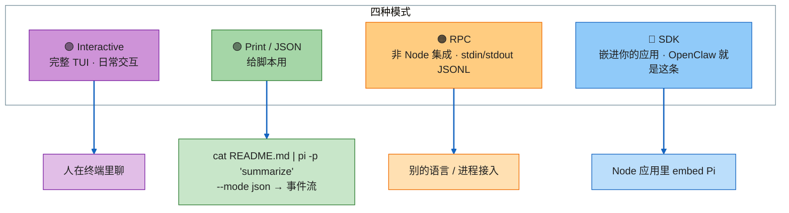
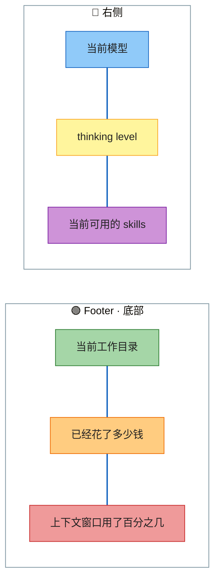
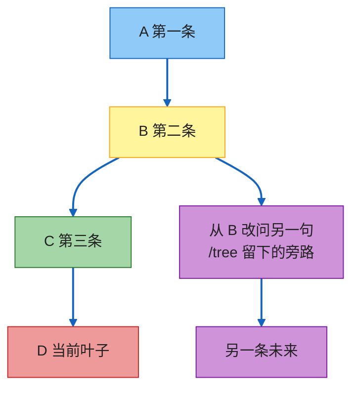
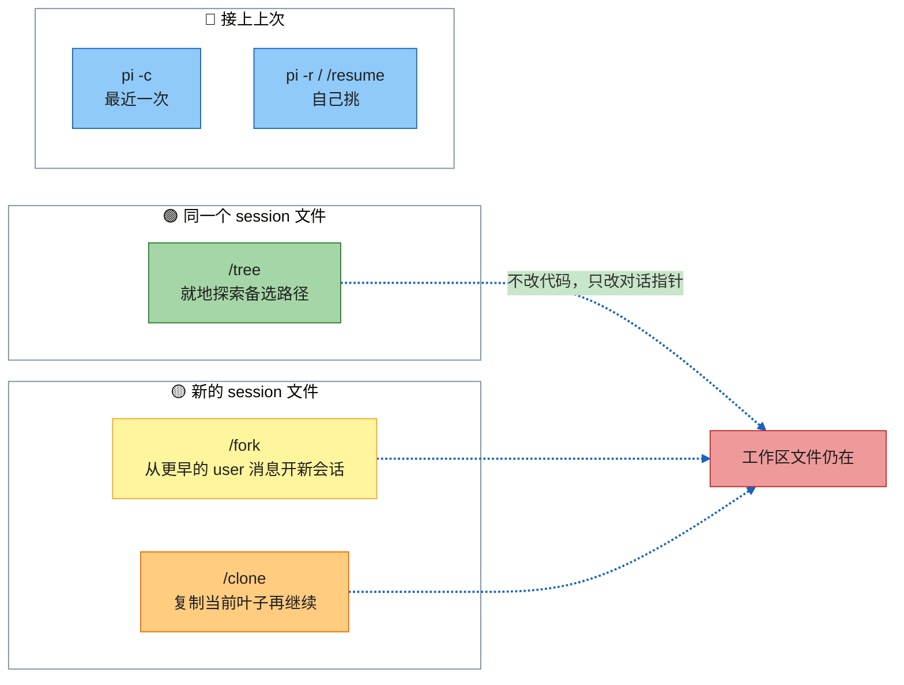
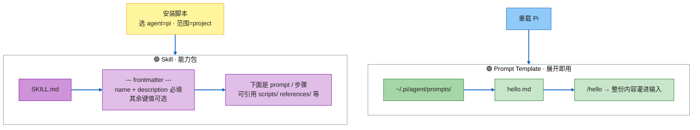

# Pi 上手指南

> 一句话：**别人在堆功能，Pi 只给最小核心；你按自己的工作流去塑形它，而不是反过来迁就它。**

官方入口：[pi.dev](https://pi.dev) · 文档：[pi.dev/docs/latest](https://pi.dev/docs/latest) · 包库：[pi.dev/packages](https://pi.dev/packages)

---

## 讲解目录

| 模块 | 你要带走什么 |
|------|----------------|
| [1. Introduction & The Philosophy of Pi](#1-introduction--the-philosophy-of-pi) | 为什么极简反而火；核心 5 件 vs 边缘可编程 |
| [2. Setup: Installation](#2-setup-installation-for-mac-linux-and-windows) | Mac / Linux / WSL / 原生 Windows 分别怎么装 |
| [3. Connecting LLM Providers](#3-connecting-llm-providers-openai-anthropic-etc) | 订阅 / API Key / CLI 一次性调用 / `/login` |
| [4. Navigation & Essential Commands](#4-navigation--essential-commands) | 每天都用的快捷键、`!` vs `!!`、`/settings` |
| [5. Exploring Operating Modes](#5-exploring-pis-different-operating-modes) | Interactive / Print+JSON / RPC / SDK + 状态栏 |
| [6. Sessions, Branching, Recovering](#6-sessions-branching-and-recovering-history) | 会话是树；`-c` / `-r`；`/tree` `/fork` `/clone`；两种 undo |
| [7. Extending: Skills & Prompt Templates](#7-extending-pi-skills-and-prompt-templates) | 改上下文、Skill vs Prompt Template |
| [8. Packages & Customizing the UI](#8-using-packages--customizing-the-ui) | 七层扩展、官方包库、Pi 故意不做的事 |

---

## 1. Introduction & The Philosophy of Pi

这是 **Pi**：一个极简的终端编程 harness。

当几乎所有公司都在拼命往产品里塞新功能时，Pi 走了相反的路——**只给你最少的东西**。结果是：GitHub 超过 **4.55 万 star**，npm 每周超过 **250 万次下载**。连当下最热的编码 agent 之一 **OpenClaw**，也选择接入 Pi，用它来驱动自己的 AI agent 能力。

热度的真正原因不是功能清单，而是哲学：

> **Pi 期望你去适配它、塑形它，而不是反过来让你迁就它。**

读完这八个模块，你就能判断：这是不是一个能真正变成「你自己的 harness」的工具。哲学这一块的核心句是：

**Pi = 很小的核心 + 可编程的边缘。**

### 核心里只有这五件事

这五件事就是 Pi 本身：

| 能力 | 做什么 |
|------|--------|
| **read** | 读文件 |
| **bash** | 跑 shell |
| **edit** | 改文件（patch） |
| **write** | 写 / 覆盖文件 |
| **sessions** | 会话（可回退、可分叉、可恢复） |

一眼扫过去你会发现：几乎所有别的 AI 编程工具都有的东西，**Pi 核心里没有**——**没有内置 Plan Mode**。

这让 vibe coding 更快（多数人本来就是这么干的）。如果你需要计划模式，可以装一个 plan mode 扩展，后面会讲怎么扩。

### 核心之外全是你的

模型、`AGENTS.md`、Skills、Prompts、Extensions——这些都在核心外面。你用它们改核心的行为。

整套设计围着一句话转：

> **核心之外你还需要什么，就自己造。按你的需要塑形工具，再分享给别人。**

这样得到的是一个**高度个人化的 agent**：只包含你需要的，不包含你不想要的。



**为什么没有 Plan Mode 也成立**：核心只保证「读 / 写 / 改 / 跑 / 记住会话」。计划、权限、子 agent、MCP 都是工作流偏好，不该强制塞进每一次 API 调用。需要就装；不需要就不付那笔注意力税。

---

## 2. Setup: Installation for Mac, Linux, and Windows


---

## 3. Connecting LLM Providers (OpenAI, Anthropic, etc.)

装好之后，连模型有好几条路。

### 连模型的三条大路



### 1) 订阅

常用订阅登录：

- **Claude Pro / Max**。如果 Claude 发现调用方不是自家客户端，**会单独计费**（官方说法：第三方 harness 走 extra usage，按 token 计，不吃套餐限额）。
- **ChatGPT Plus / Pro**（Codex）。
- **GitHub Copilot**。

另外还有：xAI（Grok/X 订阅）、OpenRouter OAuth、Radius。

### 2) API Key

常用提供商：Anthropic、OpenAI、Grok、Mistral、xAI、Azure、Bedrock，以及 **custom**。

完整目录还包括 DeepSeek、Gemini、Groq、Cerebras、OpenRouter、Vercel AI Gateway、Hugging Face、Fireworks、Together、MiniMax、Kimi、Qwen Token Plan，以及 **OpenCode Zen / OpenCode Go**。

两种写法：

```bash
export ANTHROPIC_API_KEY=sk-ant-...
pi
```

或在 TUI 里 `/login`，选 API-key 提供商，把 key 存进 `~/.pi/agent/auth.json`。

### 3) 命令行直接跑 prompt

Pi 支持不进交互界面、直接在命令行带上 provider、model 和 prompt。文档 Usage 页的 Examples 里有更多写法，Provider 列表也在同一套文档里。

### 操作：`/login` → ChatGPT 订阅

1. 跑 `/login`。
2. 选订阅，例如 ChatGPT。
3. 浏览器打开 OpenAI 登录 → 可能要验证身份 → Continue。
4. 终端出现 **authentication successful / logged in**，凭证已保存。
5. 测一句：`hello`，再问 `Hello, what is Pi?` ——能回就是通了。

`/logout` 清凭证。Token 在 `~/.pi/agent/auth.json`，过期会自动刷新（OpenRouter 那条是用户自己控的 API key，不会自动过期）。

---

## 4. Navigation & Essential Commands

这些快捷键值得背，日常几乎每天都用。

全部快捷键可在 `/hotkeys` 里查看，也可改 `~/.pi/agent/keybindings.json`。下面先记高频绑定，再补日常还会碰到的键。

### 模型与思考

| 按键 | 做什么 | 效果 |
|------|--------|------|
| **Ctrl+L** | 打开模型选择器 | 可切到例如 GPT 5.1，再切回 GPT 5.5 |
| **Ctrl+P** | 循环下一个模型 | 状态栏顶部的模型名跟着变 |
| **Shift+Ctrl+P** | 循环上一个 | 反向循环 |
| **Shift+Tab** | 循环 thinking level | 常见档位含 **medium** |
| **Ctrl+T** | 折叠 / 展开思考块 | 只改显示，不改模型 |

`/scoped-models` 可以决定 Ctrl+P 循环里有哪些模型。

### `!` vs `!!`：在 TUI 里跑 shell、又不想喂给模型

用 **Ctrl+G** 打开外部编辑器前，往往要先配环境变量。Pi 可能给出一条需要在当前终端执行的命令。问题是：**在 Pi 的输入框里怎么跑这条命令、还不把输出喂给模型？**

GitHub README / 文档的 Editor 一节：

| 前缀 | 行为 |
|------|------|
| `!command` | 执行，**把 stdout 发给 LLM** |
| `!!command` | 执行，**不发给 LLM** |

这里不需要模型看到输出 → 用 **两个感叹号**，回车。

如果当前会话里 Ctrl+G 仍不生效，**新开一个终端**再试：Ctrl+G → 例如 **VS Code 打开** → 「Manage trust this window」→ 在编辑器里写 prompt → 保存关闭 → 文本回到 Pi 输入框。

**为什么要外部编辑器**：prompt 需要多想一会儿、要对照一份 prompt 库、或者不想在 TUI 里长贴长打时，在真正的编辑器里写完再灌回来更轻松。

Ctrl+G 的解析顺序：`externalEditor` 设置 → `$VISUAL` → `$EDITOR` → Windows 上 Notepad / 其他系统 nano。

### `/settings`

输入 `/settings` 进设置面板。常见项：

- **auto compact**（上下文自动压缩）
- **auto resize images**（图片自动缩到上限，默认 2000×2000）
- **block images**
- **scale commands**
- 大约 **21 项**
- **theme**：可以改主题（含 dark / light）

其它常用斜杠命令：`/login` `/logout` `/model` `/resume` `/new` `/tree` `/fork` `/clone` `/reload` `/hotkeys` `/quit`。

### 日常还会碰到的键

| 按键 | 做什么 |
|------|--------|
| **Enter** | 提交；agent 还在跑时会排队 steering message |
| **Shift+Enter** / **Ctrl+J** | 换行（Windows Terminal 常用 Ctrl+Enter） |
| **Ctrl+C** | 第一次清输入，第二次退出 |
| **Ctrl+D** | 输入为空时退出 |
| **Escape** | 取消 / 中止当前回合 |
| **Ctrl+O** | 折叠 / 展开 tool 输出；启动头也可以展开技能/扩展列表 |
| **Ctrl+X** | 复制上一条 assistant 消息（`/tree` 里复制选中消息） |
| **Ctrl+V** | 粘贴图片或文本（Windows 上是 **Alt+V**） |
| **@** | 模糊搜索项目文件 |
| **Tab** | 路径补全 |
| **Alt+Enter** | 排队 follow-up（Windows Terminal 默认可能是全屏，要重映射） |
| **Alt+Up** | 把排队消息取回编辑器 |

全部可在 `~/.pi/agent/keybindings.json` 改；改完 `/reload` 即可，不必重启会话。

---

## 5. Exploring Pi’s Different Operating Modes

Pi 有 **四种运行模式**。



| 模式 | 给谁用 | 怎么用 |
|------|--------|--------|
| **Interactive** | 人 | 完整 TUI，前面所有操作都是这个 |
| **Print / JSON** | 脚本 | `cat` 一份 README，管道进 Pi 做 summarize；加 `--mode json` 会打出处理过程的 JSON 事件流 |
| **RPC** | 非 Node 集成 | stdin/stdout JSONL |
| **SDK** | 把 Pi 嵌进应用 | 例如 **OpenClaw** 就是这种用法 |

Print 模式的具体形状：

```bash
# 不先启动 TUI，直接把文件内容交给 Pi 总结
cat README.md | pi -p "Summarize this text"

# 同一条，要 JSON 事件流
cat README.md | pi --mode json -p "Summarize this text"
```

发生了什么：README 被送给 Pi 里的模型，终端打印模型的总结；JSON 模式则是同一过程的结构化事件流。

### 状态栏读什么

TUI 底部 / 右侧是日常「还剩多少钱、窗口满了没」的仪表盘：



界面拆成四块：

1. **Startup header** — 快捷键、已加载的 context 文件、prompt templates、skills、extensions
2. **Messages** — 用户消息、回复、tool 调用/结果、通知、错误、扩展 UI
3. **Editor** — 你打字的地方；边框颜色表示 thinking level
4. **Footer** — 工作目录、会话名、token/cache、花费、上下文占用、当前模型。总量包含 assistant 回复、工具上报的 usage、以及摘要生成。

状态栏里列出的 skills 可能来自其它 harness（例如 OpenCode）装进同一台机器的技能，**不一定是 Pi 自带的**。

---

## 6. Sessions, Branching, and Recovering History

这一节讲：会话怎么工作、对话怎么接、怎么从上次停下的地方继续、怎么 undo。

### 会话是树，不是一条直线

Sessions 是可以回去、可以分叉的 **树**。

想象：第一条消息 A → 第二条 B → 第三条 C → 到了 D 你突然想：**回到 B，但从 B 问一个不同的问题**。这就是 `/tree` 做的事：跳到更早的消息，编辑，重新提交。**备选路径仍写在同一个 session 文件里。**



落盘位置：`~/.pi/agent/sessions/`，按工作目录组织，每个会话一个 **JSONL**，树结构（每条有 `id` + `parentId`，当前位置是 active leaf）。

### 恢复、挑选、删除

| 做法 | 作用 |
|------|------|
| `pi -c` | 继续**最近一次**会话 |
| `pi -r` | 打开会话选择器（和 TUI 里 `/resume` 同一套） |
| `/fork` | 从旧的某条 user prompt **新建**一个 session 文件 |
| `/clone` | 把**当前这条分支、当前这个点**复制成新 session |
| `/tree` | 在**同一个** session 文件里跳转 / 分叉 |
| `pi --no-session` | 临时会话，不落盘 |
| `pi --name "my task"` | 启动时起显示名 |

操作示例：

1. 让 Pi 做一个基础 **Flask server** → 能看到思考过程和它跑了哪些步骤。
2. 再让它加一条路径 `/hello`，页面只显示 hello。检查代码，这些路径都在。
3. **Ctrl+C 两次**停掉会话，清屏。
4. 再跑 `pi -c` → **同一段会话完整回来**。
5. 跑 `pi -r` → 看到所有会话。
   - **Tab**：在「当前文件夹」和「全部」之间切。
   - **Ctrl+S**：排序（threaded / recent / fuzzy）。
   - 选中一条 **Ctrl+D**，回车确认 → 会话被删。
6. 回到刚才那次对话，跑 `/fork`，选**第二条消息**。原来是「做 `/hello`」，现在改成「做 `/goodbye`」。
7. 结果：**hello 路径还在**，只是又加了 goodbye。

> **`/fork` 撤销的是对话历史，不是磁盘上的代码改动。**

如果不要分叉到更早，只想「就在当前点复制一份再继续」，用 **`/clone`**。

选择器还支持：打字搜索、**Ctrl+P** 切换是否显示路径、**Ctrl+N** 只看已命名会话、**Ctrl+R** 重命名。能用的话删除会走 `trash` CLI，而不是直接永久删文件。



对照表：

| | `/tree` | `/fork` | `/clone` |
|--|---------|---------|----------|
| 输出 | 同一 session 文件 | 新文件 | 新文件 |
| 视图 | 整棵树 | 只选 user 消息 | 当前 active 分支 |
| 典型用途 | 备选方案放一起 | 从更早的 prompt 另开一局 | 继续前先复制当前进度 |
| 分支摘要 | 可选 | 无 | 无 |

`/tree` 切走一条旁路时，Pi 可以给被放弃的分支做摘要，挂到新位置上，免得上下文丢光。提示里三项：不要摘要 / 默认 prompt 摘要 / 自定义焦点摘要。

### Undo 是两个词

有了 Flask 那个例子，就能分清：

| 种类 | 工具 | 改什么 |
|------|------|--------|
| **Prompt undo** | `/tree`、`/fork` | 对话历史 / 会话树指针 |
| **File undo** | **Git**，或 checkpoint 类扩展 | 工作区里的文件 |

**Pi 开箱不支持撤销文件改动。** 跑之前如果还想回去，先把东西提交进 Git。

`/tree` 选中行为（文档，帮助理解「跳回去再提交」）：

- 选 **user / custom 消息**：叶子移到它的 parent，原文进编辑器，改完重提 = 新分支。
- 选 **assistant / tool / compaction**：叶子移到那条，编辑器空着，从那点继续。
- 选 **根 user 消息**：对话清空，原 prompt 回到编辑器。

---

## 7. Extending Pi: Skills and Prompt Templates

先改上下文，再谈 Skill 和 Prompt Template——它们解决的是不同问题。

### 启动时 Context 怎么拼

```mermaid
%%{init: {
  "theme": "base",
  "themeVariables": {
    "fontSize": "15px",
    "lineColor": "#1565C0",
    "clusterBkg": "transparent",
    "clusterBorder": "#78909C",
    "edgeLabelBackground": "#BBDEFB"
  }
}}%%
flowchart TB
    subgraph Default["🔴 默认 system prompt"]
        SP["system.md 可整份替换"]
        AP["append-system.md 往默认后面追加"]
        META["自动注入：当前日期 + 当前工作目录"]
    end

    subgraph Rules["🟢 行为说明书"]
        G["~/.pi/agent/AGENTS.md<br/>全局"]
        P["项目里的 AGENTS.md 或 CLAUDE.md<br/>从父目录到 cwd"]
        O["某目录有 AGENTS.override.md<br/>则覆盖该目录的 AGENTS/CLAUDE"]
    end

    subgraph Caps["🔵 按需能力"]
        SK["Skills · 可复用能力包"]
        PT["Prompt templates · 斜杠展开"]
    end

    SP --> CTX["发给模型的 Context"]
    AP --> CTX
    META --> CTX
    G --> CTX
    P --> CTX
    O --> CTX
    SK --> CTX
    PT --> EDITOR["进编辑器，不是改 system prompt"]

    style SP fill:#EF9A9A,stroke:#C62828,color:#212121
    style AP fill:#EF9A9A,stroke:#C62828,color:#212121
    style META fill:#FFCC80,stroke:#EF6C00,color:#212121
    style G fill:#A5D6A7,stroke:#2E7D32,color:#212121
    style P fill:#A5D6A7,stroke:#2E7D32,color:#212121
    style O fill:#C8E6C9,stroke:#2E7D32,color:#212121
    style SK fill:#CE93D8,stroke:#7B1FA2,color:#212121
    style PT fill:#90CAF9,stroke:#1565C0,color:#212121
    style CTX fill:#FFF59D,stroke:#F9A825,color:#212121
    style EDITOR fill:#BBDEFB,stroke:#1565C0,color:#212121
    linkStyle default stroke:#1565C0,stroke-width:2px
```



规则逐条：

1. **`append-system.md`**：追加到默认 prompt 后面。
2. **`AGENTS.md` 或 `CLAUDE.md`**：告诉它你希望它怎么表现。
3. **Skills**：给 agent 加能力。
4. 默认 prompt 加载时还会带上 **当前日期** 和 **当前工作目录**。
5. 全局改动：去 **`.pi` 文件夹 → `agent/`**，放 `AGENTS.md`。项目级规则放在项目目录。
6. 用 `system.md` **整份替换**默认 system prompt；用 `append-system.md` **追加**。
7. 细节在文档 Usage。想看默认 prompt 怎么拼，去 GitHub 上的 **`system prompt.ts`**。

改完 context 文件：重启 Pi，或 `/reload`。

### Skill vs Prompt Template

| | **Skill** | **Prompt Template** |
|--|-----------|---------------------|
| 解决什么 | **可复用能力打包**：工作流、setup、脚本、reference | **保存下来的 prompt**，用斜杠命令展开 |
| 模型看见什么 | 启动时只进 name + description；匹配任务后再 `read` 全文（progressive disclosure） | 斜杠一下，模型直接看到**整份 prompt** |
| 最小形态 | 一个文件夹，必须有 `SKILL.md`；frontmatter 里 **只要 name + description** | `~/.pi/agent/prompts/*.md`，文件名就是命令名 |
| 调用 | `/skill:name`（可带参数） | `/hello` 这种 `/文件名` |



### 安装一个 Skill

以 **「skill planning with files」** 为例：教 agent 用类似 **Manus** 的方式工作。这类 skill 通常带安装脚本。

如果只想装到当前项目、不要全局，安装时去掉全局标志，在项目目录里跑：

1. 问装给哪个 agent → 选 **pi**。
2. 选范围 → **project**。
3. 项目里出现 agents 文件夹。每个 skill = 一个文件夹，**必须有 `SKILL.md`**。
4. 这个例子很复杂、字段很多，但真正必填的只有 **name** 和 **description**。
5. 两段三短横线之间叫 **frontmatter**（key-value）；下面整段就是 prompt，可能引用文件/文件夹，告诉模型怎么完成某类任务。

Skill 扫描位置：

- 全局：`~/.pi/agent/skills/`、`~/.agents/skills/`
- 项目（需 trust）：`.pi/skills/`、cwd 及祖先的 `.agents/skills/`
- 包、settings 的 `skills` 数组、CLI `--skill`
- 也可把 Claude Code / Codex 的 skill 目录加进 settings

**安全**：skill 可以让模型做任何事，也可以带可执行代码。装之前先读内容。

### 写一个 Prompt Template

「简化版 skill」其实就是 prompt template：保存的 prompt，用斜杠命令展开，模型看到全文。

1. 在 `.pi` 下建 `prompts/`，放入命令 markdown。
2. 例如写一个内容只有 `hello there` 的 `hello.md`。
3. 重载 Pi → 顶部能看到可用 prompts。
4. 跑 `/hello` → 整份 prompt 填进来。

模板文件名 = 命令名：`review.md` → `/review`。可选 frontmatter：`description`、`argument-hint`。参数：`$1` `$2` `$@` / `$ARGUMENTS`，以及 `${1:-default}` 这类默认值。

---

## 8. Using Packages & Customizing the UI

Skill 和模板只是扩展面的一部分。Pi 真正能改的东西很多。

### 扩展面

| 你能做的 | 效果 |
|----------|------|
| **Tools** | LLM 可以调用的新工具 |
| **Commands** | 斜杠命令（上一节） |
| **拦截事件** | 拦截 turn 和 tool call |
| **改 state** | 会话如何持久化 |
| **Providers** | 换模型 = 换行为 |
| **改 UI** | 主题、自定义 TUI 组件 |

懒得自己造：看 GitHub 官方 examples，或去包库 **[pi.dev/packages](https://pi.dev/packages)**。

包库里常见的包：

- **context mode** — MCP 插件，号称能省 **98%** 上下文窗口
- **Pi subagents**
- **Pi MCP adapter**
- **Pi web search**

```mermaid
%%{init: {
  "theme": "base",
  "themeVariables": {
    "fontSize": "15px",
    "lineColor": "#1565C0",
    "clusterBkg": "transparent",
    "clusterBorder": "#78909C",
    "edgeLabelBackground": "#BBDEFB"
  }
}}%%
flowchart TB
    subgraph Seven["七层 · 每天用的工作流就做成其中一层"]
        L1["① settings.json<br/>改默认"]
        L2["② AGENTS.md<br/>项目规则"]
        L3["③ system.md<br/>替换 agent 身份 / 默认 system prompt"]
        L4["④ Prompt template<br/>重复同一段 prompt"]
        L5["⑤ Skill<br/>加能力"]
        L6["⑥ Extension<br/>改行为 · 工具 · 事件 · UI"]
        L7["⑦ Package<br/>打包分享"]
    end

    L1 --> L2 --> L3 --> L4 --> L5 --> L6 --> L7

    style L1 fill:#FFF59D,stroke:#F9A825,color:#212121
    style L2 fill:#A5D6A7,stroke:#2E7D32,color:#212121
    style L3 fill:#EF9A9A,stroke:#C62828,color:#212121
    style L4 fill:#90CAF9,stroke:#1565C0,color:#212121
    style L5 fill:#CE93D8,stroke:#7B1FA2,color:#212121
    style L6 fill:#80CBC4,stroke:#00695C,color:#212121
    style L7 fill:#FFCC80,stroke:#EF6C00,color:#212121
    linkStyle default stroke:#1565C0,stroke-width:2px
```



主规则：

> **每天都要用的工作流，就做成 template、skill、extension 或 package。**

七层分别是：

1. **`settings.json`** — 改默认（见文档 Settings）
2. **`AGENTS.md`** — 项目规则
3. **`system.md`** — 换掉默认 system prompt，等于换 agent 身份
4. **Prompt template** — 重复同一段 prompt
5. **Skill** — 加能力
6. **Extension** — 改行为
7. **Package** — 分享你做的东西

怎么写自己的 package：文档 Packages 节。`settings.json`：文档 Settings 节。

### Pi 故意不做、别的工具常做的事

| 没有 | 含义 |
|------|------|
| 内置 MCP | 用包 / 适配器补 |
| Subagents | 用包补 |
| 权限弹窗 | 用 extension 自己做门闩 |
| 后台 bash | 核心 bash 是同步的 |
| Todos | 用 stateful extension |
| Plan mode | 用扩展补 |

Extension 能做的事：自定义工具、拦截 tool call、`ctx.ui` 问用户、完整自定义 TUI 组件、注册 `/mycommand`、`pi.appendEntry()` 跨重启存状态、自定义 tool/消息怎么渲染。典型用例：危险命令确认、每回合 git stash、挡住 `.env` 写入、自定义 compaction、todo list、文件监听。

包怎么装：

```bash
pi install npm:@foo/bar@1.0.0
pi install git:github.com/user/repo@v1
pi list
pi remove npm:@foo/bar
pi -e npm:@foo/bar          # 本次运行临时试，不写入 settings
```

默认写用户 settings `~/.pi/agent/settings.json`；`-l` 写项目 `.pi/settings.json`。**第三方包拥有完整系统权限**，装前读源码。

### 收束

到这里，日常用法已经够深：哲学（小核心 + 可编程边缘）→ 安装 → 连模型 → 快捷键与 `!`/`!!` → 四种模式 → 会话树与两种 undo → Skill/模板 → 七层扩展和包库。

若要把「核心为什么长这样」再往下挖一层（Agent Loop、Compact、TUI 差分渲染），接 [01.arch.md](01.arch.md)。
