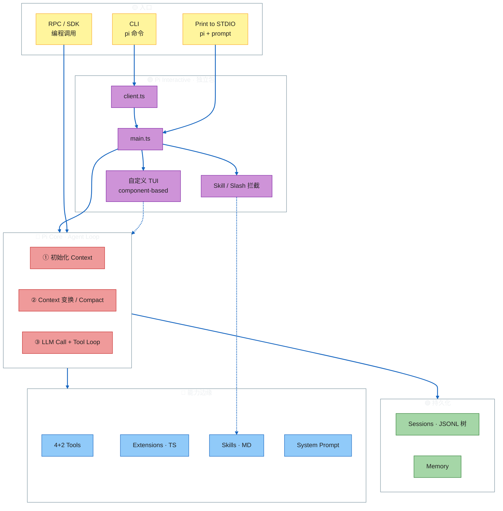
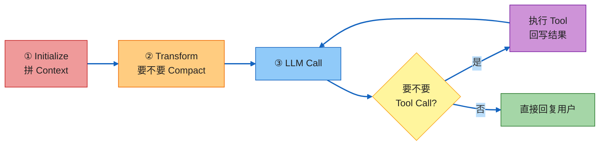
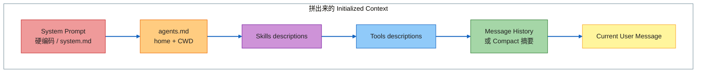
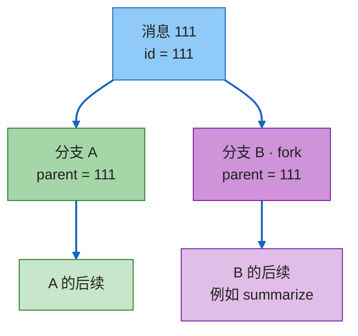
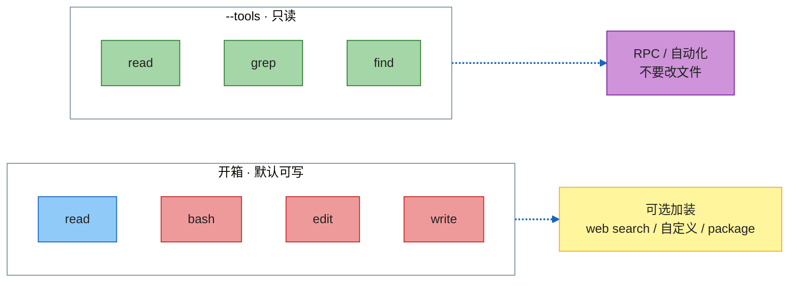
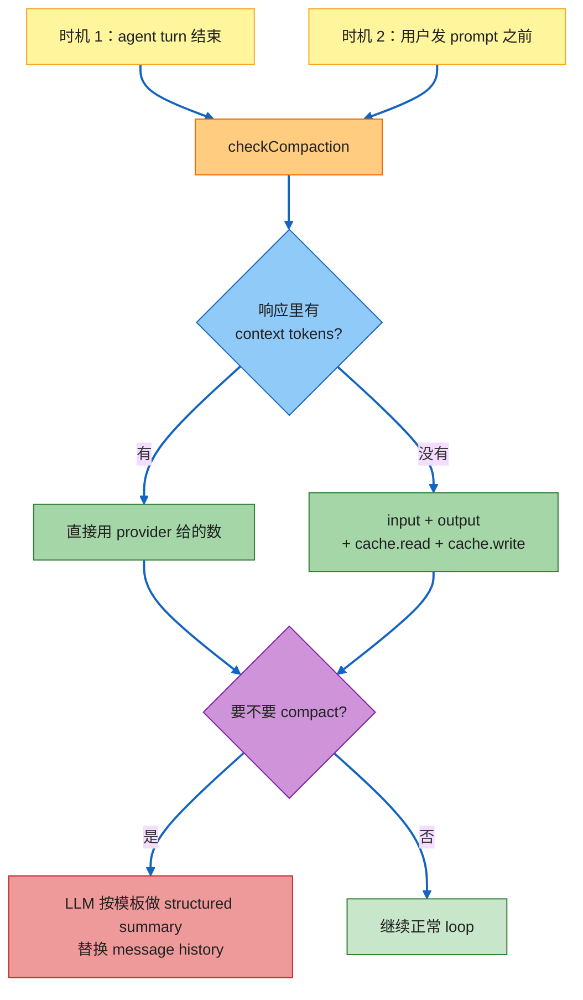
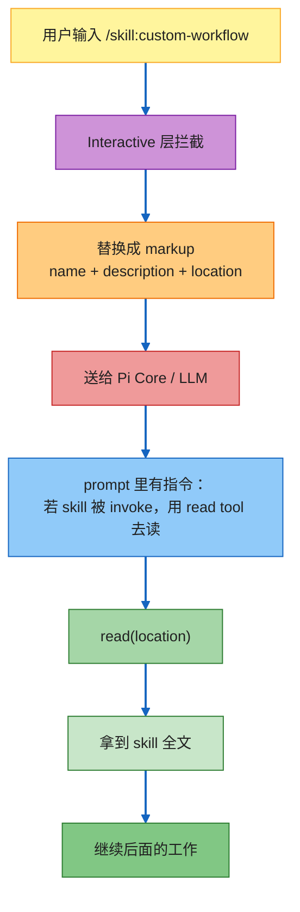

# Pi Agent — Architecture Map

> 来源：Pi 全架构讲解（iPad 录制版）  
> 一句话：**Pi 极简、从零手写；核心只做 Agent Loop，能力长在 Interactive / Extensions / Skills 边缘。**

## 讲解目录

两大块：

1. **Pi Core** — 背后跑的 agentic loop，也可经 RPC / SDK 以编程方式调用
2. **Pi Interactive** — 终端用户界面（TUI）叠加上去的功能

| # | 章节 | 要点 |
|---|------|------|
| [0](#0-全景) | 全景 | Core / Interactive / 持久化 / 能力边缘 |
| [1](#1-pi-core--agent-loop) | Pi Core — Agent Loop | 拼 Context → Compact → LLM + Tool 循环 |
| [2](#2-sessions-与-memory) | Sessions 与 Memory | 按工作目录落盘，可导出 / 回退 / fork |
| [3](#3-tools) | Tools | 开箱 4 个 + 只读 2 个 |
| [4](#4-extensions) | Extensions | TS 包，改行为 |
| [5](#5-system-prompt-与-skillscore-侧) | System Prompt 与 Skills | Core 侧怎么拼 prompt |
| [6](#6-pi-interactive--和-core-怎么接) | Pi Interactive 怎么接 Core | 独立包，三种运行模式 |
| [7](#7-terminal-user-interface) | TUI | 自研、component-based、不闪屏 |
| [8](#8-compaction) | Compaction | 不估 chars/4，信 usage |
| [9](#9-skills-与-custom-promptsinteractive-层) | Skills 与 Custom Prompts | Interactive 层拦截 |
| [10](#10-对照速查) | 对照速查 | 一张表收齐设计选择 |
| [11](#11-收束) | 收束 | 够上手，也够自己做一版 |

---

## 0. 全景



**设计立场**：Pi 的主设计就是 Agent Core（也就是 Agent Loop）。整条 loop **从零手写**，没有套 OpenAI Agents SDK、Vercel AI SDK 这类「预装 agentic loop」的库。看起来步骤少，实现并不简单。这是一个很适合自学、也适合自己动手做一个的教育项目。

---

## 1. Pi Core — Agent Loop

每次你跟 Pi 开一段对话、发一条消息，背后都会走完下面三步。



复杂任务可以打出 **上百次** tool call；搜一下网页可能只要几次。模型自己决定「不再需要工具」时，才给出最终回复。这就是 Pi 的 agentic loop 全部内容。

---

### 1.1 第一步：初始化 Context

打开 Pi、发出第一条消息后，先把下面这些东西拼成一份 context：

| 顺序 | 拼进去的东西 | 细节 |
|------|-------------|------|
| 1 | **System Prompt** | 硬编码在 Pi 里。极简，就几行指令，**别再试图更短了**。可在 workspace 里写自己的 `system.md` 覆盖 |
| 2 | **agents.md** | 同时加载 **home** 和 **当前工作目录** 里的 `agents.md`（注意：不是 `.agents.md`）。文件太多会把 system prompt 撑爆 |
| 3 | **Skills 描述** | 已加载 skill 的 **description**（不是全文） |
| 4 | **Tools 描述** | 全部 tool description |
| 5 | **消息历史 + 当前消息** | 新对话：没有历史。进行中：完整历史。已被 compact：历史可被 **摘要** 替换 |



---

### 1.2 第二步：Context 变换（Transformation / Compact）

看刚拼好的 context，判断要不要 compact。

- **需要 compact**：用 LLM 把历史消息摘要掉，**用摘要替换**原来的 message history
- Compact 的含义：把历史里的全部消息交给 LLM 做 summarize

（更细的触发时机、token 算法、摘要模板见第 8 节。）

---

### 1.3 第三步：LLM Call + Tool Loop

调用你选的 provider，例如：

- OpenAI GPT-5
- Anthropic 系列
- Kimi
- MiniMax
- ……任意你配的模型

然后进入循环：

1. 模型若要改文件 / 读文件 / 搜网 → 返回 **tool call**
2. Tool 执行后把结果回给模型
3. 模型可以再发起下一次 tool call
4. 模型认为不需要工具了 → 直接回复用户

整条 loop **完全自定义**，没有额外库帮忙搭。对比：OpenAI Agents SDK、Vercel AI SDK 这类库已经预装了 agentic loop，import 就能用。Pi 选择自己写。

---

## 2. Sessions 与 Memory

这是讲解者最喜欢的部分之一：导出 session、在 session 里回退到某一步、fork，都非常直接、设计干净。

### 2.1 存在哪

Session 存在 **home 目录** 下：

```text
~/.../agent/sessions/
├── <标准化后的工作目录路径 A>/     # 例如你做过 dashboard
│   └── <session-id>.jsonl
├── <标准化后的工作目录路径 B>/     # 例如你做过 weather-app
│   └── <session-id>.jsonl
└── ...
```

演示里的真实路径形态（讲者本机）：

```text
.../Users/Alejandro/Agent/Skills/Video-Tool/...
```

目录名不是原始文件夹名，而是把 **工作目录路径标准化** 之后的映射。每个工作目录下面可以有多个 session（各自一份 ID）。

### 2.2 为什么是 JSONL，不是 JSON 数组

每个 session 是一份 **JSONL**（JSON Lines）：

- 每一行一个 JSON 对象（一条消息）
- 不是「一个大 JSON 数组包住所有消息」

新消息来了，只要 **append 最后一行**。如果是数组，每次都要改整份文件里的某一段。JSONL 更新成本低得多。

每条对象大致包含：

| 字段 | 作用 |
|------|------|
| `type` / `role` | 消息类型：user / assistant / tool call 等 |
| `id` | 本条消息 ID |
| `parent` / `parentId` | 父消息 ID，用来长成树 |
| `timestamp` | 时间戳 |
| 消息正文 | 实际内容 |

用 VS Code 打开就能看到：每一行就是一条完整消息，以 `{` 开头、`}` 结尾。

---

### 2.3 Session 不是列表，是树

Session **不是** `list[message]`，而是一棵 **session tree**。TUI 里用 `/tree` 在树上导航，原因就在这里。

每条消息除了 `role` / 正文，还有：

- **`id`**
- **`parent`**：指向它分叉出来的那条父消息



同一条父消息可以长出两条子消息 → 两段 **fork 出来的对话**。整棵树仍然写在 **同一个 JSONL 文件** 里。

`/tree` 做的事：沿这份 JSONL **纵向**走消息列表。一条消息可以是 tool call、user、assistant……你选中某条（例如「把前面对话 summarize」），Pi 会：

1. 在 JSONL **末尾 append 一条新消息**
2. 把它的 parent 设成你分叉点上的那条
3. 旧分支的消息 **还在同一个文件 / 同一份列表里**，没有删

再开 `/tree`，就能看到分叉：一边是原来的对话，一边是 summary，可以从 summary 接着干。

> 很多 AI agent 正在从「一条接一条的线性列表」迁到这种 **tree 设计**。后面新出的 agent 会越来越常见。

---

## 3. Tools

Pi 是极简 agent，默认工具列表同样极简。

### 3.1 开箱 4 个

| 工具 | 作用 |
|------|------|
| `read` | 读文件 |
| `bash` | 跑命令 |
| `edit` | 改文件 |
| `write` | 写文件 |

就这四个，没有更多。

你可以：

- 让 Pi 自己写一个新 tool
- 装 package 给它加 tool
- 讲者自己几乎总会再装一个 **web search**，这是他的「真·极简套装」

### 3.2 另外两个：grep / find（默认关）

很少被提到：其实还有 **`grep`** 和 **`find`**。

- 能力上，bash 本来也能做同样的事
- **默认 disabled**
- 设计用途：只在 **只读模式** 下打开

只读场景你通常 **不想给 bash**。用 `--tools` 显式点名：

```bash
pi --tools read,grep,find
```

得到一个只读 Pi：能读、能搜、能找，不能改文件。

这对 **编程方式跑 Pi** 特别有用——例如走 **RPC** 自动化几段工作流时，你往往不希望 Pi 改你的文件。



---

## 4. Extensions

Extensions 是可以装到 Pi 上、用来改行为的 **现成 package**。

Pi 默认极简：只有 4 个 tool，**不带 MCP、不带 web search**。Extensions 就是往上叠这些能力的方式。

### 4.1 能做什么

| 能力 | 说明 |
|------|------|
| **Register new tools** | 注册新工具 |
| **Subscribe to events** | 订阅事件。整条对话 workflow 的每一步都会抛事件，例如 `tool call`、`agent response`、`user message`。扩展可以在 loop 的特定时刻做事 |
| **Register commands** | 注册命令 |
| **Add keyboard shortcuts** | 加快捷键 |
| **Add CLI flags** | 加命令行 flag |
| **Update the system prompt** | 改 system prompt |
| **Render custom messages** | 渲染自定义消息 |

用 **TypeScript** 写。Pi 很模块化：加一个 extension、插到你要插的点，行为就被改掉。网站 packages 区可以看现成扩展。

### 4.2 安全

这些 package 会在你的机器上 **加载并执行代码**。

- 不要装不信任的第三方源
- 要用的话，至少先让 Pi / PyAgents **读一遍那个 package 的代码**，确认安全

---

## 5. System Prompt 与 Skills（Core 侧）

### 5.1 默认 system prompt 怎么拼

大约 **20 行**，非常短。默认结构：

```text
You are a helpful assistant, you are Pi
+ append-system.md 追加段
+ <skills> ... </skills> 列表（markup）
+ 当前日期
+ 当前工作目录
```

细节：

1. 开头身份：「你是一个 helpful assistant，你是 Pi」
2. 可用 `append-system.md` **追加**（不是覆盖）。文件放在 `.pi` / `.py` 目录里，追加在「You are Pi」那段后面
3. 然后列出 skills。用 markup 包起来，例如：

```xml
<skills>
  <skill>
    name / description / 它做什么
  </skill>
</skills>
```

   必须用 markup：**TUI 后面会 parse 这些标签**（见第 9 节）。
4. 再带上 **当前日期** 和 **当前工作目录（CWD）**

### 5.2 覆盖（override）的两种方式

| 方式 | 做法 |
|------|------|
| 文件覆盖 | 在 `.pi` 目录写自己的 `system.md` |
| CLI 覆盖 | `pi --system-prompt "...你的 prompt..."` |

默认创建流程如上；覆盖是另外两条路。

讲到这里，**Pi Core 基本讲完**。有这些信息，已经够你动手做一个自己的 Pi。

---

## 6. Pi Interactive — 和 Core 怎么接

Pi Interactive 是 **另一个完全独立的 package**，不在 Pi Core 包里。

| 层 | 它是什么 |
|----|---------|
| **Pi Core** | 就是 agent 本身（agentic loop） |
| **Pi Interactive** | 真正的 **coding agent** 那一层：CLI + TUI + slash / skill 拦截 |

Core 当然还能再往下挖，这里是一个合适的停手点，转去看 Interactive。

```mermaid
%%{init: {
  "theme": "base",
  "themeVariables": {
    "fontSize": "15px",
    "lineColor": "#1565C0",
    "clusterBkg": "transparent",
    "clusterBorder": "#78909C"
  }
}}%%
flowchart LR
    USER["用户在终端里敲 pi"] --> CLIENT["client.ts"]
    CLIENT --> TITLE["设 process title 等"]
    TITLE --> MAIN["调用 main.ts"]
    MAIN --> PARSE["解析 arguments"]
    PARSE --> CFG["resolve 配置<br/>自定义 working directory 等"]
    CFG --> EXT["加载 Extensions"]
    EXT --> SESS["创建 Agent Session<br/>这时才初始化 Pi Core"]
    SESS --> MODE{"运行模式"}
    MODE --> INT["interactive · TUI"]
    MODE --> RPC["RPC"]
    MODE --> PRINT["print to STDIO<br/>pi + 一行 prompt"]

    style USER fill:#FFF59D,stroke:#F9A825,color:#212121
    style CLIENT fill:#CE93D8,stroke:#7B1FA2,color:#212121
    style TITLE fill:#E1BEE7,stroke:#7B1FA2,color:#212121
    style MAIN fill:#CE93D8,stroke:#7B1FA2,color:#212121
    style PARSE fill:#90CAF9,stroke:#1565C0,color:#212121
    style CFG fill:#90CAF9,stroke:#1565C0,color:#212121
    style EXT fill:#FFCC80,stroke:#EF6C00,color:#212121
    style SESS fill:#EF9A9A,stroke:#C62828,color:#212121
    style MODE fill:#FFF59D,stroke:#F9A825,color:#212121
    style INT fill:#A5D6A7,stroke:#2E7D32,color:#212121
    style RPC fill:#A5D6A7,stroke:#2E7D32,color:#212121
    style PRINT fill:#A5D6A7,stroke:#2E7D32,color:#212121
    linkStyle default stroke:#1565C0,stroke-width:2px
```



### 6.1 CLI 入口：两个文件

新开 session、进 CLI，实际发生在两个文件里：

**`client.ts`**

- 接到 `pi` 命令
- 做一堆杂事，例如设置 process title
- 然后 **调用 `main`**

**`main.ts`**（真正有意思的地方）

1. **Parse arguments**
2. **Resolve configuration**：自定义 working directory 在哪，等等
3. **Load extensions**（模块化，所以在这里装）
4. **Create the agent session** —— 直到这一步，才真正初始化 Pi Core 组件
5. 按选中的模式跑：
   - **interactive**（TUI）
   - **RPC**
   - **print to STDIO**：命令行直接 `pi <你的 prompt>`

---

## 7. Terminal User Interface

TUI 本身也很直白、很模块化：

- 上面是 **messages**
- 中间 / 下面是 **input**
- 最底下一根信息条（bar）
- **不闪屏（no flicker）**
- 极简，但该用的都好用

### 为什么能做成这样

1. **完全自研**。不用 Textual 之类的 TUI 框架
2. **Component-based**：每个组件自己负责
   - 自己的 **rendering**
   - 自己的 **inputs**
   - 可以 **动态更新**
3. 可以订阅 Agent Core 抛出的各种事件
4. 开箱这套 TUI 是为 Pi 定制的；**不妨碍**你在上面再挂自己的 GUI / 另一套 TUI

---

## 8. Compaction

不同 agent 处理 compaction 的方式差很多。Pi 的做法不仅极简，而且简单、直觉。

### 8.1 不算「字符数 / 4」

有些 agent（尤其早期、还没拿到 LLM 回包时）会：

```text
token 约等于  全文字符数 / 4
```

这有时能用。**Pi 完全不这么干。**

Pi 只信 LLM **响应里带回的 usage**。启动时它假定你也不会一上来就丢一条超长消息。

### 8.2 何时检查：`checkCompaction`

在两个时机调用：

| 时机 | 含义 |
|------|------|
| **When an agent ends** | Agent 结束一轮 turn，给出 tool call 之后的真正回复（或本轮结束） |
| **Before the prompt** | 用户真正开始发下一条消息之前 |

目的：别让 context 太长，导致模型回复时撑爆 context window；一开始也不该把窗口塞满。

### 8.3 Token 怎么算

Agent 回复后，看响应里有多少 token。

- 部分 LLM provider 会在响应里直接带回 **context tokens** → **有就直接用**
- 没有的话，把 usage 里这几项 **加起来**：

| 字段 | 含义 |
|------|------|
| `usage.input` | 你输入了多少 token |
| `usage.output` | LLM 生成了多少 token |
| `usage` 里的 `cache.read` | 缓存读 |
| `usage` 里的 `cache.write` | 缓存写 |

每次 **agent 结束一轮** 或 **用户发 prompt 之前**，都用这套算法算当前 context。



### 8.4 摘要 prompt 长什么样

代码位置（演示里打开的路径）：

```text
packages/agent/src/harness/compaction/compactions.ts
```

里面有 **summarization system prompt**，大意：

> You are a context summarization assistant.  
> Your task is to read a conversation between a user and an AI assistant ...  
> The messages above are a conversation to summarize.  
> Create a **structured context checkpoint summary** that **another LLM** will use to continue the work.

要求的结构：

| 段落 | 内容 |
|------|------|
| **Goal** | 目标 |
| **Constraints and preferences** | 约束与偏好 |
| **Progress** | 已完成 / 进行中 / 被堵住 |
| **Key decisions** | agent 做过的关键决策 |
| **Next steps** | 下一步 |
| **Critical context** | 关键上下文（演示展开后还能看到 original request、early progress 等） |

约束：**每一段保持简洁**；**原样保留** 精确的文件路径、函数名、错误信息。

如果已经有一份 context summary，会用 **略有不同的 prompt** 去做「更新已有摘要」，而不是从零再写一份。

TUI 里可以主动让它 compact；`Ctrl-O` 展开就能看到完全按上述模板生成的摘要。

---

## 9. Skills 与 Custom Prompts（Interactive 层）

这两件事不一样，但处理方式很像。

| | Skills | Custom Prompts |
|--|--------|----------------|
| 是什么 | 带 frontmatter 的 Markdown 说明书 | 自定义 **slash commands** |
| 头部 | `name` + `description`，description 进 system prompt | 存在 Interactive 层 |
| 谁看见原文 | **Core / LLM 通过 read tool 自己读** | **永远到不了 Pi Core** |
| 触发 | `/skill:你的技能名`（演示里的写法） | `/你的命令` |

### 9.1 Custom Prompts：在 Interactive 层就替换完

你打出一个自定义 slash command → CLI 读到它 → **立刻替换成** 你存在 custom prompts 里的那段 prompt → 再交给后面。

Pi Core **从来看不到** `/xxx` 这个命令本身。这一点很重要。

### 9.2 Skills：不在 Interactive 层展开全文

System prompt 里已经有「可用 skills 列表」，所以 LLM **知道自己有 skills**。  
它 **不知道** 有 custom slash commands——那些到达 Pi 时已经渲染成普通 prompt 了。

Skills **不会**在 Interactive 层被整段粘贴进去。流程：



1. 用户发送 `/skill:custom-workflow`（名字只是例子）
2. **Interactive 层拦截**。Agent Core **看不见** 你用了 `/skill:` 这种语法  
   - 换一套 CLI / TUI 完全可以改成 Codex 那种 `$`，或 Claude Code 那种 `/command`
3. 拦截后替换成带 markup 的 skill 块，里面有：
   - **name**
   - **description**
   - **location**（最关键）
4. location 告诉模型 skill 文件在哪，例如：
   - `pi/agent/skills/...`
   - `.agents/skills/...`
   - 可能在 **CWD**，也可能在 **home**
5. 这些数据作为 **消息** 发给 LLM。LLM **看得到** 这块 markup
6. prompt 里有一条定制指令：**如果 skill 被 invoke，用 `read` tool 去读它**
7. 模型于是 `read(location)` → 拿到全文 → 继续干活

### 9.3 和其他 agent 的差别

有些 agent 会在 Interactive 层把 `/skill:xxx` **直接替换成 skill 全文**。

Pi（至少在这套 Interactive 层）不这么做：只发 name / description / location，让 Pi **自己用 tool call 打开文件**。

因为这件事发生在 Core **之外**，你完全可以换一种 Interactive 实现，改成「直接内联全文」。

---

## 10. 对照速查

| 主题 | Pi 的选择 |
|------|-----------|
| Agent Loop | 从零手写，不依赖 Agents SDK / Vercel AI SDK |
| Context 初始化 | system prompt → `agents.md`(home+CWD) → skill 描述 → tool 描述 → 历史或摘要 → 当前消息 |
| Session 存储 | `home/.../agent/sessions/<标准化工作目录>/<id>.jsonl` |
| Session 结构 | **树**（`id` + `parent`），不是线性 list；`/tree` 导航、可 fork |
| 默认 Tools | `read` / `bash` / `edit` / `write` |
| 只读 Tools | `grep` / `find` 默认关；`--tools read,grep,find` |
| Extensions | TS；注册 tool / 订事件 / 命令 / 快捷键 / CLI flag / 改 prompt / 自定义渲染 |
| System Prompt | ~20 行；`append-system.md` 追加；`system.md` 或 `--system-prompt` 覆盖 |
| Compaction | 不估 `chars/4`；用 usage（或 provider 给的 context tokens）；turn 结束 + 发 prompt 前检查 |
| Compact 模板 | Goal / Constraints / Progress / Key decisions / Next steps / Critical context |
| Compact 代码 | `packages/agent/src/harness/compaction/compactions.ts` |
| CLI 入口 | `client.ts` → `main.ts`（parse → config → extensions → 建 session → 选模式） |
| 运行模式 | interactive / RPC / print to STDIO |
| TUI | 自研、component-based、不闪屏；可订 Core 事件 |
| Custom slash | Interactive 层替换，**不到达 Core** |
| Skills | Interactive 只塞 name+desc+location；Core 用 `read` 自己读 |

---

## 11. 收束

到这里，Pi 怎么搭起来的主干都覆盖了：够你上手 Pi，也够你开始做自己的一版。

讲者把它当成一个 side research；觉得这种拆源码的视频有用，可以在评论区提问。
