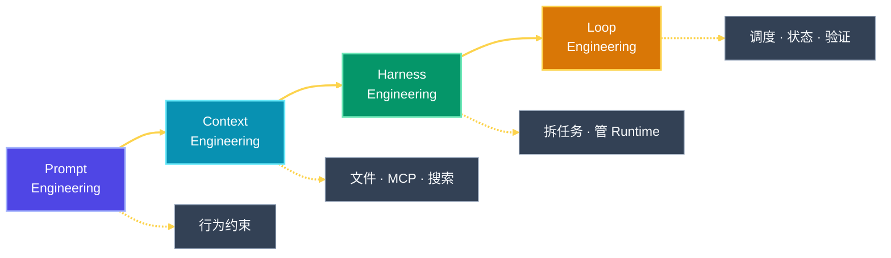
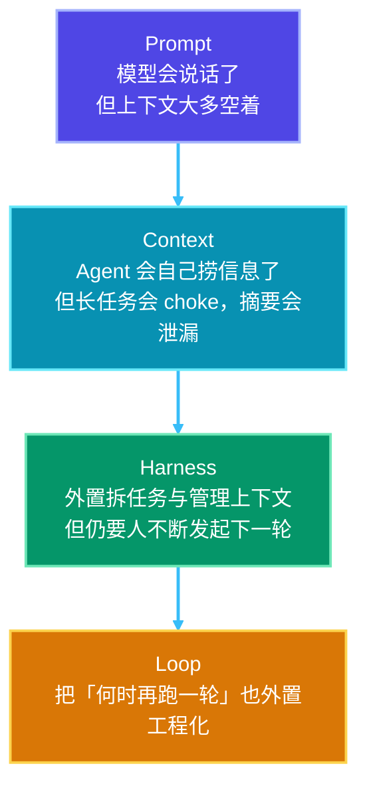
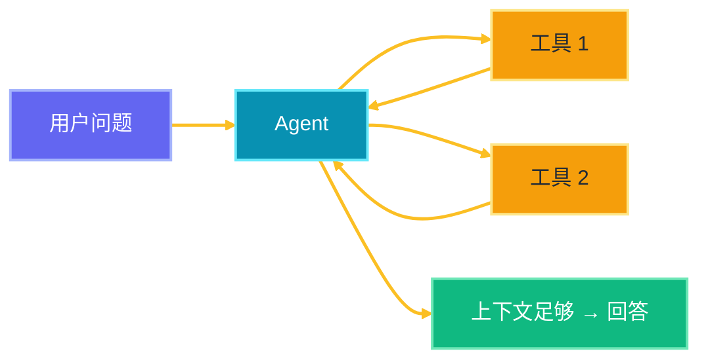
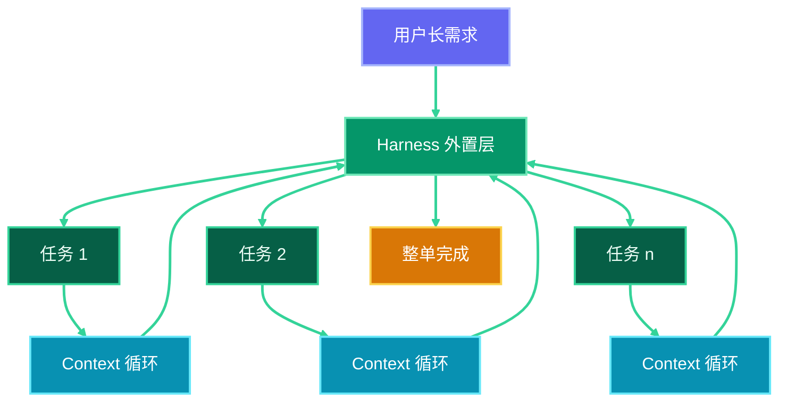
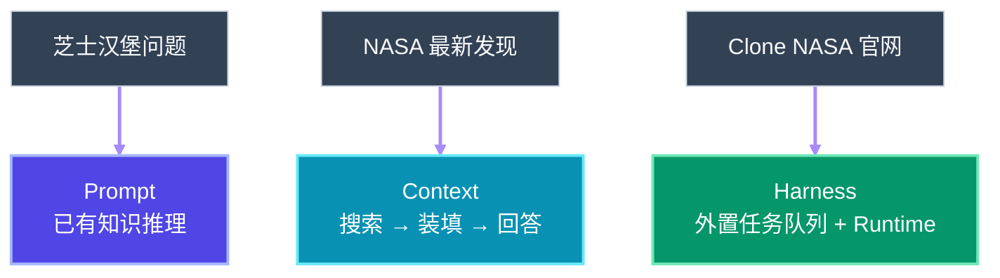
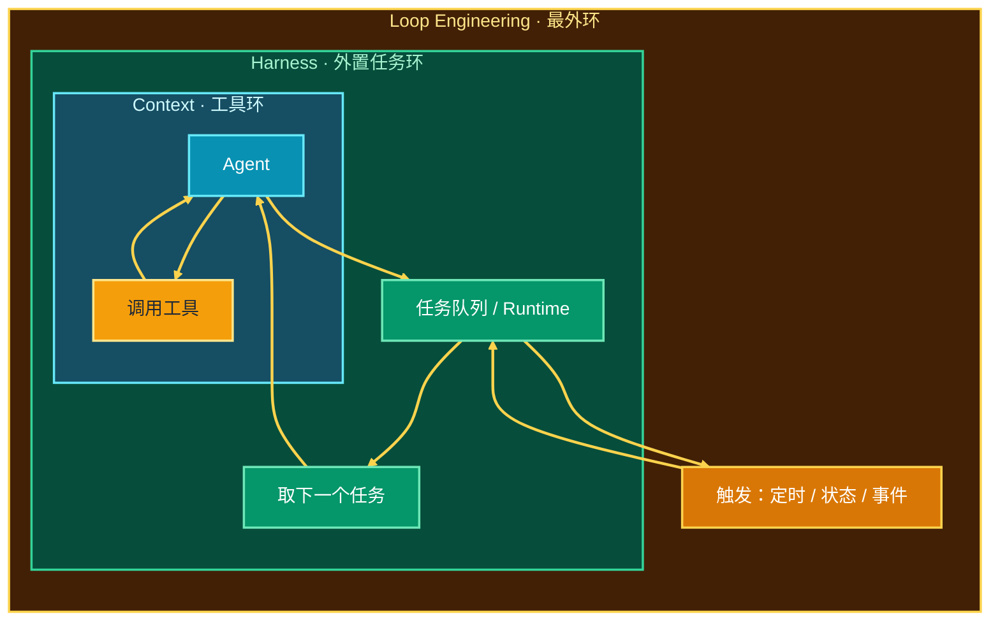
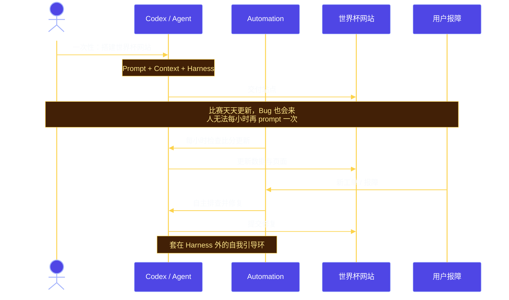
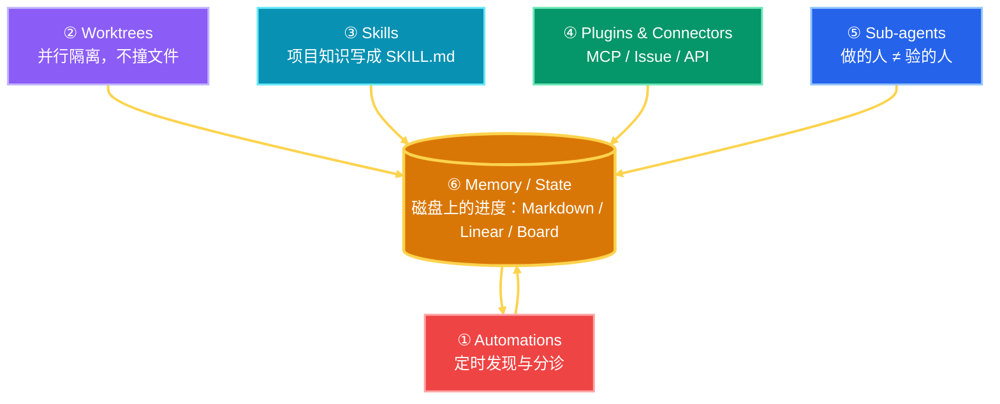
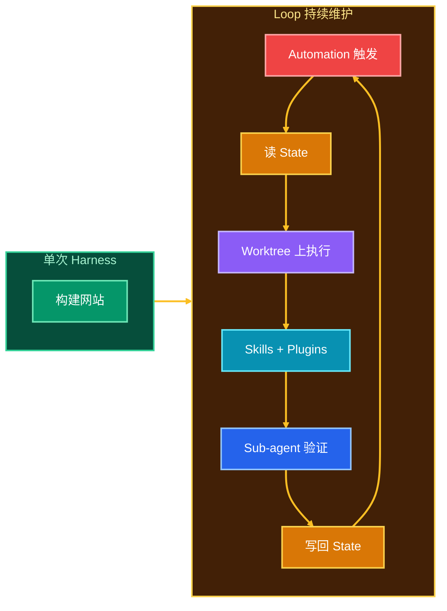

# Loop Engineering：从 Prompt 到自我驱动的 Agent

工程范式在不断叠「环」。每一层并不取代下一层，而是在能力边界外扩时，把上一层补不上的缺口工程化。

| 层级 | 解决什么 | 谁发起下一轮 |
|------|----------|--------------|
| Prompt Engineering | 约束模型角色与行为 | 人类一次提问 |
| Context Engineering | 让 Agent 自主装填上下文 | Agent 调用工具直到足够 |
| Harness Engineering | 长任务不靠上下文硬扛 | 外部系统管理任务与运行时 |
| Loop Engineering | 减少人类持续催促 | 调度与状态驱动下一轮 |

**下层不消失，上层叠加上去。**

---

## 1. 演进路径

每一层出现，都是因为上一层留下了结构性缺口：

---

## 2. Prompt Engineering

用自然语言约束 Agent 的角色与行为。

> You are a helpful customer service rep. Please be nice to my customers.

之后任意提问，模型都按客服人设回答——简单、有效。

局限也很清楚：Prompt 只占 context window 的一小块，窗口里还有大量空间没有被利用。

---

## 3. Context Engineering

当上下文还有空位时，下一步是让 Agent **自主调用工具**，按任务需要往窗口里装填信息。

典型能力包括：读写文件、经 MCP 连接数据库与外部应用、Web 搜索等。

Context Engineering 的局限不在原理错误，而在能力边界：

- 任务一旦超过约 **5–10 分钟**，所需上下文常常超出窗口
- 靠「快满了就自己总结」会 **泄漏**：每一轮摘要都会丢掉细节

---

## 4. Harness Engineering

因此我们需要一套 **在 context 之外** 管理 Agent 的系统：从外向内稳住长任务执行。

Harness 的核心职责：

- 把用户需求拆成更稳定的执行单元
- 管理 runtime 与任务列表，而不是把整条流水线硬塞进模型窗口

---

## 5. 三层对照：同一个 NASA 故事

用三个熟悉的问题，对齐前三层：

| 提问 | 主要依赖 | 原因 |
|------|----------|------|
| 地球和月亮之间能塞多少芝士汉堡？ | Prompt | 闭卷推理，不需要外部信息 |
| NASA 最近有什么发现？ | Context | 需要检索并自主补全上下文 |
| 把整个 NASA 官网 clone 下来？ | Harness | 超长、多步骤；只靠 context 会中途 choke |

---

## 6. 模式：我们一直在叠 Loop

到这里会出现一个清晰模式：每一层工程，本质都是一种循环。

| 层 | 循环在做什么 |
|----|----------------|
| Context | 工具 → 结果 → 再工具，直到足够回答 |
| Harness | 外置任务列表，任务 → 任务，直到整单完成 |
| Loop | 再外置一层：决定下一轮是否开启、开启什么 |

关键判断：**不是否定下层，而是 scope 变大后，环必须再往外长一层。**

---

## 7. Loop Engineering 要解决什么

前面所有例子都还缺一块：始终是 **人** 在提问——汉堡、新闻、clone 网站。

Loop Engineering 的核心，是再搭一层脚手架，让 Agent **也能对自己发起下一轮该做什么**：从 human-guided，走向更多 self-guided。

对争议也要直说：

- 有人认为它是 buzzword，只会烧更多 token、产出更多 AI slop
- 目前「一锤定音」的落地案例仍然偏少
- 但当 Agent 能力边界持续外扩时，是否还需要再叠一层环，是值得认真讨论的工程问题

---

## 8. 用例：世界杯比分网站

假设用 Codex 搭建一个世界杯比分网站。Prompt、Context、Harness 足以完成一次性交付。真正的问题在交付之后：

- 比赛每天都在进行，数据需要持续更新
- 用户会报障，站点需要持续修复
- 人不可能每小时再 prompt 一次

配套能力与六大组件一一对应：

- **Skills / Plugins**：复用已有知识库与连接器，持续改进
- **Sub-agents**：完成后再验证，降低单 Agent 自嗨风险
- **Worktree**：并行修复多个问题，避免 runtime 互相踩踏

---

## 9. 六大组件（Addy Osmani）

五个执行原语，外加一个跨 run 的记事本：

**Automations · Worktrees · Skills · Plugins/Connectors · Sub-agents · Memory/State**

| # | 组件 | 在环里的工作 | 一句话 |
|---|------|--------------|--------|
| 1 | **Automations** | 定时触发 discovery / triage | 没有它，只是跑过一次，不是 loop |
| 2 | **Worktrees** | 并行 Agent 使用隔离工作树 | 避免同仓互相覆盖 |
| 3 | **Skills** | 用 `SKILL.md` 固化约定与流程 | 不必每次会话重新猜项目规矩 |
| 4 | **Plugins / Connectors** | 接入已有工具链 | Agent 能接触真实工单、CI 与数据 |
| 5 | **Sub-agents** | Maker–Checker 分工 | 想法与验证拆开 |
| 6 | **Memory / State** | 会话外持久化「已做 / 下一步」 | 模型会忘，仓库与文件不会 |

从一次性交付，到持续维护：

---

## 10. 总结

1. **Prompt → Context → Harness → Loop** 是能力边界外扩，不是名词替换。  
2. 每一层都在补上一层的缺口：空上下文 → 长任务泄漏 → 人类必须持续催促。  
3. Loop 的本质，是把「下一轮谁来开启」工程化：调度、状态、验证。  
4. 六组件是配方；**Memory / State** 最不起眼，却是跨 run 能复合、而不是重置的关键。  
5. 不是所有任务都需要 Loop；可验证、可重复的维护类工作，最适合先落地。

两个值得带走的问题：

- 你当前的痛点卡在哪一层：上下文不够、长任务不稳，还是人在充当 cron？
- 若上 Loop，你的 **stop condition** 与 **验证门** 是什么？没有验证的 loop，等于无人值守地犯错。

---

## 参考

- [Addy Osmani — Loop Engineering](https://addyosmani.com/blog/loop-engineering/)
- 相关专题：`06-harnes/`（Harness）、`08-hermes-agent/`（Memory / Compress）
