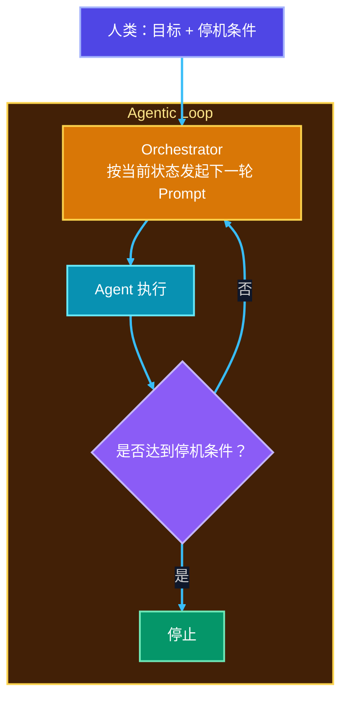
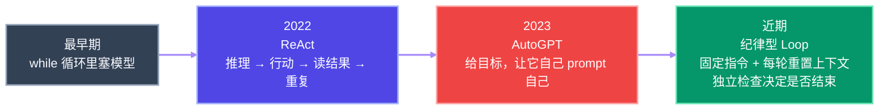
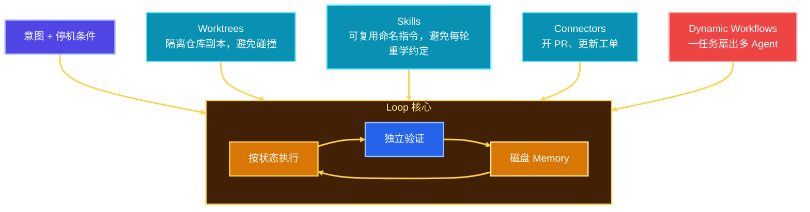
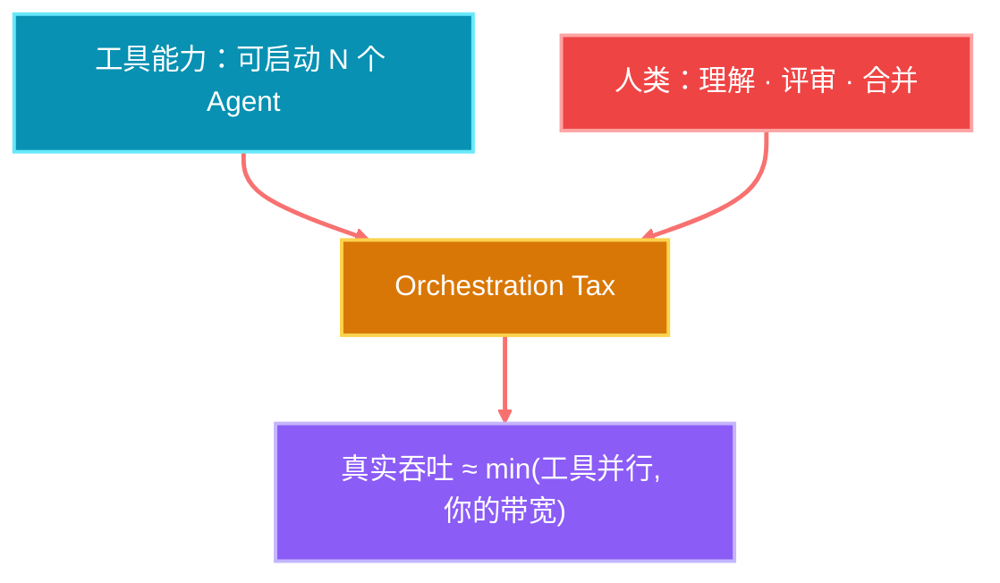
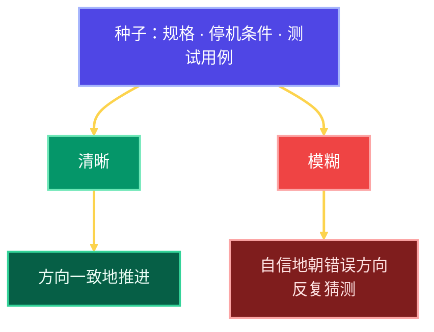
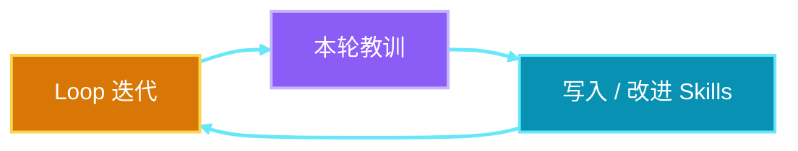

# Loop Engineering：什么是 Loop，以及如何写好一个

核心主张很简单：

> 你不该再不停地 prompt coding agent。  
> 你该设计 **会去 prompt agent 的 loop**。

职责没有消失，只是上移了一层：人定义目标与停机条件；orchestrator 根据状态持续发起下一轮。

---

## 1. 问题从哪里来

传统工作流里，**人是瓶颈**：

这是串行的：人给指令 → Agent 产出 → 人评价 → 人再给下一轮指令。  
对短问答可以；对长时任务，人跟不上，系统也撑不住。

长时任务需要另一种模式：

停机条件可以是：单测通过、达到最大迭代次数，或任意你预先定义的判据。

关键点：**Prompting 没有死，它只是搬到了最开始。**  
即便是全自动 loop，仍在被 prompt——只是 prompt 来自你的初始目标与规格，而不是你每一轮手动敲字。

---

## 2. Loop 是新词，还是旧轮子？

Loop 不是全新发明。把它放回时间线更清楚：

| 阶段 | 特征 | 结果 |
|------|------|------|
| while + model | 最朴素的环 | 概念上成立 |
| ReAct（2022） | 推理、行动、读结果、再循环 | Agent 范式成型 |
| AutoGPT（2023） | 目标驱动、自我 prompt | 常空转烧 token，几乎不交付 |
| 纪律型 Loop（今） | 同指令反复喂入，但每轮重置上下文；独立检查说停才停 | Claude Code / Codex 一类产品的主流形态 |

所以当有人说「design loops」时，真正该问的是：**哪一种 loop？**

---

## 3. Loop ≠ Cron（但也不完全不是）

最尖锐的质疑是：

> 这不就是换了个名字的 cron 吗？

他们说对了一半。

```mermaid
%%{init: {'theme': 'dark', 'themeVariables': {
  'lineColor': '#FBBF24',
  'primaryTextColor': '#F8FAFC',
  'edgeLabelBackground': '#0F172A'
}}}%%
flowchart TB
    subgraph CRON["Cron"]
        C1[定时触发] --> C2[跑固定脚本]
        C2 --> C3[结束]
    end

    subgraph LOOP["Loop = Cron + 决策体"]
        L1[定时 / 事件触发] --> L2[读当前状态]
        L2 --> L3[模型决定下一步]
        L3 --> L4[执行]
        L4 --> L5[检查]
        L5 --> L6{继续？}
        L6 -->|是| L2
        L6 -->|否| L7[停止]
    end

    linkStyle default stroke:#FBBF24,stroke-width:2.5px

    classDef cron fill:#334155,stroke:#94A3B8,color:#F8FAFC,stroke-width:2px
    classDef loop fill:#422006,stroke:#FCD34D,color:#FDE68A,stroke-width:2px
    classDef cnode fill:#64748B,stroke:#CBD5E1,color:#FFF,stroke-width:2px
    classDef trigger fill:#D97706,stroke:#FCD34D,color:#FFF,stroke-width:2px
    classDef decide fill:#8B5CF6,stroke:#C4B5FD,color:#FFF,stroke-width:2px
    classDef act fill:#0891B2,stroke:#67E8F9,color:#FFF,stroke-width:2px
    classDef check fill:#2563EB,stroke:#93C5FD,color:#FFF,stroke-width:2px
    classDef stop fill:#059669,stroke:#6EE7B7,color:#FFF,stroke-width:2px

    class CRON cron
    class LOOP loop
    class C1,C2,C3 cnode
    class L1 trigger
    class L2,L3 decide
    class L4 act
    class L5,L6 check
    class L7 stop
```

- **Cron**：调度固定脚本  
- **Loop**：调度 + 中间的决策体——看状态、决定下一步、执行、检查、再决定是否继续

一句话：**Loop = Cron + decision maker in the body。**

---

## 4. 怎么搭一个认真的 Loop

以 Claude Code 为例，入口可以极简：

> `/loop` —— 写出意图与停机条件，而不是写出每一步。

但严肃的 loop 需要外围零件，而不只是一条命令：

| 零件 | 作用 |
|------|------|
| **Worktrees** | 隔离副本，并行 Agent 不互相踩踏 |
| **Skills** | 可复用命名指令，避免每轮重学项目约定 |
| **Connectors** | 接入真实工具链：开 PR、更新工单 |
| **Verifier** | 写代码的与打分的不能是同一个 |
| **Memory on disk** | 模型跨 run 会忘；失败时要能回到上一状态 |
| **Dynamic Workflows** | 单 loop 可扇出大量并行 Agent——很强，也最容易把成本跑飞 |

---

## 5. 最重要的一步：Verification

一个只写代码、从不检查自己的 loop，是最快制造「自信错误」并烧光 token 的方式。

好的 loop 需要反馈机制：

**Verification 才是让 loop 可信的部分；plumbing 只是水管。**

---

## 6. Orchestration Tax：并行的天花板是人

Loop 可以拉起成百上千个并行 Agent。但有一个天花板谁也拆不掉：

**你自己。**

真正能跑多少 loop，由 **review bandwidth** 决定，不由工具决定。这就是 orchestration tax。

更危险的不是「失败得很吵」，而是「成功得很安静」：

- 你只看到最终结果
- 已交付内容与你理解之间的鸿沟持续扩大
- 三百个 commit 之后，你已经跟不上自己系统在做什么

两种结果 loop 都分不清：

| 结果 | 表现 |
|------|------|
| A | 人在自己理解的代码上跑得更快 |
| B | 人开始回避理解，只收结果 |

无论哪种，**责任仍在人**。小项目或许还能赌；大项目与关键系统不行。

---

## 7. 种子 Prompt 比以前更重要

Loop 跑在「由你的规格拼出来的 prompt」上。  
因此 **第一条 prompt 不是更不重要，而是更重要**：

- 它不再是你可以边走边改的一轮对话
- 它是你看不见的成百上千步的种子

模糊的规格、停机条件、测试用例，会让系统做大量假设——而这些假设多数是错的。  
对长时 loop，这不是小问题，是灾难级问题。

---

## 8. 第二笔真实成本：钱

每一个 token 都在烧钱。浪漫版故事是：

> 写好 loop，然后去睡觉。

诚实版是：

> 你很大一部分工作，是确保它会停下来。

必备护栏：

- 进度停滞时的停止判断
- **硬性花费上限（hard spending limit）**

没有这些，钱包上会出现一个洞。

---

## 9. 真正会复利的是 Skill，不是 Loop 本身

如果 loop 多半是水管，verification 负责可信，那么长期复利的不是环本身，而是环里沉淀下来的能力：

每一轮都要把学习写回 Skills，让 Agent 能从上一轮的错误里长出来。  
**Loop 负责运转；Skills 负责复利。**

---

## 10. 总结：何时用，如何用

Agentic Loop 有价值，但前提是护栏齐全：

1. **清晰的种子 Prompt** —— 规格、指令、测试用例要扎实  
2. **明确的停机条件** —— 否则它会空转  
3. **独立 Verification** —— 写的人不打分  
4. **花费与进度上限** —— 浪漫睡眠前先装刹车  
5. **可复利的 Skills** —— 让教训留下，而不是每轮归零  
6. **尊重 Orchestration Tax** —— 并行上限是你的理解与评审带宽

| 适合 | 不适合 |
|------|--------|
| 可验证、可重复、停机条件清晰的任务 | 目标模糊、无法客观验收的探索 |
| 有独立检查与花费上限的维护类工作 | 「开了几百个 Agent 就当交付」的幻想 |

前段工程时间花得越多，后面结果越稳。  
否则，你得到的只是长时间运转的 gibberish。

---

## 参考

- Peter Steinberger：设计会 prompt agent 的 loops，而不是自己不停 prompt  
- Boris Cherny（Claude Code）：工作是写 loops；由 loops 去 prompt Claude  
- 相关专题：`01.context-looop-engineering.md`（四层演进）、`06-harnes/`、`08-hermes-agent/`
