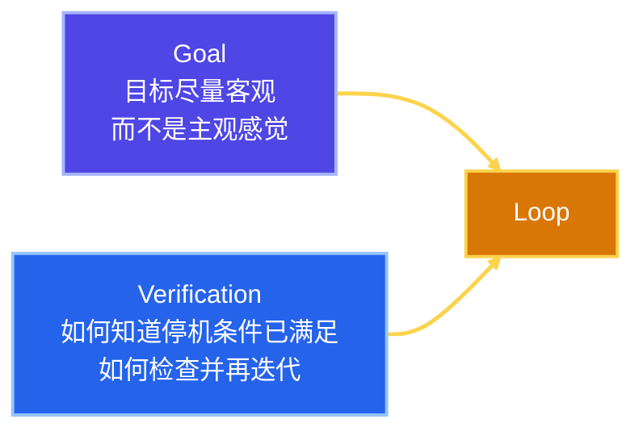
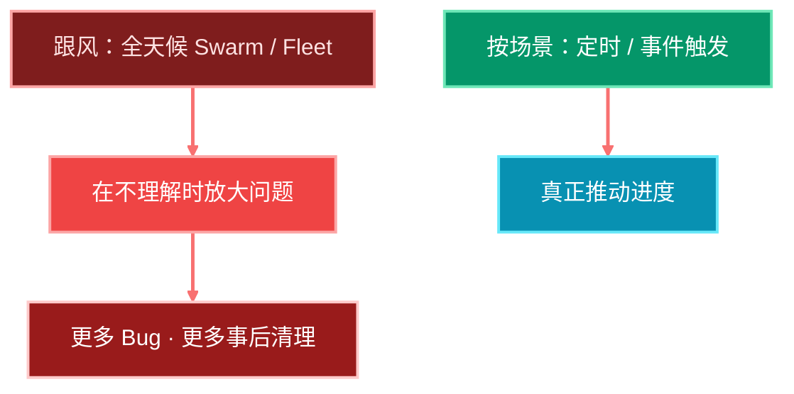
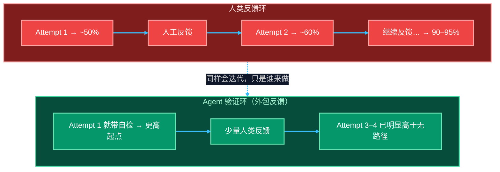
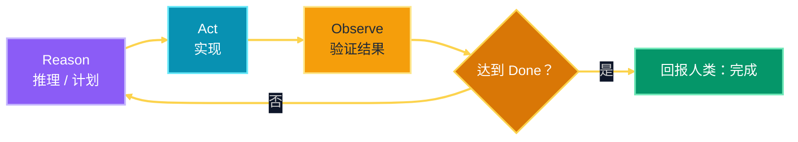
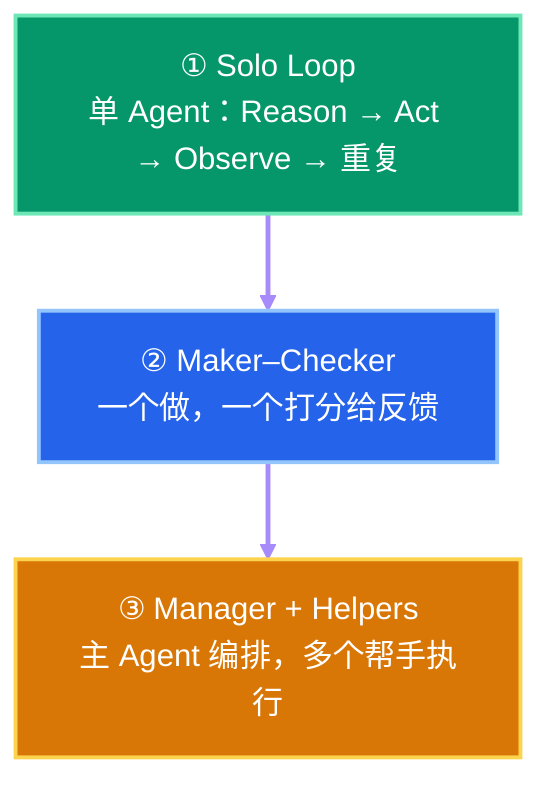
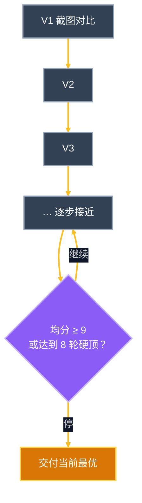
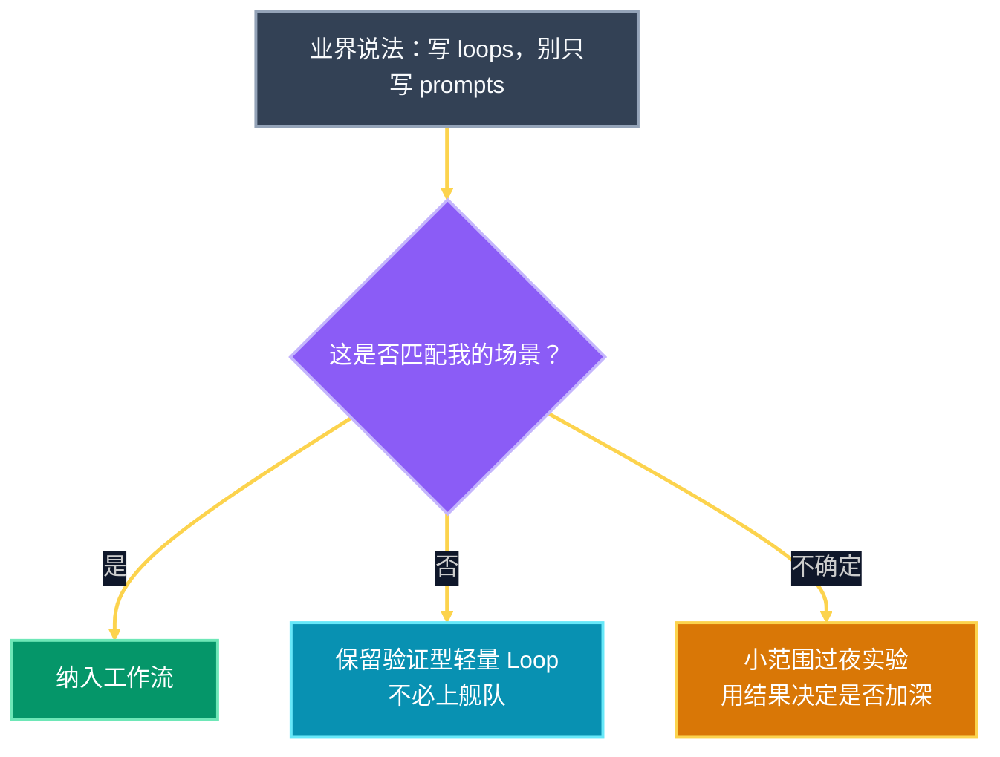

# Loop Engineering：定义澄清、质量曲线与落地形态

网上关于 agent loops / loop engineering 的说法很多，定义却并不统一。  
这篇只做一件事：**把概念压到可执行，并说明何时不该跟风上舰队。**

一句话定义：

> **Loop Engineering = 把自己从「不断 prompt 的人」替换掉。**  
> 你设计的是那个替你发 prompt 的系统。

一个 Loop 只有三件事：

| 零件 | 含义 |
|------|------|
| **Trigger** | 何时启动 |
| **Action** | 做什么 |
| **Stop Condition** | 何时停 |

---

## 1. 两根柱子：Goal 与 Verification

递归目标可以这样理解：你定义目的，AI 迭代直到完成。真正扛重量的只有两根柱子。

- **Goal**：客观目标优于主观目标  
- **Verification**：Agent 如何知道「做完了」，如何检查后继续迭代

烤蛋糕的类比：叉子插进去不带面糊，就是 done。  
你要给 Agent 的，是尽量同样客观的 **definition of done**。

---

## 2. 先别急着上「24/7 舰队」

看到「别再 prompt，去写 loops」的推文，很容易误判成：

> 如果没有五组 Agent 全天候编排另外五组 Agent，我就落后了。

这通常是错的。

不理解就上规模，放大的是问题，不是产出。  
也不是每个人的场景都需要 24/7 无人值守：

| 更可能受益 | 未必需要 |
|------------|----------|
| 团队共建产品、持续迭代的代码库 | 个人知识工作、按事件/节奏触发即可 |
| 可验证、可合并的流水线任务 | 「炫酷 demo」式的套娃编排 |

**别人 10 倍的方式，不等于你的方式。**

---

## 3. 为什么需要 Loop：质量随尝试上升

AI 几乎不会一次打满分。横轴是尝试次数，纵轴是质量：

迭代本来就会发生。Loop 做的是：**把反馈与再试外包给 Agent**，让第一次交付的起点更高，后面少踩几轮。

核心预期要讲清楚：

> Loop / Goal **不是**为了 100% 完美交付。  
> 它们是为了让你 **第一次就离目标近得多**。

---

## 4. 最小工作单元：Reason → Act → Observe

把 loop 想成一个你不显微管理的聪明实习生：

1. 你交目标  
2. 它自己决定下一步  
3. 自己检查工作  
4. 再来一轮  
5. 确认过几次之后，才回来跟你说「做完了」

Observe 可以是：视觉截图、跑测试、打开浏览器检查渲染——取决于任务。  
人类擅长定义终点；工程难点是：**如何把终点说得足够客观，并给 Agent 正确的检查工具。**

---

## 5. 三种常见形态（多数任务不需要舰队）

多数任务并不需要巨型动态架构。  
一条好 prompt + 一个终端会话里的 **Solo Loop**，往往就够。

| 形态 | 何时用 | 风险 |
|------|--------|------|
| **Solo Loop** | 默认首选；验证闭环即可 | 自评偏差 |
| **Maker–Checker** | 需要独立打分 / 主观任务客观化 | 协调成本上升 |
| **Manager + Helpers** | 可拆分的并行子任务 | 成本与理解鸿沟放大 |

日常最常用的，往往是：**为了 verification 而建的轻量 loop**，不是俄罗斯套娃式的 fleets。

---

## 6. 三个例子：看到 Loop 真正在做什么

### 6.1 Thumbnail Goal（约 27 分钟）

流程：

1. 生成 10 个缩略图概念  
2. 按 rubric 打分（小尺寸清晰度、好奇感、情绪拉力、对比度等）  
3. 选 Top 3，找各自最弱项并改进、重打分  
4. 在最强概念上继续迭代，直到「满意」

问题：停机条件若是「直到你满意」，仍然偏主观。  
更好的形态是：**metric = target**；若必须主观打分，就单独训练/评估一个 **Scorer Sub-agent**，提高分数可信度。

### 6.2 Three.js 飞机（约 37 分钟）

构建 → 开浏览器 → 旋转检查 → 看渲染 → 再迭代。  
结果仍不完美，但远好于一句「用 Three.js 做个 3D 飞机」。

### 6.3 Abbey Road 纯代码复刻（硬顶 8 轮）

不用图像生成，只用 HTML/CSS 等复刻名画；每轮截图对比；平均分 ≥ 9 停，硬顶 8 次。

最终仍可能「不像」。这正好说明：

> **Loop 的上限，就是 Done Check 的上限。**  
> 有验证、有迭代，不等于任务本身可被该验证方式完美求解。

---

## 7. 动手前只问两个问题

| 产物类型 | Done 可能长什么样 | 检查方式 |
|----------|-------------------|----------|
| 可玩的游戏 | 关卡可通、无阻断 Bug | 视觉 + 功能 + 实际游玩 |
| 文稿 / 脚本 | 结构完整、语气一致 | 流程检查、语气对照（通常不需要截图） |
| UI / 视觉 | 对照参考图达到阈值 | 浏览器截图 + 对比 |
| 视频剪辑 | 节拍对齐、错误口播已切 | 转录对齐、边界检查、渲染校验 |

能写成 **metric = result** 最好；不能时，才退回到「直到足够自信」这类主观停机——并承认它更弱。

---

## 8. 让 Loop 真正能跑的清单

| 要素 | 作用 |
|------|------|
| **Checkable Goal** | 目标可被检验 |
| **Hard Stop** | 硬顶迭代 / 时间 / 花费，防止永远打不中的目标空转 |
| **Good Tools** | 验证所需的浏览器、测试、截图等 |
| **Memory** | 跨轮次可回看状态 |
| **Separate Checker** | 降低自评自嗨 |
| **Planning First** | 先计划再实现 |
| **Logging** | 事后能审计「它为什么停」 |
| **Cost Sense** | 难目标 + 难 done = 可能跑很久 |

经验区间（因人而异）：

- 常见有用：约 **30 分钟–数小时**  
- 过夜实验：约 **4–8 小时**，早上接手再迭代  
- 很少需要：连续 **数天** 的炫酷长跑

12 小时以上却不见推进的 loop，往往不值得保留。

---

## 9. 场景适配：别把别人的工作流直接粘贴过来

Peter Steinberger / Boris Cherny 那类提醒，对硬核编程、Agent 基建、大规模代码演进很有意义。  
对知识工作、内容工作、非全时软件交付，更常见的是：

- 事件触发 / 固定节奏，而不是 24/7  
- 轻量 Solo Loop + 强 Verification  
- 大目标偶尔过夜跑一截，早上人工或二次 loop 接手  

AI 会渗入每个岗位，**不会用同一种姿势渗入**。  
跟进前沿有价值；把别人的舰队原样搬进每次会话，没有价值。

---

## 10. 总结

1. Loop = **Trigger + Action + Stop**；Loop Engineering = 设计替你发 prompt 的系统。  
2. 两根柱子：**客观 Goal** + **可执行 Verification**。  
3. 价值在于抬高质量曲线的起点，不是保证一次完美。  
4. 默认用 **Reason → Act → Observe** 的 Solo Loop；需要时再上 Maker–Checker 或编排。  
5. 动手前只问：**Done 是什么？怎么查？工具够不够？**  
6. 没有硬停与成本意识的难目标，会变成长时间空转。  
7. 别人的 24/7 舰队叙事，先过场景过滤，再决定是否采用。

最好的 Agent Loop，长这样：

> **Keep iterating until X metric equals Y result.**

做不到完全客观时，至少把检查做实，并把硬顶装上。

---

## 参考

- Matthew Berman 等公开的 Loop Library（`/goal` 类示例）  
- 系列前文：`01.context-looop-engineering.md`（四层演进）、`02.loop-engineering.md`（定义、Cron、Orchestration Tax）
