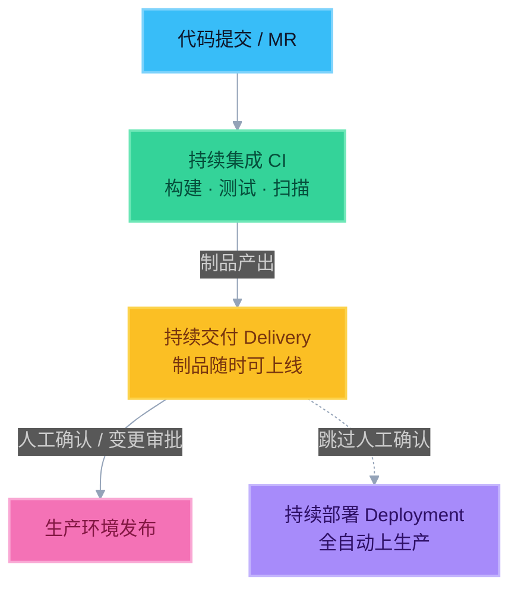
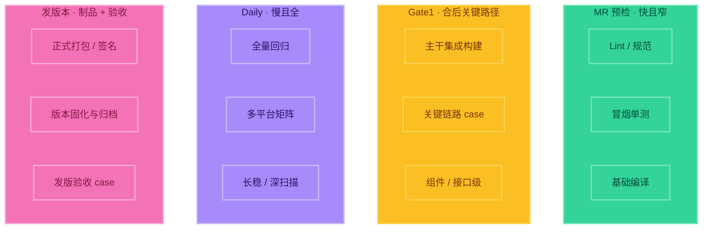
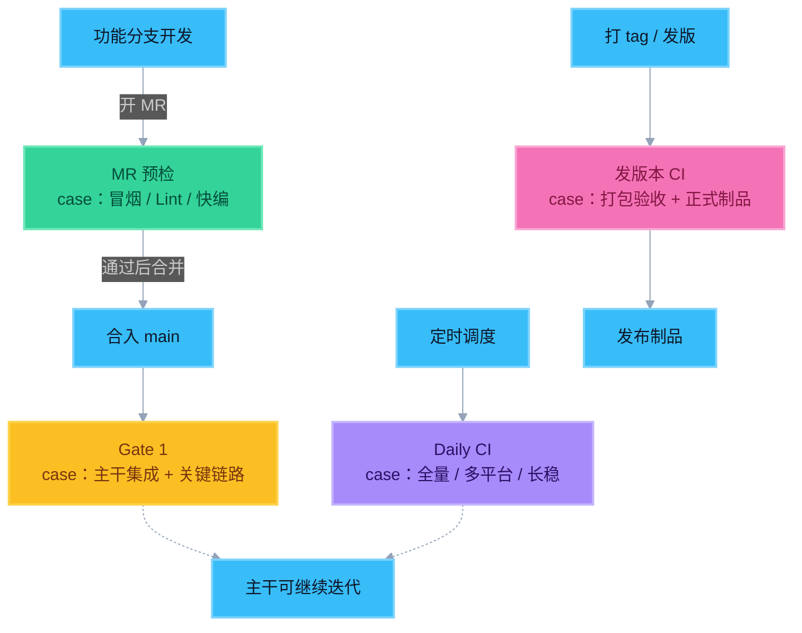
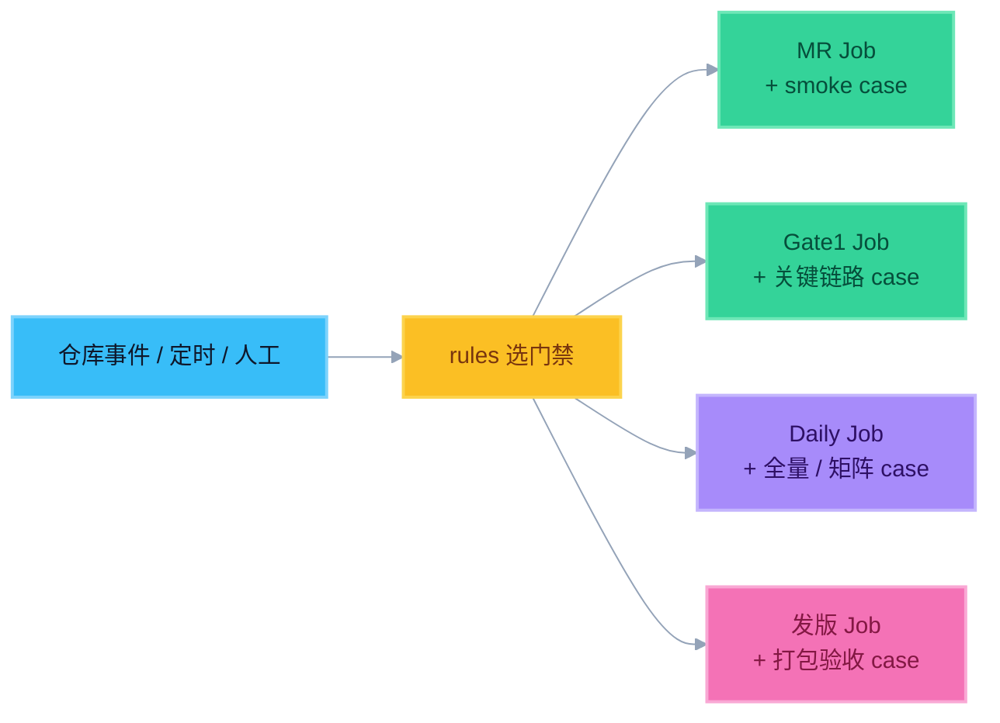
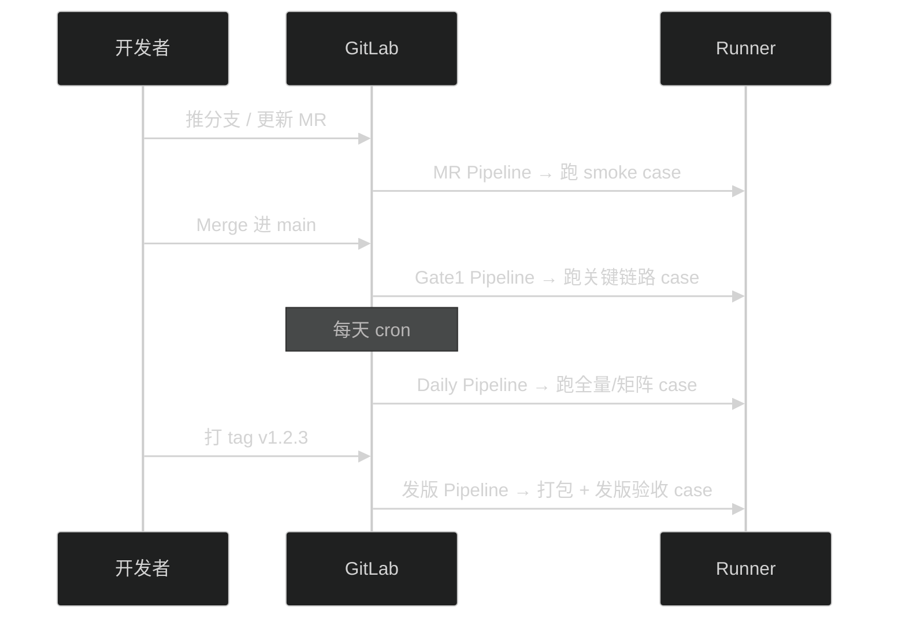

# 1. CI / 持续交付 / 持续部署（必背）

## 一句话对照表

| 概念 | 英文 | 含义 | 上线方式 |
|------|------|------|----------|
| **持续集成** | Continuous Integration（CI） | 频繁把代码合入主干，并自动构建 / 测试 | 不到上线这一步 |
| **持续交付** | Continuous Delivery | 制品随时可上线，质量门禁已过 | **人工确认**后上生产 |
| **持续部署** | Continuous Deployment | 门禁通过后自动推到生产 | **全自动**上生产 |

> 记忆口诀：**集成测得住 → 交付随时上 → 部署自动上**。

---

## 分别讲清楚

### 持续集成（CI）——面试主战场

**做什么**：开发者频繁提交代码（一天多次），每次提交/MR 触发流水线：拉取代码 → 检查 → 测试 → 构建。

**解决什么问题**：

- 避免「临上线才发现合不进去」
- 问题发现得早、修得便宜
- 主干始终保持可构建状态

**和你转岗的关系**：维护 CI = 保证多条自动验证链路（门禁）稳定、快、可追溯——不只是「有一条流水线」这么简单。

### 持续交付（Continuous Delivery）——企业最常见落地

**做什么**：CI 通过后，产出可发布制品（包 / 镜像），部署到生产**随时可以**，但最后一步要人点确认（或走变更单）。

**为什么企业爱用**：

- 合规、审计、回滚责任需要人拍板
- 业务窗口、灰度、审批流仍在
- 风险可控

### 持续部署（Continuous Deployment）——了解即可

**做什么**：门禁全绿后，自动部署到生产，无人确认。

**为什么多数公司不用到这一步**：

- 监管 / 变更管理要求
- 生产事故责任边界
- 业务侧需要发布窗口控制

---

## 落地区分结论（面试必说）

> **大多数企业：做到「持续交付」；生产环境一般不启用全自动「持续部署」。**

口述模板：

> 「我们做的是持续集成保证每次合入可构建可测，再做到持续交付——制品随时可发，但上生产保留人工确认。全自动持续部署在强合规或复杂业务场景里比较少见。」

---

## 三者关系图（心里有图）



> 颜色记忆：青绿 = CI｜琥珀 = 持续交付｜粉 = 生产｜紫虚线 = 少见的全自动部署

---

## 企业实战：多门禁 CI（结合本公司）

教科书常画「一条 Pipeline」；真实公司往往是**多条 CI、多层门禁**，在不同时机拦不同风险。

### 三道常见门禁

| 门禁 | 触发时机 | 典型目的 | 面试怎么说 |
|------|----------|----------|------------|
| **Gate 1（Merge 后门禁）** | 代码合入主干之后 | 再验一次主干健康：合入后的集成构建 / 关键测试，防止「MR 绿了、合完却坏」 | 合并后的主干守护 |
| **Daily CI** | 每天定时（夜间/清晨） | 跑更重、更全的回归：全量测试、多平台、耗时长的扫描 | 定时全量健康检查 |
| **发版本 CI** | 打 tag / 发版分支 / 发布流程触发 | 出正式制品：打包、签名、归档、版本号固化，供发布使用 | 发布专用流水线 |

> **为什么要拆多条？**  
> 两层原因：① **触发时机不同**；② **跑的 case 本身就不一样**（不是同一套测试换个时间再跑一遍）。

### 关键点：每种门禁跑的 case 不一致

多门禁 ≠「同一批用例，换个 cron」。  
每道门禁有自己的 **用例集 / 检查矩阵**，按风险与耗时裁剪：

| 门禁 | 典型会跑的 case（示例） | 通常不跑 / 少跑 | 设计理由 |
|------|-------------------------|-----------------|----------|
| **MR 预检** | Lint、冒烟单测、关键模块快测、基础编译 | 长稳、全平台、全量回归 | 要在几分钟内反馈，不能堵开发 |
| **Gate 1（Merge 后）** | 主干集成构建、合入后关键链路、接口/组件级 case | 整夜全量、发版签名打包 | 防「MR 绿了、合完主干却坏」；比 MR 稍重，但仍偏关键路径 |
| **Daily CI** | 全量回归、多平台 / 多配置矩阵、慢测、压力或长稳子集、深扫描 | 每次提交都跑（太重） | 夜间有时间窗口，换覆盖面 |
| **发版本 CI** | 正式打包、版本号固化、签名、制品校验、发版验收 case（checklist） | 日常开发向的快速冒烟为主 | 目标是「可发布制品 + 可追溯」，不是日常开发反馈 |



面试怎么强调：

> 「触发源决定**什么时候跑**；用例集决定**跑什么**。我们 Gate1、Daily、发版的 case 清单本身就不一样——覆盖面、耗时、失败处理都不相同。」

落地时 case 通常拆成不同目录 / 标签 / Job，例如：

- `tests/smoke/` → MR  
- `tests/gate1/` 或 `pytest -m gate1` → Merge 后  
- `tests/full/` 或矩阵配置 → Daily  
- `tests/release/` + 打包脚本 → 发版本  

### 多门禁关系图（时机 + 用例）



### 和「合并门禁」别混

| 说法 | 指什么 |
|------|--------|
| **MR 合并门禁** | 合进去之前：Pipeline 不过不许合（见分支策略篇） |
| **Gate 1（Merge 后）** | 合进去之后：跑**另一套**主干/关键 case |
| **Daily / 发版本 CI** | 触发不同，**用例集也不同** |

### 多门禁怎么实现？如何触发？

核心思路两件事一起配：

1. **触发分流**：用 `rules` / Schedule / tag 决定「这次开哪条门禁」  
2. **用例分流**：每条门禁绑定**不同的 Job + 不同的 case 集**（目录、标记、矩阵、脚本）  

不是装四套互不相干的 CI 系统，也不是「同一批 case 换个时间重跑」。



#### 1）实现方式（三种常见落地）

| 方式 | 做法 | 优点 | 注意 |
|------|------|------|------|
| **A. 同一 `.gitlab-ci.yml` + `rules`** | 不同 Job 写不同触发条件；一次事件只激活匹配的 Job | 配置集中，最常见 | `rules` 要写清楚，避免误触发重 Job |
| **B. 子流水线 / 多 yml** | 如 `ci/mr.yml`、`ci/daily.yml`、`ci/release.yml`，用 `include` 或 parent-child pipeline | 文件清晰、权限好拆 | 要维护多文件与变量传递 |
| **C. 外部调度触发 API** | 公司定时任务 / Jenkins 调 GitLab Pipeline API | 和既有调度系统集成 | 凭证与审计要管好 |

> 面试够用说法：**「rules 分流触发；不同 Job 挂不同 case 集。MR 跑 smoke，Gate1 跑合后关键路径，Daily 跑全量矩阵，发版跑打包验收——内容和时机都分开。」**

#### 2）各门禁如何触发（GitLab 视角）

| 门禁 | 触发源（谁点火） | 典型 `rules` 条件（概念） | 谁在「按开关」 |
|------|------------------|---------------------------|----------------|
| **MR 预检** | 打开/更新 MR → `merge_request_event` | `if: $CI_PIPELINE_SOURCE == "merge_request_event"` | 开发者推分支 / 改 MR |
| **Gate 1（Merge 后）** | MR 合入后，对 `main` 的 **push** | `if: $CI_COMMIT_BRANCH == "main"` 且来源是 push | 合并动作本身（合完 = push 主干） |
| **Daily CI** | **Pipeline Schedule**（cron，如每天 02:00） | `if: $CI_PIPELINE_SOURCE == "schedule"` 或自定义变量 `DAILY=1` | GitLab 定时器（或公司 cron 调 API） |
| **发版本 CI** | **打 tag** / 推发版分支 / **手动 Run pipeline** | `if: $CI_COMMIT_TAG` 或 `when: manual` | 发布负责人打 tag / 点手动 |

补充细节（常被追问）：

1. **Gate 1 为什么是「合完再跑」？**  
   合入 `main` 会在主干上产生一次新 commit（merge commit 或 squash），GitLab 对这次 **push 到 main** 再开一条 Pipeline。这条和 MR 上那条不是同一次。

2. **Daily 怎么和普通 push 错开？**  
   Daily 的 Job 只在 `schedule` 来源（或带 `DAILY=true` 变量）时启用；平时 push / MR **rules 直接不匹配**，所以不会每次提交都跑通宵全量。

3. **发版本为什么常用 tag？**  
   tag 不可变、带版本号（如 `v1.2.3`），天然适合「正式制品」；Job 里用 `$CI_COMMIT_TAG` 写版本、归档路径，禁止乱用 `latest`。

#### 3）极简配置示意（触发 + 不同 case）

```yaml
# 概念示意：rules 决定何时跑；script/标记决定跑哪批 case
mr_smoke:
  rules:
    - if: $CI_PIPELINE_SOURCE == "merge_request_event"
  script:
    - pytest tests/smoke -m smoke   # MR：窄、快

gate1_critical:
  rules:
    - if: $CI_COMMIT_BRANCH == "main" && $CI_PIPELINE_SOURCE == "push"
  script:
    - pytest tests/gate1 -m gate1   # 合后：关键链路，与 smoke 不同集

daily_full:
  rules:
    - if: $CI_PIPELINE_SOURCE == "schedule"
  script:
    - pytest tests/full --matrix    # Daily：全量 / 多平台，更重

release_build:
  rules:
    - if: $CI_COMMIT_TAG
  script:
    - ./build_release.sh            # 发版：打包签名
    - pytest tests/release -m release  # 发版验收 case，又是另一套
```

项目里还要在 GitLab UI 配好：

- **Settings → CI/CD → Schedules**：Daily 的 cron  
- **Protected branches / tags**：主干与发版 tag 的保护  
- **Merge checks**：MR 必须 Pipeline 通过才能合（合前的那道门）

#### 4）触发链路总览



### 口述模板（贴合经历）

> 「我们公司多层门禁，不只是触发时间不同，**每道门禁跑的 case 也不一样**：MR 跑冒烟和快检；合入主干后的 Gate 1 跑集成和关键链路；Daily 跑全量回归和多平台；发版本跑正式打包和发版验收。用 rules 分流触发，用不同 Job / 用例目录分流内容——快慢分离、覆盖面分离。」

---

## 易混提醒

| 混淆点 | 正确说法 |
|--------|----------|
| CD 到底是哪个 | 口语里「CD」常指 Delivery；Deployment 要说全称或强调「自动上生产」 |
| 有 CI 就等于 DevOps | 否，CI 只是工程实践的一块 |
| 没上生产就不算 CI | 否，CI 到「构建测试通过」就算闭环 |
| 公司只有一条 CI | 常见是多门禁：MR 预检、Merge 后 Gate、Daily、发版本 CI 各司其职 |
| 多门禁 = 同一批 case 换时间跑 | 否；**触发不同，用例集也不同**（smoke / 关键路径 / 全量 / 发版验收） |
