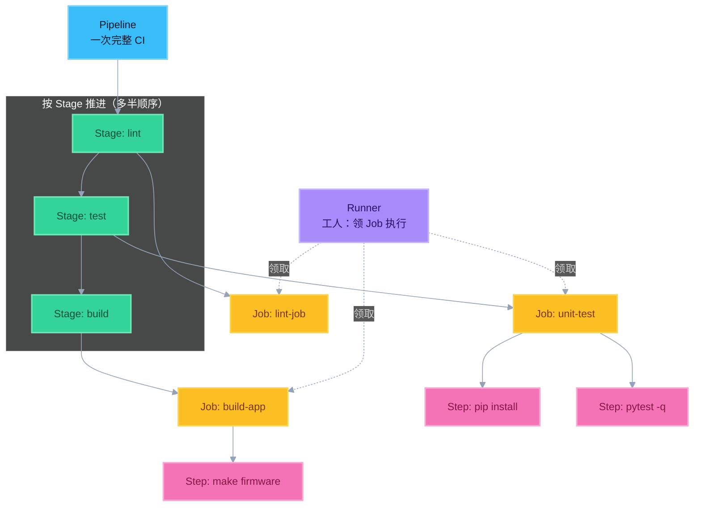
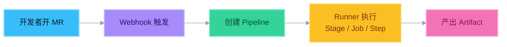

# 2. 核心名词（熟记）

面试里听到这些词，要能立刻解释，并说清它们的层级关系。

## 层级关系（先背这个）

```
Pipeline（一次执行）
  └── Stage（阶段，多半顺序）
        └── Job（任务，同 Stage 可并行）
              └── Step（script 里的一行行命令）
                    ↑
              Runner 领走 Job 去执行
```

| 名词 | 是什么 | 和上下谁的关系 |
|------|--------|----------------|
| **Pipeline** | 一次完整 CI 运行实例 | 包含多个 Stage |
| **Stage** | 阶段分组（lint / test / build…） | 属于 Pipeline；内含多个 Job |
| **Job** | 可调度的最小任务单元 | 属于某个 Stage；由 **一个 Runner** 执行 |
| **Step** | Job 里的命令步骤 | 属于 Job（`script:` 每一行） |
| **Runner** | 执行工人（不在 yml 层级树里） | 从 GitLab **领取 Job**，跑完回报 |



> 蓝 = Pipeline｜绿 = Stage｜琥珀 = Job｜粉 = Step｜紫 = Runner  
> **口诀**：流水线分阶段，阶段里跑任务，任务里是命令；**Runner 是外面的工人，专门领 Job 干。**

### 故事串连图（Webhook → Artifact）



---

## 名词详解

### Pipeline（流水线）

一次完整的自动执行过程。例如：某个 MR 触发后，从检查到出制品的整条链路。

- 对应配置：仓库里的 `.gitlab-ci.yml`
- 面试说法：「一次 Pipeline 就是这次提交/MR 触发的整条 CI 执行实例」

### Stage（阶段）

流水线里的**大步骤分组**，通常按顺序执行。

常见划分：

| Stage | 做什么 |
|-------|--------|
| lint | 代码规范 |
| test | 单元测试 / 扫描 |
| build | 编译、打包装 |
| publish | 上传制品（有的团队放这里） |

同 Stage 内多个 Job **默认可并行**；下一 Stage 一般等上一 Stage 成功（除非用 `needs` 打破）。

### Job（任务）

Stage 里的一个可执行单元，跑在某个 Runner 上。

- 有独立脚本、独立日志
- 失败通常会导致流水线失败（视规则而定）

### Step（步骤）

Job 内部的命令步骤。在 GitLab 里主要体现在 `script:` 列表的每一行。

> 有的平台把「Step」做成一等概念；GitLab 面试说「Job 里的 script 步骤」即可。

### Webhook

外部事件通知机制：代码仓库有 push / MR 等事件时，通过 HTTP 回调触发流水线。

口述：

> 「Webhook 就是仓库事件的钩子；有提交或 MR 时通知 CI 系统去跑流水线。」

排查时常问：流水线没触发 → 先看 Webhook / 触发规则是否正常。

### Runner / Agent（执行工人）

真正干活的机器或容器环境。

| 叫法 | 常见于 |
|------|--------|
| Runner | GitLab |
| Agent | Jenkins 等 |

作用：拉取代码、执行 Job 脚本、上传产物。

类型预习（Day 2 深挖）：

- 共享 Runner / 私有 Runner
- Shell 执行器 / Docker 执行器

### Artifact（制品）

流水线产出的**需要保留的成果物**。

常见：

- 安装包、固件、二进制
- 容器镜像（或镜像构建结果）
- 测试报告、扫描报告

和 Cache 的区别 Day 2/附赠考点会细讲，Day 1 先记住：

> **Artifact = 要留下的输出；Cache = 为了下次跑得更快的临时加速。**

---

## 用一条故事串起来（背诵）

> 开发者开了 **MR**，仓库通过 **Webhook** 通知 CI。  
> CI 创建一条 **Pipeline**，按 **Stage** 顺序跑。  
> 每个 Stage 里有若干 **Job**，由 **Runner** 执行 Job 里的 **Step**。  
> 构建成功后产出 **Artifact**，供下载或后续发布。

---

## 速记卡片

| 名词 | 一句话 |
|------|--------|
| Pipeline | 一次完整 CI 执行 |
| Stage | 阶段（顺序分组） |
| Job | 阶段里的一个任务 |
| Step | 任务里的命令步骤 |
| Webhook | 事件回调触发流水线 |
| Runner/Agent | 执行 Job 的工人 |
| Artifact | 需要保存的构建产物 |
