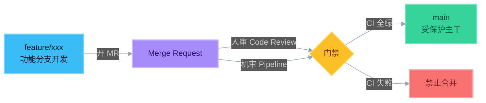
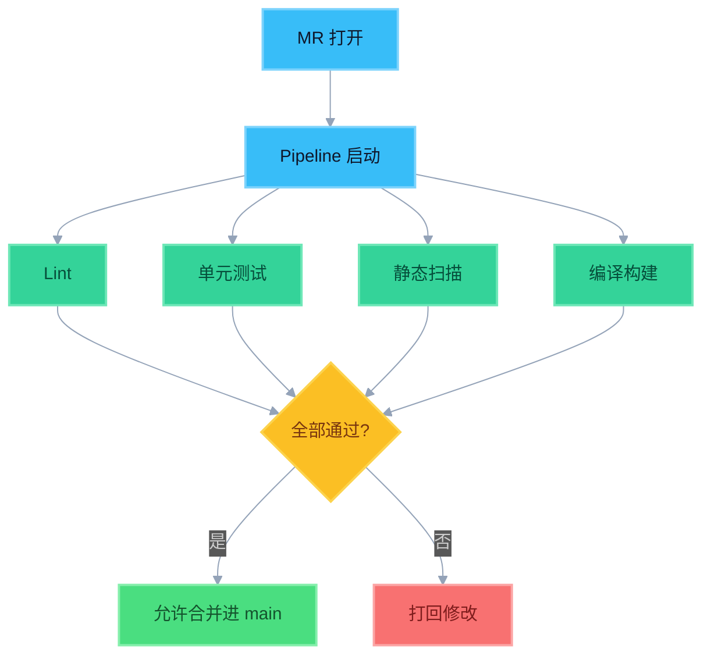

# 3. 分支策略（GitLab Flow + MR 门禁）

## 为什么面试官爱问

分支策略决定了：**什么时候触发 CI、什么分支要过门禁、制品从哪来**。  
你做 CI，必须能说清「流水线卡在合并入口」。

---

## GitLab Flow（掌握概念即可）

核心理念：

1. 用 **功能分支** 开发，不直接往受保护分支乱推
2. 通过 **Merge Request（MR）** 合入
3. 环境/发布用分支或标签表达（如 `main` / `production`，团队实现各异）
4. **流水线是合并的前置条件**（门禁）

简化图：

### 合并门禁放大镜

和其他 Flow 对比（了解）：

| 策略 | 特点 | 面试怎么说 |
|------|------|------------|
| Git Flow | 分支多（develop/release/hotfix） | 重，适合强版本发布节奏 |
| GitHub Flow | 很简：feature → main | 轻量，偏持续交付 |
| **GitLab Flow** | MR + 环境相关分支/发布 | 强调审查与流水线门禁 |

> Day 1 不要求背全对比细节，重点会讲 **MR + 流水线门禁**。

---

## MR 合并

**Merge Request**：把功能分支的改动，请求合并到目标分支（常是 `main`）。

MR 上通常挂着：

- Code Review（人审）
- Pipeline 状态（机审）
- 讨论、审批人

面试说法：

> 「代码不直接进主干，而是走 MR；人和流水线一起当守门员。」

---

## 流水线作为合并门禁（重点）

### 什么是门禁

受保护分支设置规则：**MR 必须 Pipeline 成功才能合并**。

典型检查：

- Lint 通过
- 单元测试通过
- 静态扫描无阻断级问题
- 构建成功

### 为什么重要

| 价值 | 说明 |
|------|------|
| 质量底线 | 坏代码进不了主干 |
| 责任清晰 | 红了就不能合，减少「先合再补」 |
| 可追溯 | 每次合入都有流水线记录 |
| 合规友好 | 门禁不可随意关闭（Day 3 合规点会再提） |

### 口述模板

> 「我们用 GitLab Flow：功能分支开发，MR 合入主干。主干受保护，必须流水线通过才能合并——也就是把 CI 当成合并门禁，保证主干始终可构建、可测。」

---

## 和 CI 配置的关系（预习，Day 2 展开）

- `rules` / `only`：MR 事件触发流水线
- 目标分支是 `main` 时跑完整检查
- tag / 发布分支可能跑额外打包 Job

Day 1 只要记住：**MR 一开，流水线就要跑；不过门禁不能合。**

---

## 自检三问

1. 为什么不建议所有人直接 push 到 `main`？  
2. MR 和 Pipeline 各自拦什么？  
3. 「门禁关掉」会带来什么风险？
